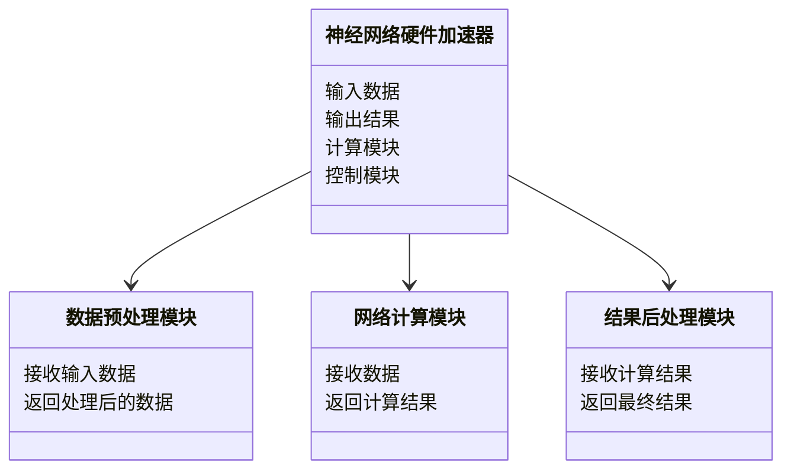

                 

# 如何识别企业的神经网络硬件加速器优势

> **关键词**：神经网络硬件加速器、企业级计算、深度学习优化、计算性能、硬件资源分配

> **摘要**：  
> 在当今人工智能快速发展的背景下，神经网络硬件加速器在企业中的应用越来越广泛。本文从神经网络硬件加速器的核心概念、技术原理、系统架构设计以及项目实战四个方面展开，详细阐述了如何识别和优化企业中的神经网络硬件加速器优势。文章通过理论分析与实际案例相结合的方式，深入探讨了神经网络硬件加速器的性能优化、系统设计以及实际应用场景，为企业技术决策者和开发者提供了实用的指导和建议。

---

## 第一部分：神经网络硬件加速器的背景与概念

### 第1章：神经网络硬件加速器概述

#### 1.1 神经网络硬件加速器的定义与背景

**1.1.1 神经网络的定义与特点**

神经网络是一种模仿生物神经网络的人工神经网络，通过多层非线性变换实现对数据的特征提取和模式识别。其核心特点包括：

- **非线性变换**：通过多层网络结构，能够处理复杂的非线性问题。
- **分布式计算**：数据和计算分布在多个神经元之间，具备并行处理能力。
- **自适应学习**：通过反向传播算法不断优化权重，提升模型性能。

**1.1.2 硬件加速器的定义与作用**

硬件加速器是一种专用计算设备，通过高效的硬件架构设计，显著提升特定类型任务的计算速度。其主要作用包括：

- **加速计算**：通过专用指令集和并行计算架构，提升计算效率。
- **降低能耗**：优化硬件设计以减少能源消耗。
- **提高吞吐量**：在单位时间内处理更多的任务。

**1.1.3 神经网络硬件加速器的背景与发展**

神经网络硬件加速器的发展源于深度学习的兴起，尤其是在图像识别、自然语言处理等领域，对计算能力的需求急剧增加。硬件加速器的出现解决了传统 CPU 在处理大规模神经网络时的性能瓶颈问题。当前，主流的神经网络硬件加速器包括 GPU、TPU（张量处理单元）、NPU（神经网络处理单元）等。

---

#### 1.2 神经网络硬件加速器的核心优势

**1.2.1 计算速度的提升**

神经网络硬件加速器通过并行计算和专用指令集，显著提升了神经网络模型的训练和推理速度。例如，GPU 的并行计算能力使其在深度学习任务中表现尤为突出。

**1.2.2 能耗的优化**

与通用 CPU 相比，神经网络硬件加速器通常具有更高的能效比。通过优化硬件架构，可以在更低的能耗下完成更多的计算任务。

**1.2.3 企业级应用的适用性**

企业级应用通常需要处理大规模数据和高并发任务，神经网络硬件加速器通过高效的资源分配和系统设计，能够更好地满足企业的需求。

---

#### 1.3 神经网络硬件加速器的典型应用场景

**1.3.1 深度学习训练**

在深度学习模型的训练过程中，神经网络硬件加速器通过高效的矩阵运算和并行计算能力，显著缩短训练时间。

**1.3.2 实时推理**

在实时推理场景中，神经网络硬件加速器能够快速处理输入数据，满足实时性要求。

**1.3.3 大规模数据处理**

企业级应用通常涉及海量数据的处理，神经网络硬件加速器通过高效的并行计算能力，能够快速完成数据处理任务。

---

## 第二部分：神经网络硬件加速器的技术原理

### 第2章：神经网络硬件加速器的核心原理

#### 2.1 神经网络计算的数学模型

**2.1.1 神经网络的数学表达**

神经网络的核心数学模型是多层感知机（MLP），其输入-输出关系可以通过以下公式表示：

$$
y = f(Wx + b)
$$

其中，$W$ 是权重矩阵，$x$ 是输入向量，$b$ 是偏置项，$f$ 是激活函数。

**2.1.2 矩阵运算在神经网络中的应用**

矩阵运算是神经网络的核心操作，尤其是卷积运算和全连接层的矩阵乘法。例如，卷积层的数学表达式为：

$$
Conv(x, W) = \sum_{i=1}^{n} \sum_{j=1}^{m} W_{i,j} \cdot x_{i,j}
$$

其中，$x$ 是输入矩阵，$W$ 是卷积核权重矩阵。

**2.1.3 神经网络的前向传播与反向传播**

前向传播是指输入数据通过网络层传递到输出的过程，反向传播则是通过梯度下降优化权重的过程。反向传播的核心算法是链式法则，用于计算损失函数对权重的梯度。

---

#### 2.2 硬件加速器的加速机制

**2.2.1 并行计算原理**

并行计算是硬件加速器的核心加速机制之一。通过将任务分解为多个并行执行的子任务，硬件加速器能够显著提升计算速度。例如，GPU 的流多处理器架构支持多个线程并行执行。

**2.2.2 矩阵运算的硬件优化**

硬件加速器通过专用指令集和架构优化，提升矩阵运算的效率。例如， NVIDIA 的 Tensor Cores 就是专门为矩阵运算设计的硬件单元。

**2.2.3 硬件加速器的流水线处理**

流水线处理是一种优化技术，通过将任务分解为多个阶段，并在不同的处理单元上并行执行，提升整体处理效率。

---

#### 2.3 神经网络硬件加速器的性能指标

**2.3.1 计算密度**

计算密度是硬件加速器的性能指标之一，表示单位面积或单位功耗下的计算能力。

**2.3.2 能耗效率**

能耗效率是硬件加速器的重要指标，衡量在单位时间内完成的计算任务数量与能耗的比值。

**2.3.3 并行计算能力**

并行计算能力是硬件加速器的核心指标之一，反映其同时处理多个任务的能力。

---

## 第三部分：神经网络硬件加速器的系统分析与架构设计

### 第3章：企业级神经网络硬件加速器的系统分析

#### 3.1 神经网络硬件加速器的系统架构

**3.1.1 系统组成与功能模块**

企业级神经网络硬件加速器的系统架构通常包括以下几个功能模块：

- **数据输入模块**：接收输入数据并进行预处理。
- **计算模块**：负责神经网络的前向传播和反向传播计算。
- **控制模块**：协调各个模块的工作，管理任务调度。
- **结果输出模块**：输出计算结果并进行后处理。

**3.1.2 硬件加速器与计算框架的交互**

硬件加速器需要与深度学习框架（如 TensorFlow、PyTorch）进行无缝对接，通过 API 接口完成任务分配和结果返回。

**3.1.3 系统的扩展性与可维护性**

企业级系统需要具备良好的扩展性和可维护性，支持动态添加或替换硬件加速器模块。

---

#### 3.2 神经网络硬件加速器的性能优化

**3.2.1 算法优化策略**

算法优化策略包括：

- **模型剪枝**：通过去除冗余参数降低计算复杂度。
- **模型量化**：通过降低数据精度减少计算量。
- **模型并行**：将模型分布在多个加速器上进行计算。

**3.2.2 硬件资源分配优化**

硬件资源分配优化包括：

- **任务调度优化**：根据任务类型和加速器能力分配任务。
- **资源利用率优化**：通过动态调整资源分配策略，提升硬件利用率。

**3.2.3 系统调优方法**

系统调优方法包括：

- **批处理优化**：通过批处理提升数据吞吐量。
- **缓存优化**：通过优化数据缓存策略减少访问延迟。
- **并行优化**：通过优化并行粒度提升计算效率。

---

#### 3.3 神经网络硬件加速器的系统设计

**3.3.1 系统功能需求分析**

系统功能需求分析包括：

- **输入输出需求**：支持多种数据格式和接口。
- **性能需求**：满足企业级应用的实时性和吞吐量要求。
- **可扩展性需求**：支持硬件加速器的动态扩展。

**3.3.2 系统架构设计（领域模型 Mermaid 类图）**

**3.3.3 系统接口设计**

系统接口设计包括：

- **输入接口**：支持多种数据格式的输入，如图像、文本等。
- **输出接口**：支持多种格式的结果输出，如 JSON、Protobuf 等。
- **控制接口**：支持任务调度和资源管理的 API 接口。

---

## 第四部分：神经网络硬件加速器的项目实战

### 第4章：神经网络硬件加速器的环境安装与配置

#### 4.1 硬件加速器的环境搭建

**4.1.1 硬件加速器的安装与配置**

以 NVIDIA GPU 为例，安装 CUDA 和 cuDNN 是配置硬件加速器的基本步骤：

1. **安装 CUDA Toolkit**：从 NVIDIA 官网下载并安装 CUDA Toolkit。
2. **安装 cuDNN**：下载 cuDNN 框架并将其动态链接库文件复制到 CUDA 的 lib 目录中。
3. **配置环境变量**：在系统环境变量中配置 CUDA 和 cuDNN 的路径。

**4.1.2 开发环境的搭建**

开发环境的搭建通常包括以下几个步骤：

1. **安装操作系统**：选择适合硬件加速器的 Linux 发行版（如 Ubuntu）。
2. **安装开发工具链**：安装 GCC 编译器、Python 和深度学习框架（如 TensorFlow、PyTorch）。
3. **配置开发环境**：设置虚拟环境和依赖库。

**4.1.3 硬件加速器驱动的安装**

硬件加速器驱动的安装是配置硬件加速器的重要步骤，以 NVIDIA GPU 为例：

1. **下载驱动程序**：从 NVIDIA 官网下载适合的操作系统版本的驱动程序。
2. **安装驱动程序**：按照安装向导完成驱动程序的安装。
3. **验证驱动程序**：通过 NVIDIA 显卡管理器验证驱动程序是否安装成功。

---

#### 4.2 神经网络硬件加速器的性能测试

**4.2.1 硬件加速器的基准测试**

基准测试是评估硬件加速器性能的重要手段，通常使用以下工具：

- **NVIDIA 的 CUDA toolkit 验证工具**：用于验证 GPU 的计算能力。
- **深度学习框架的性能测试脚本**：如 TensorFlow 的 benchmark 脚本。

**4.2.2 硬件加速器的负载测试**

负载测试用于评估硬件加速器在高负载情况下的性能表现，通常包括以下步骤：

1. **设置测试场景**：选择适合的测试数据集和模型。
2. **运行测试任务**：启动测试任务并记录性能指标。
3. **分析测试结果**：通过性能指标评估硬件加速器的性能。

---

#### 4.3 神经网络硬件加速器的资源分配与优化

**4.3.1 硬件资源分配策略**

硬件资源分配策略包括：

- **动态分配**：根据任务需求动态分配硬件资源。
- **静态分配**：预先分配硬件资源以满足固定任务需求。
- **混合分配**：结合动态和静态分配策略，提升资源利用率。

**4.3.2 硬件加速器的负载均衡**

负载均衡是硬件加速器优化的重要内容，通常包括以下方法：

- **任务分片**：将任务分解为多个子任务，分别分配到不同的硬件加速器上。
- **负载均衡算法**：通过负载均衡算法动态调整任务分配，避免资源浪费。

---

## 第五部分：神经网络硬件加速器的最佳实践

### 第5章：神经网络硬件加速器的性能优化技巧

#### 5.1 硬件加速器的性能优化策略

**5.1.1 算法优化**

算法优化包括：

- **模型剪枝**：通过去除冗余参数降低计算复杂度。
- **模型量化**：通过降低数据精度减少计算量。
- **模型并行**：将模型分布在多个加速器上进行计算。

**5.1.2 硬件资源分配优化**

硬件资源分配优化包括：

- **任务调度优化**：根据任务类型和加速器能力分配任务。
- **资源利用率优化**：通过动态调整资源分配策略，提升硬件利用率。

---

#### 5.2 神经网络硬件加速器的系统调优

**5.2.1 硬件加速器的系统调优方法**

系统调优方法包括：

- **批处理优化**：通过批处理提升数据吞吐量。
- **缓存优化**：通过优化数据缓存策略减少访问延迟。
- **并行优化**：通过优化并行粒度提升计算效率。

**5.2.2 硬件加速器的系统调优案例**

以 GPU 加速器为例，系统调优案例包括：

1. **批处理优化**：通过增大 batch size 提升数据吞吐量。
2. **缓存优化**：通过优化数据布局减少缓存不命中率。
3. **并行优化**：通过调整线程粒度提升 GPU 的计算效率。

---

### 第6章：神经网络硬件加速器的未来发展趋势

#### 6.1 神经网络硬件加速器的未来技术展望

**6.1.1 新型硬件加速器的出现**

随着技术的进步，新型硬件加速器不断涌现，如量子计算加速器和光子计算加速器。

**6.1.2 硬件加速器的智能化**

硬件加速器的智能化包括自适应计算能力、自优化能力等。

**6.1.3 硬件加速器的绿色计算**

绿色计算是指在保证性能的前提下，降低硬件加速器的能耗，实现节能减排。

---

#### 6.2 神经网络硬件加速器的企业级应用展望

**6.2.1 人工智能的普及**

随着人工智能技术的成熟，神经网络硬件加速器将在更多领域得到广泛应用。

**6.2.2 硬件加速器的生态建设**

硬件加速器的生态系统建设包括硬件、软件、服务等多个方面，形成完整的产业链。

**6.2.3 硬件加速器的标准化**

硬件加速器的标准化是实现大规模应用的重要基础，包括接口标准、性能标准等。

---

## 结语

通过本文的系统分析和深入探讨，我们了解了如何识别和优化企业中的神经网络硬件加速器优势。从背景与概念、技术原理、系统设计到项目实战，我们全面覆盖了神经网络硬件加速器的核心内容。未来，随着技术的不断进步，神经网络硬件加速器将在企业级应用中发挥越来越重要的作用，为企业创造更大的价值。

--- 

**注意事项**：  
1. 本文内容为框架性指导，具体实现细节需根据实际场景调整。  
2. 硬件加速器的选择和部署需结合企业的实际需求和预算。  
3. 神经网络硬件加速器的优化是一个持续改进的过程，需要结合实际性能测试结果不断调整和优化。

