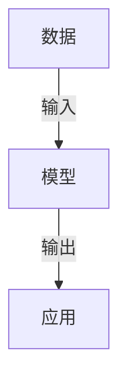
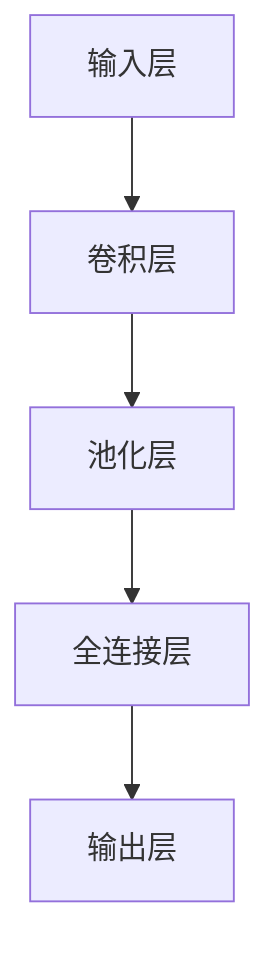
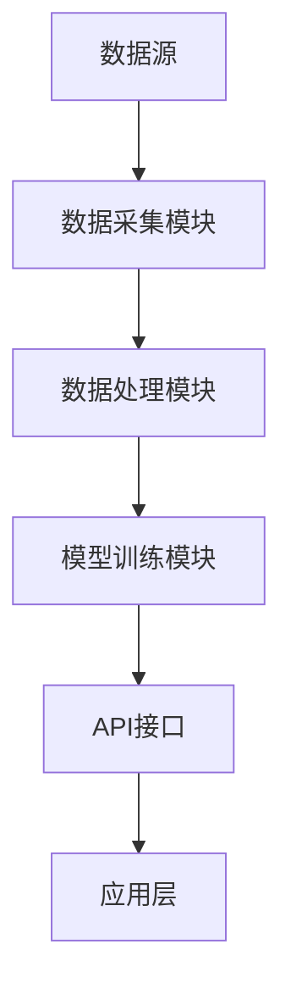

                 


# 如何识别企业的计算机视觉技术优势

## 关键词：计算机视觉，企业技术优势，深度学习，图像处理，计算机视觉算法，技术实现

## 摘要：  
计算机视觉技术作为人工智能领域的重要分支，正在改变企业的运作方式。本文将深入探讨如何识别企业的计算机视觉技术优势，涵盖核心概念、算法原理、系统架构及项目实战。通过详细分析，帮助读者理解如何在企业中有效应用计算机视觉技术，提升竞争力。

---

## 正文

### 第一部分: 背景介绍

#### 第1章: 计算机视觉技术概述

##### 1.1 计算机视觉的基本概念
计算机视觉（Computer Vision）是人工智能领域的重要分支，旨在模拟人类视觉系统，通过算法处理图像或视频数据，提取有用信息。从图像处理到深度学习，计算机视觉技术不断演进，广泛应用于图像识别、目标检测、图像分割等领域。

##### 1.2 技术背景与市场现状
当前，计算机视觉技术在图像识别、自动驾驶、医疗影像分析等领域快速发展。全球计算机视觉市场增长迅速，企业应用该技术的驱动力包括效率提升和成本降低。

##### 1.3 企业计算机视觉技术的优势
计算机视觉技术可以提升企业效率、降低成本，并为创新商业模式提供机会。企业通过技术实现自动化处理和数据驱动决策，增强竞争力。

##### 1.4 计算机视觉技术对企业的影响
计算机视觉技术改变了企业的运营模式，推动了效率提升和成本优化。未来，技术将进一步与企业业务深度融合，但同时也面临数据隐私和模型泛化等挑战。

### 第二部分: 核心概念与联系

#### 第2章: 计算机视觉的核心原理

##### 2.1 计算机视觉的核心概念
计算机视觉的核心包括图像处理、特征提取和目标检测。图像处理是基础，特征提取帮助识别关键信息，目标检测用于定位和识别目标。

##### 2.2 计算机视觉的技术对比
| 技术 | 传统CV | 深度学习 |
|------|---------|----------|
| 方法 | 基于特征提取 | 基于深度神经网络 |
| 优点 | 实时性高 | 高精度 |
| 缺点 | 易受光照影响 | 需大量数据 |

##### 2.3 实体关系图
Mermaid图展示数据、模型和应用之间的关系：


### 第三部分: 算法原理讲解

#### 第3章: 算法原理

##### 3.1 卷积神经网络（CNN）
Mermaid流程图展示CNN的工作流程：


##### 3.2 Python代码示例
```python
import cv2
import keras

# 加载预训练模型
model = keras.models.load_model('model.h5')

# 图像处理
image = cv2.imread('input.jpg')
image = cv2.resize(image, (224, 224))
image = image / 255.0  # 归一化
image = image[np.newaxis, ...]  # 增加batch维度

# 预测
prediction = model.predict(image)
print(prediction)
```

##### 3.3 数学模型
CNN的卷积层数学表示：
$$ y = f(W \cdot x + b) $$
其中，$W$是卷积核，$x$是输入，$b$是偏置。

### 第四部分: 系统分析与架构设计

#### 第4章: 系统架构设计

##### 4.1 功能模块设计
系统功能模块包括数据采集、模型训练、应用接口。

##### 4.2 系统架构图
Mermaid架构图展示系统架构：


### 第五部分: 项目实战

#### 第5章: 项目实战

##### 5.1 工业缺陷检测案例
环境安装：
```bash
pip install tensorflow opencv-python keras
```

##### 5.2 数据采集与处理
代码示例：
```python
import cv2

def detect_defect(image):
    # 转换为灰度图
    gray = cv2.cvtColor(image, cv2.COLOR_BGR2GRAY)
    # 使用Canny边缘检测
    edges = cv2.Canny(gray, 50, 150)
    return edges

image = cv2.imread('product.jpg')
result = detect_defect(image)
cv2.imwrite('result.jpg', result)
```

##### 5.3 模型训练与部署
训练代码：
```python
model.compile(optimizer='adam', loss='binary_crossentropy', metrics=['accuracy'])
model.fit(X_train, y_train, epochs=10, batch_size=32)
```

### 第六部分: 最佳实践

#### 第6章: 最佳实践

##### 6.1 小结
总结计算机视觉技术的核心优势，包括算法选型和系统设计的重要性。

##### 6.2 注意事项
- 数据质量是关键
- 模型泛化能力需关注
- 安全和隐私问题需重视

##### 6.3 拓展阅读
推荐书籍：《深度学习》、《计算机视觉入门》。

---

# 结语
通过本文，读者可以系统地了解如何识别和利用企业的计算机视觉技术优势。从核心概念到算法实现，再到系统设计和项目实战，全面掌握相关知识，助力企业技术提升。

