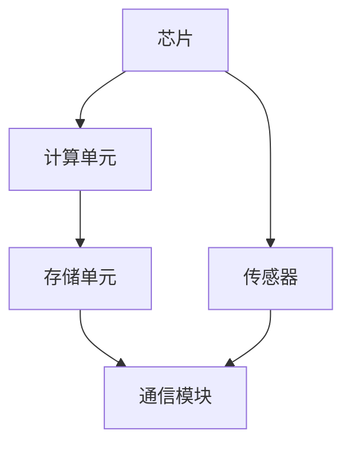
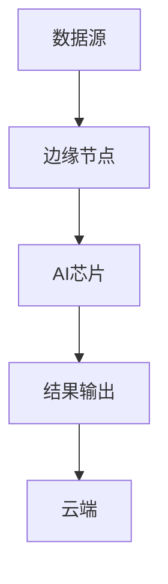
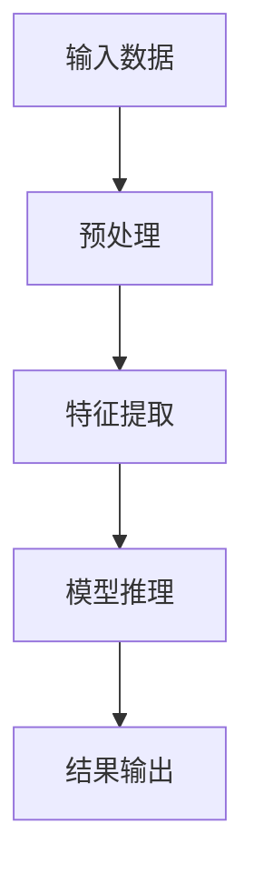
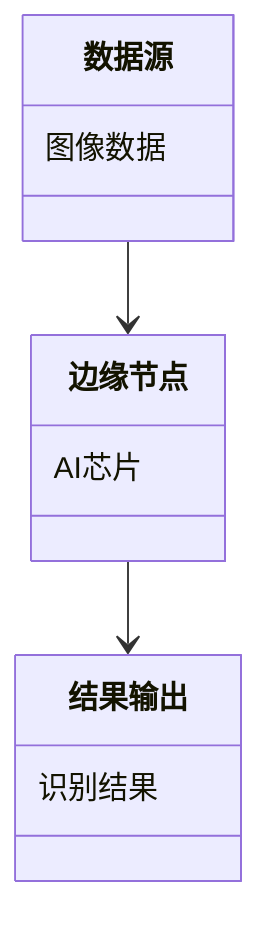
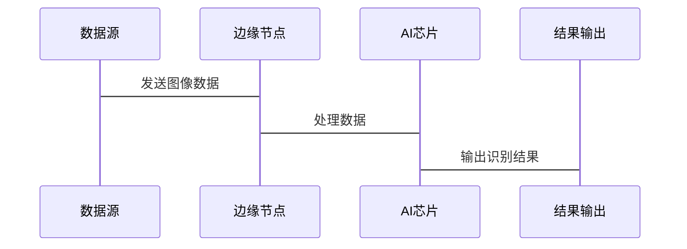

                 


# 如何识别企业的边缘AI芯片优势

## 关键词：边缘AI芯片，企业优势，技术分析，市场应用，算法实现

## 摘要：边缘AI芯片作为人工智能与边缘计算结合的重要技术，正在为企业带来显著的性能和成本优势。本文通过深入分析边缘AI芯片的技术原理、算法实现、系统架构和实际应用案例，帮助读者识别企业在采用边缘AI芯片时的优势，并提供具体的实施策略和建议。

---

# 第一部分: 边缘AI芯片的背景与核心概念

## 第1章: 边缘AI芯片的定义与技术背景

### 1.1 边缘AI芯片的定义
#### 1.1.1 边缘计算的定义与特点
边缘计算是一种分布式计算范式，将数据处理从云端转移到靠近数据源的边缘设备。其特点包括低延迟、高实时性、本地化数据处理和分布式架构。

#### 1.1.2 边缘AI芯片的核心概念
边缘AI芯片是专门设计用于在边缘设备上运行AI算法的硬件。它结合了边缘计算的低延迟需求和AI算法的高性能计算要求。

#### 1.1.3 边缘AI芯片与传统AI芯片的区别
- **计算场景**：边缘AI芯片主要用于边缘设备，而传统AI芯片通常用于云端或数据中心。
- **功耗要求**：边缘AI芯片注重低功耗和高效能，而传统AI芯片可能功耗较高。
- **延迟要求**：边缘AI芯片需要极低的延迟，而传统AI芯片可能对延迟要求不敏感。

### 1.2 边缘AI芯片的技术背景
#### 1.2.1 边缘计算的发展历程
边缘计算起源于20世纪90年代，随着物联网（IoT）和5G技术的发展，边缘计算逐渐成为企业数字化转型的重要技术。

#### 1.2.2 AI技术在边缘计算中的应用
AI技术在边缘计算中的应用包括图像识别、语音识别、实时数据分析和预测性维护。

#### 1.2.3 边缘AI芯片的市场现状
边缘AI芯片市场正在快速增长，主要驱动因素包括5G普及、物联网设备增加和企业对实时数据处理的需求。

### 1.3 边缘AI芯片的优势与挑战
#### 1.3.1 边缘AI芯片的优势
- **低延迟**：边缘AI芯片能够实时处理数据，减少云端传输延迟。
- **高能效**：边缘AI芯片通常设计为低功耗，适合移动设备和物联网场景。
- **隐私保护**：边缘计算可以在本地处理数据，减少数据传输到云端的风险。

#### 1.3.2 边缘AI芯片的挑战
- **硬件复杂性**：边缘AI芯片需要高性能和低功耗的平衡，设计难度大。
- **软件支持**：边缘AI芯片需要专门的软件框架和工具链支持。
- **成本问题**：边缘AI芯片的研发和生产成本较高。

#### 1.3.3 企业采用边缘AI芯片的潜在价值
边缘AI芯片可以帮助企业在智能制造、智慧城市、医疗健康等领域提升效率、降低成本和增强用户体验。

---

## 第2章: 边缘AI芯片的核心概念与联系

### 2.1 边缘AI芯片的技术原理
#### 2.1.1 边缘AI芯片的硬件架构
边缘AI芯片通常包括以下硬件组件：
- **计算单元**：负责AI算法的计算，如GPU、TPU或专用AI加速器。
- **存储单元**：用于存储模型权重和中间数据。
- **通信模块**：用于与传感器或其他设备进行数据交互。

#### 2.1.2 边缘AI芯片的算法实现
边缘AI芯片支持多种AI算法，包括卷积神经网络（CNN）、循环神经网络（RNN）和图神经网络（GNN）。

#### 2.1.3 边缘AI芯片的性能指标
- **计算能力**：通常以FLOPS（每秒浮点运算次数）衡量。
- **功耗**：通常以瓦特（W）衡量。
- **延迟**：通常以毫秒（ms）衡量。

### 2.2 边缘AI芯片与相关技术的对比
#### 2.2.1 边缘AI芯片与云计算的关系
- **云计算**：集中式计算，适合大规模数据处理。
- **边缘AI芯片**：分布式计算，适合实时性和低延迟要求。

#### 2.2.2 边缘AI芯片与物联网的结合
边缘AI芯片可以与物联网设备无缝集成，实现本地化智能决策。

#### 2.2.3 边缘AI芯片与边缘服务器的区别
边缘AI芯片通常集成在边缘设备中，而边缘服务器是更大的计算设备。

### 2.3 边缘AI芯片的实体关系图


### 2.4 边缘AI芯片的架构图


### 2.5 本章小结

---

## 第3章: 边缘AI芯片的算法原理

### 3.1 边缘AI芯片的典型算法
#### 3.1.1 卷积神经网络（CNN）
CNN广泛应用于图像识别任务，边缘AI芯片可以通过硬件加速CNN的卷积操作。

#### 3.1.2 循环神经网络（RNN）
RNN适用于时间序列数据的处理，如语音识别和自然语言处理。

#### 3.1.3 图神经网络（GNN）
GNN适用于图结构数据的处理，如社交网络分析和推荐系统。

### 3.2 边缘AI芯片的算法实现流程


### 3.3 边缘AI芯片的数学模型与公式
#### 3.3.1 卷积神经网络的数学模型
卷积操作的数学公式如下：
$$
y_{i,j} = \sum_{k=1}^{K} \sum_{l=1}^{L} w_{k,l} x_{i+l-1,j+k-1}
$$

#### 3.3.2 循环神经网络的数学模型
循环神经网络的递推公式如下：
$$
h_t = \text{tanh}(W_{hh} h_{t-1} + W_{xh} x_t)
$$

---

## 第4章: 边缘AI芯片的系统分析与架构设计

### 4.1 项目背景与需求分析
本项目旨在设计一个基于边缘AI芯片的实时图像识别系统，用于工业视觉检测。

### 4.2 系统功能设计
#### 4.2.1 领域模型图


#### 4.2.2 系统架构图


#### 4.2.3 接口设计
- **输入接口**：接收图像数据。
- **输出接口**：输出识别结果。

#### 4.2.4 交互流程


---

## 第5章: 边缘AI芯片的项目实战

### 5.1 环境安装
- **硬件**：Raspberry Pi + AI芯片（如Google Coral）
- **软件**：安装Ubuntu操作系统和TensorFlow框架。

### 5.2 核心代码实现
```python
import tensorflow as tf
from tensorflow import keras
from tensorflow.keras import layers

# 定义模型
model = keras.Sequential([
    layers.Conv2D(32, (3,3), activation='relu', input_shape=(64, 64, 3)),
    layers.MaxPooling2D((2,2)),
    layers.Flatten(),
    layers.Dense(128, activation='relu'),
    layers.Dense(10, activation='softmax')
])

# 编译模型
model.compile(optimizer='adam', loss='sparse_categorical_crossentropy', metrics=['accuracy'])

# 训练模型
model.fit(x_train, y_train, epochs=10, batch_size=32)
```

### 5.3 案例分析与解读
通过实际案例分析，展示边缘AI芯片在图像识别中的应用，并解释代码实现和结果输出。

### 5.4 项目小结

---

## 第6章: 边缘AI芯片的最佳实践与注意事项

### 6.1 最佳实践
- **选择合适的芯片**：根据具体需求选择适合的边缘AI芯片。
- **优化算法模型**：在边缘设备上优化模型以减少计算开销。
- **确保数据安全**：在边缘设备上处理数据时，需注意数据隐私和安全。

### 6.2 小结
边缘AI芯片为企业提供了强大的计算能力和低延迟优势，但其成功实施需要企业在硬件选型、算法优化和系统架构设计方面进行全面考虑。

### 6.3 注意事项
- **硬件兼容性**：确保芯片与设备的兼容性。
- **软件支持**：选择有良好支持的AI框架。
- **维护与更新**：定期维护和更新模型以保持性能。

### 6.4 拓展阅读
推荐相关书籍和论文，供读者进一步学习。

---

## 第7章: 总结与展望

### 7.1 总结
边缘AI芯片作为人工智能与边缘计算结合的重要技术，正在为企业带来显著的性能和成本优势。

### 7.2 展望
未来，边缘AI芯片将在更多领域得到广泛应用，企业需要持续关注技术发展，抓住机遇。

---

## 致谢
感谢读者的耐心阅读，感谢技术专家的指导和支持。

---

通过以上目录和内容的撰写，您可以根据实际需求补充各章节的具体内容，以确保文章的完整性和专业性。

