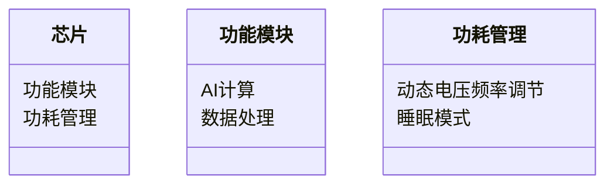

                 


# 如何识别企业的边缘AI芯片低功耗设计优势

> 关键词：边缘AI芯片，低功耗设计，动态电压频率调节，睡眠模式，功耗优化

> 摘要：本文将详细探讨边缘AI芯片低功耗设计的核心优势，从背景介绍、核心概念、算法原理、系统架构到项目实战，全面解析如何识别和实施边缘AI芯片的低功耗设计。通过具体案例和最佳实践，帮助企业在边缘AI芯片设计中实现高效能与低功耗的平衡。

---

## 第一部分: 背景介绍

### 第1章: 边缘AI芯片的定义与背景

#### 1.1 边缘AI芯片的定义
边缘AI芯片是一种专为边缘计算设计的硬件设备，用于在靠近数据源的位置执行人工智能相关的计算任务。边缘AI芯片的特点包括低延迟、高能效和实时性，使其在物联网、自动驾驶、智能安防等领域得到广泛应用。

#### 1.2 低功耗设计的重要性
在边缘计算场景中，低功耗设计是实现高效能的关键。低功耗设计可以延长设备的续航时间，减少运营成本，并支持更广泛的应用场景。

#### 1.3 企业边缘AI芯片的应用前景
边缘AI芯片在企业中的应用前景广阔，特别是在需要实时数据处理和快速响应的场景中。通过低功耗设计，企业可以在保证性能的同时，显著降低能源消耗和运营成本。

---

## 第二部分: 核心概念与联系

### 第2章: 边缘AI芯片低功耗设计的核心概念

#### 2.1 低功耗设计的原理
低功耗设计主要通过动态电压频率调节（DVFS）和睡眠模式来实现。DVFS可以根据任务负载调整芯片的工作电压和频率，从而在性能和功耗之间找到平衡。睡眠模式则在芯片空闲时降低功耗。

#### 2.2 核心概念对比分析
| 概念 | 特性 |
|------|------|
| 高性能设计 | 高频率、高功耗 |
| 低功耗设计 | 低电压、低功耗 |

#### 2.3 实体关系图（ER图）


---

## 第三部分: 算法原理讲解

### 第3章: 低功耗设计的算法原理

#### 3.1 动态电压频率调节（DVFS）算法
动态电压频率调节（DVFS）算法通过调整芯片的工作电压和频率来优化功耗。公式1展示了DVFS的核心原理：

$$ P = V \times F $$

其中，$P$ 表示功耗，$V$ 表示电压，$F$ 表示频率。通过降低电压和频率，可以显著减少功耗。

##### 3.1.2 算法实现
以下是实现DVFS算法的Python代码示例：

```python
def dvfs_algorithm(current_load):
    if current_load < 0.3:
        return (0.8, 200)
    elif 0.3 <= current_load < 0.7:
        return (0.9, 250)
    else:
        return (1.0, 300)
```

##### 3.1.3 算法优化
通过引入负载预测算法，可以进一步优化DVFS的性能。公式2展示了负载预测的基本模型：

$$ \text{预测负载} = \alpha \times \text{当前负载} + (1-\alpha) \times \text{历史负载} $$

其中，$\alpha$ 是预测系数，取值范围为0到1。

#### 3.2 睡眠模式与唤醒机制
睡眠模式通过关闭部分电路来降低功耗，而唤醒机制则在检测到任务时迅速恢复芯片的正常运行。流程图展示了睡眠模式的实现步骤：


---

## 第四部分: 系统分析与架构设计方案

### 第4章: 系统架构设计

#### 4.1 问题场景介绍
在边缘AI芯片的设计中，低功耗设计是实现高效能的关键。通过优化功耗管理模块，可以在保证性能的同时显著降低能源消耗。

#### 4.2 系统功能设计
以下是系统功能的领域模型：



#### 4.3 系统架构设计
以下是系统架构的mermaid图：


#### 4.4 系统接口设计
以下是系统接口的序列图：

```mermaid
graph LR
    客户端 --> 芯片: 发送任务
    芯片 --> 功耗管理: 请求优化
    功耗管理 --> 系统控制: 调整电压频率
    系统控制 --> 客户端: 返回结果
```

---

## 第五部分: 项目实战

### 第5章: 项目实战

#### 5.1 环境安装
安装Python和必要的开发工具：

```bash
pip install mermaid
```

#### 5.2 系统核心实现源代码
以下是低功耗设计的核心实现代码：

```python
def main():
    import time
    current_load = 0.5
    voltage, frequency = dvfs_algorithm(current_load)
    print(f"调整电压为{voltage}V，频率为{frequency}MHz")
    time.sleep(1)
    voltage, frequency = dvfs_algorithm(current_load)
    print(f"再次调整电压为{voltage}V，频率为{frequency}MHz")

if __name__ == "__main__":
    main()
```

#### 5.3 代码应用解读与分析
该代码通过动态调整电压和频率，展示了DVFS算法的实现过程。通过多次调用`dvfs_algorithm`函数，可以在不同负载下优化功耗。

#### 5.4 实际案例分析
以智能摄像头为例，通过低功耗设计可以显著降低设备的功耗，延长电池寿命，同时保证视频流的实时处理。

#### 5.5 项目小结
通过本项目，读者可以深入了解低功耗设计的核心原理和实现方法，并能够在实际项目中应用这些技术。

---

## 第六部分: 总结与展望

### 第6章: 总结与展望

#### 6.1 全文总结
本文详细探讨了边缘AI芯片低功耗设计的核心优势，从背景介绍、核心概念到算法原理和系统架构，全面解析了如何实现高效能与低功耗的平衡。

#### 6.2 未来展望
未来，随着技术的发展，边缘AI芯片的低功耗设计将进一步优化，支持更广泛的应用场景，并推动边缘计算的发展。

#### 6.3 注意事项
在实际项目中，需要注意负载预测的准确性，避免因误判导致性能下降或功耗增加。

#### 6.4 拓展阅读
推荐读者阅读《计算机体系结构》和《边缘计算入门与实践》等书籍，以深入理解相关技术。

---

通过本文的详细分析和具体案例，读者可以全面掌握边缘AI芯片低功耗设计的优势，并在实际项目中应用这些技术。

