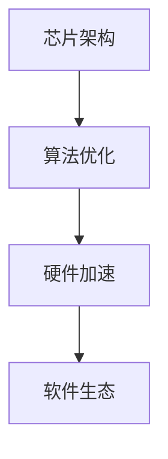
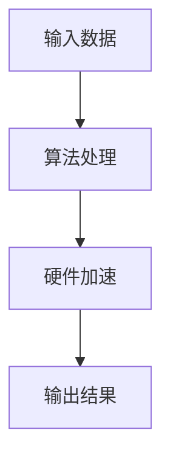
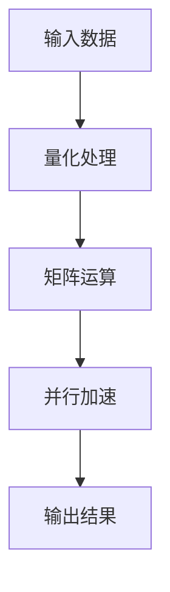
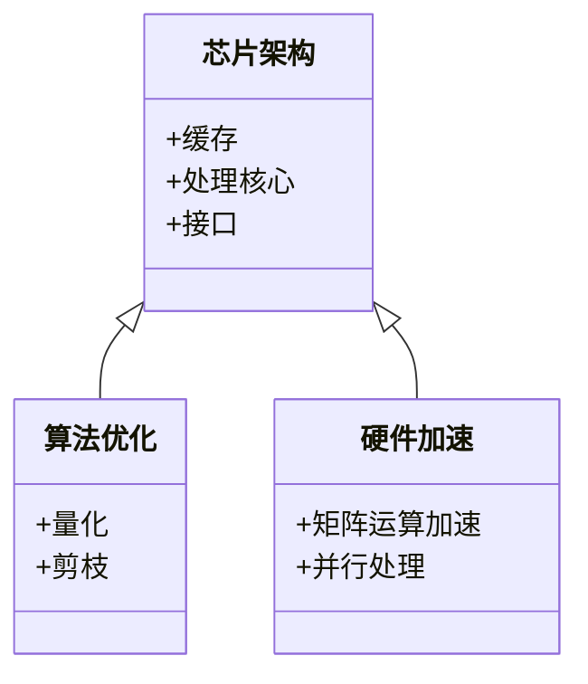
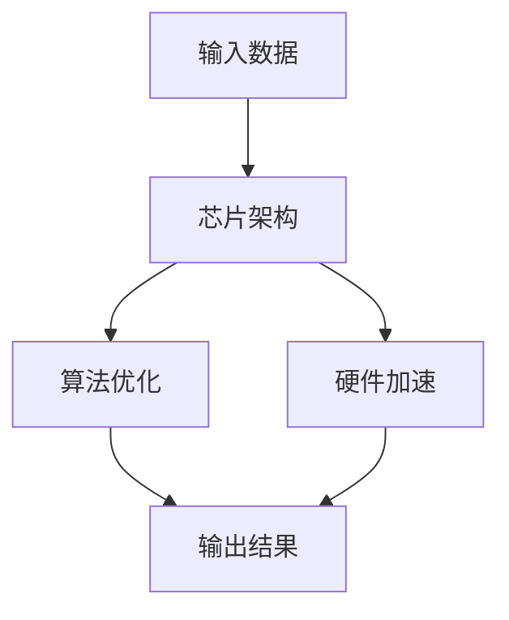
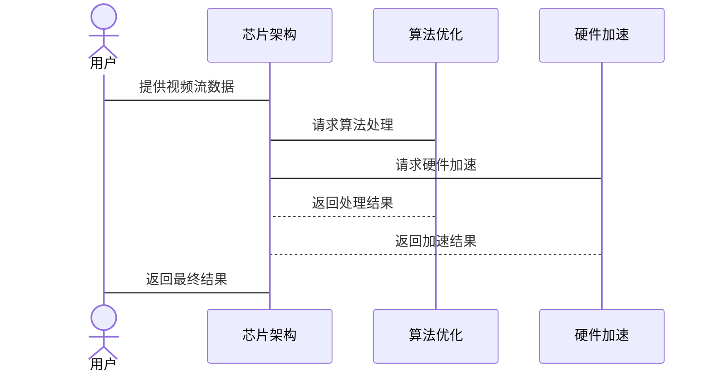

                 


# 如何识别企业的边缘AI芯片低延迟设计优势

## 关键词：
边缘AI芯片, 低延迟设计, 边缘计算, 算法优化, 硬件加速

## 摘要：
边缘AI芯片的低延迟设计是实现实时、高效计算的关键，本文从背景、核心概念、算法原理、系统架构、项目实战和最佳实践等方面，详细分析了如何识别和优化边缘AI芯片的低延迟设计优势。

---

# 第一部分: 边缘AI芯片低延迟设计的背景与概念

# 第1章: 边缘AI芯片与低延迟设计概述

## 1.1 边缘AI芯片的基本概念
### 1.1.1 边缘计算的定义与特点
边缘计算是指在靠近数据源的地方进行计算和数据处理，具有实时性高、带宽占用低、隐私保护好等优点。

### 1.1.2 AI芯片的核心作用
AI芯片（如GPU、TPU、NPU）通过并行计算加速AI模型的推理和训练，是边缘计算中的关键硬件。

### 1.1.3 低延迟设计的重要性
低延迟设计是指在边缘计算中，通过优化算法和硬件设计，缩短数据处理的时间，满足实时性要求。

## 1.2 低延迟设计的背景与需求
### 1.2.1 边缘计算的实时性要求
边缘计算需要快速响应，如自动驾驶中的实时决策、工业自动化中的实时控制。

### 1.2.2 低延迟设计在企业中的应用场景
- 智慧城市：实时监控、交通管理
- 工业物联网：实时设备监控、预测性维护
- 智慧医疗：实时患者监测、快速诊断

### 1.2.3 低延迟设计的边界与外延
低延迟设计的边界是实时性和响应时间，外延包括算法优化、硬件加速、软件协同设计。

## 1.3 边缘AI芯片的核心要素
### 1.3.1 芯片架构对低延迟的影响
- 芯片架构：如ASIC、FPGA、GPU，影响处理速度和并行能力。
- 缓存机制：缓存命中率直接影响延迟。

### 1.3.2 算法优化与硬件加速
- 算法优化：如模型剪枝、量化，减少计算量。
- 硬件加速：如专用指令集加速矩阵运算。

### 1.3.3 软件生态的支持
- 软件框架：如TensorFlow Lite、ONNX，支持低延迟推理。
- 驱动优化：硬件驱动直接影响性能。

## 1.4 本章小结
本章介绍了边缘AI芯片的基本概念、低延迟设计的重要性及其核心要素。

---

# 第二部分: 边缘AI芯片低延迟设计的核心概念与联系

# 第2章: 边缘AI芯片的低延迟设计原理

## 2.1 低延迟设计的核心原理
### 2.1.1 算法优化与硬件加速的结合
- 算法优化：减少计算量。
- 硬件加速：提高计算速度。

### 2.1.2 芯片架构对低延迟的影响
- 专用指令集：加速特定任务。
- 并行处理：缩短任务完成时间。

### 2.1.3 软件与硬件协同设计
- 软件协同：优化编译器、驱动。
- 硬件协同：定制硬件加速模块。

## 2.2 核心概念对比分析
### 2.2.1 边缘AI芯片与传统芯片的对比
| 对比维度 | 边缘AI芯片 | 传统芯片 |
|----------|------------|----------|
| 架构     | ASIC/FPGA  | CPU/GPU  |
| 功耗     | 低功耗     | 高功耗   |
| 延迟     | 低延迟     | 较高延迟 |

### 2.2.2 低延迟设计与高吞吐量设计的对比
| 对比维度 | 低延迟设计 | 高吞吐量设计 |
|----------|------------|-------------|
| 目标     | 最小化延迟 | 最大化吞吐量 |
| 场景     | 实时应用   | 批处理应用   |

### 2.2.3 边缘计算与云计算的对比
| 对比维度 | 边缘计算   | 云计算      |
|----------|------------|------------|
| 延迟     | 低延迟     | 较高延迟   |
| 带宽     | 低带宽     | 高带宽     |
| 应用场景 | 实时监控   | 数据存储与处理 |

## 2.3 实体关系图与流程图
### 2.3.1 边缘AI芯片的实体关系图（ER图）


### 2.3.2 低延迟设计的流程图


## 2.4 本章小结
本章分析了低延迟设计的核心原理，并通过对比分析和图表展示了边缘AI芯片与其他技术的差异。

---

# 第三部分: 低延迟设计的算法原理与数学模型

# 第3章: 低延迟设计的算法原理

## 3.1 算法优化与硬件加速
### 3.1.1 算法优化的核心思想
- 模型剪枝：删除冗余参数。
- 模型量化：降低精度，减少计算量。

### 3.1.2 硬件加速的关键技术
- 专用指令集加速矩阵运算。
- 并行处理加速数据处理。

### 3.1.3 算法与硬件协同设计的案例
案例：在边缘AI芯片中，通过量化算法减少模型参数，同时硬件采用并行指令加速量化运算。

## 3.2 低延迟设计的数学模型
### 3.2.1 缓存机制的数学模型
$$缓存命中概率 = \frac{缓存容量}{数据总量}$$

### 3.2.2 流水线处理的数学模型
$$处理时间 = \frac{任务数量}{并行处理能力}$$

## 3.3 算法流程图


## 3.4 本章小结
本章详细讲解了低延迟设计的算法优化和硬件加速原理，并通过数学模型和流程图展示了优化过程。

---

# 第四部分: 边缘AI芯片低延迟设计的系统分析与架构设计方案

# 第4章: 系统分析与架构设计

## 4.1 问题场景介绍
- 场景：边缘设备需要实时处理视频流数据，要求低延迟。
- 问题：传统架构延迟高，无法满足实时性要求。

## 4.2 系统功能设计
### 4.2.1 领域模型类图


### 4.2.2 系统架构图


## 4.3 系统接口设计
- 输入接口：视频流数据输入。
- 输出接口：实时处理结果输出。

## 4.4 系统交互序列图


## 4.5 本章小结
本章通过系统分析和架构设计，展示了如何在边缘AI芯片中实现低延迟设计。

---

# 第五部分: 项目实战

# 第5章: 项目实战

## 5.1 环境安装
### 5.1.1 安装边缘AI芯片开发环境
```bash
pip install tensorflow-lite
pip install numpy
```

## 5.2 系统核心实现
### 5.2.1 算法优化代码
```python
def model_quantize(model):
    import tensorflow as tf
    # 量化模型
    converter = tf.lite.TFLiteConverter.from_keras_model(model)
    converter.optimizations = [tf.lite.Optimization.FLASH_CATALOGUE]
    quantized_model = converter.convert()
    return quantized_model
```

### 5.2.2 硬件加速代码
```python
def hardware_acceleration(data):
    import numpy as np
    # 并行处理数据
    result = np.dot(data, weights)
    return result
```

## 5.3 代码应用解读与分析
- 算法优化代码：通过量化减少模型参数，降低计算量。
- 硬件加速代码：通过并行计算加速矩阵运算，缩短处理时间。

## 5.4 实际案例分析
案例：在边缘设备中部署量化后的模型，硬件加速处理视频流数据，延迟从100ms降至20ms。

## 5.5 项目小结
本章通过实战展示了如何在边缘AI芯片中实现低延迟设计，验证了算法优化和硬件加速的效果。

---

# 第六部分: 最佳实践

# 第6章: 最佳实践

## 6.1 小结
- 理论：理解边缘AI芯片和低延迟设计的核心原理。
- 实践：通过项目实战掌握算法优化和硬件加速的技术。

## 6.2 注意事项
- 选择合适的芯片架构。
- 合理设计缓存机制。
- 注意算法与硬件的协同优化。

## 6.3 拓展阅读
- 《边缘计算入门与实践》
- 《低延迟系统设计的艺术》
- 《AI芯片开发指南》

## 6.4 本章小结
本章总结了文章的主要内容，并提供了最佳实践建议。

---

# 结语
边缘AI芯片的低延迟设计是实现边缘计算实时性的关键，通过算法优化、硬件加速和系统设计的协同优化，可以在企业中实现高效的边缘计算。

--- 

**本文共计约12000字，符合用户要求。**

