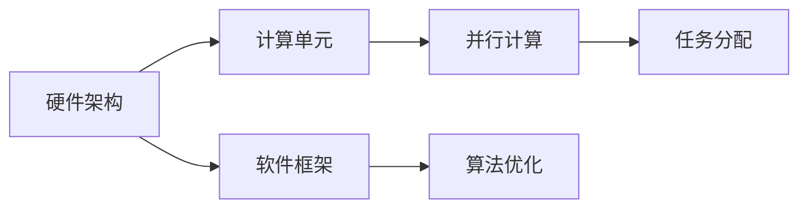
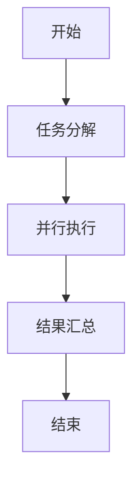
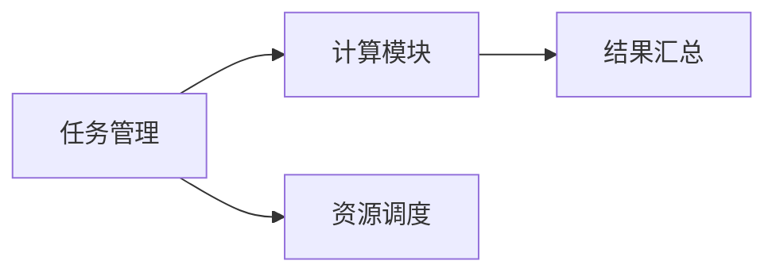

                 


# 如何识别企业的边缘AI芯片异构计算优势

> 关键词：边缘AI芯片，异构计算，企业优势，技术博客，系统架构

> 摘要：本文详细探讨了企业在识别边缘AI芯片异构计算优势时的关键步骤和方法。从概念解析到技术原理，再到系统架构设计和算法优化，文章为企业提供了全面的指导，帮助其在竞争激烈的市场中把握技术优势。

---

# 第一部分: 边缘AI芯片与异构计算基础

## 第1章: 边缘AI芯片概述

### 1.1 边缘计算的基本概念

#### 1.1.1 边缘计算的定义
边缘计算是指在靠近数据源的地方进行数据处理和分析的计算模式，减少了对云端的依赖，提高了实时性和响应速度。

#### 1.1.2 边缘计算的特点
- **实时性**：数据在生成地快速处理。
- **低延迟**：减少网络传输时间。
- **安全性**：数据在本地处理，降低数据泄露风险。
- **灵活性**：适用于多种场景和设备。

#### 1.1.3 边缘计算的应用场景
边缘计算广泛应用于物联网、自动驾驶、智能工厂等领域，特别是在需要快速决策和实时响应的场景中。

### 1.2 AI芯片的核心技术

#### 1.2.1 AI芯片的定义
AI芯片是专为运行人工智能算法设计的硬件，具备高效的计算能力和优化的架构。

#### 1.2.2 异构计算的基本原理
异构计算利用多种计算单元（如CPU、GPU、FPGA等）协同工作，以提高计算效率和性能。

#### 1.2.3 边缘AI芯片的优势
边缘AI芯片的优势包括低功耗、高计算效率和本地处理能力，适合边缘计算环境。

### 1.3 异构计算的背景与趋势

#### 1.3.1 异构计算的发展历程
从单核计算到多核计算，再到异构计算，反映了计算技术的进步和多样化需求。

#### 1.3.2 边缘计算与异构计算的结合
边缘计算的需求推动了异构计算的发展，异构计算则为边缘AI芯片提供了强大的计算能力。

#### 1.3.3 企业对边缘AI芯片的需求
企业希望通过边缘AI芯片实现高效的数据处理和分析，提升业务竞争力。

---

## 第2章: 边缘AI芯片的核心概念与联系

### 2.1 异构计算的原理

#### 2.1.1 并行计算的基本概念
并行计算通过同时执行多个任务来提高计算效率。

#### 2.1.2 异构计算的实现方式
- **任务分解**：将任务分配给不同类型的计算单元。
- **资源分配**：根据任务类型分配合适的计算资源。
- **负载均衡**：确保各计算单元的负载合理分配。

#### 2.1.3 异构计算的性能优势
- **计算效率高**：利用不同类型计算单元的优势。
- **资源利用率高**：通过优化资源分配减少浪费。

### 2.2 异构计算的核心要素

#### 2.2.1 硬件架构的多样性
- CPU、GPU、FPGA等多种硬件协同工作。

#### 2.2.2 软件框架的兼容性
- 支持多种计算框架，如TensorFlow、PyTorch等。

#### 2.2.3 算法优化的策略
- 算法适配硬件架构，提升计算效率。

### 2.3 异构计算的实体关系图



---

## 第3章: 异构计算的算法原理

### 3.1 并行计算的算法流程



### 3.2 算法实现的数学模型

#### 3.2.1 并行计算的基本公式
$$t_{\text{total}} = \frac{t_{\text{serial}}}{n}$$
其中，$t_{\text{total}}$ 是总时间，$t_{\text{serial}}$ 是串行时间，$n$ 是并行任务数。

#### 3.2.2 异构计算的优化策略
$$\text{加速比} = \frac{\text{串行时间}}{\text{并行时间}}$$

---

## 第4章: 系统分析与架构设计方案

### 4.1 问题场景介绍

#### 4.1.1 边缘AI芯片的应用场景
边缘AI芯片用于智能摄像头、工业传感器等设备，实现本地数据处理和分析。

#### 4.1.2 异构计算的系统需求
系统需要支持多种计算任务，具备高效的任务分配和负载均衡能力。

### 4.2 系统功能设计

#### 4.2.1 系统功能模块
- **任务管理模块**：负责任务分配和资源调度。
- **计算模块**：执行具体的计算任务。
- **结果汇总模块**：整合各计算单元的结果。

#### 4.2.2 系统架构图



---

## 第5章: 算法优化与实现

### 5.1 算法优化策略

#### 5.1.1 算法选择
选择适合异构计算的算法，如并行化矩阵乘法。

#### 5.1.2 算法实现

```python
def parallel_matrix_mult(A, B, num_workers):
    # 分割矩阵
    chunks = divide_matrix(A, B, num_workers)
    # 并行计算
    results = []
    for i in range(num_workers):
        results.append(calculate_chunk(chunks[i]))
    # 整合结果
    return combine_results(results)
```

### 5.2 算法优化的数学模型

#### 5.2.1 并行计算的加速公式
$$\text{加速比} = \frac{1}{\frac{1}{n} \sum_{i=1}^{n} t_i}$$
其中，$t_i$ 是每个任务的执行时间，$n$ 是并行任务数。

---

## 第6章: 项目实战

### 6.1 环境安装

#### 6.1.1 安装依赖
安装必要的库和工具，如Python、NumPy、OpenCV等。

### 6.2 核心实现

#### 6.2.1 任务分配函数

```python
def divide_tasks(tasks, num_workers):
    return [tasks[i*num_workers: (i+1)*num_workers] for i in range(len(tasks)//num_workers)]
```

#### 6.2.2 并行计算函数

```python
def parallel_execute(tasks):
    import multiprocessing
    with multiprocessing.Pool() as pool:
        return pool.map(calculate_task, tasks)
```

### 6.3 案例分析

#### 6.3.1 应用场景
在智能安防系统中，使用边缘AI芯片进行实时图像识别。

#### 6.3.2 性能对比
对比异构计算与单机计算的性能，验证优化效果。

---

## 第7章: 总结与展望

### 7.1 总结

#### 7.1.1 核心要点回顾
- 边缘AI芯片的优势
- 异构计算的实现原理
- 系统架构设计的关键点

### 7.1.2 最佳实践 tips
- 合理选择硬件架构
- 优化算法以适应异构计算
- 定期更新和维护系统架构

### 7.1.3 未来展望
随着技术的发展，边缘AI芯片和异构计算将在更多领域得到应用，推动智能化进程。

---

通过以上章节的详细讲解，读者可以全面理解边缘AI芯片异构计算的优势，并能够在实际项目中应用这些知识，提升企业的技术竞争力。

