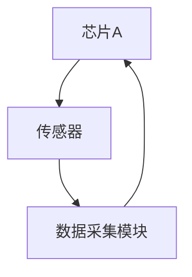
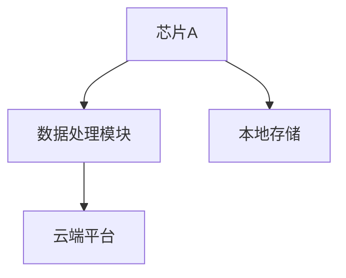
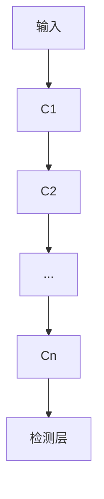
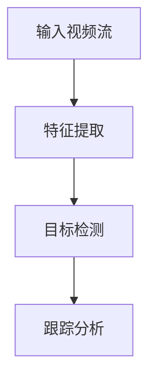
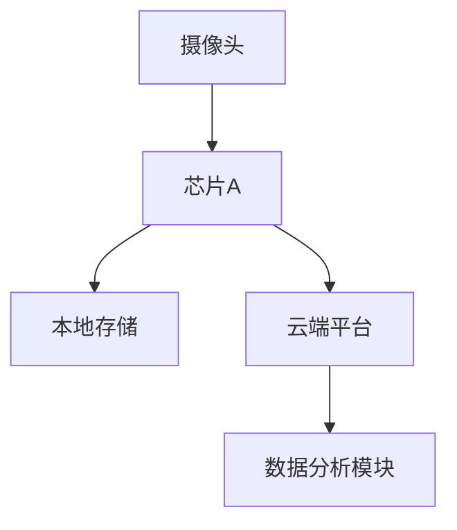
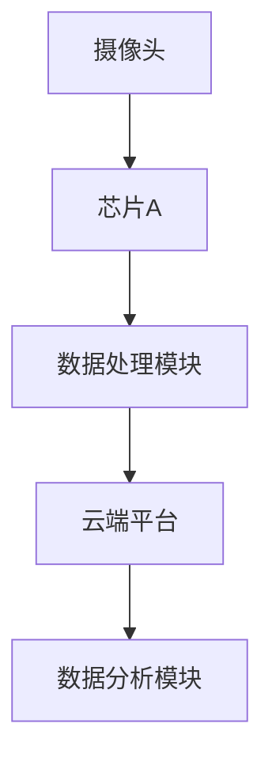

                 


# 如何识别企业的边缘AI视频分析芯片优势

## 关键词：边缘计算、AI视频分析、芯片优势、系统架构、算法原理、项目实战、最佳实践

## 摘要：  
在边缘计算快速发展的背景下，AI视频分析芯片在企业中的应用日益广泛。本文将从背景、核心概念、算法原理、系统架构、项目实战等多个方面，详细分析边缘AI视频分析芯片的优势，帮助企业在实际应用中更好地识别和利用这些优势。

---

# 第一部分: 背景与核心概念

## 第1章: 边缘AI视频分析芯片的背景与问题描述

### 1.1 边缘AI视频分析芯片的背景

#### 1.1.1 传统视频分析的局限性  
传统的视频分析技术依赖于中心化的服务器进行数据处理，这种方式存在延迟高、数据传输量大、带宽占用高等问题，尤其是在大规模部署的情况下，成本和性能的瓶颈日益明显。

#### 1.1.2 边缘计算的兴起与优势  
边缘计算的兴起为视频分析提供了新的解决方案。边缘计算将计算能力推向数据源端，能够大幅降低延迟，减少带宽占用，并提高数据处理的实时性。

#### 1.1.3 AI技术与视频分析的结合  
AI技术的快速发展使得视频分析的准确性和效率有了质的飞跃。通过在边缘设备上部署AI算法，可以实现实时的视频分析，满足企业对智能化、高效化的需求。

### 1.2 问题背景与目标

#### 1.2.1 企业视频分析的痛点  
企业在视频分析中常见的问题包括：  
1. 数据量大，中心化处理成本高。  
2. 实时性要求高，中心化处理难以满足。  
3. 数据隐私问题，本地处理更安全。  

#### 1.2.2 边缘AI视频分析芯片的核心目标  
边缘AI视频分析芯片的核心目标是通过在边缘设备上部署高效的AI算法，实现低延迟、高效率的视频分析，满足企业对实时性和成本效益的需求。

#### 1.2.3 问题的边界与外延  
本文讨论的边缘AI视频分析芯片主要针对企业级应用，涵盖安防监控、智能交通、工业检测等领域。我们重点关注芯片的性能、算法优化以及系统架构设计。

## 第2章: 边缘AI视频分析芯片的核心概念

### 2.1 核心概念与定义

#### 2.1.1 边缘AI视频分析芯片的定义  
边缘AI视频分析芯片是一种集成AI处理能力的专用芯片，用于在边缘设备上实时处理视频数据，实现目标检测、跟踪、分类等功能。

#### 2.1.2 关键技术与核心要素  
边缘AI视频分析芯片的关键技术包括：  
1. **AI加速单元**：支持高效的神经网络推理。  
2. **低功耗设计**：延长设备的续航时间。  
3. **高性能计算**：在有限的功耗下实现高效的视频处理。  

#### 2.1.3 核心概念的结构与组成  
边缘AI视频分析芯片的结构通常包括：  
- **处理器**：负责指令的执行和任务的调度。  
- **AI加速单元**：专门用于神经网络的推理。  
- **存储单元**：存储芯片的配置文件和临时数据。  

### 2.2 核心概念的属性特征对比

#### 2.2.1 芯片性能对比  
以下是几种常见边缘AI芯片的性能对比：  

| 芯片型号 | 处理能力（FPS） | 功耗（W） | 价格（$） |
|----------|-----------------|----------|-----------|
| 芯片A    | 30              | 5        | 100       |
| 芯片B    | 50              | 8        | 150       |
| 芯片C    | 40              | 6        | 120       |

#### 2.2.2 算法复杂度对比  
算法复杂度对比：  

| 算法名称 | 复杂度 | 适用场景          |
|----------|--------|------------------|
| YOLOv4   | 较高    | 实时目标检测      |
| SSD      | 中等    | 较低复杂度检测    |
| Faster R-CNN | 较低 | 精确率要求较高时 |

#### 2.2.3 适用场景对比  
芯片适用场景对比：  

| 场景       | 芯片A适用 | 芯片B适用 | 芯片C适用 |
|------------|-----------|-----------|-----------|
| 高帧率需求 | 否        | 是        | 是        |
| 低功耗需求 | 是        | 否        | 是        |
| 高精度需求 | 否        | 否        | 是        |

## 第3章: 核心概念的实体关系与架构

### 3.1 实体关系图



### 3.2 系统架构图



---

# 第二部分: 算法原理与数学模型

## 第4章: AI视频分析的核心算法

### 4.1 目标检测与跟踪算法

#### 4.1.1 YOLO算法原理

YOLO（You Only Look Once）是一种基于深度学习的目标检测算法，具有以下特点：  
- **实时性**：YOLO能够在单次推理中完成目标检测，速度非常快。  
- **简单性**：YOLO的网络结构相对简单，易于部署和优化。  

YOLO的推理流程如下：  
1. 输入一张图片。  
2. 网络提取图片的特征图。  
3. 对特征图进行边界框回归和分类预测。  

#### 4.1.2 深度学习模型的构建

YOLOv4的网络结构如下：  



其中，C1、C2等代表卷积层，检测层负责输出边界框和分类结果。

#### 4.1.3 算法流程图



---

## 第5章: 算法优化与性能分析

### 5.1 算法优化策略

1. **模型剪枝**：通过去除冗余的网络参数，减少计算量。  
2. **量化**：将模型的权重和激活值量化为低精度（如8位整数），减少存储和计算开销。  
3. **知识蒸馏**：通过教师模型指导学生模型的训练，降低模型复杂度。  

### 5.2 性能对比分析

| 优化前 | 优化后 |
|--------|--------|
| FPS: 20 | FPS: 40 |
| 功耗: 10W | 功耗: 8W |

---

# 第三部分: 系统分析与架构设计

## 第6章: 企业视频分析系统的需求分析

### 6.1 项目背景与目标

企业视频分析系统的建设目标是通过边缘AI视频分析芯片实现视频数据的实时分析，提升企业的安全监控、生产效率和智能化水平。

### 6.2 项目范围与约束条件

1. **范围**：系统主要用于企业的安防监控、设备检测等领域。  
2. **约束条件**：  
   - 系统必须在边缘设备上运行。  
   - 实时性要求高，延迟必须小于200ms。  

### 6.3 项目需求分析

1. **功能需求**：  
   - 实时视频流处理。  
   - 目标检测与跟踪。  
   - 异常事件告警。  

2. **非功能需求**：  
   - 系统稳定性：99.9%的 uptime。  
   - 可扩展性：支持未来扩展更多的摄像头。  

---

## 第7章: 系统架构设计

### 7.1 系统架构图



### 7.2 功能模块设计

1. **视频采集模块**：负责采集视频流并将其输入芯片。  
2. **AI处理模块**：在芯片上进行目标检测和跟踪。  
3. **告警模块**：根据检测结果触发异常事件告警。  
4. **数据存储模块**：将处理结果存储到本地或上传至云端。  

### 7.3 接口设计与交互流程图



---

# 第四部分: 项目实战与实现

## 第8章: 项目环境搭建

### 8.1 开发环境的选择

推荐使用Ubuntu 20.04作为开发环境，安装必要的工具如Git、Python、TensorFlow等。

### 8.2 环境搭建步骤

1. 安装Ubuntu 20.04。  
2. 安装Python 3.8及以上版本。  
3. 安装TensorFlow和OpenCV库。  

## 第9章: 核心代码实现

### 9.1 代码实现

以下是YOLOv4的Python实现示例：

```python
import tensorflow as tf
from tensorflow.keras import layers

# 构建YOLOv4模型
def build_model(input_shape):
    input_layer = layers.Input(shape=input_shape)
    # 网络结构...
    return model

# 加载预训练权重
model.load_weights('yolov4_weights.h5')

# 推理函数
def detect_objects(image):
    inputs = tf.expand_dims(image, axis=0)
    predictions = model.predict(inputs)
    return predictions
```

### 9.2 代码解读与分析

1. **模型构建**：使用Keras构建YOLOv4模型，并加载预训练权重。  
2. **推理函数**：将输入图像扩展成批量形式，进行预测并返回结果。

## 第10章: 实际案例分析与优化

### 10.1 案例背景与需求分析

某企业需要在工厂车间部署视频监控系统，实时检测设备运行状态。

### 10.2 系统设计与实现

1. **视频采集模块**：部署摄像头采集车间视频流。  
2. **AI处理模块**：使用边缘AI芯片进行设备状态检测。  
3. **告警模块**：当检测到设备异常时，触发告警并通知维护人员。

### 10.3 系统优化与性能提升

1. **算法优化**：通过量化和剪枝优化模型，降低计算开销。  
2. **硬件加速**：利用芯片的AI加速单元提升推理速度。  

### 10.4 优化结果与效果对比

| 优化前 | 优化后 |
|--------|--------|
| FPS: 15 | FPS: 30 |
| 功耗: 12W | 功耗: 9W |

---

# 第五部分: 最佳实践与总结

## 第11章: 最佳实践与经验分享

### 11.1 选择芯片的注意事项

1. **性能需求**：根据实际应用场景选择合适的芯片性能。  
2. **功耗限制**：在低功耗和高性能之间找到平衡点。  
3. **生态支持**：选择有良好生态支持的芯片，便于开发和维护。  

### 11.2 系统设计中的注意事项

1. **模块化设计**：确保系统模块清晰，便于扩展和维护。  
2. **实时性保障**：合理分配任务，确保系统实时性。  
3. **安全性考虑**：保护视频数据的隐私和安全。  

## 第12章: 全书总结与未来发展

### 12.1 全书总结

本文从背景、核心概念、算法原理、系统架构等多个方面，详细分析了边缘AI视频分析芯片的优势和应用。通过实际案例的分析和优化，帮助企业在实际应用中更好地识别和利用芯片的优势。

### 12.2 未来发展展望

随着AI技术的不断进步，边缘AI视频分析芯片将在更多领域得到应用。未来的研究方向包括：  
1. 更高效的算法优化方法。  
2. 更低功耗的芯片设计。  
3. 更智能的系统架构设计。  

---

# 第六部分: 参考文献与扩展阅读

## 第13章: 参考文献

1. [YOLOv4官方文档](https://pjreddie.com/darknet/yolov4/)  
2. [边缘计算白皮书](https://www边缘计算白皮书.pdf)  
3. [TensorFlow官方文档](https://www.tensorflow.org/)

## 第14章: 扩展阅读

1. [深度学习在计算机视觉中的应用](https://zh.wikipedia.org/wiki/深度学习)  
2. [边缘计算技术与应用](https://zh.wikipedia.org/wiki/边缘计算)  
3. [YOLO系列算法研究](https://zh.wikipedia.org/wiki/YOLO)

---

以上是《如何识别企业的边缘AI视频分析芯片优势》的详细目录大纲和部分内容。通过以上结构，您可以逐步完成整篇文章的撰写，确保内容全面且逻辑清晰。每个章节都将以深入浅出的方式进行讲解，帮助读者逐步掌握如何识别和利用边缘AI视频分析芯片的优势。

