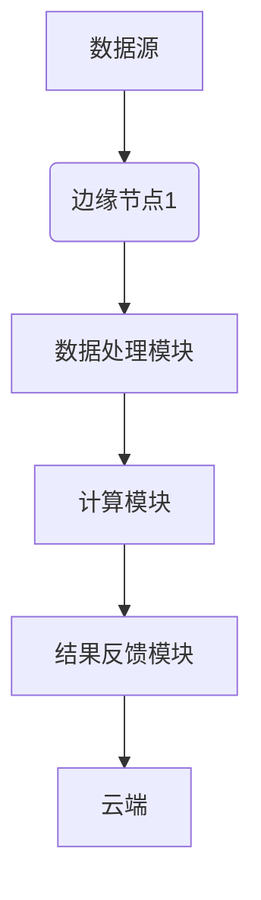

                 


# 如何识别企业的边缘计算优势

> 关键词：边缘计算、企业优势、分布式计算、实时数据处理、物联网、数字化转型

> 摘要：边缘计算作为一种分布式计算范式，正在逐渐成为企业数字化转型中的关键驱动力。本文将从边缘计算的背景、核心概念、算法原理、系统架构、项目实战等多个方面，深入分析如何识别和利用企业的边缘计算优势。通过详细的技术解析和实际案例，本文将为企业在边缘计算领域的实践提供清晰的指导和实用的建议。

---

## 第一部分：边缘计算背景与核心概念

### 第1章：边缘计算的背景与定义

#### 1.1 边缘计算的定义与特点
- **1.1.1 边缘计算的定义**
  边缘计算是一种分布式计算范式，它将数据处理和计算能力从中心化的云端转移到数据源附近，以减少延迟并提高数据处理的实时性。

- **1.1.2 边缘计算的核心特点**
  - **分布式架构**：数据在靠近源的边缘节点进行处理，减少对云端的依赖。
  - **低延迟**：边缘计算能够快速响应本地事件，适用于实时性要求高的场景。
  - **带宽优化**：通过在边缘处理数据，减少需要传输到云端的数据量，节省带宽成本。
  - **本地化决策**：边缘节点能够独立完成部分计算任务，具备一定的自治性。

- **1.1.3 边缘计算与云计算的区别**
  边缘计算与云计算的区别主要体现在数据处理的位置和计算资源的分布上。云计算依赖于中心化的服务器集群，而边缘计算则是将计算能力分散到边缘节点。

- **1.1.4 边缘计算的生态系统**
  边缘计算涵盖了硬件、软件、网络和应用等多个层面，形成了一个完整的生态系统。例如，边缘服务器、边缘网关、边缘云平台等都是边缘计算生态的重要组成部分。

#### 1.2 边缘计算的背景与发展趋势
- **1.2.1 传统计算模式的局限性**
  传统的云计算模式在数据量激增的背景下，面临着延迟高、带宽消耗大、本地化决策能力不足等问题。

- **1.2.2 边缘计算的兴起背景**
  随着物联网（IoT）的普及和实时数据处理需求的增加，边缘计算因其低延迟、带宽优化和本地化决策的优势而逐渐兴起。

- **1.2.3 边缘计算的发展趋势**
  - **技术融合**：边缘计算与人工智能、5G、物联网等技术的深度融合将推动其快速发展。
  - **行业应用扩展**：边缘计算在制造业、医疗、交通、能源等行业的应用将逐渐普及。
  - **标准化进程**：边缘计算的标准制定和生态系统完善将加速其商业化进程。

#### 1.3 边缘计算在企业中的应用价值
- **1.3.1 边缘计算对企业业务的影响**
  边缘计算能够提升企业的数据处理效率，优化业务流程，并增强实时决策能力。
  
- **1.3.2 边缘计算在企业数字化转型中的作用**
  在数字化转型中，边缘计算为企业提供了更高效的数据处理方式，支持实时数据分析和智能化决策。

- **1.3.3 边缘计算的核心优势**
  - **实时性**：边缘计算能够快速响应本地事件，适用于需要实时决策的应用场景。
  - **带宽优化**：通过在边缘处理数据，减少对云端的依赖，降低带宽消耗。
  - **本地化决策**：边缘节点能够独立完成部分计算任务，具备一定的自治性。

---

## 第二部分：边缘计算的核心概念与原理

### 第2章：边缘计算的核心概念与原理

#### 2.1 边缘计算的基本原理
- **2.1.1 边缘计算的计算流程**
  边缘计算的计算流程通常包括数据采集、数据处理、计算与分析、结果反馈等步骤。通过在边缘节点完成这些步骤，能够实现快速响应和本地化决策。

- **2.1.2 边缘计算的节点架构**
  边缘节点是边缘计算的核心组成部分，通常包括计算单元、存储单元和通信单元。边缘节点能够独立完成部分计算任务，并与云端或其他边缘节点进行数据交互。

- **2.1.3 边缘计算的数据处理机制**
  边缘计算的数据处理机制包括数据采集、数据压缩、数据加密、数据传输和数据存储等多个环节。通过在边缘节点进行数据预处理，可以减少需要传输到云端的数据量，提高数据处理效率。

#### 2.2 边缘计算的关键技术
- **2.2.1 边缘节点的计算能力**
  边缘节点的计算能力主要依赖于硬件性能和软件优化。通过使用高性能的边缘服务器和优化算法，可以提高边缘节点的计算效率。

- **2.2.2 边缘计算的通信机制**
  边缘计算的通信机制包括本地通信和跨边缘节点通信。本地通信通常采用局域网技术，而跨边缘节点通信则需要依赖于网络协议和通信协议的优化。

- **2.2.3 边缘计算的安全性保障**
  边缘计算的安全性保障包括数据加密、访问控制、身份认证等技术。通过在边缘节点实现多层次的安全防护，可以有效保障数据的安全性和系统的稳定性。

#### 2.3 边缘计算与企业业务的结合
- **2.3.1 边缘计算在企业IT架构中的位置**
  边缘计算在企业IT架构中的位置通常是靠近数据源的边缘层，与云端和应用层共同构成分布式计算架构。

- **2.3.2 边缘计算与企业数据流的关系**
  边缘计算通过在边缘节点处理数据，优化了企业数据流的流动路径，减少了云端的负担，提高了数据处理效率。

- **2.3.3 边缘计算对企业业务流程的优化**
  边缘计算能够实时处理数据，快速响应业务需求，优化业务流程，提升企业的整体运营效率。

---

## 第三部分：边缘计算的算法与数学模型

### 第3章：边缘计算的核心算法与数学模型

#### 3.1 边缘计算中的关键算法
- **3.1.1 边缘节点的计算优化算法**
  边缘节点的计算优化算法包括数据压缩算法、任务调度算法等。这些算法旨在提高边缘节点的计算效率，减少资源消耗。

- **3.1.2 边缘计算中的数据压缩算法**
  数据压缩算法用于减少数据传输量，提高数据传输效率。例如，使用熵编码算法对数据进行压缩，可以有效降低数据传输的带宽消耗。

- **3.1.3 边缘计算中的任务调度算法**
  任务调度算法用于优化边缘节点的任务分配，提高计算资源的利用率。例如，基于负载均衡的任务调度算法可以有效分配计算任务，避免节点过载。

#### 3.2 边缘计算的数学模型
- **3.2.1 边缘节点的计算能力模型**
  边缘节点的计算能力模型可以通过硬件性能指标和软件优化策略来建模。例如，使用CPU利用率和内存占用率等指标来评估边缘节点的计算能力。

- **3.2.2 边缘计算中的数据传输模型**
  数据传输模型可以通过网络带宽和延迟等参数来建模。例如，使用排队论模型来分析数据传输的效率和延迟。

- **3.2.3 边缘计算中的资源分配模型**
  资源分配模型可以通过计算资源的需求和供给来建模。例如，使用线性规划模型来优化资源分配，提高系统整体效率。

#### 3.3 算法的实现与优化
- **3.3.1 算法的实现流程**
  边缘计算算法的实现流程包括算法设计、代码实现、测试优化和部署应用等步骤。通过详细的实现流程，可以确保算法在边缘节点上的高效运行。

- **3.3.2 算法的优化策略**
  算法优化策略包括代码优化、硬件加速和分布式计算优化等。通过优化策略，可以进一步提高算法的执行效率和系统的整体性能。

- **3.3.3 算法的性能评估**
  算法性能评估包括计算效率、资源利用率、延迟和带宽消耗等指标。通过性能评估，可以验证算法的有效性和优化的空间。

---

## 第四部分：边缘计算的系统架构与设计

### 第4章：边缘计算的系统架构与设计

#### 4.1 边缘计算的系统架构
- **4.1.1 边缘计算的分层架构**
  边缘计算的分层架构通常包括感知层、网络层、计算层和应用层。每一层负责不同的功能模块，协同工作以实现数据处理和计算任务。

- **4.1.2 边缘计算的节点架构**
  边缘节点的架构包括硬件层、操作系统层和应用层。硬件层提供计算和存储资源，操作系统层提供运行环境，应用层负责具体的计算任务。

- **4.1.3 边缘计算的通信架构**
  边缘计算的通信架构包括本地通信和跨边缘节点通信。本地通信通常采用局域网技术，而跨边缘节点通信则需要依赖于网络协议和通信协议的优化。

#### 4.2 边缘计算的功能设计
- **4.2.1 边缘节点的功能模块**
  边缘节点的功能模块包括数据采集、数据处理、计算与分析、结果反馈等。这些模块协同工作，完成边缘计算的整个流程。

- **4.2.2 边缘计算的管理模块**
  边缘计算的管理模块包括资源管理、任务调度、安全管理等。这些模块负责优化系统资源的利用，确保系统的安全性和稳定性。

- **4.2.3 边缘计算的应用模块**
  边缘计算的应用模块包括实时监控、数据可视化、智能决策等。这些模块基于边缘计算的结果，提供具体的业务功能。

#### 4.3 边缘计算的系统实现
- **4.3.1 系统的功能实现**
  系统的功能实现包括数据采集、数据处理、计算与分析、结果反馈等步骤。通过具体的实现步骤，可以确保系统的高效运行。

- **4.3.2 系统的模块划分**
  系统的模块划分包括数据采集模块、数据处理模块、计算模块和应用模块。每个模块负责不同的功能，协同工作以实现系统目标。

- **4.3.3 系统的接口设计**
  系统的接口设计包括本地接口和跨边缘节点接口。通过合理的接口设计，可以实现模块之间的高效交互，确保系统的整体性能。

#### 4.4 边缘计算的系统架构图


---

## 第五部分：边缘计算的项目实战

### 第5章：边缘计算的项目实战

#### 5.1 项目背景与目标
- **5.1.1 项目背景**
  本项目旨在通过边缘计算技术，优化企业的数据处理流程，提升实时决策能力，降低带宽消耗和运营成本。

- **5.1.2 项目目标**
  - 实现边缘节点的数据采集和处理功能。
  - 优化边缘节点的计算效率，减少延迟。
  - 实现边缘节点与云端的高效交互，确保数据的完整性和安全性。

#### 5.2 项目环境的搭建
- **5.2.1 环境需求分析**
  - 硬件需求：边缘服务器、边缘网关等。
  - 软件需求：边缘计算平台、数据处理工具、开发环境等。
  - 网络需求：本地网络环境，支持边缘节点之间的通信。

- **5.2.2 环境搭建步骤**
  1. 安装边缘计算平台。
  2. 配置边缘节点的硬件和网络环境。
  3. 安装必要的数据处理工具和开发环境。
  4. 测试环境的连通性和稳定性。

- **5.2.3 环境配置与测试**
  1. 配置边缘节点的IP地址和网络参数。
  2. 测试边缘节点之间的通信。
  3. 验证边缘节点的数据采集和处理功能。

#### 5.3 项目核心代码实现
- **5.3.1 核心算法的实现**
  1. 数据压缩算法的实现：
     ```python
     import zlib

     def compress(data):
         return zlib.compress(data.encode())
     ```
  2. 任务调度算法的实现：
     ```python
     import random

     def task_scheduler(tasks, nodes):
         return tasks[i % len(nodes)] for i in range(len(tasks))
     ```

- **5.3.2 系统功能的实现**
  1. 数据采集模块的实现：
     ```python
     import socket

     def data采集(data):
         return data
     ```

  2. 计算模块的实现：
     ```python
     def 计算(data):
         return data * 2
     ```

  3. 结果反馈模块的实现：
     ```python
     def 反馈(result):
         print(result)
     ```

- **5.3.3 系统接口的实现**
  1. 本地接口的定义：
     ```python
     def local_interface(data):
         return 处理(data)
     ```

  2. 跨边缘节点接口的定义：
     ```python
     def cross_edge_interface(data, node):
         return 跨节点处理(data, node)
     ```

#### 5.4 项目案例分析
- **5.4.1 案例背景**
  本案例以制造业为例，通过边缘计算优化生产过程中的实时数据处理，提高生产效率。

- **5.4.2 案例分析**
  1. 数据采集：通过边缘节点采集生产线上的实时数据。
  2. 数据处理：在边缘节点进行数据压缩和初步分析。
  3. 计算与分析：边缘节点完成计算任务，并将结果反馈到云端。
  4. 应用场景：优化生产流程，提高产品质量和生产效率。

- **5.4.3 案例总结**
  通过边缘计算优化生产过程，能够显著降低数据传输延迟，提高生产效率，并减少带宽消耗。

---

## 第六部分：总结与展望

### 第6章：总结与展望

#### 6.1 本章小结
通过本文的分析，我们深入探讨了边缘计算的核心概念、算法原理、系统架构以及项目实战。边缘计算作为一种分布式计算范式，正在逐渐成为企业数字化转型中的关键驱动力。通过识别和利用企业的边缘计算优势，可以显著提升企业的数据处理效率和实时决策能力。

#### 6.2 最佳实践 tips
- **硬件选择**：选择高性能的边缘服务器和边缘网关，确保边缘节点的计算能力。
- **软件优化**：优化数据处理算法和任务调度算法，提高系统的整体性能。
- **安全防护**：加强边缘节点的安全性保障，确保数据的安全性和系统的稳定性。
- **系统维护**：定期维护和更新系统，确保边缘计算平台的高效运行。

#### 6.3 未来展望
随着边缘计算技术的不断发展，未来将有更多的行业和应用场景能够受益于边缘计算的优势。例如，人工智能与边缘计算的结合将进一步推动智能化决策的发展。此外，边缘计算的标准化进程也将加速，为企业提供更完善的生态系统和解决方案。

---

通过本文的系统分析和详细讲解，我们希望能够为企业在边缘计算领域的实践提供清晰的指导和实用的建议。希望读者能够通过本文的阅读，深入理解边缘计算的优势，并能够在实际工作中充分利用这些优势，推动企业的数字化转型和智能化发展。

