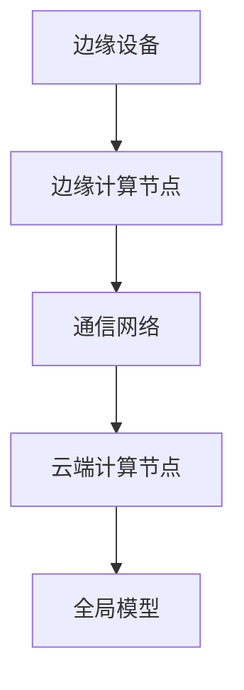

                 


# 如何识别企业的边缘计算分布式学习优势

## 关键词：
边缘计算，分布式学习，企业应用，算法原理，系统架构

## 摘要：
边缘计算和分布式学习是当前技术领域的热点，特别是在企业应用中。本文将详细分析边缘计算和分布式学习的核心概念、算法原理、系统架构，并通过实际案例和项目实战，帮助企业识别边缘计算分布式学习的优势，提升企业的竞争力。

---

## 第一部分：边缘计算与分布式学习概述

### 1.1 边缘计算的定义与特点

#### 1.1.1 边缘计算的定义
边缘计算是指在数据生成的源端（如传感器、设备等）进行计算处理，而不是将数据传输到云端进行集中处理。

#### 1.1.2 边缘计算的核心特点
- **低延迟**：边缘计算能够在数据生成的地方快速处理，减少数据传输到云端的时间，从而降低延迟。
- **高实时性**：适用于需要实时响应的场景，如工业自动化、自动驾驶等。
- **节省带宽**：通过在边缘处理数据，减少了需要传输到云端的数据量，节省了带宽成本。
- **本地化处理**：边缘计算能够处理本地数据，适用于需要本地隐私保护和数据安全的场景。

#### 1.1.3 边缘计算与云计算的区别
- **数据处理位置**：边缘计算在数据生成的地方进行处理，而云计算将数据传输到云端进行集中处理。
- **延迟**：边缘计算具有低延迟，而云计算的延迟较高。
- **带宽使用**：边缘计算节省带宽，而云计算需要大量的带宽。

### 1.2 分布式学习的定义与优势

#### 1.2.1 分布式学习的定义
分布式学习是指在多个计算节点上分布式地进行机器学习模型的训练，每个节点只处理部分数据，通过通信协议将模型参数同步到其他节点。

#### 1.2.2 分布式学习的核心优势
- **数据隐私保护**：分布式学习可以在不共享原始数据的情况下进行模型训练，保护数据隐私。
- **计算资源利用率高**：通过分布式计算，可以充分利用多台设备的计算能力，提高整体计算效率。
- **容错能力强**：分布式系统能够在部分节点故障的情况下继续运行，保证系统的高可用性。

#### 1.2.3 分布式学习与集中式学习的对比
- **数据隐私保护**：分布式学习保护数据隐私，而集中式学习需要将数据集中到云端，存在数据泄露风险。
- **计算资源利用率**：分布式学习利用多台设备的计算能力，而集中式学习需要集中计算资源。
- **容错能力**：分布式学习具有较高的容错能力，而集中式学习在单点故障时可能会导致整个系统崩溃。

### 1.3 企业边缘计算分布式学习的背景

#### 1.3.1 企业数字化转型的背景
随着企业数字化转型的推进，边缘计算和分布式学习在企业中的应用越来越广泛。企业需要处理大量的实时数据，同时需要保护数据隐私，降低计算成本。边缘计算和分布式学习为企业提供了新的解决方案。

#### 1.3.2 边缘计算在企业中的应用场景
- **智能制造**：通过边缘计算节点采集生产线上的传感器数据，进行设备故障预测和优化。
- **智慧城市**：通过边缘计算节点采集交通流量数据，进行交通流量预测和优化。
- **智能医疗**：通过边缘计算节点采集患者数据，进行疾病预测和诊断。

#### 1.3.3 分布式学习在企业中的潜在价值
- **提升模型泛化能力**：通过分布式学习，企业可以在边缘设备上进行模型训练，提升模型的泛化能力和适应性。
- **降低计算成本**：通过分布式计算，可以充分利用多台设备的计算能力，降低计算成本。
- **保护数据隐私**：通过分布式学习，企业可以在不共享原始数据的情况下进行模型训练，保护数据隐私。

---

## 第二部分：边缘计算分布式学习的核心概念与联系

### 2.1 边缘计算的体系结构

#### 2.1.1 边缘计算的分层架构
边缘计算的体系结构通常分为三层：感知层、网络层和计算层。

- **感知层**：负责数据的采集和初步处理，如传感器、摄像头等设备。
- **网络层**：负责数据的传输和通信，如物联网协议、5G等。
- **计算层**：负责数据的处理和分析，如边缘计算节点、云端计算节点等。

#### 2.1.2 边缘计算的主要组件
- **边缘设备**：负责数据的采集和初步处理，如传感器、摄像头等。
- **边缘计算节点**：负责数据的处理和分析，进行模型训练和更新。
- **通信网络**：负责数据和模型参数的传输，如5G、物联网协议等。
- **云端计算节点**：负责全局模型的管理和优化，提供计算资源支持。

#### 2.1.3 边缘计算的通信机制
- **数据传输**：通过通信网络将数据从边缘设备传输到边缘计算节点。
- **模型参数同步**：通过通信协议将模型参数从边缘计算节点同步到其他节点，更新全局模型。
- **数据加密**：通过加密通信协议保护数据隐私，防止数据泄露。

### 2.2 分布式学习的原理

#### 2.2.1 分布式学习的基本原理
分布式学习的核心是将数据分布在多个节点上，每个节点独立训练模型，然后将模型参数汇总，更新全局模型。

#### 2.2.2 分布式学习的核心算法
- **联邦学习**：多个参与方（如企业、用户等）各自持有数据，通过加密通信协议进行模型参数的同步和更新，实现模型的联合训练。
- **分层分布式学习**：将数据分成多个层次，每个层次进行独立的模型训练，然后将结果汇总到上层，形成全局模型。

#### 2.2.3 分布式学习的实现机制
- **同步分布式学习**：所有节点同时进行模型训练，定期同步模型参数，适用于计算资源充足的情况。
- **异步分布式学习**：节点可以在不同的时间进行模型训练，模型参数可以随时更新，适用于计算资源有限的情况。

### 2.3 边缘计算与分布式学习的结合

#### 2.3.1 边缘计算分布式学习的定义
边缘计算分布式学习是指在边缘计算节点上进行分布式学习，利用边缘计算的低延迟和高实时性，结合分布式学习的数据隐私保护和计算效率优势。

#### 2.3.2 边缘计算分布式学习的核心要素
- **边缘计算节点**：负责数据的采集和初步处理，进行模型训练和更新。
- **通信协议**：负责数据和模型参数的传输，确保数据和模型参数的安全性和高效性。
- **分布式学习算法**：通过分布式学习算法，实现模型的联合训练和更新。

#### 2.3.3 边缘计算分布式学习的实现框架
- **数据采集**：通过边缘设备采集数据，如传感器、摄像头等。
- **模型训练**：在边缘计算节点上进行模型训练，更新模型参数。
- **模型更新**：通过通信协议将模型参数同步到其他节点，更新全局模型。
- **结果输出**：将模型预测结果输出，供企业进行决策和应用。

### 2.4 核心概念对比分析

#### 2.4.1 集中式与分布式计算的对比
| 对比维度 | 集中式计算 | 分布式计算 |
|----------|------------|------------|
| 数据处理位置 | 集中到云端 | 分布到边缘节点 |
| 延迟 | 高 | 低 |
| 带宽使用 | 高 | 低 |
| 容错能力 | 低 | 高 |

#### 2.4.2 边缘计算与云计算的对比
| 对比维度 | 边缘计算 | 云计算 |
|----------|------------|------------|
| 数据处理位置 | 边缘节点 | 云端 |
| 延迟 | 低 | 高 |
| 带宽使用 | 低 | 高 |
| 数据隐私 | 高 | 低 |

#### 2.4.3 分布式学习与传统机器学习的对比
| 对比维度 | 分布式学习 | 传统机器学习 |
|----------|------------|------------|
| 数据分布 | 分布在多个节点 | 集中到云端 |
| 计算资源利用率 | 高 | 低 |
| 数据隐私保护 | 高 | 低 |

---

## 第三部分：边缘计算分布式学习的算法原理

### 3.1 分布式学习算法原理

#### 3.1.1 分布式学习算法概述
分布式学习算法主要分为两类：同步分布式学习和异步分布式学习。

- **同步分布式学习**：所有节点同时进行模型训练，定期同步模型参数，适用于计算资源充足的情况。
- **异步分布式学习**：节点可以在不同的时间进行模型训练，模型参数可以随时更新，适用于计算资源有限的情况。

#### 3.1.2 联邦学习算法
联邦学习是一种典型的分布式学习算法，通过在多个参与方之间进行模型参数的同步和更新，实现联合模型的训练。

- **联邦学习的定义**：参与方各自持有数据，通过加密通信协议进行模型参数的同步和更新。
- **联邦学习的流程**：
  1. 初始化模型参数。
  2. 各参与方独立训练模型。
  3. 通过通信协议同步模型参数，更新全局模型。
- **联邦学习的优缺点**：优点是保护数据隐私，缺点是需要较高的通信成本和计算资源。

#### 3.1.3 分层分布式学习算法
分层分布式学习是一种将数据分成多个层次进行独立训练的算法。

- **分层分布式学习的定义**：将数据分成多个层次，每个层次进行独立的模型训练，然后将结果汇总到上层，形成全局模型。
- **分层分布式学习的实现步骤**：
  1. 数据分层。
  2. 各层次独立训练模型。
  3. 结果汇总，更新全局模型。
- **分层分布式学习的优缺点**：优点是模型训练更加高效，缺点是需要复杂的层次划分和协调。

### 3.2 边缘计算分布式学习的数学模型

#### 3.2.1 分布式学习的数学模型
分布式学习的数学模型通常包括以下部分：

- **模型参数**：全局模型参数 $\theta$，由多个节点的局部模型参数 $\theta_i$ 组成。
- **损失函数**：每个节点的损失函数 $L_i(\theta_i)$。
- **优化目标**：通过优化全局模型参数 $\theta$，使得所有节点的损失函数之和最小。

$$ \min_{\theta} \sum_{i=1}^{N} L_i(\theta_i) $$

其中，$N$ 是节点的数量。

#### 3.2.2 联邦学习的数学模型
联邦学习的数学模型包括以下部分：

- **局部模型参数**：每个参与方的局部模型参数 $\theta_i$。
- **全局模型参数**：全局模型参数 $\theta$，通过通信协议同步到各个节点。
- **优化目标**：通过优化全局模型参数 $\theta$，使得所有参与方的局部损失函数之和最小。

$$ \min_{\theta} \sum_{i=1}^{N} L_i(\theta_i) $$

其中，$N$ 是参与方的数量。

#### 3.2.3 分层分布式学习的数学模型
分层分布式学习的数学模型包括以下部分：

- **层次划分**：将数据分成多个层次，每个层次进行独立的模型训练。
- **局部模型参数**：每个层次的局部模型参数 $\theta_j$。
- **全局模型参数**：通过汇总各层次的局部模型参数，更新全局模型参数 $\theta$。

$$ \theta = \sum_{j=1}^{M} \lambda_j \theta_j $$

其中，$M$ 是层次的数量，$\lambda_j$ 是每个层次的权重。

---

## 第四部分：边缘计算分布式学习的系统分析与架构设计

### 4.1 系统功能设计

#### 4.1.1 数据采集
通过边缘设备采集数据，如传感器、摄像头等。数据采集的过程需要确保数据的准确性和实时性。

#### 4.1.2 模型训练
在边缘计算节点上进行模型训练，更新模型参数。模型训练的过程需要考虑数据的分布和模型的复杂度。

#### 4.1.3 模型更新
通过通信协议将模型参数同步到其他节点，更新全局模型。模型更新的过程需要确保数据的安全性和高效性。

#### 4.1.4 结果输出
将模型预测结果输出，供企业进行决策和应用。结果输出的过程需要考虑结果的可解释性和实用性。

### 4.2 系统架构设计

#### 4.2.1 系统架构图


#### 4.2.2 系统组件
- **边缘设备**：负责数据的采集和初步处理，如传感器、摄像头等。
- **边缘计算节点**：负责数据的处理和分析，进行模型训练和更新。
- **通信网络**：负责数据和模型参数的传输，如5G、物联网协议等。
- **云端计算节点**：负责全局模型的管理和优化，提供计算资源支持。

#### 4.2.3 通信协议
- **数据传输**：通过通信网络将数据从边缘设备传输到边缘计算节点。
- **模型参数同步**：通过通信协议将模型参数从边缘计算节点同步到其他节点，更新全局模型。
- **数据加密**：通过加密通信协议保护数据隐私，防止数据泄露。

### 4.3 系统接口设计

#### 4.3.1 数据接口
定义数据的格式和传输方式，确保数据在各节点之间顺利传输。

#### 4.3.2 模型接口
定义模型的结构和参数，确保各节点之间能够同步模型参数。

#### 4.3.3 通信接口
定义通信协议和接口，确保数据和模型参数的传输安全和高效。

---

## 第五部分：边缘计算分布式学习的项目实战

### 5.1 项目环境搭建

#### 5.1.1 环境搭建步骤
1. **安装Python**：安装Python和pip，用于运行分布式学习算法。
2. **安装TensorFlow**：安装TensorFlow框架，用于模型训练和推理。
3. **安装通信协议库**：安装如gRPC、Kafka等通信协议库，用于数据和模型参数的传输。

#### 5.1.2 环境搭建代码示例
```python
# 安装Python和pip
python --version
pip install --upgrade pip

# 安装TensorFlow
pip install tensorflow

# 安装通信协议库
pip install grpcio
pip install kafka-python
```

### 5.2 核心代码实现

#### 5.2.1 数据采集
编写代码采集边缘设备的数据，如传感器数据、图像数据等。

```python
# 数据采集代码示例
import numpy as np

# 生成传感器数据
def generate_sensor_data():
    return np.random.rand(100, 10)  # 100个样本，每个样本10个特征

data = generate_sensor_data()
print("Sensor data generated:", data)
```

#### 5.2.2 模型训练
在边缘计算节点上进行模型训练，更新模型参数。

```python
# 模型训练代码示例
import tensorflow as tf

# 定义模型
model = tf.keras.Sequential([
    tf.keras.layers.Dense(10, activation='relu'),
    tf.keras.layers.Dense(1, activation='sigmoid')
])

# 编译模型
model.compile(optimizer='adam', loss='binary_crossentropy', metrics=['accuracy'])

# 训练模型
model.fit(data, labels, epochs=10, batch_size=32)
```

#### 5.2.3 模型更新
通过通信协议将模型参数同步到其他节点，更新全局模型。

```python
# 模型更新代码示例
def synchronize_models(local_model, global_model):
    global_model.set_weights(local_model.get_weights())

# 同步模型参数
synchronize_models(local_model, global_model)
```

#### 5.2.4 结果输出
将模型预测结果输出，供企业进行决策和应用。

```python
# 结果输出代码示例
def predict_and_output(model, input_data):
    predictions = model.predict(input_data)
    print("Predictions:", predictions)

# 预测结果
predict_and_output(global_model, new_data)
```

### 5.3 实际案例分析

#### 5.3.1 智能制造案例
通过边缘计算节点采集生产线上的传感器数据，进行设备故障预测和优化。

- **数据采集**：传感器数据采集。
- **模型训练**：在边缘计算节点上训练设备故障预测模型。
- **模型更新**：通过通信协议将模型参数同步到其他节点，更新全局模型。
- **结果输出**：将设备故障预测结果输出，供企业进行决策和优化。

#### 5.3.2 智慧城市案例
通过边缘计算节点采集交通流量数据，进行交通流量预测和优化。

- **数据采集**：交通流量数据采集。
- **模型训练**：在边缘计算节点上训练交通流量预测模型。
- **模型更新**：通过通信协议将模型参数同步到其他节点，更新全局模型。
- **结果输出**：将交通流量预测结果输出，供企业进行决策和优化。

---

## 第六部分：边缘计算分布式学习的最佳实践

### 6.1 小结
边缘计算分布式学习是一种高效、隐私保护的计算模式，适用于企业中需要实时响应和数据隐私保护的场景。通过边缘计算和分布式学习的结合，企业可以在边缘节点上进行模型训练，提升模型的泛化能力和适应性。

### 6.2 注意事项
在实际应用中，需要注意以下几点：

- **数据隐私保护**：确保数据在传输和处理过程中不被泄露，采用加密通信协议。
- **计算资源管理**：合理分配计算资源，确保模型训练和更新的效率。
- **系统安全性**：加强系统安全性，防止恶意攻击和数据篡改。

### 6.3 拓展阅读
- **相关书籍**：《分布式系统：概念与设计》、《边缘计算：原理与应用》
- **学术论文**：《分布式学习算法研究》、《边缘计算中的数据隐私保护》
- **技术博客**：关注技术博客平台，获取最新的边缘计算和分布式学习技术动态。

通过以上步骤的详细分析，可以全面了解如何识别企业的边缘计算分布式学习优势，并在实际应用中发挥其潜力。

