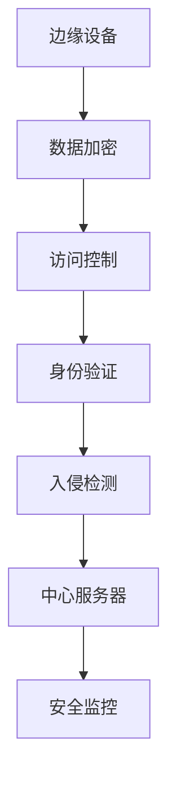
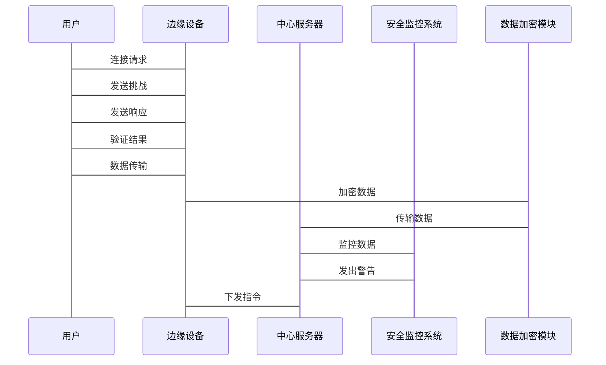

                 


# 如何识别企业的边缘计算安全优势

## 关键词：
边缘计算、安全优势、企业安全、数据隐私、安全威胁、安全架构、安全算法

## 摘要：
在数字化转型的浪潮中，边缘计算作为一种新兴的技术架构，正在被越来越多的企业采用。然而，随着边缘计算的广泛应用，其安全问题也逐渐暴露出来。本文将从边缘计算的基本概念出发，深入探讨其安全优势，并结合实际案例分析如何识别和利用这些优势。文章内容包括边缘计算安全的核心原理、常见安全威胁、安全架构设计、安全算法实现以及实际项目中的应用案例。通过本文的分析，读者将能够全面了解边缘计算安全的优势，并掌握如何在企业中有效识别和利用这些优势。

---

## 第1章: 边缘计算安全的背景与挑战

### 1.1 边缘计算的基本概念

#### 1.1.1 边缘计算的定义
边缘计算是一种分布式计算范式，它将计算能力从传统的中心化服务器扩展到网络的边缘。边缘计算的核心思想是将数据处理和存储的功能从中心服务器转移到靠近数据源的边缘设备上，从而减少数据传输的延迟，并提高数据处理的效率。

#### 1.1.2 边缘计算的特点与优势
边缘计算具有以下特点：
- **低延迟**：数据在边缘端进行处理，减少了数据传输到中心服务器的时间，从而降低了延迟。
- **高带宽**：边缘计算能够充分利用边缘设备的计算能力，提高数据处理的速度和效率。
- **本地化处理**：数据在边缘端进行处理，减少了对中心服务器的依赖，提高了系统的可靠性和容错能力。

边缘计算的优势包括：
- **实时性**：边缘计算能够实时处理数据，适用于需要快速响应的场景。
- **带宽优化**：通过在边缘端处理数据，可以减少数据传输到中心服务器的带宽需求。
- **安全性**：边缘计算可以通过本地化处理和加密技术，提高数据的安全性。

#### 1.1.3 边缘计算在企业中的应用场景
边缘计算在企业中的应用场景非常广泛，包括：
- **智能制造**：通过边缘计算对生产线上的设备进行实时监控和优化。
- **智慧城市**：利用边缘计算对交通、环境等数据进行实时分析和处理。
- **远程医疗**：通过边缘计算实现患者数据的实时传输和分析，提高医疗效率。

### 1.2 边缘计算安全的重要性

#### 1.2.1 边缘计算中的安全威胁
边缘计算的安全威胁主要包括以下几种：
- **数据泄露**：边缘设备上的数据可能被未经授权的用户访问，导致数据泄露。
- **设备被攻击**：边缘设备可能受到恶意攻击，导致设备被控制或数据被篡改。
- **通信被截获**：边缘设备与中心服务器之间的通信可能被截获，导致数据被窃取或篡改。

#### 1.2.2 企业边缘计算安全的挑战
企业在边缘计算安全方面面临以下挑战：
- **设备管理**：边缘设备数量多，分布广，难以统一管理和监控。
- **安全防护**：边缘设备的计算能力有限，难以部署复杂的安全防护措施。
- **数据隐私**：边缘设备上的数据涉及企业的核心业务数据，如何保证数据的隐私性是一个难题。

#### 1.2.3 边缘计算安全对企业竞争力的影响
边缘计算安全对企业竞争力的影响主要体现在以下几个方面：
- **数据完整性**：通过保证数据的完整性，企业可以确保数据在传输和处理过程中的准确性和可靠性。
- **系统可靠性**：通过提高系统的安全性，企业可以减少因安全漏洞导致的系统故障和停机时间。
- **业务连续性**：通过增强系统的容错能力，企业可以在面对安全威胁时保持业务的连续性。

### 1.3 本章小结
本章主要介绍了边缘计算的基本概念、特点与优势，以及在企业中的应用场景。同时，还分析了边缘计算安全的重要性，包括数据泄露、设备被攻击、通信被截获等安全威胁，以及企业在边缘计算安全方面面临的挑战。最后，本章总结了边缘计算安全对企业竞争力的影响，包括数据完整性、系统可靠性和业务连续性等方面。

---

## 第2章: 边缘计算安全的核心概念与联系

### 2.1 边缘计算安全的核心原理

#### 2.1.1 边缘计算安全的基本原理
边缘计算安全的基本原理是通过在边缘设备上部署安全机制，保护数据在传输、处理和存储过程中的安全。这些安全机制包括数据加密、访问控制、身份验证等。

#### 2.1.2 边缘计算安全的关键技术
边缘计算安全的关键技术包括：
- **数据加密**：通过对数据进行加密，确保数据在传输过程中的安全性。
- **访问控制**：通过访问控制机制，限制只有授权的用户才能访问边缘设备和数据。
- **身份验证**：通过身份验证机制，确保只有合法的用户才能连接到边缘设备。
- **入侵检测**：通过入侵检测系统，实时监控边缘设备的安全状态，发现并应对潜在的安全威胁。

#### 2.1.3 边缘计算安全的核心要素
边缘计算安全的核心要素包括：
- **数据完整性**：通过数据完整性机制，确保数据在传输和处理过程中的完整性。
- **数据机密性**：通过数据加密等技术，确保数据的机密性。
- **系统可用性**：通过容错设计和冗余机制，确保系统的可用性。

### 2.2 边缘计算安全与传统安全的对比

#### 2.2.1 安全目标对比
| 安全目标 | 传统安全 | 边缘计算安全 |
|----------|----------|--------------|
| 数据机密性 | 通过加密技术保护数据 | 通过加密和访问控制保护数据 |
| 数据完整性 | 通过哈希函数确保数据完整性 | 通过哈希函数和签名机制确保数据完整性 |
| 系统可用性 | 通过冗余设计确保系统可用性 | 通过分布式架构和容错设计确保系统可用性 |

#### 2.2.2 安全机制对比
| 安全机制 | 传统安全 | 边缘计算安全 |
|----------|----------|--------------|
| 数据加密 | 使用AES、RSA等加密算法 | 使用AES、RSA等加密算法，结合轻量级加密技术 |
| 访问控制 | 基于角色的访问控制（RBAC） | 基于设备和用户的双重访问控制机制 |
| 身份验证 | 使用用户名和密码进行身份验证 | 使用多因素身份验证（MFA）和证书认证 |

#### 2.2.3 安全挑战对比
| 安全挑战 | 传统安全 | 边缘计算安全 |
|----------|----------|--------------|
| 网络攻击 | 中心服务器是主要攻击目标 | 边缘设备数量多，攻击面更大 |
| 数据隐私 | 数据集中存储，隐私保护难度较大 | 数据分散存储，隐私保护难度更大 |
| 带宽限制 | 中心服务器处理数据，带宽需求高 | 边缘设备处理数据，带宽需求降低 |

### 2.3 边缘计算安全的ER实体关系图

```mermaid
erDiagram
    actor 用户角色 {
        <属性> 用户ID
        <属性> 用户名
        <属性> 用户权限
    }
    actor 边缘设备 {
        <属性> 设备ID
        <属性> 设备类型
        <属性> 设备状态
    }
    actor 中心服务器 {
        <属性> 服务器ID
        <属性> 服务器IP
        <属性> 服务器状态
    }
    边缘设备 --> 用户角色: 访问权限
    边缘设备 --> 中心服务器: 数据传输
    用户角色 --> 中心服务器: 服务请求
```

### 2.4 本章小结
本章主要介绍了边缘计算安全的核心原理，包括数据加密、访问控制、身份验证等关键技术。同时，还分析了边缘计算安全与传统安全在安全目标、安全机制和安全挑战等方面的差异。最后，通过ER实体关系图展示了边缘计算安全的主要实体及其关系。

---

## 第3章: 边缘计算安全的算法原理

### 3.1 边缘计算安全算法概述

#### 3.1.1 常见的安全算法类型
边缘计算中常见的安全算法类型包括：
- **加密算法**：如AES、RSA等。
- **哈希算法**：如SHA-256等。
- **身份验证算法**：如数字签名、 HMAC等。

#### 3.1.2 算法选择的原则
在选择安全算法时，需要考虑以下几个原则：
- **安全性**：算法必须能够有效防止常见的安全攻击。
- **效率**：算法的计算效率必须足够高，以适应边缘设备的计算能力。
- **兼容性**：算法必须与现有的系统架构和协议兼容。

#### 3.1.3 算法实现的关键步骤
算法实现的关键步骤包括：
1. **确定安全需求**：明确需要保护的数据类型和安全目标。
2. **选择合适的算法**：根据安全需求选择合适的加密算法、哈希算法或身份验证算法。
3. **实现算法**：将选择的算法实现为代码或嵌入式系统中的功能模块。
4. **测试和验证**：对实现的算法进行测试和验证，确保其能够有效保护数据安全。

### 3.2 加密算法的实现原理

#### 3.2.1 AES加密算法的实现
AES（高级加密标准）是一种广泛使用的块加密算法，支持128、192和256位的密钥长度。其加密过程如下：

1. **初始轮**：将明文分成16字节的块，并将密钥扩展成一个密钥流。
2. **多轮加密**：对每个密钥流进行加法、乘法和移位操作，最终生成密文。
3. **解密轮**：通过逆向操作将密文解密为明文。

#### 3.2.2 AES加密算法的Python实现
以下是一个简单的AES加密算法的Python实现示例：

```python
from cryptography.hazmat.primitives.ciphers import Cipher, algorithms, modes
from cryptography.hazmat.primitives.asymmetric import padding
from cryptography.hazmat.primitives.asymmetric.rsa import RSAPublicKey, RSAPrivateKey
from cryptography.hazmat.primitives import hashes

# 生成RSA密钥对
key = RSA.generate(2048)

# 公钥和私钥
public_key = key.public_key()
private_key = key.private_key()

# 加密数据
message = b"Hello, World!"
cipher = Cipher(algorithms.AES(256), modes.CBC(b'\x00' * 16))
encryptor = cipher.encryptor()
ct = encryptor.update(message) + encryptor.finalize()

# 解密数据
decryptor = cipher.decryptor()
pt = decryptor.update(ct) + decryptor.finalize()

print("加密后的数据:", ct)
print("解密后的数据:", pt)
```

### 3.3 加密算法的数学模型和公式

#### 3.3.1 AES加密算法的数学模型
AES加密算法的数学模型基于有限域GF(2^8)上的运算，主要运算包括：
- **加法**：模2加法。
- **乘法**：基于多项式环的乘法。
- **移位**：将字节循环移位。

#### 3.3.2 AES加密算法的公式
AES加密算法的核心公式可以表示为：
$$
E(x) = x \oplus K_1 \cdot x^{254} \oplus K_2 \cdot x^{127}
$$
其中，$x$是明文，$K_1$和$K_2$是密钥扩展后的密钥流。

### 3.4 本章小结
本章主要介绍了边缘计算中常见的安全算法类型，包括加密算法、哈希算法和身份验证算法。通过具体的AES加密算法实现，详细讲解了算法的实现步骤和Python代码实现。同时，还给出了AES加密算法的数学模型和公式，帮助读者理解其工作原理。

---

## 第4章: 边缘计算安全的系统分析与架构设计

### 4.1 边缘计算安全的系统分析

#### 4.1.1 系统功能需求
边缘计算安全系统的功能需求包括：
- **数据加密**：对边缘设备上的数据进行加密存储和传输。
- **访问控制**：限制只有授权的用户才能访问边缘设备和数据。
- **身份验证**：通过多因素身份验证确保用户身份的合法性。
- **入侵检测**：实时监控边缘设备的安全状态，发现并应对潜在的安全威胁。

#### 4.1.2 系统性能需求
边缘计算安全系统的性能需求包括：
- **低延迟**：数据处理和加密过程必须高效，以保证低延迟。
- **高可用性**：系统必须能够在边缘设备上稳定运行，保证数据的安全性和可用性。
- **资源占用**：安全机制的资源占用必须合理，不能对边缘设备的正常运行造成影响。

### 4.2 边缘计算安全的系统架构设计

#### 4.2.1 系统架构设计
以下是一个典型的边缘计算安全系统的架构图：



#### 4.2.2 系统功能模块
边缘计算安全系统的功能模块包括：
- **数据加密模块**：负责对边缘设备上的数据进行加密和解密。
- **访问控制模块**：通过访问控制列表（ACL）限制只有授权的用户才能访问边缘设备和数据。
- **身份验证模块**：通过多因素身份验证确保用户身份的合法性。
- **入侵检测模块**：实时监控边缘设备的安全状态，发现并应对潜在的安全威胁。

### 4.3 边缘计算安全的系统交互设计

#### 4.3.1 系统交互流程
以下是一个典型的边缘计算安全系统的交互流程：



### 4.4 本章小结
本章主要分析了边缘计算安全系统的功能需求和性能需求，并通过架构图和交互图展示了系统的整体架构和交互流程。通过具体的模块设计和系统交互设计，帮助读者理解边缘计算安全系统的实现过程。

---

## 第5章: 边缘计算安全的项目实战

### 5.1 项目背景与目标

#### 5.1.1 项目背景
某制造企业希望通过引入边缘计算技术，实现对生产线设备的实时监控和优化。为了确保数据的安全性，企业需要在边缘设备上部署安全机制，保护设备数据不被未经授权的用户访问或篡改。

#### 5.1.2 项目目标
本项目的目標包括：
- 在边缘设备上部署数据加密模块，保护设备数据的机密性。
- 实现多因素身份验证，确保只有授权的用户才能访问边缘设备。
- 部署入侵检测系统，实时监控边缘设备的安全状态，发现并应对潜在的安全威胁。

### 5.2 项目实施步骤

#### 5.2.1 环境搭建
- **硬件设备**：部署边缘计算设备，如树莓派、工业路由器等。
- **软件环境**：安装边缘计算框架，如Kubernetes、FogFlow等。
- **工具安装**：安装加密算法库、身份验证库和入侵检测系统。

#### 5.2.2 核心代码实现
以下是一个边缘计算安全系统的核心代码实现示例：

```python
import hashlib
import rsa

# 生成RSA密钥对
key = rsa.new_keypair(2048)

# 公钥和私钥
public_key = key.publickey()
private_key = key.privatekey()

# 加密数据
message = b"设备数据"
cipher = rsa.encrypt(message, public_key)

# 解密数据
plaintext = rsa.decrypt(cipher, private_key)

print("加密后的数据:", cipher)
print("解密后的数据:", plaintext)
```

#### 5.2.3 系统测试与优化
- **功能测试**：测试数据加密、访问控制和身份验证功能是否正常。
- **性能测试**：测试系统在高负载下的性能表现，确保系统的稳定性和可靠性。
- **安全测试**：测试系统是否能够抵御常见的网络攻击，如DDoS攻击、中间人攻击等。

### 5.3 项目总结与优化建议

#### 5.3.1 项目总结
通过本项目的实施，企业在边缘设备上成功部署了数据加密模块、多因素身份验证和入侵检测系统，有效提升了设备数据的安全性。系统运行稳定，性能表现良好，能够满足企业的实际需求。

#### 5.3.2 优化建议
- **优化加密算法**：根据实际需求选择更高效的加密算法，降低系统的资源占用。
- **增强入侵检测**：引入更先进的入侵检测算法，提高系统的安全防护能力。
- **定期安全审计**：定期对系统进行全面的安全审计，发现并修复潜在的安全漏洞。

### 5.4 本章小结
本章通过一个实际的边缘计算安全项目，详细讲解了项目的背景、目标、实施步骤以及核心代码实现。通过系统的测试与优化，帮助企业提升了边缘设备的安全性。最后，本章还给出了项目的总结与优化建议，为读者提供了宝贵的实践经验。

---

## 第6章: 边缘计算安全的总结与展望

### 6.1 本章总结
本章总结了全文的核心内容，包括边缘计算的基本概念、安全威胁、安全优势以及系统的实现与优化。通过本文的分析，读者可以全面了解边缘计算安全的优势，并掌握如何在企业中有效识别和利用这些优势。

### 6.2 技术趋势与展望
随着边缘计算的广泛应用，其安全问题也将变得更加重要。未来，边缘计算安全技术将朝着以下几个方向发展：
- **轻量级安全算法**：针对边缘设备的计算能力有限的特点，开发更高效的轻量级安全算法。
- **智能化安全防护**：利用人工智能技术，实现智能化的安全防护，提高系统的安全性和响应速度。
- **零信任架构**：通过零信任架构，确保只有经过严格验证的用户才能访问边缘设备和数据。

### 6.3 最佳实践与注意事项
在实际应用中，企业需要注意以下几点：
- **定期安全审计**：定期对系统进行全面的安全审计，发现并修复潜在的安全漏洞。
- **团队培训**：加强对安全团队的培训，提高员工的安全意识和技能。
- **持续优化**：根据实际需求和技术发展，持续优化系统的安全防护能力。

### 6.4 本章小结
本章总结了全文的核心内容，展望了边缘计算安全技术的未来发展趋势，并给出了最佳实践和注意事项。通过本文的分析，读者可以更好地理解边缘计算安全的重要性，并在实际应用中采取有效的安全防护措施。

---

## 结语
边缘计算作为一种新兴的技术架构，正在为企业带来前所未有的机遇和挑战。通过本文的分析，读者可以全面了解边缘计算安全的优势，并掌握如何在企业中有效识别和利用这些优势。未来，随着技术的不断发展，边缘计算安全将变得更加重要，企业需要持续关注安全技术的发展，不断提升系统的安全防护能力。

