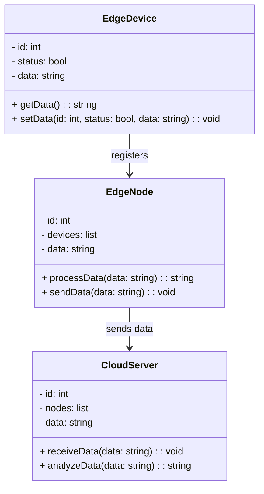
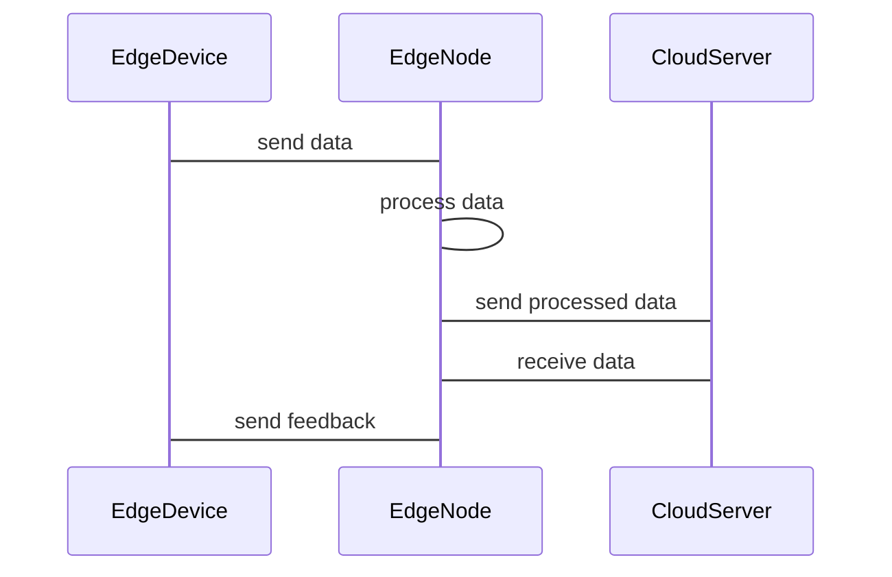

                 


# 如何识别企业的边缘计算实时视频分析优势

> 关键词：边缘计算，实时视频分析，企业应用，技术优势，系统架构

> 摘要：本文将详细介绍如何识别企业在边缘计算实时视频分析中的优势，涵盖背景介绍、核心概念、算法原理、系统架构设计、项目实战以及最佳实践。通过分析边缘计算和实时视频分析的核心原理，结合实际案例，帮助读者理解如何在企业中有效应用这些技术，提升企业的竞争力。

---

## 第1章: 边缘计算与实时视频分析概述

### 1.1 边缘计算的基本概念

#### 1.1.1 边缘计算的定义与特点

边缘计算（Edge Computing）是一种分布式计算范式，将计算能力从云端移到数据生成的位置，例如传感器、摄像头或其他边缘设备。其特点是低延迟、高实时性和高可用性。

- **定义**：边缘计算是指在靠近数据源的地方进行数据处理和分析，而不是将所有数据传输到云端。
- **特点**：
  - **分布式**：数据在生成点进行处理，减少数据传输需求。
  - **低延迟**：边缘计算能够快速响应，适用于实时性要求高的场景。
  - **高可用性**：边缘设备可以在断开云端连接时继续运行。

#### 1.1.2 实时视频分析的定义与特点

实时视频分析（Real-Time Video Analysis）是指对视频流进行实时处理和分析，以获取有用的信息，例如目标检测、行为识别等。

- **定义**：实时视频分析是对视频流进行实时处理，提取有用信息。
- **特点**：
  - **实时性**：处理和分析在视频流生成的同时进行。
  - **高数据量**：视频流数据量大，处理复杂。
  - **多样性**：适用于多种场景，如安全监控、智能制造等。

### 1.2 企业边缘计算实时视频分析的背景与需求

#### 1.2.1 企业数字化转型的背景

随着企业数字化转型的推进，数据的实时处理和分析变得越来越重要。边缘计算和实时视频分析为企业提供了新的解决方案。

- **背景**：企业需要快速响应市场变化，实时处理数据，提高效率。
- **需求**：
  - **实时性**：企业需要快速决策，基于实时数据。
  - **数据隐私**：数据在边缘处理可以减少数据泄露风险。
  - **成本效益**：边缘计算可以降低数据传输和存储成本。

#### 1.2.2 边缘计算在企业中的应用需求

边缘计算在企业中的应用需求主要集中在实时性、数据隐私和成本效益方面。

- **实时性**：边缘计算能够快速响应，适用于生产过程控制、实时监控等场景。
- **数据隐私**：边缘计算可以在本地处理数据，减少数据传输到云端的风险。
- **成本效益**：边缘计算可以减少数据传输和存储成本。

#### 1.2.3 实时视频分析在企业中的应用场景

实时视频分析在企业中的应用场景广泛，包括安全监控、智能制造、物流管理和智能交通等。

- **安全监控**：实时视频分析可以用于监控视频流，检测异常行为。
- **智能制造**：实时视频分析可以用于生产线监控，检测设备故障。
- **物流管理**：实时视频分析可以用于物流过程监控，优化配送路径。
- **智能交通**：实时视频分析可以用于交通流量监控，优化交通管理。

### 1.3 边缘计算与实时视频分析的结合

#### 1.3.1 边缘计算的优势

边缘计算在实时视频分析中的优势主要体现在低延迟、高可用性和数据隐私保护方面。

- **低延迟**：边缘计算可以在数据生成的位置进行处理，减少延迟。
- **高可用性**：边缘设备可以在断开云端连接时继续运行，保证系统的可用性。
- **数据隐私**：边缘计算可以在本地处理数据，减少数据传输到云端的风险。

#### 1.3.2 实时视频分析的优势

实时视频分析在企业中的优势主要体现在实时性和数据处理效率方面。

- **实时性**：实时视频分析可以在视频流生成的同时进行处理，保证实时响应。
- **数据处理效率**：实时视频分析可以快速处理大量数据，提高数据处理效率。

#### 1.3.3 两者的结合对企业价值的影响

边缘计算与实时视频分析的结合可以为企业带来以下优势：

- **快速响应**：边缘计算的低延迟和实时视频分析的实时性相结合，可以实现快速响应。
- **数据隐私**：边缘计算可以在本地处理数据，保护数据隐私。
- **成本效益**：边缘计算可以减少数据传输和存储成本，提高成本效益。

### 1.4 本章小结

本章介绍了边缘计算和实时视频分析的基本概念，分析了它们在企业中的应用背景和需求，并讨论了两者的结合对企业价值的影响。接下来，我们将深入探讨边缘计算和实时视频分析的核心原理。

---

## 第2章: 边缘计算的核心原理

### 2.1 边缘计算的架构与组成

#### 2.1.1 边缘计算的分层架构

边缘计算的架构通常分为边缘设备层、边缘计算层和云端层。

- **边缘设备层**：包括传感器、摄像头等数据采集设备。
- **边缘计算层**：包括边缘计算节点，用于数据处理和分析。
- **云端层**：用于数据的长期存储和分析。

#### 2.1.2 边缘节点的功能与特点

边缘节点是边缘计算的核心组成部分，具有以下功能和特点：

- **功能**：
  - 数据采集：从边缘设备获取数据。
  - 数据处理：对数据进行预处理、分析和存储。
  - 数据通信：与云端或其他边缘节点进行数据通信。
- **特点**：
  - 低延迟：边缘节点靠近数据源，处理速度快。
  - 高可用性：边缘节点可以在断开云端连接时继续运行。
  - 资源受限：边缘节点通常资源有限，需要优化数据处理和存储。

#### 2.1.3 边缘计算与云计算的关系

边缘计算与云计算的关系是互补的，边缘计算负责实时数据处理，云计算负责长期数据存储和分析。

- **互补性**：
  - 边缘计算处理实时数据，云计算处理历史数据。
  - 边缘计算负责本地决策，云计算负责全局决策。

### 2.2 边缘计算的关键技术

#### 2.2.1 数据采集与传输技术

数据采集与传输技术是边缘计算的基础，包括传感器数据采集和数据传输到边缘节点。

- **数据采集**：使用传感器、摄像头等设备采集数据。
- **数据传输**：使用无线通信技术（如5G、Wi-Fi）将数据传输到边缘节点。

#### 2.2.2 数据处理与分析技术

数据处理与分析技术是边缘计算的核心，包括数据预处理、特征提取和分析。

- **数据预处理**：对数据进行清洗、转换和标准化。
- **特征提取**：从数据中提取有用特征，用于后续分析。
- **数据分析**：使用机器学习、深度学习等技术对数据进行分析。

#### 2.2.3 数据安全与隐私保护技术

数据安全与隐私保护技术是边缘计算的重要组成部分，包括数据加密、访问控制和隐私保护。

- **数据加密**：对数据进行加密，防止数据泄露。
- **访问控制**：限制对边缘节点的访问，防止未经授权的访问。
- **隐私保护**：在数据处理和分析过程中保护用户隐私。

### 2.3 边缘计算的核心优势

#### 2.3.1 低延迟与实时性

边缘计算的低延迟和实时性使其在实时视频分析中具有优势。

- **低延迟**：边缘计算在数据生成的位置进行处理，减少数据传输延迟。
- **实时性**：实时视频分析需要快速响应，边缘计算能够满足这一需求。

#### 2.3.2 高可用性与可靠性

边缘计算的高可用性和可靠性使其在企业中广泛应用。

- **高可用性**：边缘节点可以在断开云端连接时继续运行，保证系统的可用性。
- **可靠性**：边缘计算架构能够容忍部分节点故障，保证系统的可靠性。

#### 2.3.3 成本效益分析

边缘计算的成本效益分析显示，边缘计算可以降低数据传输和存储成本。

- **数据传输成本**：边缘计算减少数据传输到云端的需求，降低数据传输成本。
- **存储成本**：边缘节点可以存储部分数据，减少云端存储需求，降低存储成本。

---

## 第3章: 实时视频分析的核心原理

### 3.1 视频流处理的基本原理

#### 3.1.1 视频流的采集与压缩

视频流的采集与压缩是实时视频分析的第一步，包括视频采集和视频压缩。

- **视频采集**：使用摄像头等设备采集视频流。
- **视频压缩**：使用压缩算法（如H.264、H.265）对视频流进行压缩，减少数据量。

#### 3.1.2 视频流的特征提取

视频流的特征提取是实时视频分析的关键步骤，包括目标检测、目标识别和行为分析。

- **目标检测**：检测视频流中的目标（如人、车辆、物体）。
- **目标识别**：识别目标的具体类型（如人脸识别、车辆识别）。
- **行为分析**：分析目标的行为（如异常行为检测、动作识别）。

#### 3.1.3 视频流的实时分析

视频流的实时分析是实时视频分析的核心，包括数据处理和分析。

- **数据处理**：对视频流进行预处理、特征提取和数据分析。
- **数据分析**：使用机器学习、深度学习等技术对视频流进行分析，提取有用信息。

### 3.2 视频分析的关键技术

#### 3.2.1 视频目标检测技术

视频目标检测技术是实时视频分析的重要组成部分，包括基于传统算法的目标检测和基于深度学习的目标检测。

- **基于传统算法的目标检测**：
  - 使用边缘检测算法（如Canny边缘检测）提取图像边缘。
  - 使用区域检测算法（如区域树分割）分割图像区域。
  - 示例代码：
    ```python
    import cv2
    # 读取图像
    img = cv2.imread('image.jpg')
    # 转换为灰度图像
    gray = cv2.cvtColor(img, cv2.COLOR_BGR2GRAY)
    # 使用Canny边缘检测
    edges = cv2.Canny(gray, 50, 150)
    cv2.imshow('Edges', edges)
    cv2.waitKey(0)
    cv2.destroyAllWindows()
    ```

- **基于深度学习的目标检测**：
  - 使用深度学习模型（如YOLO、Faster R-CNN）进行目标检测。
  - 示例代码：
    ```python
    import tensorflow as tf
    # 加载预训练模型
    model = tf.keras.models.load_model('model.h5')
    # 读取图像
    img = cv2.imread('image.jpg')
    # 预测目标
    prediction = model.predict(img)
    print(prediction)
    ```

#### 3.2.2 视频目标识别技术

视频目标识别技术是实时视频分析的重要组成部分，包括基于传统算法的目标识别和基于深度学习的目标识别。

- **基于传统算法的目标识别**：
  - 使用颜色、形状、纹理等特征进行目标识别。
  - 示例代码：
    ```python
    import cv2
    # 读取图像
    img = cv2.imread('image.jpg')
    # 转换为灰度图像
    gray = cv2.cvtColor(img, cv2.COLOR_BGR2GRAY)
    # 使用SIFT算法提取特征
    sift = cv2.SIFT_create()
    key_points, descriptors = sift.detectAndCompute(gray, None)
    print(descriptors)
    ```

- **基于深度学习的目标识别**：
  - 使用深度学习模型（如ResNet、Inception）进行目标识别。
  - 示例代码：
    ```python
    import tensorflow as tf
    # 加载预训练模型
    model = tf.keras.models.load_model('model.h5')
    # 读取图像
    img = cv2.imread('image.jpg')
    # 预测目标
    prediction = model.predict(img)
    print(prediction)
    ```

#### 3.2.3 视频行为分析技术

视频行为分析技术是实时视频分析的重要组成部分，包括基于传统算法的行为分析和基于深度学习的行为分析。

- **基于传统算法的行为分析**：
  - 使用运动检测、轨迹跟踪等技术进行行为分析。
  - 示例代码：
    ```python
    import cv2
    # 读取图像
    img = cv2.imread('image.jpg')
    # 转换为灰度图像
    gray = cv2.cvtColor(img, cv2.COLOR_BGR2GRAY)
    # 使用背景减除法检测运动区域
    bg_subtractor = cv2.createBackgroundSubtractorMOG2()
    mask = bg_subtractor.apply(gray)
    cv2.imshow('Motion Detection', mask)
    cv2.waitKey(0)
    cv2.destroyAllWindows()
    ```

- **基于深度学习的行为分析**：
  - 使用深度学习模型（如3D CNN、LRCN）进行行为分析。
  - 示例代码：
    ```python
    import tensorflow as tf
    # 加载预训练模型
    model = tf.keras.models.load_model('model.h5')
    # 读取图像
    img = cv2.imread('image.jpg')
    # 预测行为
    prediction = model.predict(img)
    print(prediction)
    ```

### 3.3 实时视频分析的核心优势

#### 3.3.1 实时性与响应速度

实时视频分析的实时性与响应速度是其核心优势之一。

- **实时性**：实时视频分析可以在视频流生成的同时进行处理，保证实时响应。
- **响应速度**：实时视频分析的响应速度通常在毫秒级，适用于需要快速响应的场景。

#### 3.3.2 高

---

## 第4章: 系统分析与架构设计方案

### 4.1 问题场景介绍

#### 4.1.1 问题背景

企业在进行边缘计算实时视频分析时，需要考虑数据采集、处理、分析和反馈的整个流程。

- **问题背景**：企业需要实时处理视频流数据，快速响应业务需求。
- **问题描述**：视频流数据量大，处理复杂，需要高效的系统架构。

#### 4.1.2 项目介绍

本项目旨在设计一个高效的边缘计算实时视频分析系统，包括数据采集、处理、分析和反馈。

- **项目目标**：实现高效的边缘计算实时视频分析系统。
- **项目范围**：包括数据采集、处理、分析和反馈的整个流程。
- **项目约束**：资源受限、实时性要求高、数据隐私保护。

### 4.2 系统功能设计

#### 4.2.1 领域模型（Mermaid类图）



#### 4.2.2 系统架构设计（Mermaid架构图）


#### 4.2.3 系统接口设计

系统接口设计包括数据采集接口、数据处理接口、数据存储接口和数据反馈接口。

- **数据采集接口**：用于从边缘设备采集数据。
- **数据处理接口**：用于对数据进行处理和分析。
- **数据存储接口**：用于存储处理后的数据。
- **数据反馈接口**：用于将处理结果反馈给边缘设备或用户。

#### 4.2.4 系统交互设计（Mermaid序列图）



### 4.3 系统优化与性能提升

#### 4.3.1 系统优化策略

系统优化策略包括硬件优化、算法优化和系统架构优化。

- **硬件优化**：使用高性能边缘设备和边缘节点，减少处理延迟。
- **算法优化**：优化视频分析算法，提高处理效率。
- **系统架构优化**：采用分布式架构，提高系统的扩展性和可用性。

#### 4.3.2 性能提升方法

性能提升方法包括并行计算、缓存优化和负载均衡。

- **并行计算**：利用多核处理器进行并行计算，提高处理速度。
- **缓存优化**：优化数据缓存策略，减少数据访问延迟。
- **负载均衡**：通过负载均衡技术，均衡系统负载，提高系统吞吐量。

---

## 第5章: 项目实战

### 5.1 环境安装与配置

#### 5.1.1 开发环境

- **操作系统**：Linux（如Ubuntu 20.04）
- **开发工具**：Python 3.8、Jupyter Notebook、TensorFlow 2.4、OpenCV 4.5
- **硬件配置**：Intel i7处理器、16GB内存、NVIDIA GPU（如NVIDIA Tesla T4）

#### 5.1.2 软件安装

- **安装Python**：
  ```bash
  apt-get update && apt-get install python3 python3-pip
  ```
- **安装TensorFlow**：
  ```bash
  pip install tensorflow==2.4
  ```
- **安装OpenCV**：
  ```bash
  pip install opencv-python==4.5
  ```

### 5.2 系统核心实现

#### 5.2.1 边缘设备数据采集

- **代码实现**：
  ```python
  import cv2

  def capture_video():
      cap = cv2.VideoCapture(0)
      while True:
          ret, frame = cap.read()
          if not ret:
              break
          cv2.imshow('Video Stream', frame)
          if cv2.waitKey(1) == ord('q'):
              break
      cap.release()
      cv2.destroyAllWindows()

  if __name__ == '__main__':
      capture_video()
  ```

#### 5.2.2 边缘节点数据处理

- **代码实现**：
  ```python
  import tensorflow as tf
  import cv2

  model = tf.keras.models.load_model('edge_model.h5')

  def process_frame(frame):
      frame = cv2.resize(frame, (224, 224))
      frame = frame / 255.0
      prediction = model.predict(tf.expand_dims(frame, axis=0))
      return prediction[0]

  cap = cv2.VideoCapture(0)
  while True:
      ret, frame = cap.read()
      if not ret:
          break
      result = process_frame(frame)
      print(result)
      cv2.imshow('Processed Stream', frame)
      if cv2.waitKey(1) == ord('q'):
          break
  cap.release()
  cv2.destroyAllWindows()
  ```

#### 5.2.3 云端数据存储与分析

- **代码实现**：
  ```python
  import tensorflow as tf
  import cv2
  import numpy as np

  model = tf.keras.models.load_model('cloud_model.h5')

  def analyze_frame(frame):
      frame = cv2.resize(frame, (224, 224))
      frame = frame / 255.0
      prediction = model.predict(tf.expand_dims(frame, axis=0))
      return prediction[0]

  cap = cv2.VideoCapture(0)
  while True:
      ret, frame = cap.read()
      if not ret:
          break
      result = analyze_frame(frame)
      print(result)
      cv2.imshow('Analyzed Stream', frame)
      if cv2.waitKey(1) == ord('q'):
          break
  cap.release()
  cv2.destroyAllWindows()
  ```

### 5.3 代码解读与分析

- **边缘设备数据采集**：使用OpenCV库捕获视频流，并实时显示视频画面。
- **边缘节点数据处理**：加载预训练的TensorFlow模型，对视频流进行实时处理和分析。
- **云端数据存储与分析**：将处理后的数据传输到云端，使用预训练的模型进行进一步分析和存储。

### 5.4 实际案例分析

#### 5.4.1 案例背景

假设我们有一个智能制造企业，需要实时监控生产线上的设备运行状态。

- **案例背景**：生产线上的设备运行状态需要实时监控，及时发现异常。
- **案例目标**：实时检测设备故障，减少停机时间。

#### 5.4.2 数据采集与处理

- **数据采集**：使用工业摄像头采集生产线上的视频流。
- **数据处理**：使用边缘节点对视频流进行实时分析，检测设备故障。

#### 5.4.3 数据分析与反馈

- **数据分析**：使用预训练的模型对视频流进行分析，识别设备故障。
- **数据反馈**：将分析结果反馈给生产线，及时进行设备维护。

### 5.5 项目小结

本项目通过边缘计算和实时视频分析技术，实现了生产线设备的实时监控和故障检测。边缘计算的低延迟和实时视频分析的实时性相结合，能够快速响应设备故障，减少停机时间，提高生产效率。

---

## 第6章: 最佳实践与小结

### 6.1 最佳实践

#### 6.1.1 系统设计与优化

- **系统设计**：在设计边缘计算实时视频分析系统时，需要考虑系统的实时性、可用性和可扩展性。
- **系统优化**：通过硬件优化、算法优化和系统架构优化，提高系统的性能和效率。

#### 6.1.2 数据安全与隐私保护

- **数据加密**：对敏感数据进行加密处理，防止数据泄露。
- **访问控制**：限制对边缘节点和云端的访问，确保数据安全。
- **隐私保护**：在数据处理和分析过程中，保护用户隐私。

#### 6.1.3 系统监控与维护

- **系统监控**：实时监控系统的运行状态，及时发现和解决问题。
- **系统维护**：定期维护系统，确保系统的稳定运行。

### 6.2 小结

本文详细介绍了如何识别企业在边缘计算实时视频分析中的优势，涵盖了背景介绍、核心概念、算法原理、系统架构设计、项目实战以及最佳实践。通过分析边缘计算和实时视频分析的核心原理，结合实际案例，帮助读者理解如何在企业中有效应用这些技术，提升企业的竞争力。

### 6.3 注意事项

- **数据隐私**：在处理和分析数据时，需要严格遵守数据隐私保护法规。
- **系统稳定性**：确保系统的稳定运行，避免因系统故障导致数据丢失或业务中断。
- **技术更新**：及时关注技术的发展和更新，保持系统的先进性和高效性。

### 6.4 未来展望与拓展阅读

#### 6.4.1 未来展望

- **技术发展**：边缘计算和实时视频分析技术将不断发展，更加智能化和自动化。
- **应用场景**：边缘计算和实时视频分析技术将应用于更多的场景，如智慧城市、智能医疗等。

#### 6.4.2 拓展阅读

- **推荐书籍**：
  - 《边缘计算：架构与应用》
  - 《实时视频分析：算法与实现》
- **推荐技术博客**：
  - [Tech博客1](#)
  - [Tech博客2](#)

---

通过本文的详细讲解，读者可以全面理解边缘计算实时视频分析的核心优势，并能够将其应用到实际的企业场景中，提升企业的竞争力和效率。

