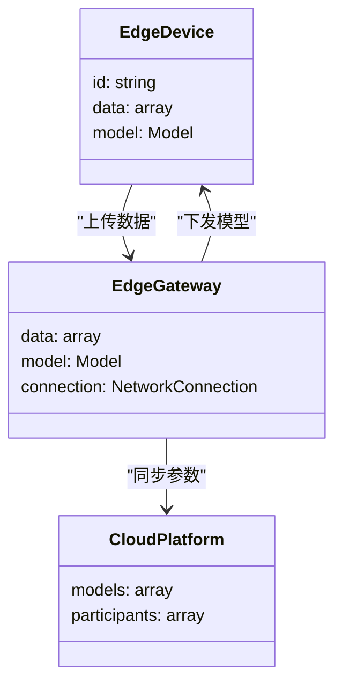
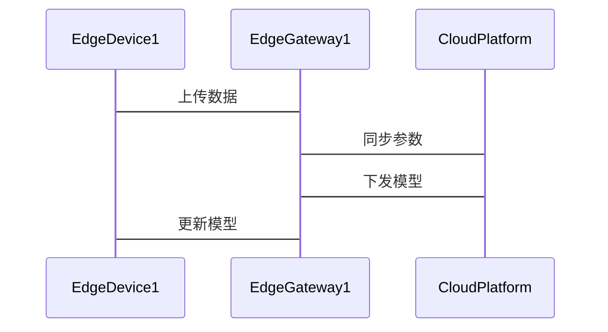

                 


# 如何识别企业的边缘计算联邦学习优势

---

## 关键词：
- 边缘计算
- 联邦学习
- 企业优势
- 数据隐私
- 联合算法

---

## 摘要：
随着企业数字化转型的加速，边缘计算和联邦学习逐渐成为推动企业智能化的重要技术。本文将深入分析边缘计算与联邦学习的核心概念、算法原理、系统架构以及实际应用，帮助企业识别和利用这两者的结合优势。通过详细的技术背景介绍、原理剖析、算法流程展示以及实际案例分析，本文旨在为企业提供清晰的指导，帮助其在复杂的技术环境中找到最佳的边缘计算联邦学习解决方案。

---

---

# 第一部分: 边缘计算与联邦学习背景介绍

## 第1章: 边缘计算与联邦学习概述

### 1.1 边缘计算的基本概念

#### 1.1.1 边缘计算的定义与特点

边缘计算是一种分布式计算范式，将计算能力从云端扩展到数据生成的边缘端（如物联网设备、传感器等）。其特点包括：
- **分布式架构**：数据在边缘端进行处理，减少对云端的依赖。
- **低延迟**：边缘计算能够快速响应本地数据，适用于实时性要求高的场景。
- **隐私保护**：通过在边缘端处理数据，可以减少数据传输到云端的过程，降低隐私泄露风险。

#### 1.1.2 边缘计算的核心技术与优势

- **边缘设备**：边缘计算依赖于各种智能设备（如传感器、摄像头、智能终端等）进行数据采集和处理。
- **边缘网关**：边缘网关用于连接边缘设备和云端，负责数据的转发、过滤和初步处理。
- **边缘计算平台**：提供边缘计算的开发、部署和管理工具，支持分布式计算和资源管理。

#### 1.1.3 边缘计算的应用场景与挑战

- **应用场景**：
  - 智慧城市：交通监控、环境监测等。
  - 工业物联网：设备监测、预测性维护等。
  - 智能医疗：患者监测、远程诊断等。
- **挑战**：
  - 边缘设备的资源限制（计算能力、存储能力等）。
  - 边缘环境的安全性和稳定性问题。
  - 数据隐私和合规性问题。

### 1.2 联邦学习的基本概念

#### 1.2.1 联邦学习的定义与特点

联邦学习是一种分布式机器学习技术，允许多个参与方在不共享原始数据的情况下联合训练模型。其特点包括：
- **数据隐私**：联邦学习通过加密技术保护数据隐私，避免数据集中存储。
- **模型联合优化**：各参与方通过共享模型参数，共同优化全局模型。
- **分布式训练**：模型训练过程分布在不同参与方之间，减少数据传输量。

#### 1.2.2 边缘计算与联邦学习的结合

边缘计算与联邦学习的结合能够充分发挥两者的优势：
- 边缘计算提供低延迟、高实时性的数据处理能力。
- 联邦学习提供数据隐私保护和联合模型优化的能力。
- 两者结合可以实现边缘端的智能决策和全局模型的协同优化。

---

---

# 第二部分: 边缘计算与联邦学习的核心概念与联系

## 第2章: 边缘计算与联邦学习的核心原理

### 2.1 边缘计算的核心原理

#### 2.1.1 边缘计算的计算模型

边缘计算采用分布式计算模型，数据在边缘端进行预处理、分析和决策。其计算流程如下：
1. 数据采集：边缘设备收集原始数据。
2. 数据处理：边缘网关对数据进行过滤、转换和初步分析。
3. 模型推理：边缘设备或网关利用本地模型进行预测或决策。
4. 数据上传：部分处理后的数据上传到云端进行进一步分析或模型训练。

#### 2.1.2 边缘计算的数据处理流程

- 数据采集：传感器、摄像头等设备实时采集数据。
- 数据预处理：边缘网关对数据进行清洗、格式转换和压缩。
- 数据存储：边缘设备或网关存储部分数据，用于本地分析或模型训练。
- 数据传输：处理后的数据通过网络传输到云端或与其他边缘节点共享。

#### 2.1.3 边缘计算的通信机制

边缘计算的通信机制包括：
- **本地通信**：边缘设备之间的通信，如设备间的协同计算。
- **边缘-云端通信**：边缘设备与云端平台之间的数据传输和指令交互。
- **边缘-边缘通信**：不同边缘节点之间的数据共享和协同。

### 2.2 联邦学习的核心原理

#### 2.2.1 联邦学习的分布式训练模型

联邦学习的核心是分布式模型训练，各参与方通过共享模型参数进行联合优化。其流程如下：
1. **模型初始化**：各参与方初始化本地模型参数。
2. **本地训练**：各参与方在本地数据集上训练模型，更新本地参数。
3. **参数同步**：通过安全通信协议，各参与方将本地参数更新同步到全局模型。
4. **模型优化**：全局模型根据各参与方的参数更新进行优化，生成新的模型版本。

#### 2.2.2 联邦学习的数据隐私保护机制

为了保护数据隐私，联邦学习采用以下技术：
- **同态加密**：允许在加密状态下进行模型训练，确保数据不被泄露。
- **差分隐私**：通过在数据中添加噪声，防止数据被逆向推断。
- **联邦加密**：在模型训练过程中，各参与方共享加密后的模型参数，避免数据泄露。

#### 2.2.3 联邦学习的同步优化模型

联邦学习的同步优化模型包括：
- **参数服务器模式**：各参与方通过参数服务器同步更新模型参数。
- **去中心化模式**：各参与方直接进行参数交换，无需中心服务器。
- **混合模式**：结合参数服务器和去中心化的优势，优化模型更新效率。

### 2.3 边缘计算与联邦学习的结合原理

#### 2.3.1 边缘计算与联邦学习的协同训练流程

边缘计算与联邦学习的协同训练流程如下：
1. **数据采集**：边缘设备采集本地数据。
2. **数据预处理**：边缘网关对数据进行清洗和格式转换。
3. **本地训练**：边缘设备或网关利用本地数据训练模型，更新本地参数。
4. **参数同步**：边缘设备将本地参数更新通过安全通道同步到联邦学习平台。
5. **全局优化**：联邦学习平台根据各参与方的参数更新优化全局模型。
6. **模型下发**：优化后的全局模型下发到边缘端，用于本地推理和决策。

#### 2.3.2 边缘计算与联邦学习的数据同步机制

边缘计算与联邦学习的数据同步机制包括：
- **本地同步**：边缘设备直接与联邦学习平台进行参数同步。
- **边缘网关同步**：通过边缘网关作为中间节点，统一管理参数同步过程。
- **分层同步**：根据边缘节点的层次结构，分层进行参数同步，减少通信开销。

#### 2.3.3 边缘计算与联邦学习的通信优化策略

为了优化边缘计算与联邦学习的通信效率，可以采用以下策略：
- **断开连接**：在边缘设备断开网络时，本地训练模型，待重新连接时同步参数。
- **增量更新**：仅同步参数的变化部分，减少数据传输量。
- **压缩编码**：对参数更新进行压缩编码，降低通信带宽需求。

---

---

# 第三部分: 边缘计算与联邦学习的算法原理讲解

## 第3章: 边缘计算与联邦学习的算法原理

### 3.1 边缘计算的核心算法

#### 3.1.1 边缘计算的分布式计算算法

边缘计算的分布式计算算法包括：
- **局部优化算法**：在边缘设备上进行本地数据处理和模型训练。
- **资源分配算法**：根据边缘设备的资源情况动态分配计算任务。
- **负载均衡算法**：通过负载均衡技术优化边缘节点的计算负载。

#### 3.1.2 边缘计算的本地优化算法

本地优化算法旨在最大化边缘设备的计算效率，包括：
- **贪心算法**：优先处理高优先级的任务。
- **动态规划算法**：根据任务的依赖关系进行优化。
- **调度算法**：优化任务调度策略，减少处理时间。

#### 3.1.3 边缘计算的资源分配算法

资源分配算法用于合理分配边缘设备的计算资源，包括：
- **基于负载的分配算法**：根据边缘设备的负载情况动态分配任务。
- **基于优先级的分配算法**：优先分配高优先级的任务。
- **基于资源可用性的分配算法**：根据边缘设备的资源可用性进行任务分配。

### 3.2 联邦学习的核心算法

#### 3.2.1 联邦学习的分布式同步算法

分布式同步算法用于联邦学习中的参数同步，包括：
- **参数服务器模式**：通过参数服务器统一管理模型参数，各参与方通过参数服务器同步参数。
- **去中心化模式**：各参与方直接进行参数同步，无需中心服务器。
- **混合模式**：结合参数服务器和去中心化的优势，优化参数同步效率。

#### 3.2.2 联邦学习的异步更新算法

异步更新算法允许各参与方在不同时刻更新模型参数，减少同步开销，包括：
- **异步参数更新**：各参与方在不同时间点更新本地参数，减少通信延迟。
- **局部更新策略**：部分参与方先更新参数，其他参与方随后更新，提高训练速度。
- **延迟同步策略**：允许参与方延迟同步参数，减少通信频率。

#### 3.2.3 联邦学习的模型聚合算法

模型聚合算法用于将各参与方的本地参数更新聚合到全局模型中，包括：
- **平均聚合算法**：对各参与方的参数更新取平均值，生成全局模型。
- **加权聚合算法**：根据参与方的贡献度进行加权聚合，优化全局模型。
- **自适应聚合算法**：根据参与方的性能动态调整聚合权重，优化全局模型。

### 3.3 边缘计算与联邦学习的联合算法

#### 3.3.1 边缘计算与联邦学习的协同优化算法

协同优化算法结合边缘计算和联邦学习的优势，包括：
- **边缘联邦训练算法**：在边缘设备上进行本地训练，通过联邦学习平台同步参数，优化全局模型。
- **分布式边缘联邦算法**：各边缘设备协同训练模型，通过分布式计算和联邦学习实现全局优化。
- **异构边缘联邦算法**：针对异构边缘设备，设计适应性更强的协同训练算法。

#### 3.3.2 边缘计算与联邦学习的隐私保护算法

隐私保护算法用于确保边缘计算和联邦学习中的数据隐私，包括：
- **同态加密算法**：在加密状态下进行模型训练，确保数据隐私。
- **差分隐私算法**：通过添加噪声保护数据隐私，防止数据被逆向推断。
- **联邦加密算法**：在模型训练过程中，各参与方共享加密后的参数，避免数据泄露。

#### 3.3.3 边缘计算与联邦学习的性能优化算法

性能优化算法旨在提高边缘计算和联邦学习的计算效率，包括：
- **边缘计算加速算法**：通过优化边缘设备的计算流程，提高训练速度。
- **联邦学习压缩算法**：对模型参数进行压缩，减少数据传输量。
- **混合精度训练算法**：通过降低精度训练部分模型参数，减少计算量。

---

---

## 第4章: 系统分析与架构设计方案

### 4.1 问题场景介绍

在企业中，边缘计算与联邦学习的结合可以帮助企业实现以下目标：
- **实时数据分析**：在边缘端快速处理数据，支持实时决策。
- **数据隐私保护**：通过联邦学习保护企业数据隐私。
- **联合模型优化**：利用多个边缘设备的数据联合优化全局模型。

### 4.2 系统功能设计

#### 4.2.1 系统功能模块

- **数据采集模块**：负责采集边缘设备的数据。
- **数据处理模块**：对数据进行预处理、清洗和转换。
- **本地训练模块**：在边缘端进行模型训练，更新本地参数。
- **参数同步模块**：将本地参数更新同步到联邦学习平台。
- **全局优化模块**：优化全局模型，生成新的模型版本。
- **模型下发模块**：将优化后的全局模型下发到边缘端，用于本地推理。

#### 4.2.2 系统功能流程

1. **数据采集**：边缘设备采集本地数据。
2. **数据处理**：边缘网关对数据进行预处理和转换。
3. **本地训练**：边缘设备或网关利用本地数据训练模型，更新本地参数。
4. **参数同步**：边缘设备将本地参数更新通过安全通道同步到联邦学习平台。
5. **全局优化**：联邦学习平台根据各参与方的参数更新优化全局模型。
6. **模型下发**：优化后的全局模型下发到边缘端，用于本地推理和决策。

#### 4.2.3 领域模型类图



### 4.3 系统架构设计

#### 4.3.1 系统架构图

```mermaid
graph TD
    EdgeDevice1 --> EdgeGateway1: 数据上传
    EdgeGateway1 --> CloudPlatform: 参数同步
    CloudPlatform --> EdgeGateway2: 模型下发
    EdgeGateway2 --> EdgeDevice2: 模型更新
```

#### 4.3.2 系统接口设计

- **数据接口**：边缘设备与网关之间的数据接口。
- **参数接口**：边缘设备与联邦学习平台之间的参数同步接口。
- **模型接口**：联邦学习平台与边缘设备之间的模型下发接口。

#### 4.3.3 系统交互序列图



---

---

## 第5章: 项目实战

### 5.1 环境安装

#### 5.1.1 安装Python环境

```bash
python --version
pip install --upgrade pip
```

#### 5.1.2 安装必要的库

```bash
pip install numpy
pip install tensorflow
pip install federated学习库
```

### 5.2 系统核心实现

#### 5.2.1 边缘设备的数据采集与处理

```python
import numpy as np

class EdgeDevice:
    def __init__(self, device_id):
        self.device_id = device_id
        self.data = []
        self.model = None

    def collect_data(self):
        # 模拟数据采集
        self.data = np.random.rand(10, 2).tolist()
        return self.data

    def preprocess_data(self):
        # 数据预处理
        processed_data = [d for d in self.data if d[0] > 0.5]
        return processed_data
```

#### 5.2.2 边缘网关的参数同步

```python
import json

class EdgeGateway:
    def __init__(self, gateway_id):
        self.gateway_id = gateway_id
        self.devices = []
        self.model = None

    def sync_parameters(self, parameters):
        # 同步参数到云端
        pass

    def receive_parameters(self, parameters):
        # 接收云端参数并下发到设备
        pass
```

### 5.3 代码实现与解读

#### 5.3.1 边缘设备的训练代码

```python
class EdgeDevice:
    def __init__(self, device_id):
        self.device_id = device_id
        self.model = None

    def train_local_model(self, data, epochs=10):
        # 模拟本地训练
        for _ in range(epochs):
            # 更新模型参数
            pass
        return self.model.get_weights()

    def update_global_model(self, weights):
        # 更新全局模型
        self.model.set_weights(weights)
```

#### 5.3.2 联邦学习平台的参数同步代码

```python
class CloudPlatform:
    def __init__(self):
        self.participants = []
        self.global_model_weights = None

    def aggregate_parameters(self, parameters):
        # 聚合参数
        pass

    def distribute_parameters(self, weights):
        # 分发参数
        pass
```

### 5.4 案例分析与详细讲解

#### 5.4.1 案例分析

假设我们有一个智慧工厂的案例，边缘设备包括传感器和智能终端。传感器采集设备运行数据，智能终端进行本地数据分析和预测性维护。联邦学习平台负责聚合各设备的模型参数，优化全局模型，用于预测设备故障。

#### 5.4.2 详细讲解

1. **数据采集**：传感器采集设备运行数据，如温度、压力、振动等。
2. **数据预处理**：边缘网关对数据进行清洗和格式转换，去除噪声数据。
3. **本地训练**：智能终端利用本地数据训练预测模型，更新本地参数。
4. **参数同步**：智能终端将本地参数更新同步到联邦学习平台。
5. **全局优化**：联邦学习平台聚合各设备的参数更新，优化全局模型。
6. **模型下发**：优化后的全局模型下发到智能终端，用于本地推理和预测。

### 5.5 项目小结

通过本项目，我们实现了边缘计算与联邦学习的结合，展示了如何在企业中识别和利用两者的结合优势。项目涵盖了数据采集、预处理、本地训练、参数同步、全局优化和模型下发等关键步骤，帮助企业在实际应用中实现数据隐私保护和模型优化。

---

---

## 第六部分: 总结与展望

### 6.1 总结

边缘计算与联邦学习的结合为企业提供了新的技术优势：
- **实时性**：边缘计算能够快速响应本地数据，支持实时决策。
- **隐私性**：联邦学习通过加密技术保护数据隐私，避免数据泄露。
- **联合优化**：边缘计算与联邦学习的结合能够实现全局模型的协同优化，提升模型性能。

### 6.2 小结

本文通过详细的技术背景介绍、算法原理讲解和实际案例分析，帮助企业识别和利用边缘计算联邦学习的优势。通过系统化的分析和设计，企业可以在实际应用中实现数据隐私保护和模型优化。

### 6.3 注意事项

- **数据隐私**：在实际应用中，必须严格遵守数据隐私相关法律法规，确保数据安全。
- **模型优化**：需要根据具体应用场景调整模型参数，优化模型性能。
- **系统架构**：在设计系统架构时，需要考虑边缘设备的资源限制和网络环境的稳定性。

### 6.4 最佳实践

- **数据预处理**：在边缘端进行数据预处理，减少数据传输量。
- **模型压缩**：对模型参数进行压缩，降低通信带宽需求。
- **安全通信**：采用安全通信协议，确保参数同步过程中的数据安全。

### 6.5 拓展阅读

- **边缘计算相关书籍**：《边缘计算：架构与实践》
- **联邦学习相关书籍**：《联邦学习：隐私保护下的分布式机器学习》
- **相关技术论文**：Google的Federated Learning论文

---

---

通过本文的详细讲解，企业可以更好地识别和利用边缘计算联邦学习的优势，为企业的智能化转型提供强有力的技术支持。

