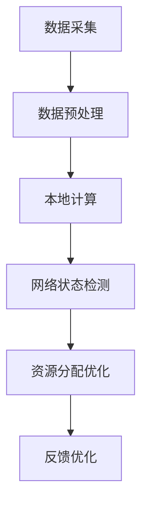

                 


# 如何识别企业的边缘计算自适应网络优势

> 关键词：边缘计算、自适应网络、企业网络架构、算法原理、系统设计、项目实战

> 摘要：本文深入探讨了边缘计算自适应网络的优势识别方法，通过详细的技术分析和案例解读，帮助读者理解如何在企业中有效识别和利用边缘计算自适应网络的优势。文章从核心概念、算法原理、系统设计到项目实战，全面解析了边缘计算自适应网络的特点和应用。

---

# 第1章: 边缘计算自适应网络的背景与概念

## 1.1 边缘计算的定义与特点
边缘计算是一种将计算能力从云端转移到数据生成地点（如传感器、设备或边缘服务器）的分布式计算范式。其特点是：
- **低延迟**：数据在本地处理，减少传输延迟。
- **高实时性**：支持实时数据处理和决策。
- **分布式架构**：数据在边缘节点处理后，仅传输关键信息到中心服务器。

## 1.2 自适应网络的定义与特点
自适应网络是指能够根据网络环境和业务需求动态调整网络配置和资源分配的智能网络。其特点是：
- **动态调整**：根据负载和网络状况自动优化。
- **智能决策**：利用AI和机器学习技术进行预测和优化。
- **高可靠性**：在网络故障时快速恢复，确保业务连续性。

## 1.3 边缘计算自适应网络的优势
边缘计算自适应网络结合了边缘计算的分布式优势和自适应网络的动态优化能力，主要优势包括：
- **降低延迟**：本地处理减少数据传输时间。
- **提高效率**：动态调整网络资源，提升整体性能。
- **增强安全性**：数据在边缘处理，减少敏感数据传输风险。

---

# 第2章: 边缘计算自适应网络的核心概念与联系

## 2.1 边缘计算自适应网络的原理
边缘计算自适应网络通过在边缘节点部署计算资源，并利用自适应算法动态调整网络配置，实现高效的资源利用和实时响应。

### 核心概念对比表
| **对比项**       | **边缘计算**                     | **自适应网络**                  | **边缘计算自适应网络**          |
|--------------------|----------------------------------|---------------------------------|---------------------------------|
| **核心目标**      | 降低延迟，提升实时性             | 动态调整网络资源，优化性能       | 结合两者，实现高效、实时的网络优化 |
| **主要优势**      | 分布式架构，本地数据处理         | 智能调整，动态优化               | 低延迟，高效率                   |
| **应用场景**      | 智能制造、物联网、实时监控       | 网络流量管理、负载均衡、动态扩展 | 边缘设备管理、实时数据分析       |

## 2.2 ER实体关系图
通过ER实体关系图，我们可以清晰地看到边缘计算自适应网络的核心要素及其关系。

```mermaid
erd
  entity 边缘节点 {
    key 属性: 节点ID
    属性: 处理能力, 网络带宽, 存储容量
  }
  entity 中心服务器 {
    key 属性: 服务器ID
    属性: 计算能力, 网络带宽, 存储容量
  }
  entity 数据流 {
    关系: 边缘节点 -> 数据流 -> 中心服务器
    关系: 数据流 -> 边缘节点
  }
```

---

# 第3章: 边缘计算自适应网络的算法原理

## 3.1 算法原理概述
边缘计算自适应网络的算法主要包括数据采集、本地处理、网络调整和反馈优化四个步骤。

### 算法流程图
以下是算法的流程图：



## 3.2 算法的数学模型与公式
边缘计算自适应网络的优化目标是最小化网络延迟和资源消耗。其数学模型如下：

$$ \text{目标函数} = \min_{x} \left( \sum_{i=1}^{n} w_i x_i + \lambda \sum_{j=1}^{m} c_j \right) $$

其中：
- $x_i$ 表示第i个节点的资源分配量。
- $w_i$ 表示资源分配的成本权重。
- $c_j$ 表示第j个边的网络消耗。
- $\lambda$ 表示惩罚系数。

---

# 第4章: 边缘计算自适应网络的系统分析与架构设计

## 4.1 系统分析
边缘计算自适应网络的系统分析包括以下步骤：
1. **问题场景介绍**：识别企业中需要实时处理和动态调整的业务场景。
2. **系统功能需求**：定义系统的功能需求，如数据采集、本地计算、网络优化等。
3. **系统性能需求**：确定系统的性能指标，如延迟、吞吐量、资源利用率。

## 4.2 系统架构设计
以下是系统架构图：


---

# 第5章: 边缘计算自适应网络的项目实战

## 5.1 环境安装
以下是项目实战的环境安装步骤：
1. 安装边缘计算框架（如Kubernetes）。
2. 部署自适应网络算法。
3. 测试环境配置。

## 5.2 系统核心实现源代码
以下是核心算法的实现代码：

```python
def adaptive_network_optimization(nodes, edges):
    for node in nodes:
        # 数据采集
        data = collect_data(node)
        # 数据预处理
        processed_data = preprocess(data)
        # 本地计算
        result = compute(processed_data)
        # 网络调整
        adjust_network(edges, result)
    return optimized_network
```

## 5.3 实际案例分析
通过实际案例分析，我们可以看到边缘计算自适应网络在企业中的应用效果。例如，在智能制造场景中，边缘计算自适应网络可以显著降低设备间的通信延迟，提升生产效率。

---

# 第6章: 边缘计算自适应网络的最佳实践

## 6.1 最佳实践 tips
1. **合理规划边缘节点**：根据业务需求选择合适的边缘节点数量和位置。
2. **动态调整网络资源**：根据负载变化实时优化网络配置。
3. **确保数据安全性**：在边缘节点处理数据时，注意数据加密和访问控制。

## 6.2 小结
边缘计算自适应网络的优势识别需要从背景、核心概念、算法原理、系统设计和项目实战等多个方面进行综合分析。通过本文的讲解，读者可以更好地理解如何在企业中识别和利用边缘计算自适应网络的优势。

## 6.3 注意事项
- 在实际应用中，需注意网络延迟和资源分配的平衡。
- 定期监控和优化网络架构，确保系统的高效运行。

## 6.4 拓展阅读
建议读者进一步阅读相关技术文献，深入了解边缘计算和自适应网络的最新研究进展。

---

# 总结
本文系统地分析了如何识别企业的边缘计算自适应网络优势，从理论到实践，为读者提供了全面的指导。通过本文的学习，读者可以更好地理解边缘计算自适应网络的优势，并在实际工作中加以应用。

