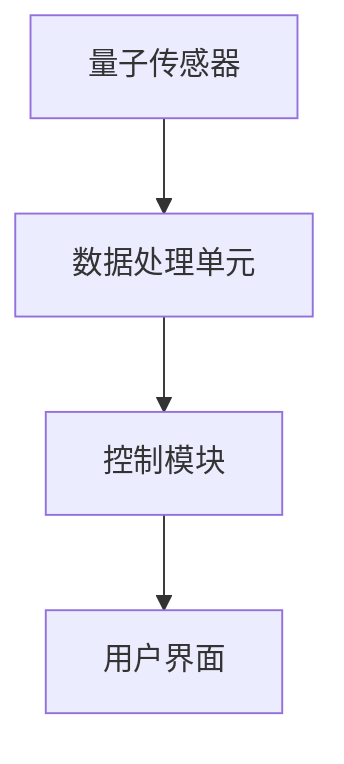

                 


# 如何识别企业的量子传感器优势

## 关键词：量子传感器、企业优势、技术原理、应用价值、算法原理、系统架构、项目实战

## 摘要：  
量子传感器作为一种新兴技术，正在改变企业数据采集和分析的方式。本文将深入探讨量子传感器的核心概念、技术原理、系统架构，以及在企业中的实际应用。通过分析其优势识别方法，结合具体案例，帮助企业在竞争中占据先机。

---

## 第一章：量子传感器的背景与概念

### 1.1 量子传感器的基本概念  
量子传感器是一种基于量子力学原理设计的设备，用于精确测量物理量（如磁场、重力、位置等）。与传统传感器相比，量子传感器具有更高的灵敏度和分辨率，能够在复杂环境中提供更准确的数据。

#### 1.1.1 量子传感器的定义  
量子传感器利用量子系统的特性（如叠加态和纠缠态）来测量物理量。其核心在于将量子系统作为敏感元件，通过测量量子态的变化来获取外界信息。

#### 1.1.2 量子传感器的基本原理  
量子传感器的工作原理基于量子叠加和量子纠缠。通过将量子系统置于特定状态，外界的物理变化会改变量子态，从而被测量和分析。

#### 1.1.3 量子传感器与传统传感器的对比  
| 特性       | 量子传感器 | 传统传感器 |
|------------|------------|------------|
| 灵敏度     | 极高       | 较低       |
| 数据精度   | 高         | 中等       |
| 适用场景   | 高精度需求 | 广泛场景    |

### 1.2 量子传感器的发展历程  
#### 1.2.1 历史演变  
量子传感器的发展始于20世纪末，随着量子力学理论的完善和技术的进步，逐渐从理论走向实际应用。

#### 1.2.2 现状与趋势  
当前，量子传感器技术已在多个领域（如国防、医疗、能源）取得突破，未来有望在更多领域发挥重要作用。

---

## 第二章：量子传感器的核心概念与技术原理

### 2.1 量子传感器的核心原理  
量子传感器的原理可以简单理解为通过量子系统的变化来反映外界物理量的变化。例如，利用原子的超精细结构变化来测量磁场。

#### 2.1.1 量子叠加原理  
量子叠加是指量子系统处于多个状态的叠加态。例如，一个量子位可以同时处于0和1的状态。

#### 2.1.2 量子纠缠原理  
量子纠缠是指两个或多个量子系统之间的状态相互关联。例如，测量其中一个系统的状态会立即确定另一个系统的状态。

#### 2.1.3 量子测量原理  
量子测量是通过观测量子系统的变化来获取外界信息。例如，通过测量光子的偏振来判断环境中的磁场变化。

### 2.2 量子传感器的关键技术  
#### 2.2.1 量子态制备技术  
量子态制备是将量子系统初始化到特定状态的技术，例如将单个光子制备成横向偏振态。

#### 2.2.2 量子态操控技术  
量子态操控是指通过施加外部控制（如磁场、电场）来改变量子系统状态的技术，例如通过磁场改变原子的超精细结构。

#### 2.2.3 量子态测量技术  
量子态测量是通过精密仪器测量量子系统的变化，例如通过光电检测器测量光子的偏振状态。

### 2.3 量子传感器的性能指标  
| 指标       | 描述                     |
|------------|--------------------------|
| 灵敏度     | 测量最小变化的能力       |
| 分辨率     | 区分相邻状态的能力       |
| 稳定性     | 长时间保持精度的能力     |

---

## 第三章：量子传感器的优势识别方法

### 3.1 识别量子传感器优势的步骤  
#### 3.1.1 确定企业目标  
明确企业在数据采集和分析中的具体需求，例如提高生产效率或优化产品质量。

#### 3.1.2 识别潜在应用场景  
分析企业中哪些环节适合使用量子传感器，例如高精度测量或复杂环境监测。

#### 3.1.3 评估技术可行性  
评估企业是否具备相关技术储备或外部合作资源，例如是否有量子传感器研发团队或合作伙伴。

#### 3.1.4 分析成本效益  
计算引入量子传感器的成本和预期收益，评估其是否具备经济可行性。

### 3.2 量子传感器优势识别的工具与方法  
#### 3.2.1 技术评估工具  
使用技术可行性分析工具，例如SWOT分析，评估量子传感器在企业中的应用潜力。

#### 3.2.2 数据分析方法  
通过数据分析工具（如Python、R）评估量子传感器的数据准确性、处理速度和稳定性。

#### 3.2.3 专家评估法  
邀请量子传感器领域的专家进行评估，获取专业意见和建议。

### 3.3 量子传感器优势识别的案例分析  
#### 3.3.1 制造业案例  
某汽车制造企业引入量子传感器，用于精确测量车身尺寸，显著提高了产品质量和生产效率。

#### 3.3.2 医疗领域案例  
某医疗设备公司使用量子传感器进行高精度磁场测量，成功开发出新型磁共振成像设备。

---

## 第四章：量子传感器的系统架构与设计

### 4.1 系统架构设计  
#### 4.1.1 系统组成  
量子传感器系统通常包括量子传感器、数据处理单元、控制模块和用户界面。

#### 4.1.2 架构图  


### 4.2 接口设计  
量子传感器系统需要与企业的现有系统（如ERP、MES）无缝对接，确保数据的实时传输和处理。

#### 4.2.1 数据接口  
通过API接口将量子传感器数据集成到企业数据管理系统中。

#### 4.2.2 控制接口  
通过RS-485或Modbus协议实现量子传感器与控制系统的通信。

### 4.3 交互流程  
#### 4.3.1 数据采集  
量子传感器实时采集物理量数据，并通过数据接口传输到数据处理单元。

#### 4.3.2 数据处理  
数据处理单元对原始数据进行分析和处理，生成有意义的信息。

#### 4.3.3 用户反馈  
用户通过人机交互界面查看处理结果，并根据需要进行进一步操作。

---

## 第五章：量子传感器的优势识别与应用

### 5.1 量子传感器的优势识别  
#### 5.1.1 技术优势  
量子传感器的高精度和灵敏度使其在复杂环境中表现优异。

#### 5.1.2 经济优势  
通过提高数据采集和分析效率，量子传感器可以降低企业运营成本。

#### 5.1.3 创新优势  
量子传感器的应用推动企业技术升级和产品创新。

### 5.2 量子传感器的实际应用  
#### 5.2.1 制造业优化  
某制造企业使用量子传感器优化生产流程，减少废品率，提高生产效率。

#### 5.2.2 医疗健康提升  
某医疗机构引入量子传感器进行高精度医疗设备研发，提升诊断准确率。

---

## 第六章：量子传感器的项目实战

### 6.1 项目环境安装  
#### 6.1.1 硬件安装  
安装量子传感器及其配套设备，确保其在特定环境下的正常运行。

#### 6.1.2 软件安装  
安装数据采集和处理软件，配置API接口和数据存储模块。

### 6.2 核心代码实现  
#### 6.2.1 数据采集代码  
```python
import serial

ser = serial.Serial('COM3', 9600)
data = ser.readline().decode()
print("Raw data:", data)
```

#### 6.2.2 数据处理代码  
```python
import numpy as np

def process_data(raw_data):
    # 数据预处理
    processed_data = np.array(raw_data)
    # 数据分析
    result = np.mean(processed_data)
    return result

result = process_data([1.2, 1.3, 1.4])
print("Processed result:", result)
```

#### 6.2.3 系统交互代码  
```python
import tkinter as tk

root = tk.Tk()
label = tk.Label(root, text="量子传感器数据")
label.pack()

root.mainloop()
```

### 6.3 案例分析与总结  
通过具体案例分析，总结量子传感器在实际项目中的应用效果和经验教训，为其他企业提供参考。

---

## 第七章：量子传感器的优势识别总结与展望

### 7.1 小结  
量子传感器作为一种新兴技术，为企业提供了更高的数据采集和分析能力。通过识别其优势，企业可以在多个领域实现技术升级和效率提升。

### 7.2 注意事项  
企业在引入量子传感器时，需要考虑技术可行性、成本效益和团队能力，避免盲目应用。

### 7.3 拓展阅读  
建议读者进一步了解量子传感器在更多领域的应用，例如量子计算、量子通信等。

---

## 结语  
量子传感器的优势识别是企业在数字化转型中的重要一步。通过本文的详细分析，企业可以更好地理解量子传感器的技术特点和应用价值，从而在竞争中占据优势。

---

## 关键词：  
量子传感器、企业优势、技术原理、应用价值、算法原理、系统架构、项目实战

