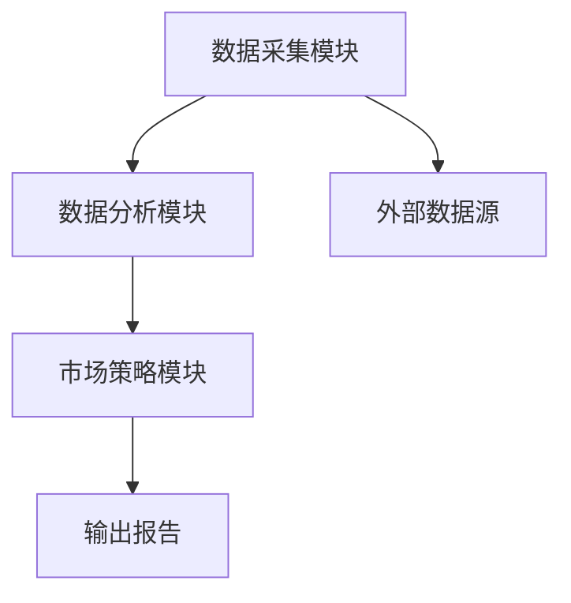
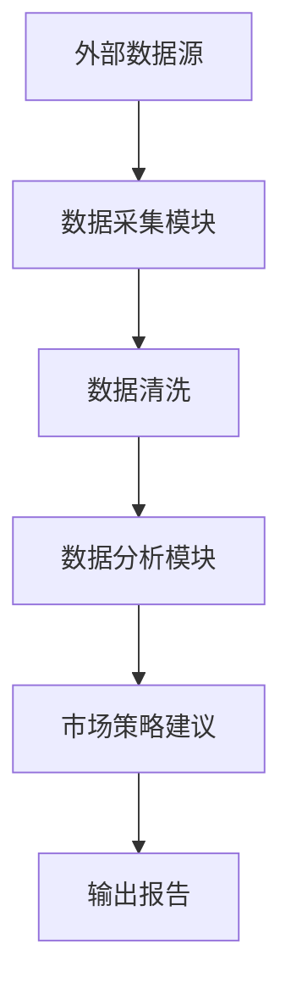
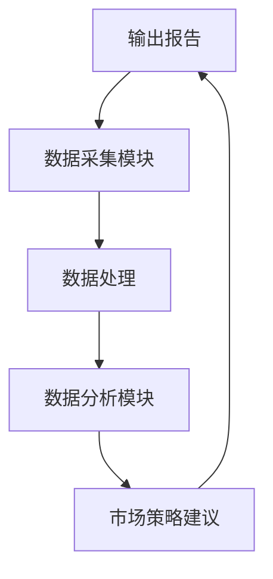

                 


# 如何识别企业的长尾效应优势

## 关键词：长尾效应, 企业优势, 数据分析, 市场细分, 系统设计

## 摘要：长尾效应是一种在数据分布中尾部部分累积效应的现象，能够为企业识别小众市场和竞争优势提供重要线索。本文通过背景分析、识别方法、系统设计和实际案例，详细阐述了如何利用长尾效应优化企业策略，提供了一套完整的识别与应用框架，帮助企业在竞争激烈的市场中找到新的增长点。

---

## 第1章：长尾效应的定义与特点

### 1.1 长尾效应的定义

长尾效应是指在数据分布中，尾部的长尾部分（即不太常见或小量的部分）累积起来能够产生与头部相当的甚至更大的整体效应。在商业领域，长尾效应指的是通过关注小众市场或非主流产品，利用其数量庞大的特性，形成整体的竞争优势。

#### 1.1.1 长尾效应的核心概念

- **数据分布**：数据分布可以分为头部（高频、高量）和尾部（低频、低量）。
- **累积效应**：尾部的大量小部分可以累积起来，形成与头部相当或更大的整体效应。
- **竞争优势**：通过识别和利用尾部市场，企业可以在竞争中找到新的机会。

### 1.2 长尾效应的特点

#### 1.2.1 小众市场的潜力

- 小众市场虽然单个市场规模小，但数量众多，整体潜力巨大。
- 小众市场的需求通常未被主流市场满足，存在较大的空白。

#### 1.2.2 尾部市场的累积效应

- 尾部市场的总体规模可以与头部市场相媲美。
- 尾部市场的分散性和多样性为企业提供了更多的选择。

#### 1.2.3 个性化需求的满足

- 尾部市场通常对应个性化或 niche 的需求。
- 通过满足这些个性化需求，企业可以建立差异化竞争优势。

### 1.3 长尾效应与传统商业模式的对比

#### 1.3.1 传统商业模式的局限性

- 传统商业模式过于依赖头部市场，忽视了小众市场的潜力。
- 传统商业模式难以满足个性化需求，容易陷入同质化竞争。

#### 1.3.2 长尾效应的独特优势

- 长尾效应利用小众市场的累积效应，为企业提供了新的增长点。
- 长尾效应通过满足个性化需求，提高了客户满意度和忠诚度。

#### 1.3.3 长尾效应的适用场景

- 适用于市场分散、个性化需求较多的行业。
- 适用于资源有限但可以通过聚焦小众市场实现增长的企业。

---

## 第2章：长尾效应的识别方法

### 2.1 数据分析方法

#### 2.1.1 数据采集与清洗

- **数据采集**：从各种渠道（如销售数据、用户反馈、市场调研等）获取相关数据。
- **数据清洗**：去除无效数据，确保数据的准确性和完整性。

#### 2.1.2 数据可视化与分布分析

- **数据可视化**：通过图表（如柱状图、折线图）展示数据分布，识别尾部市场的特征。
- **分布分析**：分析数据分布的长尾特征，确定尾部市场的范围。

#### 2.1.3 数据挖掘技术的应用

- **聚类分析**：识别尾部市场的潜在客户群体。
- **关联规则挖掘**：发现尾部市场中的关联需求。

### 2.2 市场细分与需求分析

#### 2.2.1 市场细分的步骤

1. **定义目标市场**：明确企业的目标客户群体。
2. **数据采集与整理**：收集客户数据，进行初步分析。
3. **客户分群**：基于客户特征（如年龄、性别、消费习惯）进行分群。
4. **识别尾部市场**：分析各分群的市场规模和潜力，确定尾部市场。

#### 2.2.2 需求分析的方法

- **问卷调查**：了解客户的需求和偏好。
- **焦点小组**：深入探讨客户对尾部市场的看法和需求。
- **竞争分析**：分析竞争对手在尾部市场的策略和表现。

#### 2.2.3 小众市场的识别

- **市场规模评估**：评估小众市场的潜在规模和盈利能力。
- **竞争环境分析**：了解小众市场的竞争格局，评估进入的可行性。

### 2.3 长尾效应的量化评估

#### 2.3.1 市场潜力的评估指标

- **市场规模**：小众市场的总体容量。
- **增长潜力**：市场未来增长的可能性。
- **竞争强度**：市场中现有竞争者的数量和实力。

#### 2.3.2 市场规模的估算方法

- **数据推算**：基于历史数据和市场趋势，估算小众市场的规模。
- **调研分析**：通过市场调研获取准确的市场规模数据。

#### 2.3.3 企业竞争优势的评估

- **成本优势**：企业是否能够在小众市场中以较低成本提供产品或服务。
- **差异化优势**：企业是否能够通过满足小众市场的独特需求，实现差异化竞争。
- **品牌优势**：企业品牌在小众市场中的认知度和影响力。

---

## 第3章：长尾效应的系统分析与架构设计

### 3.1 系统分析

#### 3.1.1 长尾效应识别系统的目标

- 实现对尾部市场的自动识别和分析。
- 提供基于长尾效应的市场策略建议。

#### 3.1.2 系统功能需求

- 数据采集与处理模块：负责数据的采集、清洗和预处理。
- 数据分析模块：利用数据挖掘技术识别尾部市场。
- 市场策略模块：根据分析结果提供市场策略建议。

#### 3.1.3 系统边界与外部接口

- 数据来源：销售数据、客户反馈、市场调研等。
- 输出结果：尾部市场识别报告、市场策略建议。

### 3.2 系统架构设计

#### 3.2.1 模块化设计

- 数据采集模块：负责数据的获取和初步处理。
- 数据分析模块：利用算法对数据进行深入分析。
- 市场策略模块：基于分析结果生成市场策略建议。

#### 3.2.2 数据流设计

1. 数据采集模块接收外部数据，进行清洗和预处理。
2. 数据分析模块对处理后的数据进行分析，识别尾部市场。
3. 市场策略模块根据分析结果生成市场策略建议，并输出报告。

#### 3.2.3 系统交互设计

- 用户通过界面向系统输入数据或查询结果。
- 系统通过界面向用户展示分析结果和市场策略建议。

### 3.3 系统设计图

#### 3.3.1 系统架构图



#### 3.3.2 数据流图



#### 3.3.3 系统交互图



---

## 第4章：长尾效应的项目实战

### 4.1 项目背景

某企业希望通过长尾效应识别小众市场，优化市场策略，提高市场占有率。

### 4.2 数据分析与处理

#### 4.2.1 数据采集

- 从企业内部数据库获取过去三年的销售数据。
- 通过市场调研收集客户反馈和需求信息。

#### 4.2.2 数据清洗

- 去除重复数据和无效记录。
- 补全缺失数据，确保数据的完整性和准确性。

#### 4.2.3 数据分析

- 使用聚类分析识别客户群体。
- 使用关联规则挖掘发现尾部市场的需求关联。

### 4.3 算法实现

#### 4.3.1 长尾效应识别算法

```python
def identify_tail_effect(data, threshold=0.1):
    # 计算数据分布
    distribution = data.value_counts(normalize=True)
    # 识别尾部市场
    tail_segments = distribution[distribution < threshold].index
    return tail_segments
```

#### 4.3.2 算法优化

- 使用机器学习算法（如随机森林）对数据进行分类，识别尾部市场。
- 通过交叉验证优化算法参数，提高识别准确率。

### 4.4 案例分析

#### 4.4.1 尾部市场识别结果

- 通过数据分析，识别出两个小众市场：年轻女性和中老年群体。
- 这两个市场虽然规模较小，但具有较高的增长潜力。

#### 4.4.2 市场策略建议

- 针对年轻女性市场，推出个性化产品，满足其特定需求。
- 针对中老年市场，提供易于使用的界面和贴心服务。

---

## 第5章：总结与展望

### 5.1 总结

本文详细阐述了长尾效应的识别方法和应用策略，通过实际案例展示了如何利用长尾效应优化企业市场策略。长尾效应的识别不仅能够帮助企业发现新的增长点，还能提高企业的市场竞争力。

### 5.2 展望

未来，随着数据技术的不断发展，长尾效应的识别和应用将更加精准和高效。企业可以通过人工智能和大数据技术，进一步挖掘尾部市场的潜力，实现更精准的市场定位和策略制定。

---

通过本文的分析和实践，企业可以更好地识别和利用长尾效应，找到新的竞争优势，实现可持续发展。

