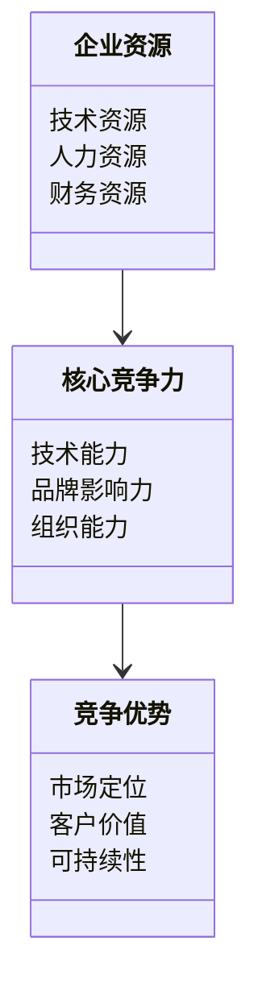

                 


# 如何识别企业的长期竞争优势

> 关键词：企业竞争优势、核心竞争力、战略分析、资源评估、可持续发展

> 摘要：本文系统地探讨了如何识别企业的长期竞争优势。通过分析核心概念、识别方法、系统架构设计以及实际案例，本文为读者提供了全面的理论与实践指导。从资源评估到战略匹配，从市场需求分析到竞争优势诊断，本文为企业管理者提供了实用的工具和方法，帮助他们在复杂多变的市场环境中持续保持竞争优势。

---

## 第一部分: 企业竞争优势的背景与核心概念

### 第1章: 企业的竞争优势概述

#### 1.1 企业竞争优势的定义与分类
企业竞争优势是指企业在市场上相对于竞争对手的有利条件，这些条件可以是资源、能力、技术或品牌等。竞争优势分为短期和长期两种，短期竞争优势可能基于价格或促销活动，而长期竞争优势则依赖于企业的核心竞争力和战略资源。

核心竞争力是企业长期竞争优势的核心，它是指企业在特定市场中能够持续提供价值的独特能力。核心竞争力通常具有独特性和不可模仿性，能够为企业的长期发展提供坚实的基础。

#### 1.2 企业竞争优势的重要性
竞争优势是企业生存和发展的关键。在激烈的市场竞争中，拥有长期竞争优势的企业能够更好地应对变化，抓住机遇，并抵御竞争对手的挑战。长期竞争优势不仅帮助企业实现短期盈利，还能确保其在长期内的可持续发展。

#### 1.3 企业竞争优势的识别与评估
识别竞争优势需要从企业的资源、能力和市场定位等方面入手。评估竞争优势的关键在于分析这些优势是否具有独特性、不可模仿性和可持续性。通过系统的评估，企业可以明确自身的强项，并制定相应的战略。

---

## 第二部分: 竞争优势的识别与分析方法

### 第2章: 竞争优势的识别方法

#### 2.1 基于资源基础的识别方法
企业竞争优势的识别可以从资源分析入手。企业需要评估自身的资源，包括人力资源、技术资源、财务资源和组织资源等。独特的资源和能力是核心竞争力的重要来源。

例如，某高科技企业拥有一项独特的专利技术，这可以成为其核心竞争力。通过分析资源的独特性和价值，企业可以识别其竞争优势。

#### 2.2 基于市场分析的识别方法
市场需求和竞争对手分析是识别竞争优势的重要途径。企业需要了解市场趋势和消费者需求，同时分析竞争对手的优劣势。通过比较，企业可以找到自身的独特定位。

例如，一家企业发现市场上缺乏某种特定产品的定制服务，这可以成为其竞争优势。

#### 2.3 基于战略匹配的识别方法
战略匹配是指企业的资源和能力与市场机会的匹配程度。通过SWOT分析（优势、劣势、机会、威胁），企业可以明确自身的竞争优势，并制定相应的战略。

例如，某企业通过SWOT分析发现，其技术能力是优势，而市场需求的增长是机会，因此可以将技术能力与市场需求相结合，形成竞争优势。

### 第3章: 竞争优势的评估与诊断

#### 3.1 评估模型与工具
企业竞争优势的评估需要使用多种工具和模型。例如，核心竞争力评估模型可以帮助企业识别其核心资源和能力。此外，数据分析和竞争对手分析也是重要的评估工具。

#### 3.2 评估步骤与流程
评估竞争优势的步骤包括：明确评估目标、收集和分析数据、制定评估标准、得出评估结果并提出改进建议。

例如，某企业计划进入新市场，首先需要评估自身的技术能力和市场定位，然后分析竞争对手的情况，最后制定相应的战略。

#### 3.3 评估中的常见问题与解决策略
评估过程中可能会遇到数据不足或不准确的问题。为了解决这些问题，企业需要收集全面且可靠的数据，并结合专家意见进行分析。

---

## 第三部分: 企业竞争优势的系统分析与架构设计

### 第4章: 系统分析与架构设计

#### 4.1 问题场景介绍
识别企业的长期竞争优势需要系统化的分析。企业需要从资源、市场和战略等多个维度进行分析，以确保竞争优势的全面性和可持续性。

#### 4.2 系统功能设计
系统功能设计包括领域模型设计和系统架构设计。例如，可以使用类图来展示企业的资源、能力和竞争优势之间的关系。



---

## 第四部分: 项目实战

### 第5章: 项目实战

#### 5.1 环境安装
为了进行竞争优势分析，企业需要安装相应的工具和软件。例如，使用数据分析工具（如Excel或Python）和项目管理工具（如JIRA）。

#### 5.2 核心代码实现
以下是竞争优势分析的Python代码示例：

```python
def assess_core_competitiveness(resources, capabilities, market_position):
    core_competitiveness = {}
    for resource in resources:
        if resource['unique'] and resource['value'] > 0.7:
            core_competitiveness[resource['name']] = resource['value']
    for capability in capabilities:
        if capability['alignment'] and capability['effectiveness'] > 0.6:
            core_competitiveness[capability['name']] = capability['effectiveness']
    return core_competitiveness

resources = [
    {'name': '技术专利', 'unique': True, 'value': 0.9},
    {'name': '品牌知名度', 'unique': False, 'value': 0.8},
    {'name': '研发团队', 'unique': True, 'value': 0.75}
]

capabilities = [
    {'name': '技术创新能力', 'alignment': True, 'effectiveness': 0.8},
    {'name': '市场拓展能力', 'alignment': False, 'effectiveness': 0.6}
]

market_position = {
    'market_growth': 0.15,
    'competitor_intensity': 0.2
}

result = assess_core_competitiveness(resources, capabilities, market_position)
print("Core Competitiveness:", result)
```

#### 5.3 案例分析
以某高科技企业为例，该企业拥有多项技术专利和强大的研发团队，但品牌知名度较低。通过分析，企业的核心竞争力在于其技术能力和研发团队，而品牌知名度较低可能成为市场竞争的劣势。因此，企业应加强品牌建设，同时继续提升技术水平。

---

## 第五部分: 最佳实践与注意事项

### 第6章: 最佳实践与注意事项

#### 6.1 最佳实践 tips
1. 定期评估竞争优势，确保其动态适应市场变化。
2. 结合企业内部资源和外部市场环境进行综合分析。
3. 制定明确的战略目标，并确保资源的合理配置。

#### 6.2 小结
识别企业的长期竞争优势需要系统化的分析和持续的努力。通过资源评估、市场分析和战略匹配，企业可以明确其核心竞争力，并制定相应的战略。

#### 6.3 注意事项
1. 确保数据的准确性和全面性。
2. 考虑到市场环境的动态变化，竞争优势需要定期更新。
3. 企业内部和外部利益相关者的反馈是重要的参考。

---

## 第六部分: 结论

通过系统的分析和实践，识别企业的长期竞争优势是企业在复杂市场环境中保持竞争力的关键。本文提供了理论与实践相结合的方法，帮助企业管理者全面评估和提升竞争优势。未来，随着技术的发展和市场的变化，竞争优势的识别将更加复杂，但通过持续的学习和创新，企业可以不断优化其竞争优势。

---

# 结语

识别企业的长期竞争优势是一个复杂而重要的任务。通过系统的分析、科学的方法和持续的努力，企业可以在竞争激烈的市场中找到并巩固其核心竞争力，实现长期的可持续发展。

