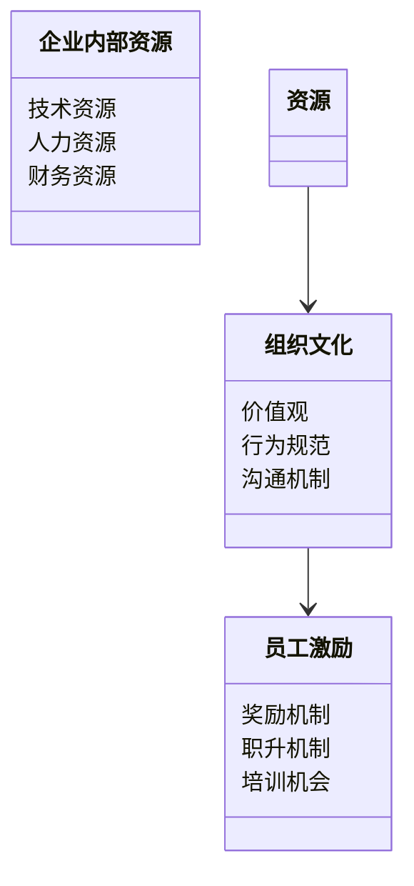
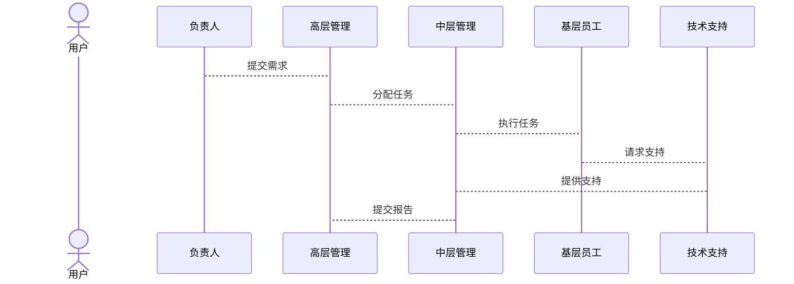

                 


# 如何识别企业的隐藏成长动力

---

## 关键词：
企业成长动力、隐藏因素、组织文化、员工激励、创新机制、系统分析、案例研究

---

## 摘要：
企业的隐藏成长动力是指那些不易被察觉但对企业发展至关重要的因素，包括组织文化、员工激励、创新机制等。本文通过系统分析和实际案例，探讨如何识别这些隐藏动力，并为企业制定有效的增长策略提供指导。

---

# 第一部分：引言

## 第1章：什么是企业的隐藏成长动力

### 1.1 隐藏成长动力的定义与核心概念
隐藏成长动力是指那些未被明显识别但对企业持续增长起关键作用的因素。这些因素可能包括组织文化、员工激励机制、内部资源优化配置等。

### 1.2 隐藏成长动力的重要性
识别隐藏成长动力可以帮助企业发现潜在的增长点，优化资源配置，提升竞争力。

### 1.3 隐藏成长动力与显性动力的区别
显性动力通常是可见的策略和行动计划，而隐藏动力则是内在的、无形的因素。

---

# 第二部分：隐藏成长动力的来源与特征

## 第2章：隐藏成长动力的来源分析

### 2.1 组织文化的影响
- **定义**：组织文化是指企业在长期发展过程中形成的共享价值观和行为规范。
- **影响**：积极的组织文化可以提升员工凝聚力和创造力。

### 2.2 员工激励机制
- **定义**：通过奖励和认可激励员工，提升工作积极性。
- **影响**：有效的激励机制可以提高员工绩效和创新意识。

### 2.3 创新机制的作用
- **定义**：企业内部推动创新的制度和流程。
- **影响**：创新机制能够加速产品和服务的更新，提升市场竞争力。

## 第3章：隐藏成长动力的特征与表现

### 3.1 隐性性与潜在性
- 隐藏动力通常不被外部观察者察觉，但对内部运作有重要影响。

### 3.2 累积性与爆发性
- 隐藏动力在长期积累后，可能突然爆发，带来显著的增长。

### 3.3 可持续性与可塑性
- 隐藏动力能够持续为企业提供增长动力，并根据环境变化进行调整。

---

# 第三部分：隐藏成长动力的识别框架

## 第4章：识别隐藏成长动力的关键维度

### 4.1 组织结构与管理风格
- **分析方法**：通过观察企业的组织架构和管理风格，判断其对员工的影响。

### 4.2 员工行为与态度
- **分析方法**：通过员工满意度调查和行为观察，评估员工的积极性。

### 4.3 资源利用效率
- **分析方法**：评估企业内部资源的分配和使用效率，发现潜在的优化空间。

## 第5章：隐藏成长动力的识别工具与技术

### 5.1 数据分析法
- **工具**：使用数据分析工具（如Excel、Python）对企业内部数据进行挖掘，识别隐藏动力。

### 5.2 员工行为分析法
- **工具**：通过员工绩效数据和行为记录，分析员工表现背后的因素。

### 5.3 创新机制评估法
- **工具**：评估企业的创新流程和文化，识别创新机制的优缺点。

---

# 第四部分：系统分析与架构设计方案

## 第6章：系统分析与架构设计

### 6.1 问题场景介绍
- **背景**：某企业面临增长缓慢的问题，希望通过识别隐藏动力找到解决方案。

### 6.2 系统功能设计
- **领域模型**：使用Mermaid绘制类图，展示企业内部资源、组织文化和员工激励之间的关系。



### 6.3 系统架构设计
- **架构图**：使用Mermaid绘制系统架构图，展示企业内部各个模块的交互。


### 6.4 系统接口设计
- **接口描述**：定义企业内部资源、组织文化、员工激励之间的交互接口。

### 6.5 系统交互设计
- **序列图**：展示企业在识别隐藏动力过程中的交互流程。



---

# 第五部分：项目实战与案例分析

## 第7章：项目实战

### 7.1 环境安装
- **工具**：安装数据分析工具（如Python、Pandas）和绘图工具（如Mermaid）。

### 7.2 核心实现源代码
- **代码示例**：使用Python进行数据分析，识别隐藏动力。

```python
import pandas as pd
import numpy as np

# 示例数据加载
data = pd.read_csv('employee_performance.csv')

# 数据预处理
data = data.dropna()

# 计算员工绩效与组织文化的相关性
correlation = data.corr()

print(correlation)
```

### 7.3 案例分析
- **案例**：某科技公司通过分析员工绩效数据和组织文化，识别出员工激励机制的不足，进而优化激励方案，提升员工积极性。

---

# 第六部分：结论与展望

## 第8章：结论与小结

### 8.1 结论
识别企业的隐藏成长动力是提升企业竞争力的重要手段。通过系统分析和实际案例，我们可以更好地发现和利用这些动力。

### 8.2 展望
未来，随着数据分析和人工智能技术的发展，识别隐藏动力的方法将更加精准和高效。

---

## 第9章：注意事项与最佳实践

### 9.1 注意事项
- 避免过于依赖单一方法，结合多种工具和技术进行分析。

### 9.2 最佳实践
- 定期进行员工满意度调查，持续优化组织文化。
- 建立创新机制，鼓励员工提出新想法。

---

## 第10章：拓展阅读

### 10.1 推荐书籍
- 《系统动力学》
- 《组织行为学》

### 10.2 相关博客与资源
- 推荐技术博客和在线资源，供读者深入学习。

---

通过以上步骤，我们可以系统地识别企业的隐藏成长动力，为企业制定有效的增长策略提供支持。

