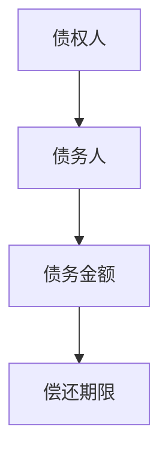
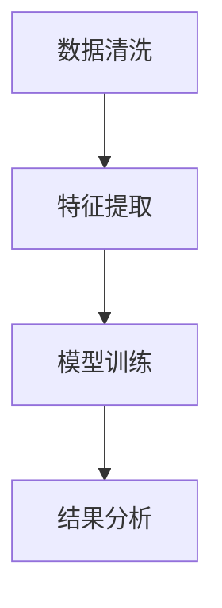
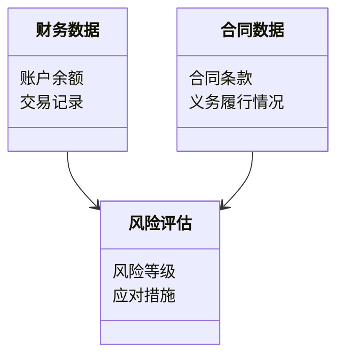
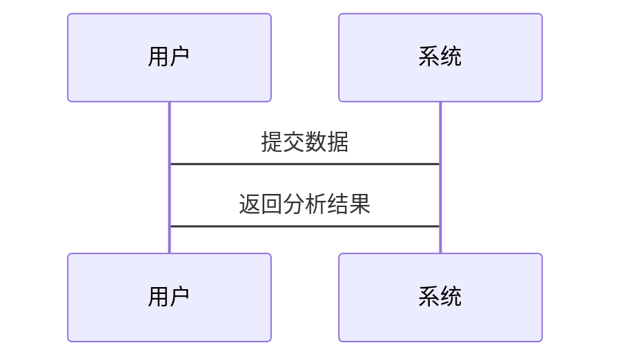
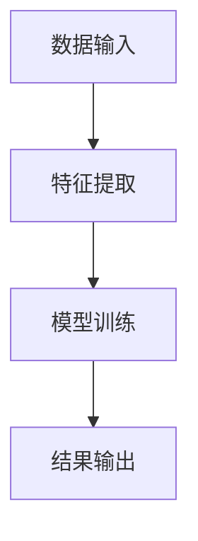

                 


# 如何识别企业的隐藏负债

> 关键词：企业财务，隐藏负债，财务风险，负债识别，企业治理，数据挖掘，财务分析

> 摘要：本文将详细探讨如何识别企业的隐藏负债，从概念、方法、工具到实际案例分析，系统性地为企业提供识别和管理隐藏负债的解决方案。通过理论与实践相结合的方式，深入分析隐藏负债对企业的影响，提供可行的应对策略。

---

## 第1章：企业隐藏负债的定义与背景

### 1.1 隐藏负债的核心概念
#### 1.1.1 隐藏负债的核心概念
隐藏负债是指企业在财务报表上未明确列示，但可能对企业财务状况产生重大影响的潜在债务或或有负债。这些负债通常隐藏在企业的日常经营、合同义务或潜在的法律纠纷中。

#### 1.1.2 隐藏负债与显性负债的对比
| 属性 | 隐藏负债 | 显性负债 |
|------|----------|----------|
| 是否列示 | 未列示 | 已列示 |
| 发现难度 | 高 | 低 |
| 影响 | 隐性风险 | 明确风险 |

#### 1.1.3 隐藏负债的分类与边界
隐藏负债可以分为以下几类：
- **合同负债**：未在财务报表中列示的合同义务。
- **或有负债**：潜在的法律纠纷或担保义务。
- **未来负债**：未来可能产生的债务。

### 1.2 隐藏负债的背景与重要性
#### 1.2.1 当前企业财务风险的现状
近年来，企业面临的财务风险日益复杂，隐藏负债已成为企业财务健康的重要隐患。

#### 1.2.2 隐藏负债对企业经营的影响
隐藏负债可能导致企业面临：
- 财务危机
- 信用评级下降
- 法律纠纷

#### 1.2.3 识别隐藏负债的必要性与挑战
识别隐藏负债的必要性：
- 避免财务黑洞
- 提高财务透明度
- 优化企业治理

识别隐藏负债的挑战：
- 数据分散
- 方法复杂
- 主观判断

---

## 第2章：企业隐藏负债的核心概念与联系

### 2.1 隐藏负债的核心要素
#### 2.1.1 负债的构成要素
- 债权人
- 债务人
- 债务金额
- 偿还期限

#### 2.1.2 隐藏负债的关键属性
- 隐秘性
- 或有性
- 累积性

#### 2.1.3 核心要素的相互关系
Mermaid图表：  


### 2.2 隐藏负债与企业其他要素的关系
#### 2.2.1 隐藏负债与企业财务状况
- 隐藏负债直接影响企业的资产负债表和利润表。

#### 2.2.2 隐藏负债与企业经营风险
- 隐藏负债可能导致企业面临突发性财务危机。

#### 2.2.3 隐藏负债与企业治理结构
- 良好的治理结构有助于减少隐藏负债的发生。

---

## 第3章：隐藏负债的识别方法与流程

### 3.1 隐藏负债的识别流程
#### 3.1.1 识别流程的步骤与框架
- 数据收集
- 数据分析
- 风险评估
- 应对策略

#### 3.1.2 各阶段的关键点与注意事项
- 数据收集：确保数据的完整性和准确性。
- 数据分析：采用多种方法交叉验证。

### 3.2 隐藏负债的识别方法
#### 3.2.1 财务报表分析法
- 检查资产负债表中的应付账款和未计负债。
- 审核利润表中的或有事项。

#### 3.2.2 内部审计法
- 审查企业内部合同和协议。
- 评估潜在的法律纠纷风险。

#### 3.2.3 第三方评估法
- 委托专业机构进行外部审计。

---

## 第4章：隐藏负债的识别工具与技术

### 4.1 财务分析工具
#### 4.1.1 财务比率分析
- 偿债能力分析
- 营运能力分析

#### 4.1.2 现金流分析
- 自由现金流分析
- 现金流量表分析

#### 4.1.3 资产负债表分析
- 资产负债率分析
- 速动比率分析

### 4.2 数据挖掘与分析技术
#### 4.2.1 数据挖掘的基本原理
- 数据清洗
- 数据建模
- 数据可视化

#### 4.2.2 数据挖掘在隐藏负债识别中的应用
- 关联规则挖掘
- 聚类分析

#### 4.2.3 实际案例中的数据挖掘分析
Mermaid图表：  


---

## 第5章：隐藏负债识别的系统分析与架构设计

### 5.1 系统分析框架
#### 5.1.1 问题场景介绍
- 系统目标：识别隐藏负债。
- 业务流程：数据采集、处理、分析、预警。

#### 5.1.2 领域模型构建（Mermaid类图）


#### 5.1.3 系统功能设计
- 数据采集模块
- 数据分析模块
- 风险预警模块

### 5.2 系统架构设计
#### 5.2.1 系统架构图（Mermaid架构图）


#### 5.2.2 系统接口设计
- 数据接口：REST API
- 用户接口：Web界面

#### 5.2.3 系统交互流程（Mermaid序列图）


---

## 第6章：隐藏负债识别的算法原理与数学模型

### 6.1 算法原理
#### 6.1.1 算法原理概述
- 基于机器学习的分类算法。
- 使用逻辑回归或支持向量机进行风险预测。

#### 6.1.2 算法流程图（Mermaid流程图）


#### 6.1.3 算法实现的Python源代码
```python
import pandas as pd
from sklearn.linear_model import LogisticRegression

# 数据加载
data = pd.read_csv('hidden_liabilities.csv')

# 特征选择
features = data[['revenue', 'expenses']]
target = data['hidden_liability']

# 模型训练
model = LogisticRegression()
model.fit(features, target)

# 预测
predictions = model.predict(features)
```

### 6.2 数学模型与公式
#### 6.2.1 核心数学模型
- 逻辑回归模型：
  $$ P(y=1|x) = \frac{e^{(w \cdot x + b)}}{1 + e^{(w \cdot x + b)}} $$

#### 6.2.2 关键公式的推导与解释
- 损失函数：
  $$ L = -\frac{1}{N} \sum_{i=1}^{N} [y_i \ln p_i + (1-y_i) \ln (1-p_i)] $$

---

## 第7章：隐藏负债识别的项目实战

### 7.1 项目环境与工具安装
#### 7.1.1 开发环境配置
- 操作系统：Windows 10
- 开发工具：PyCharm
- 数据库：MySQL

#### 7.1.2 工具安装与配置
- 安装Python库：`pip install pandas scikit-learn`

### 7.2 系统核心实现
#### 7.2.1 核心功能模块实现
- 数据清洗模块
- 模型训练模块
- 风险预警模块

#### 7.2.2 代码实现与解读
```python
import pandas as pd
from sklearn.ensemble import RandomForestClassifier

# 数据加载
data = pd.read_csv('hidden_liabilities.csv')

# 数据预处理
data.dropna(inplace=True)

# 特征选择
features = data[['account_age', 'transaction_amount']]
target = data['hidden_liability']

# 模型训练
model = RandomForestClassifier()
model.fit(features, target)

# 预测
predictions = model.predict(features)
```

#### 7.2.3 项目测试与优化
- 测试准确率
- 调参优化

### 7.3 实际案例分析
#### 7.3.1 案例背景介绍
- 某制造企业隐藏的应付账款。

#### 7.3.2 案例分析与解决过程
- 数据分析
- 模型预测
- 应对措施

#### 7.3.3 案例总结与经验分享
- 关键点总结
- 经验教训

---

## 第8章：隐藏负债识别的最佳实践与注意事项

### 8.1 最佳实践Tips
#### 8.1.1 实践中的注意事项
- 定期审查合同和财务记录。
- 建立内部控制系统。

#### 8.1.2 常见问题与解决方案
- 数据不足：使用外部数据补充。
- 模型过拟合：采用交叉验证。

#### 8.1.3 提高识别效率的方法
- 引入自动化工具。
- 培训财务人员。

### 8.2 总结
识别企业隐藏负债是一项复杂但重要的任务。通过系统化的分析和工具的应用，可以有效降低企业财务风险。

### 8.3 拓展阅读
- 《企业风险管理》
- 《数据挖掘与机器学习》

---

以上是《如何识别企业的隐藏负债》的技术博客文章的完整内容，涵盖了从理论到实践的各个方面，结合了实际案例和系统设计，帮助读者全面理解和掌握识别隐藏负债的方法。

