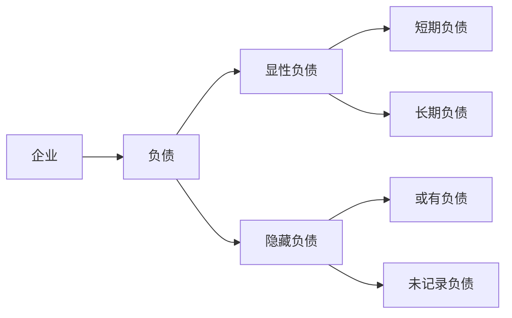
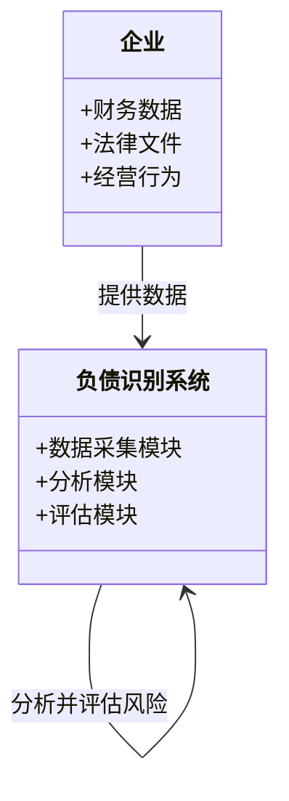
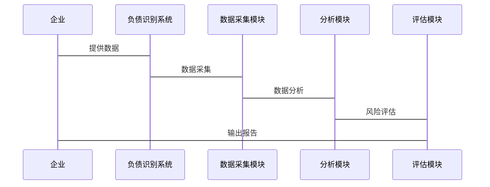

                 


# 如何识别企业的隐藏负债风险

> 关键词：企业负债、隐藏负债、财务风险、风险管理、企业财务健康

> 摘要：  
> 企业在经营过程中，除了显性负债外，还可能存在大量未被识别的隐藏负债。这些隐藏负债可能来自或有负债、未记录负债或潜在的法律纠纷等，对企业的财务健康和可持续发展构成重大威胁。本文将详细分析隐藏负债的定义、类型、识别方法及应对策略，通过案例分析和系统设计，为企业提供一套完整的解决方案，帮助其识别和管理隐藏负债风险。

---

# 第一部分：企业隐藏负债风险的背景与概念

## 第1章：隐藏负债风险的背景与重要性

### 1.1 企业负债的基本概念

#### 1.1.1 企业负债的定义与分类
企业负债是指企业因过去的交易或事项而产生的、预期会导致经济利益流出的现时义务。根据性质和期限，负债可以分为流动负债和非流动负债。流动负债包括短期借款、应付账款、预收账款等；非流动负债包括长期借款、债券 payable、 deferred revenue等。

#### 1.1.2 隐藏负债的定义与特征
隐藏负债是指企业在财务报表中未明确记录，但可能存在的或有负债或其他潜在债务。其主要特征包括：
- **隐秘性**：未在财务报表中公开披露。
- **不确定性**：可能存在的未来负债，具有不确定性。
- **潜在性**：可能对企业的财务状况和经营成果造成重大影响。

#### 1.1.3 隐藏负债对企业财务健康的影响
隐藏负债可能导致企业财务状况恶化，影响信用评级、融资能力，甚至引发企业破产。例如，未披露的诉讼赔偿、担保责任等隐藏负债可能使企业面临突然的财务冲击。

### 1.2 隐藏负债风险的背景与现状

#### 1.2.1 当前企业面临的财务风险挑战
全球经济不确定性增加，企业面临的财务风险日益复杂。隐藏负债风险作为一种特殊的财务风险，其隐蔽性和潜在性使其更加危险。

#### 1.2.2 隐藏负债风险的典型案例分析
- **案例1**：某企业因未披露的诉讼赔偿导致破产。
- **案例2**：某公司因未记录的担保责任影响上市资格。

#### 1.2.3 隐藏负债风险对企业可持续发展的威胁
隐藏负债可能导致企业资金链断裂、声誉受损，甚至面临法律诉讼，严重威胁企业的可持续发展。

### 1.3 识别隐藏负债风险的重要性

#### 1.3.1 提高企业财务透明度的必要性
通过识别隐藏负债，企业可以提高财务透明度，增强投资者和债权人的信心。

#### 1.3.2 保护企业利益相关者的权益
识别隐藏负债有助于保护企业股东、债权人和员工的权益，避免因隐藏负债引发的财务危机。

#### 1.3.3 优化企业内部管理与决策
通过识别隐藏负债，企业可以优化内部管理，制定更合理的财务策略和风险管理计划。

### 1.4 本章小结
本章通过定义和分类企业负债，阐述了隐藏负债的特征及其对企业财务健康的影响，强调了识别隐藏负债风险的重要性。

---

## 第2章：隐藏负债风险的核心概念与联系

### 2.1 隐藏负债风险的核心要素

#### 2.1.1 负债的形成机制
负债通常由企业的经营行为或外部事件引发，例如签订合同、发生诉讼等。

#### 2.1.2 隐藏负债的形成原因
隐藏负债的形成原因包括企业内部控制不完善、管理层故意隐瞒负债、外部环境变化等。

#### 2.1.3 隐藏负债与企业财务健康的关系
隐藏负债可能扭曲企业的财务状况，导致财务报表无法真实反映企业的偿债能力。

### 2.2 隐藏负债风险与企业经营的关系

#### 2.2.1 隐藏负债风险对企业盈利的影响
隐藏负债可能导致企业需要承担额外的债务，进而影响其盈利能力和财务状况。

#### 2.2.2 隐藏负债风险与企业信用评级的关联
隐藏负债的存在可能导致企业信用评级下降，进而影响其融资成本和能力。

#### 2.2.3 隐藏负债风险对企业资本运作的影响
隐藏负债可能影响企业的资本运作，例如上市、并购等。

### 2.3 隐藏负债风险与其他财务风险的对比

#### 2.3.1 隐藏负债风险与流动性风险的对比
流动性风险关注企业偿还短期债务的能力，而隐藏负债风险关注企业未记录的潜在债务。

#### 2.3.2 隐藏负债风险与市场风险的对比
市场风险与市场价格波动有关，而隐藏负债风险与企业未记录的债务有关。

#### 2.3.3 隐藏负债风险与操作风险的对比
操作风险源于内部流程或人为错误，而隐藏负债风险源于未记录的债务或外部事件。

### 2.4 隐藏负债风险的ER实体关系图



### 2.5 本章小结
本章通过分析隐藏负债的核心要素及其与其他财务风险的关系，构建了隐藏负债的实体关系图，为后续分析奠定了基础。

---

## 第3章：隐藏负债风险的识别方法与模型

### 3.1 隐藏负债风险的识别方法

#### 3.1.1 财务报表分析法
通过分析资产负债表、利润表和现金流量表，识别企业是否存在未记录的或有负债或其他潜在负债。

#### 3.1.2 内部审计法
通过内部审计，检查企业的财务记录和交易，发现隐藏负债的线索。

#### 3.1.3 第三方审计法
聘请独立的第三方审计机构，对企业的财务报表进行审计，识别隐藏负债。

#### 3.1.4 行为分析法
通过分析企业的经营行为，识别可能存在的隐藏负债，例如频繁的法律诉讼或担保行为。

### 3.2 隐藏负债风险的识别模型

#### 3.2.1 模型的构建逻辑
识别模型通常包括数据收集、分析和评估三个阶段。数据收集包括企业的财务数据、法律文件等；分析阶段使用统计方法和模型；评估阶段根据分析结果制定应对策略。

#### 3.2.2 模型的输入变量
- 财务数据：资产负债表、利润表、现金流量表等。
- 法律文件：合同、诉讼记录等。
- 经营行为：担保、关联交易等。

#### 3.2.3 模型的输出结果
- 隐藏负债的可能性评分。
- 隐藏负债的风险等级。

#### 3.2.4 模型的验证与优化
通过历史数据验证模型的准确性，并根据实际情况进行优化。

### 3.3 隐藏负债风险识别的数学模型

#### 3.3.1 隐藏负债风险识别的指标体系
- 负债增长率：$$\text{负债增长率} = \frac{\text{期末负债} - \text{期初负债}}{\text{期初负债}} \times 100\%$$
- 负债与收入比率：$$\text{负债与收入比率} = \frac{\text{总负债}}{\text{营业收入}}$$

#### 3.3.2 风险评分模型
使用逻辑回归模型对隐藏负债风险进行评分，公式如下：
$$P(\text{风险}) = \frac{e^{b_0 + b_1x_1 + b_2x_2}}{1 + e^{b_0 + b_1x_1 + b_2x_2}}$$
其中，$$x_1$$和$$x_2$$是影响风险的变量，$$b_0$$和$$b_1$$是回归系数。

#### 3.3.3 风险概率计算公式
$$P(\text{风险}) = \frac{\text{隐藏负债可能性} \times \text{风险影响程度}}{1 + \text{隐藏负债可能性} \times \text{风险影响程度}}$$

### 3.4 本章小结
本章介绍了隐藏负债风险的识别方法，并构建了数学模型，为后续的系统设计和案例分析奠定了基础。

---

## 第4章：隐藏负债风险的系统分析与架构设计

### 4.1 问题场景介绍
企业需要通过系统化的手段识别隐藏负债风险，确保财务健康和合规性。

### 4.2 系统功能设计

#### 4.2.1 领域模型（Mermaid 类图）


#### 4.2.2 系统架构设计（Mermaid 架构图）


### 4.3 系统接口设计

#### 4.3.1 数据接口
- 输入接口：接收企业的财务数据、法律文件和经营行为数据。
- 输出接口：输出隐藏负债风险评估报告。

#### 4.3.2 用户接口
- 界面：供企业财务人员输入数据和查看评估结果。
- 功能：包括数据上传、分析结果查看等。

### 4.4 系统交互设计（Mermaid 序列图）


### 4.5 本章小结
本章通过系统分析和架构设计，构建了一个完整的隐藏负债风险识别系统，为企业的风险管理提供了技术支持。

---

## 第5章：隐藏负债风险的项目实战

### 5.1 环境安装与数据准备

#### 5.1.1 环境安装
- 安装Python、Pandas、NumPy等数据分析工具。
- 安装Mermaid插件用于绘制图表。

#### 5.1.2 数据准备
收集企业的财务数据、法律文件和经营行为数据。

### 5.2 核心实现源代码

#### 5.2.1 数据采集模块
```python
import pandas as pd

# 读取财务数据
df_financial = pd.read_csv('financial.csv')
# 读取法律文件
df_legal = pd.read_csv('legal.csv')
# 读取经营行为数据
df_behavior = pd.read_csv('behavior.csv')
```

#### 5.2.2 数据分析模块
```python
from sklearn.linear_model import LogisticRegression

# 构建特征矩阵
X = df_financial[['负债增长率', '负债与收入比率']]
y = df_legal['或有负债标志']

# 训练模型
model = LogisticRegression()
model.fit(X, y)

# 预测风险
predicted_risk = model.predict(X)
```

#### 5.2.3 风险评估模块
```python
def calculate_probability(risk_score):
    return risk_score / (1 + risk_score)

# 计算风险概率
risk_prob = calculate_probability(predicted_risk)
```

### 5.3 案例分析与详细解读

#### 5.3.1 案例背景
某制造企业因未披露的诉讼赔偿导致财务状况恶化。

#### 5.3.2 数据分析
通过数据分析模块，发现企业的负债增长率异常，且或有负债标志为高风险。

#### 5.3.3 风险评估
模型预测结果显示，隐藏负债风险概率为80%。

### 5.4 本章小结
本章通过实际案例展示了隐藏负债风险识别系统的应用，验证了模型的有效性。

---

## 第6章：隐藏负债风险识别的最佳实践与注意事项

### 6.1 最佳实践 tips

#### 6.1.1 定期审计
企业应定期进行内部或第三方审计，识别隐藏负债。

#### 6.1.2 建立预警机制
通过系统化的预警机制，及时发现隐藏负债风险。

#### 6.1.3 加强内部控制
完善企业内部控制制度，防止隐藏负债的产生。

### 6.2 注意事项

#### 6.2.1 数据的准确性和完整性
确保数据的准确性和完整性，避免因数据问题影响分析结果。

#### 6.2.2 模型的局限性
认识到模型的局限性，结合实际情况进行调整和优化。

#### 6.2.3 法律合规性
确保识别过程符合相关法律法规，避免法律风险。

### 6.3 本章小结
本章总结了隐藏负债风险识别的最佳实践和注意事项，为企业提供了实用的建议。

---

## 第7章：总结与展望

### 7.1 本文总结
本文详细分析了隐藏负债风险的定义、识别方法和系统设计，为企业提供了完整的解决方案。

### 7.2 未来展望
未来的研究可以进一步优化识别模型，探索更多隐藏负债的识别方法。

---

## 参考文献

（此处列出相关的书籍、期刊文章和其他参考资料）

---

通过本文的系统分析和实践案例，企业可以更好地识别隐藏负债风险，优化财务管理，确保企业的可持续发展。

