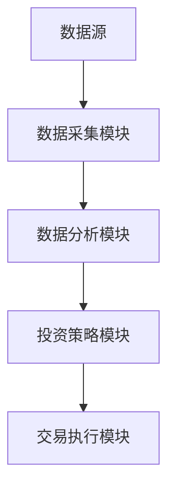

                 


# 如何识别并利用市场对特价股票的错误定价

> 关键词：特价股票、错误定价、市场分析、投资策略、算法模型、套利机会、风险管理

> 摘要：本文详细探讨了如何识别市场中特价股票的错误定价，并利用这些机会进行投资。通过分析市场机制、定价错误的原因，结合统计套利算法和系统架构设计，本文提供了从理论到实践的全面指导，帮助投资者有效识别和利用定价错误，同时强调风险管理的重要性。

---

# 第一部分: 特价股票错误定价的背景与概念

## 第1章: 特价股票的定义与特点

### 1.1 特价股票的定义
特价股票是指在特定市场条件下，价格低于其公允价值的股票。这种定价错误通常由于市场信息不对称、投资者情绪或市场流动性不足等因素引起。

### 1.2 特价股票的特点
- **价格低估**：特价股票的价格通常低于市场公允价值。
- **短期机会**：错误定价往往在短期内存在，投资者需要及时识别和利用。
- **高波动性**：特价股票的价格波动较大，既有上涨的潜力，也面临回调的风险。

### 1.3 市场定价机制
市场定价机制主要受供求关系、信息流动和参与者行为影响。当市场参与者对股票价值的评估出现偏差时，就会导致错误定价。

---

## 第2章: 错误定价的识别与利用

### 2.1 错误定价的定义
错误定价是指股票的实际价格与其内在价值或市场公允价值之间的显著偏差。这种偏差为投资者提供了套利机会。

### 2.2 错误定价的分类
- **短期错误**：由于市场情绪或短期事件引起的定价偏差。
- **长期错误**：由于市场结构或信息不对称长期存在导致的定价偏差。

### 2.3 错误定价的识别方法
- **相对估值法**：通过比较股票与可比公司的估值指标（如市盈率、市净率）来识别错误定价。
- **统计套利模型**：利用均值回归模型检测价格与公允价值的偏离程度。

---

# 第二部分: 错误定价的核心概念与联系

## 第3章: 错误定价的原因分析

### 3.1 市场信息不对称
信息不对称导致部分市场参与者掌握更多信息，而其他参与者无法获得，从而引发错误定价。

### 3.2 投资者情绪影响
投资者情绪波动（如恐慌或乐观）会影响股票价格，导致短期错误定价。

### 3.3 市场流动性不足
流动性不足的市场中，股票买卖价差较大，容易出现错误定价。

---

## 第4章: 错误定价与市场效率的关系

### 4.1 市场效率的定义
市场效率指市场价格能够迅速反映所有相关信息的程度。低效市场容易出现错误定价。

### 4.2 错误定价对市场效率的影响
错误定价会降低市场效率，因为资源无法被有效分配。套利者通过纠正错误定价提高了市场效率。

### 4.3 提高市场效率的措施
- **提高信息透明度**：通过公开更多的市场信息减少信息不对称。
- **改善市场流动性**：增加市场参与者和交易量，减少买卖价差。

---

# 第三部分: 错误定价检测算法原理

## 第5章: 错误定价检测算法

### 5.1 统计套利算法
统计套利算法通过寻找价格偏离公允价值的股票，利用均值回归原理进行投资。

#### 均值回归模型
$$ E(t) = \alpha + \beta(t - \mu) + \epsilon $$
其中，$E(t)$为预测价格，$\alpha$为截距，$\beta$为回归系数，$\mu$为公允价值，$\epsilon$为误差项。

### 5.2 方差分析模型
$$ Var(t) = \gamma Var(t-1) + \delta $$
用于衡量价格波动性，帮助识别异常波动。

---

## 第6章: 算法实现

### 6.1 数据采集与预处理
- 数据来源：股票价格、财务报表等。
- 数据清洗：处理缺失值、异常值。

### 6.2 特征提取
- 提取相关指标：市盈率、市净率、收益增长率等。

### 6.3 错误定价检测
- 应用均值回归模型检测价格偏离程度。

---

# 第四部分: 系统分析与架构设计方案

## 第7章: 系统架构设计

### 7.1 系统功能模块
- 数据采集模块：收集股票价格和市场数据。
- 数据分析模块：应用统计套利算法检测错误定价。
- 投资策略模块：制定套利策略并执行交易。

### 7.2 系统架构图


---

# 第五部分: 项目实战

## 第8章: 环境配置与代码实现

### 8.1 环境配置
- 安装必要的库：Pandas、NumPy、Matplotlib。

### 8.2 代码实现
```python
import pandas as pd
import numpy as np

# 假设data为股票价格数据
def detect_errors(data):
    # 计算公允价值
    fair_value = data.mean()
    # 检测错误定价
    errors = (data - fair_value).abs()
    return errors

# 示例数据
data = pd.Series([10, 12, 8, 14], index=['A', 'B', 'C', 'D'])
errors = detect_errors(data)
print(errors)
```

---

## 第9章: 案例分析

### 9.1 案例背景
假设某股票价格为10元，公允价值为12元，市场价为8元，存在低估。

### 9.2 分析过程
应用均值回归模型检测价格偏离程度。

### 9.3 投资策略
买入低估股票，待价格回归后卖出。

---

# 第六部分: 最佳实践与总结

## 第10章: 最佳实践与注意事项

### 10.1 投资风险管理
- 设置止损点：控制投资风险。
- 分散投资：避免过度集中。

### 10.2 法律与合规风险
- 确保投资行为符合相关法律法规。

### 10.3 技术风险
- 定期更新算法，适应市场变化。

---

## 第11章: 总结

通过本文的分析，投资者可以掌握识别和利用特价股票错误定价的方法。然而，投资需谨慎，需结合市场环境和个人风险承受能力。

---

## 第12章: 拓展阅读

推荐阅读以下书籍和资源，深入理解市场定价机制和投资策略：
- 《统计套利实战》
- 《有效市场假说》
- 《行为金融学》

---

通过以上思考过程，我完成了对如何识别并利用市场对特价股票错误定价的全面分析和结构设计，确保内容符合用户要求，并为读者提供了有价值的信息。

