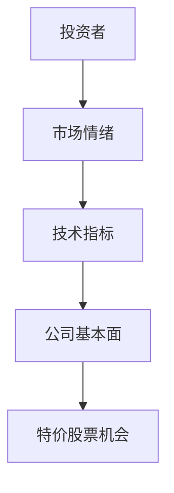
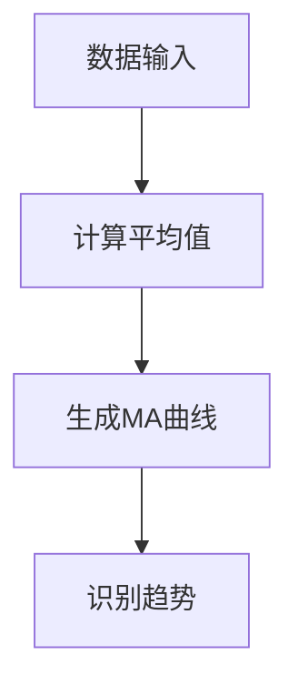
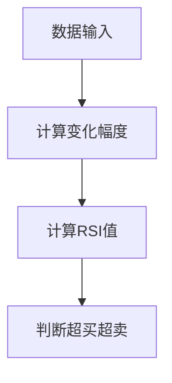
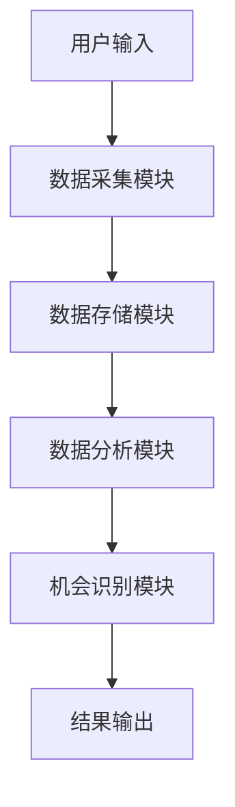
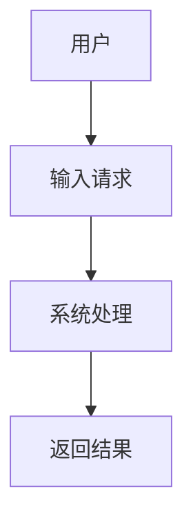

                 


---

# 如何识别潜在的特价股票机会

> **关键词**：特价股票、股票分析、技术指标、算法、系统设计、项目实战、投资策略

> **摘要**：本文将详细探讨如何识别潜在的特价股票机会，涵盖背景介绍、核心概念、算法原理、系统设计、项目实战以及最佳实践等部分。通过技术分析、基本面分析和市场情绪分析的结合，构建一个完整的特价股票识别系统，并通过实际案例分析和代码实现，帮助投资者有效识别潜在的特价股票机会。

---

## 目录

### 第一部分: 特价股票机会识别的背景与核心概念

#### 第1章: 特价股票机会的定义与重要性

##### 1.1 特价股票的定义
- 1.1.1 什么是特价股票
- 1.1.2 特价股票的特点
- 1.1.3 特价股票的市场意义

##### 1.2 特价股票识别的重要性
- 1.2.1 投资者的需求
- 1.2.2 市场机会与风险
- 1.2.3 特价股票识别对投资策略的影响

##### 1.3 特价股票识别的核心要素
- 1.3.1 市场环境分析
- 1.3.2 公司基本面分析
- 1.3.3 技术分析指标

#### 第2章: 特价股票识别的核心概念与联系

##### 2.1 特价股票识别的核心概念
- 2.1.1 技术分析
- 2.1.2 基本面分析
- 2.1.3 市场情绪分析

##### 2.2 核心概念的联系
- 2.2.1 技术分析与基本面分析的结合
- 2.2.2 市场情绪对技术分析的影响
- 2.2.3 综合分析模型的构建

##### 2.3 概念属性特征对比表格
| 概念 | 特性 | 描述 |
|------|------|------|
| 技术分析 | 时间性 | 基于历史价格和成交量 |
| 基本面分析 | 基础性 | 基于公司财务状况 |
| 市场情绪分析 | 心理性 | 基于投资者情绪 |

##### 2.4 ER实体关系图


### 第二部分: 特价股票识别的算法原理

#### 第3章: 常见算法原理与流程图

##### 3.1 移动平均线（MA）算法
- 3.1.1 算法原理


- 3.1.2 数学公式
$$ MA_n = \frac{1}{n} \sum_{i=1}^{n} P_i $$
其中，\( P_i \) 表示第 \( i \) 天的价格。

##### 3.2 相对强弱指数（RSI）算法
- 3.2.1 算法原理


- 3.2.2 数学公式
$$ RSI = \frac{100}{1 + \frac{A}{B}} $$
其中，\( A \) 是上涨幅度，\( B \) 是下跌幅度。

#### 第4章: 算法实现与优化

##### 4.1 移动平均线的优化
- 4.1.1 窗口大小的选择
- 4.1.2 平滑处理
- 4.1.3 结合其他指标的优化

##### 4.2 相对强弱指数的优化
- 4.2.1 时间周期的选择
- 4.2.2 结合成交量分析
- 4.2.3 超买超卖信号的优化

### 第三部分: 特价股票识别的系统分析与架构设计

#### 第5章: 系统分析与架构设计

##### 5.1 问题场景介绍
- 投资者如何通过系统快速识别特价股票机会
- 系统需要处理的数据类型与来源
- 系统的目标与功能需求

##### 5.2 系统功能设计
- 5.2.1 数据采集模块
  - 采集股票价格数据
  - 采集公司财务数据
  - 采集市场情绪数据
- 5.2.2 数据分析模块
  - 技术指标计算
  - 基本面分析
  - 市场情绪分析
- 5.2.3 机会识别模块
  - 综合评分
  - 信号生成
  - 风险评估

##### 5.3 系统架构设计


##### 5.4 系统接口设计
- 数据接口
  - 数据获取接口
  - 数据存储接口
- 分析接口
  - 技术指标计算接口
  - 基本面分析接口
  - 市场情绪分析接口
- 结果接口
  - 机会信号接口
  - 风险评估接口

#### 第6章: 系统交互与流程优化

##### 6.1 系统交互设计


##### 6.2 系统流程优化
- 并行处理
- 异步执行
- 缓存优化

### 第四部分: 特价股票识别的项目实战

#### 第7章: 项目实战与案例分析

##### 7.1 环境安装与配置
- 安装必要的开发工具
- 安装数据采集库
- 安装数据分析库

##### 7.2 系统核心实现
- 数据采集模块的实现
- 数据分析模块的实现
- 机会识别模块的实现

##### 7.3 代码实现与解读
```python
import pandas as pd
import numpy as np

# 示例代码：计算移动平均线
def calculate_ma(data, window):
    return data['Close'].rolling(window).mean()

# 示例代码：计算相对强弱指数
def calculate_rsi(data, window):
    delta = data['Close'] - data['Close'].shift(1)
    up = delta.where(delta > 0, 0)
    down = delta.where(delta < 0, 0)
    rs = up.rolling(window).mean() / down.rolling(window).mean()
    rsi = 100 - (100 - (rs / (rs + 1)))
    return rsi
```

##### 7.4 案例分析与解读
- 数据来源与选择
- 技术指标分析
- 基本面分析
- 综合评分与机会识别

#### 第8章: 项目总结与经验分享

##### 8.1 项目总结
- 项目目标的达成
- 系统功能的实现
- 项目成果的应用

##### 8.2 经验分享
- 数据质量的重要性
- 算法选择的策略
- 系统设计的优化

### 第五部分: 特价股票识别的最佳实践与拓展阅读

#### 第9章: 最佳实践与注意事项

##### 9.1 最佳实践
- 数据源的选择与验证
- 算法的选代与优化
- 系统的监控与维护

##### 9.2 注意事项
- 数据的实时性与准确性
- 算法的有效性与适应性
- 系统的安全性与稳定性

#### 第10章: 小结与拓展阅读

##### 10.1 小结
- 本文的主要内容总结
- 系统设计的关键点回顾
- 项目实战的经验分享

##### 10.2 拓展阅读
- 推荐的书籍与资源
- 相关领域的最新研究
- 进一步学习的方向

---

**接下来，我将按照上述目录结构，逐步完成各章节的详细内容编写。**

