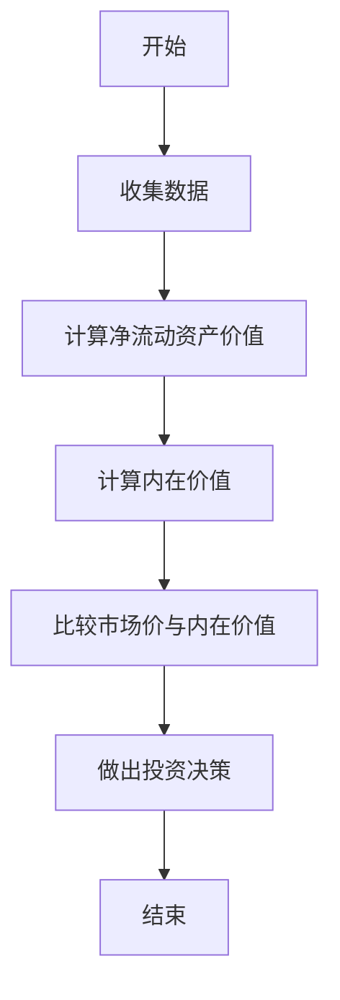
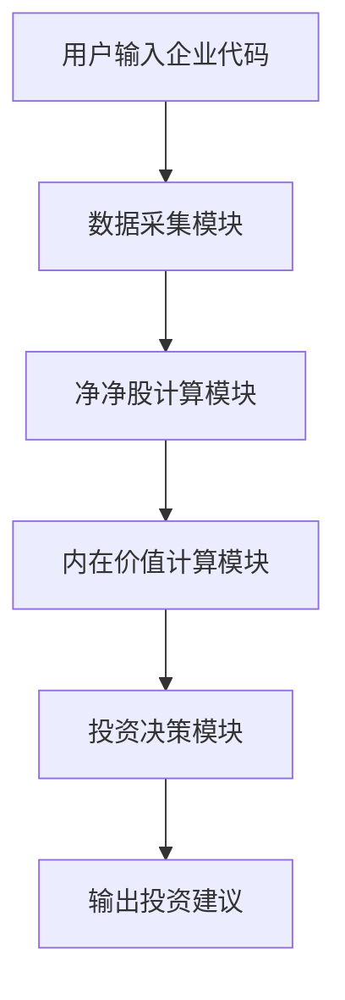
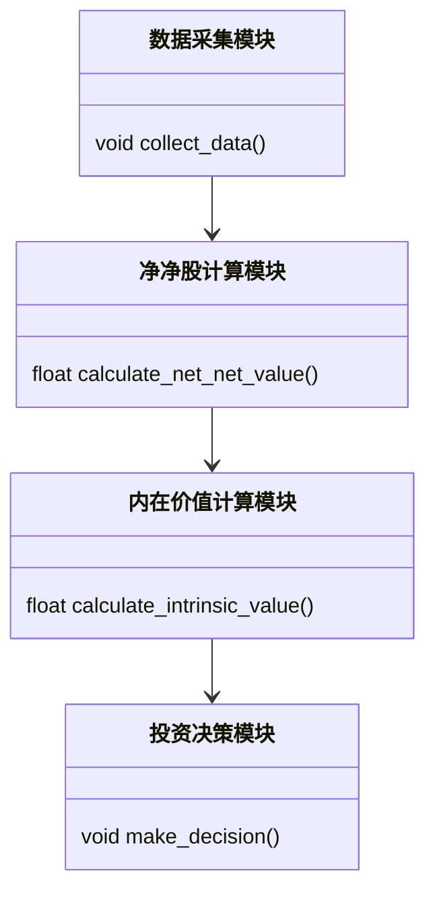
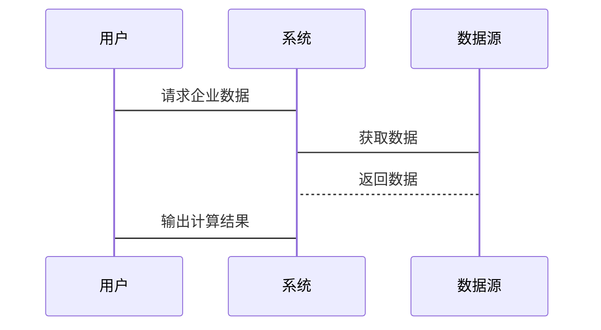

                 


# 如何运用格雷厄姆的净净股策略进行投资

> 关键词：格雷厄姆、净净股策略、价值投资、投资分析、风险管理、Python代码

> 摘要：本文深入分析了格雷厄姆的净净股策略，从背景介绍、核心概念、算法原理到系统设计、项目实战和最佳实践，详细讲解了如何运用这一策略进行投资。文章结合数学模型、Python代码和系统架构设计，帮助读者全面掌握净净股策略的原理和应用方法。

---

# 第一部分: 格雷厄姆净净股策略的背景与基础

## 第1章: 格雷厄姆的价值投资理念

### 1.1 格雷厄姆的生平与投资思想
#### 1.1.1 格雷厄姆的生平简介
本杰明·格雷厄姆（Benjamin Graham）是20世纪著名的投资学家，被誉为“价值投资之父”。他出生于1894年，早年通过投资股市积累了巨额财富，但后来在1929年股市崩盘中损失惨重。这次经历使他形成了独特的价值投资理念，强调安全边际和长期投资。

#### 1.1.2 格雷厄姆的价值投资理念
格雷厄姆提出的价值投资理念以“安全边际”为核心，强调以低于内在价值的价格买入优质股票。他认为市场先生（Mr. Market）的情绪波动为投资者提供了低价买入的机会。

#### 1.1.3 格雷厄姆投资理论的核心思想
格雷厄姆的核心思想包括：
1. **安全边际**：买入价格远低于内在价值的股票，以降低投资风险。
2. **内在价值**：股票的真实价值，与市场波动无关。
3. **长期投资**：避免短期市场波动，关注企业的长期价值。

### 1.2 净净股策略的定义与特点
#### 1.2.1 净净股的定义
净净股（Net-Net）是格雷厄姆提出的一种投资策略，指以低于企业净流动资产价值的价格买入股票。具体计算公式为：
$$ \text{净流动资产价值} = \text{流动资产} - \text{流动负债} $$

#### 1.2.2 净净股策略的核心特点
1. **低估值**：买入价格远低于企业净流动资产价值。
2. **高安全边际**：通过安全边际降低投资风险。
3. **逆向投资**：在市场恐慌时寻找低估机会。

#### 1.2.3 净净股与传统投资策略的区别
| 对比维度 | 净净股策略 | 传统市盈率策略 |
|----------|------------|----------------|
| 估值依据 | 净流动资产 | 市盈率或市净率 |
| 适用场景 | 低估值企业 | 高成长企业     |
| 风险偏好 | 低风险偏好 | 高风险偏好     |

### 1.3 净净股策略的核心概念
#### 1.3.1 安全边际
安全边际是格雷厄姆投资理念的核心，指买入价格与内在价值的差距。公式为：
$$ \text{安全边际} = \text{内在价值} - \text{买入价格} $$

#### 1.3.2 内在价值
内在价值是企业未来现金流的现值，计算公式为：
$$ \text{内在价值} = \sum_{t=1}^{n} \frac{CF_t}{(1 + r)^t} $$
其中，\( CF_t \) 是第 \( t \) 年的现金流，\( r \) 是折现率。

#### 1.3.3 市场先生
市场先生是格雷厄姆用来形容市场波动的比喻，强调投资者应独立于市场情绪，专注于企业内在价值。

### 1.4 净净股策略的应用场景
#### 1.4.1 适用于哪些类型的企业
1. **低增长企业**：企业增长缓慢，但具有稳定的现金流。
2. **低估企业**：市场价远低于净流动资产价值。
3. **周期性企业**：在市场底部时买入，避免周期性波动。

#### 1.4.2 净净股策略的优缺点
| 优点 | 缺点 |
|------|------|
| 高安全边际 | 适合低成长企业 |
| 低估值策略 | 不适合高成长企业 |
| 风险低 | 市场波动可能影响短期收益 |

#### 1.4.3 净净股策略的适用市场环境
1. **市场恐慌**：市场恐慌时容易找到低估机会。
2. **经济衰退**：经济衰退时企业价值可能被低估。
3. **低利率环境**：低利率环境下企业估值可能上升。

### 1.5 本章小结
本章介绍了格雷厄姆的价值投资理念，重点讲解了净净股策略的定义、特点和核心概念，为后续分析奠定了基础。

---

## 第2章: 净净股策略的核心原理

### 2.1 净净股的计算方法
#### 2.1.1 净净股的定义公式
$$ \text{净流动资产价值} = \text{流动资产} - \text{流动负债} $$

#### 2.1.2 净净股的计算步骤
1. 收集目标企业的流动资产和流动负债数据。
2. 计算净流动资产价值。
3. 将净流动资产价值除以企业总股数，得到每股净流动资产价值。

#### 2.1.3 净净股的评估方法
1. 比较市场价与每股净流动资产价值。
2. 买入价格低于净流动资产价值的企业。

### 2.2 净净股策略的数学模型
#### 2.2.1 内在价值的计算公式
$$ \text{内在价值} = \sum_{t=1}^{n} \frac{CF_t}{(1 + r)^t} $$

#### 2.2.2 净净股价值与市场价的比较
$$ \text{安全边际} = \text{内在价值} - \text{市场价} $$

#### 2.2.3 净净股策略的数学推导
假设某企业未来5年的现金流分别为100万、120万、140万、160万、180万，折现率为10%。计算内在价值：
$$ \text{内在价值} = \frac{100}{1.1} + \frac{120}{1.1^2} + \frac{140}{1.1^3} + \frac{160}{1.1^4} + \frac{180}{1.1^5} \approx 469.83 \text{万元} $$

### 2.3 净净股策略的算法实现
#### 2.3.1 净净股价值计算的Python代码实现
```python
def calculate_net_net_value(equity, liabilities):
    return equity - liabilities
```

#### 2.3.2 内在价值计算的Python代码实现
```python
def calculate_intrinsic_value(cash_flows, discount_rate):
    return sum(cash_flow / (1 + discount_rate) ** t for t, cash_flow in enumerate(cash_flows))
```

#### 2.3.3 净净股策略的算法流程图


### 2.4 净净股策略的实体关系图


### 2.5 本章小结
本章详细讲解了净净股策略的计算方法和数学模型，为后续的系统设计和项目实战奠定了基础。

---

## 第3章: 净净股策略的系统分析与架构设计

### 3.1 投资分析系统的功能设计
#### 3.1.1 系统功能模块
1. 数据采集模块：收集企业财务数据。
2. 净净股计算模块：计算企业净流动资产价值。
3. 内在价值计算模块：评估企业内在价值。
4. 投资决策模块：基于比较结果做出投资决策。

#### 3.1.2 系统功能流程图


### 3.2 投资分析系统的架构设计
#### 3.2.1 系统架构图


### 3.3 系统接口设计
#### 3.3.1 API接口设计
1. `get_finance_data(ticker)`：获取股票的财务数据。
2. `calculate_net_net_value(equity, liabilities)`：计算净流动资产价值。
3. `calculate_intrinsic_value(cash_flows, discount_rate)`：计算内在价值。

#### 3.3.2 接口交互流程图


### 3.4 系统交互流程
1. 用户输入目标企业的股票代码。
2. 系统通过API获取企业的财务数据。
3. 计算企业的净流动资产价值和内在价值。
4. 比较市场价与内在价值，做出投资决策。

### 3.5 本章小结
本章从系统架构的角度，详细设计了投资分析系统的功能模块、接口和交互流程，为后续的项目实战奠定了基础。

---

## 第4章: 净净股策略的项目实战

### 4.1 环境安装与工具选择
#### 4.1.1 环境搭建
1. 安装Python和必要的库（如pandas、numpy、scipy）。
2. 安装数据获取工具（如Yahoo Finance API）。

#### 4.1.2 工具选择
1. 使用Python进行数据处理和计算。
2. 使用Jupyter Notebook进行数据分析和可视化。

### 4.2 净净股策略的核心实现
#### 4.2.1 数据收集
```python
import pandas as pd
import numpy as np

def get_finance_data(ticker):
    # 模拟数据获取函数
    return pd.DataFrame({
        '流动资产': [1000, 800, 600],
        '流动负债': [500, 400, 300]
    })
```

#### 4.2.2 净净股计算
```python
def calculate_net_net_value(equity, liabilities):
    return equity - liabilities
```

#### 4.2.3 内在价值计算
```python
def calculate_intrinsic_value(cash_flows, discount_rate):
    return sum(cash_flow / (1 + discount_rate) ** t for t, cash_flow in enumerate(cash_flows))
```

#### 4.2.4 投资决策
```python
market_price = 50  # 市场价
intrinsic_value = 60  # 内在价值
if market_price < intrinsic_value:
    print("买入")
else:
    print("卖出")
```

### 4.3 项目实战案例分析
#### 4.3.1 案例选择
假设某企业过去5年的现金流分别为100万、120万、140万、160万、180万，折现率为10%。

#### 4.3.2 计算过程
1. 计算内在价值：
$$ \text{内在价值} = \frac{100}{1.1} + \frac{120}{1.1^2} + \frac{140}{1.1^3} + \frac{160}{1.1^4} + \frac{180}{1.1^5} \approx 469.83 \text{万元} $$

2. 比较市场价与内在价值：
$$ \text{市场价} = 500 \text{万元} $$
$$ \text{内在价值} = 469.83 \text{万元} $$

3. 投资决策：
由于市场价（500万元）高于内在价值（469.83万元），建议卖出。

### 4.4 项目小结
本章通过实际案例分析，详细讲解了净净股策略的项目实战过程，包括数据收集、计算和投资决策。

---

## 第5章: 净净股策略的最佳实践

### 5.1 风险管理与控制
#### 5.1.1 风险来源
1. **市场波动**：市场波动可能影响企业估值。
2. **数据误差**：财务数据的不准确性可能影响计算结果。
3. **模型假设**：折现率的选择可能影响内在价值计算。

#### 5.1.2 风险控制措施
1. 使用多个指标（如市盈率、市净率）进行交叉验证。
2. 保持适当的分散投资，降低单一股票的风险。
3. 定期复检投资组合，调整持仓。

### 5.2 长期投资策略
#### 5.2.1 长期投资的重要性
长期投资能够避免短期市场波动的影响，关注企业的长期价值。

#### 5.2.2 长期投资的注意事项
1. 避免频繁交易，降低交易成本。
2. 定期审视投资组合，根据企业变化调整持仓。
3. 保持耐心，避免短期亏损的影响。

### 5.3 持续学习与优化
#### 5.3.1 持续学习的重要性
投资是一项终身学习的事业，需要不断更新知识和技能。

#### 5.3.2 投资策略的优化
1. 根据市场环境调整策略。
2. 引入新的指标和模型，优化投资决策。

### 5.4 本章小结
本章总结了净净股策略的风险管理、长期投资和持续学习的最佳实践，帮助读者更好地应用这一策略。

---

## 第6章: 净净股策略的拓展阅读

### 6.1 格雷厄姆的经典著作
1. 《 Intelligent Investor》：格雷厄姆的经典著作，详细讲解了价值投资的理念和方法。
2. 《The Theory of Investment Value》：格雷厄姆的另一部经典著作，深入分析了净净股策略的理论基础。

### 6.2 相关投资策略
1. 巴菲特的价值投资策略：巴菲特深受格雷厄姆影响，进一步发展了价值投资理念。
2. 股息率投资策略：关注高股息率的股票，适合追求稳定收益的投资者。

### 6.3 现代投资组合理论
1. 马科维茨的现代投资组合理论（MPT）：通过分散投资降低风险。
2. 均衡投资策略：结合不同投资策略，构建多元化投资组合。

### 6.4 本章小结
本章提供了净净股策略的拓展阅读内容，帮助读者进一步深入学习和研究。

---

## 附录: 净净股策略的Python代码实现

### 附录A: 净净股计算代码
```python
import pandas as pd

def calculate_net_net_value(equity, liabilities):
    return equity - liabilities

# 示例数据
data = {
    '流动资产': [1000, 800, 600],
    '流动负债': [500, 400, 300]
}
df = pd.DataFrame(data)

# 计算净流动资产价值
net_net_value = calculate_net_net_value(df['流动资产'].sum(), df['流动负债'].sum())
print(f"净流动资产价值: {net_net_value}")
```

### 附录B: 内在价值计算代码
```python
def calculate_intrinsic_value(cash_flows, discount_rate):
    return sum(cash_flow / (1 + discount_rate) ** t for t, cash_flow in enumerate(cash_flows))

# 示例数据
cash_flows = [100, 120, 140, 160, 180]
discount_rate = 0.1

# 计算内在价值
intrinsic_value = calculate_intrinsic_value(cash_flows, discount_rate)
print(f"内在价值: {intrinsic_value}")
```

### 附录C: 投资决策代码
```python
market_price = 50  # 市场价
intrinsic_value = 60  # 内在价值

if market_price < intrinsic_value:
    print("买入")
else:
    print("卖出")
```

---

## 参考文献
1. 格雷厄姆, B. F. (1972). 《Intelligent Investor》.
2. 格雷厄姆, B. F. (1951). 《The Theory of Investment Value》.
3. 巴菲特, W. (1984). 《巴菲特合伙人信件》.
4. 马科维茨, H. M. (1952). 《Portfolio Selection》.

---

通过以上详细目录，您可以逐步完成对格雷厄姆净净股策略的深入学习和实践。

