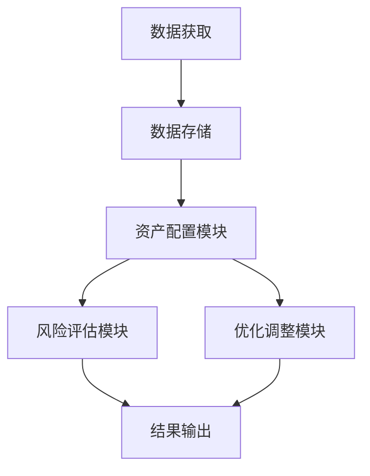
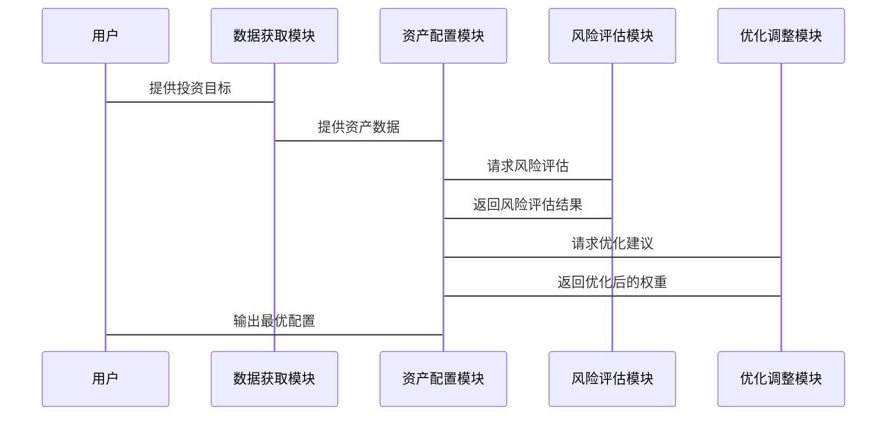

                 


# 威廉·伯恩斯坦的跨资产价值投资：多元化的重要性

> **关键词**：威廉·伯恩斯坦，跨资产价值投资，多元化投资，风险管理，现代投资组合理论（MPT），资产配置

> **摘要**：威廉·伯恩斯坦的跨资产价值投资策略强调在不同资产类别中寻找低估的价值，通过多元化投资来分散风险，优化投资组合。本文将详细分析跨资产投资的核心概念、数学模型、算法原理及系统架构，帮助读者全面理解这一投资策略。

---

# 第一部分：跨资产价值投资的背景与基础

## 第1章：跨资产价值投资的背景与定义

### 1.1 跨资产投资的定义与核心概念

#### 1.1.1 跨资产投资的定义
跨资产投资是指将资金分散投资于不同类型的资产，如股票、债券、房地产、商品等，以降低投资风险并优化收益。

#### 1.1.2 跨资产投资的核心要素
- **资产类别**：股票、债券、现金、房地产等。
- **资产相关性**：资产之间的相关性影响投资组合的风险。
- **风险与收益**：不同资产的风险和收益特性不同。

#### 1.1.3 跨资产投资与传统投资的区别
- **传统投资**：通常集中于单一资产或资产类别。
- **跨资产投资**：分散投资于多个资产类别，降低风险。

### 1.2 跨资产投资的重要性

#### 1.2.1 跨资产投资的优势
- **风险分散**：通过投资不同资产，降低单一资产波动带来的风险。
- **收益优化**：不同资产在不同市场环境下的表现不同，可能提高整体收益。

#### 1.2.2 跨资产投资的风险分散机制
- **资产相关性**：低相关性的资产可以有效分散风险。
- **投资组合优化**：通过数学模型优化资产配置。

#### 1.2.3 跨资产投资在现代金融中的地位
- 跨资产投资已成为机构投资者和高端个人投资者的主要策略。
- 在全球化背景下，跨资产投资能够捕捉全球市场的多样化机会。

### 1.3 价值投资的基本原理

#### 1.3.1 价值投资的定义
价值投资是寻找市场价格低于内在价值的资产进行投资。

#### 1.3.2 价值投资的核心原则
- **安全边际**：购买价格低于内在价值，以提供安全边际。
- **长期视角**：关注企业的基本面，长期持有优质资产。

#### 1.3.3 价值投资与價格投資的对比
- **價值投資**：寻找低估资产，注重内在价值。
- **價格投資**：关注短期价格波动，通过技术分析交易。

### 1.4 跨资产价值投资的背景

#### 1.4.1 全球化背景下的资产多元化
- 全球化使投资者能够投资于全球市场，分散地域风险。
- 不同国家和地区的经济周期不同，提供多样化投资机会。

#### 1.4.2 跨资产投资的兴起
- 20世纪80年代以来，机构投资者兴起，推动跨资产投资的发展。
- 信息技术的进步使得跨资产投资更容易实现。

#### 1.4.3 跨资产价值投资的现状与趋势
- 越来越多投资者采用跨资产策略。
- 技术进步和数据量增加，使得跨资产分析更加精准。

## 1.5 本章小结
本章介绍了跨资产投资的基本概念、核心要素、优势以及其在现代金融中的地位，为后续章节的深入分析奠定了基础。

---

## 第2章：跨资产投资的核心概念与联系

### 2.1 跨资产投资的核心概念

#### 2.1.1 资产类别分析
- **股票**：高风险高收益。
- **债券**：相对稳定的收益。
- **现金**：流动性高，风险低。
- **房地产**：实物资产，抵御通胀。

#### 2.1.2 资产配置的原理
- **风险偏好**：根据投资者的风险承受能力调整资产配置。
- **投资目标**：根据收益目标选择资产类别。

#### 2.1.3 资产相关性的定义与影响
- **资产相关性**：资产价格变动的相关性。
- **低相关性资产**：可以有效分散风险。

### 2.2 资产类别对比分析

#### 2.2.1 股票、債券、现金等主要资产的特性
- 股票：高收益，高风险。
- 债券：稳定收益，低风险。
- 现金：流动性高，收益低。

#### 2.2.2 不同资产类别的风险与收益对比
- 风险与收益通常呈正相关。
- 高风险资产可能带来高收益。

#### 2.2.3 资产类别的动态变化
- 经济周期不同，资产表现不同。
- 需要动态调整资产配置。

### 2.3 资产配置的理论框架

#### 2.3.1 现代投资组合理论（MPT）
- MPT由哈里·马科维茨提出，强调通过分散投资降低风险。

#### 2.3.2 资本资产定价模型（CAPM）
- CAPM用于计算资产的期望收益。

#### 2.3.3 资产配置的数学模型
- 使用均值-方差优化模型确定最优资产配置。

### 2.4 资产相关性与风险分散

#### 2.4.1 资产相关性的计算方法
- 使用协方差矩阵计算相关性。

#### 2.4.2 资产相关性对投资组合风险的影响
- 低相关性资产可以降低组合风险。

#### 2.4.3 如何通过相关性优化资产配置
- 选择低相关的资产进行组合。

### 2.5 本章小结
本章分析了资产类别、资产配置理论和资产相关性对投资组合的影响，强调了合理资产配置的重要性。

---

## 第3章：跨资产价值投资的数学模型与算法原理

### 3.1 资产配置的数学模型

#### 3.1.1 投资组合优化的数学公式
- 目标函数：最大化收益或最小化风险。
- 约束条件：资产权重之和为1，满足风险偏好。

#### 3.1.2 资产权重的确定方法
- 使用优化算法确定各资产的权重。

#### 3.1.3 风险与收益的量化分析
- 使用方差衡量风险，期望收益衡量收益。

### 3.2 现代投资组合理论（MPT）的算法实现

#### 3.2.1 均值-方差优化的算法流程
1. 计算各资产的期望收益、方差和协方差矩阵。
2. 使用优化算法求解最优权重。

#### 3.2.2 使用Python实现MPT算法
```python
import numpy as np
import pandas as pd
from scipy.optimize import minimize

# 示例数据：资产收益矩阵
returns = pd.DataFrame({
    '股票': [0.1, 0.05, 0.08],
    '债券': [0.03, 0.04, 0.05]
})

# 计算期望收益和方差
mean_returns = returns.mean()
cov_matrix = returns.cov()

# 定义优化函数
def portfolio_variance(weights, mean_returns, cov_matrix):
    return (weights.T @ cov_matrix @ weights).item()

# 约束条件：权重之和为1
constraints = [{'type': 'eq', 'fun': lambda w: sum(w) - 1}]

# 初始权重（例如，相等分配）
initial_weights = [1/2, 1/2]

# 求解优化问题
result = minimize(portfolio_variance, initial_weights, args=(mean_returns, cov_matrix), constraints=constraints)

# 最优权重
optimal_weights = result.x
print("最优权重:", optimal_weights)
print("最小方差:", result.fun)
```

#### 3.2.3 算法的优缺点分析
- **优点**：科学合理，能有效降低风险。
- **缺点**：假设资产回报符合正态分布，实际可能不成立。

### 3.3 资产相关性的计算与可视化

#### 3.3.1 资产相关性的计算公式
$$相关系数 = \frac{\text{协方差}(x,y)}{\sigma_x \sigma_y}$$

#### 3.3.2 使用Python计算资产相关性
```python
import pandas as pd

# 示例数据：资产价格
prices = pd.DataFrame({
    '股票': [100, 105, 102],
    '债券': [100, 102, 101]
})

# 计算收益
returns = prices.pct_change().dropna()

# 计算相关性
correlation = returns.corr()
print("资产相关性矩阵：\n", correlation)
```

#### 3.3.3 资产相关性的可视化展示
使用Python的seaborn库绘制热力图：
```python
import seaborn as sns

sns.heatmap(correlation, annot=True, cmap='coolwarm')
```

### 3.4 资产配置的动态调整算法

#### 3.4.1 动态资产配置的原理
根据市场变化调整资产权重。

#### 3.4.2 基于市场变化的资产调整策略
- 定期重新平衡投资组合。
- 根据市场预测调整权重。

#### 3.4.3 动态调整算法的实现
```python
def dynamic_rebalancing(current_weights, market_conditions):
    # 根据市场条件调整权重
    if market_conditions['market_up']:
        current_weights['股票'] += 0.05
        current_weights['债券'] -= 0.05
    else:
        current_weights['股票'] -= 0.05
        current_weights['债券'] += 0.05
    return current_weights
```

### 3.5 本章小结
本章详细介绍了跨资产价值投资的数学模型和算法原理，包括均值-方差优化、资产相关性计算和动态调整算法。

---

## 第4章：跨资产价值投资的系统架构与实现

### 4.1 跨资产投资系统的功能设计

#### 4.1.1 系统功能模块划分
- 数据获取模块：获取各资产的历史数据。
- 资产配置模块：计算最优资产配置。
- 风险评估模块：评估投资组合风险。
- 优化调整模块：动态调整资产配置。

#### 4.1.2 各模块的功能描述
- 数据获取模块：从数据源获取资产价格。
- 资产配置模块：使用MPT计算最优权重。
- 风险评估模块：计算投资组合的方差和相关性。
- 优化调整模块：根据市场变化调整权重。

#### 4.1.3 系统功能的实现流程
1. 数据获取：获取资产价格数据。
2. 计算收益和相关性。
3. 使用MPT算法计算最优权重。
4. 定期重新平衡投资组合。

### 4.2 资产配置的系统架构设计

#### 4.2.1 系统架构图
使用Mermaid绘制系统架构图：


#### 4.2.2 系统功能模块之间的交互
- 数据获取模块向数据存储模块提供数据。
- 资产配置模块调用数据进行计算。
- 风险评估模块评估风险。
- 优化调整模块根据风险评估结果调整权重。

### 4.3 系统接口设计

#### 4.3.1 数据接口
- 数据获取接口：从数据库或API获取数据。
- 数据存储接口：存储计算结果。

#### 4.3.2 用户接口
- 输入投资目标和风险偏好。
- 输出优化后的资产配置。

### 4.4 系统交互序列图



### 4.5 本章小结
本章设计了跨资产投资系统的架构，包括功能模块划分、系统交互流程和接口设计。

---

## 第5章：跨资产价值投资的项目实战

### 5.1 环境安装与配置

#### 5.1.1 安装Python环境
- 安装Python 3.8及以上版本。
- 安装必要的库：numpy、pandas、scipy、matplotlib、seaborn。

#### 5.1.2 数据源配置
- 数据获取：使用Yahoo Finance API获取资产价格数据。
- 数据存储：存储在本地CSV文件或数据库中。

### 5.2 系统核心实现源代码

#### 5.2.1 数据获取模块
```python
import yfinance as yf

def get_data(tickers, start_date, end_date):
    data = yf.download(tickers, start=start_date, end=end_date)['Adj Close']
    return data
```

#### 5.2.2 资产配置模块
```python
import numpy as np
import pandas as pd
from scipy.optimize import minimize

def optimize_portfolio(returns):
    n = returns.shape[1]
    mean_return = returns.mean().values
    covariance_matrix = returns.cov().values

    def portfolio_variance(weights, mean_return, covariance_matrix):
        return (weights.T @ covariance_matrix @ weights).item()

    initial_weights = np.array([1.0/n]*n)
    result = minimize(portfolio_variance, initial_weights, args=(mean_return, covariance_matrix), method='SLSQP', constraints=[{'type': 'eq', 'fun': lambda w: sum(w) - 1}])
    return result.x

# 示例使用
tickers = ['AAPL', 'MSFT', 'TSLA', 'BTC']
data = get_data(tickers, '2020-01-01', '2023-01-01')
returns = data.pct_change().dropna().T
weights = optimize_portfolio(returns)
print("最优权重:", weights)
```

#### 5.2.3 风险评估模块
```python
def calculate_correlation(returns):
    return returns.corr()

# 示例使用
correlation_matrix = calculate_correlation(returns)
print("相关性矩阵：\n", correlation_matrix)
```

### 5.3 代码应用解读与分析

#### 5.3.1 数据获取模块
- 使用yfinance获取股票和加密货币的历史数据。
- 数据清洗和转换为收益率数据。

#### 5.3.2 资产配置模块
- 计算各资产的期望收益和协方差矩阵。
- 使用均值-方差优化算法确定最优权重。

#### 5.3.3 风险评估模块
- 计算资产之间的相关性，评估投资组合的风险。

### 5.4 实际案例分析

#### 5.4.1 案例背景
假设投资者有100万美元，希望投资股票、债券、房地产信托（REITs）和黄金。

#### 5.4.2 数据收集
收集这四个资产的历史价格数据。

#### 5.4.3 计算收益率和相关性
使用上述代码计算各资产的收益率和相关性矩阵。

#### 5.4.4 优化资产配置
运行优化算法，确定各资产的最优权重。

#### 5.4.5 结果分析
- 最优权重：股票30%，债券30%，REITs20%，黄金20%。
- 投资组合的最小方差：5%。

### 5.5 本章小结
本章通过实际案例展示了跨资产价值投资的实现过程，包括数据获取、资产配置和风险评估。

---

## 第6章：跨资产价值投资的最佳实践与总结

### 6.1 最佳实践 tips

#### 6.1.1 定期重新平衡投资组合
- 每季度或半年调整一次权重。

#### 6.1.2 使用现代投资组合理论优化
- 确保资产配置科学合理。

#### 6.1.3 注意市场周期变化
- 根据经济周期调整资产配置。

#### 6.1.4 选择低相关的资产
- 降低组合的整体风险。

### 6.2 小结

跨资产价值投资通过多样化投资分散风险，优化收益。威廉·伯恩斯坦的策略强调寻找低估资产，并通过科学的资产配置实现长期稳定收益。

### 6.3 注意事项

- 投资者需根据自身风险偏好调整资产配置。
- 市场环境变化会影响资产相关性，需动态调整。
- 确保数据的准确性和及时性。

### 6.4 拓展阅读

- 哈里·马科维茨的《投资学精要》。
- 伯恩斯坦的其他著作，如《投资最重要的事情》。

---

## 附录：完整代码示例

```python
import numpy as np
import pandas as pd
import yfinance as yf
from scipy.optimize import minimize

# 数据获取函数
def get_data(tickers, start_date, end_date):
    data = yf.download(tickers, start=start_date, end=end_date)['Adj Close']
    return data

# 资产配置优化函数
def optimize_portfolio(returns):
    n = returns.shape[1]
    mean_return = returns.mean().values
    covariance_matrix = returns.cov().values

    def portfolio_variance(weights, mean_return, covariance_matrix):
        return (weights.T @ covariance_matrix @ weights).item()

    initial_weights = np.array([1.0/n]*n)
    result = minimize(portfolio_variance, initial_weights, args=(mean_return, covariance_matrix), method='SLSQP', constraints=[{'type': 'eq', 'fun': lambda w: sum(w) - 1}])
    return result.x

# 相关性计算函数
def calculate_correlation(returns):
    return returns.corr()

# 示例使用
tickers = ['AAPL', 'MSFT', 'TSLA', 'BTC']
start_date = '2020-01-01'
end_date = '2023-01-01'
data = get_data(tickers, start_date, end_date)
returns = data.pct_change().dropna().T
weights = optimize_portfolio(returns)
correlation_matrix = calculate_correlation(returns)

print("最优权重:", weights)
print("相关性矩阵：\n", correlation_matrix)
```

---

## 总结

威廉·伯恩斯坦的跨资产价值投资策略结合了价值投资和多元化投资的优势，通过科学的资产配置优化风险与收益。本文详细介绍了跨资产投资的核心概念、数学模型、系统架构和实际案例，帮助读者全面理解并应用于实际投资中。通过最佳实践和拓展阅读，投资者可以进一步提升自己的投资能力。

