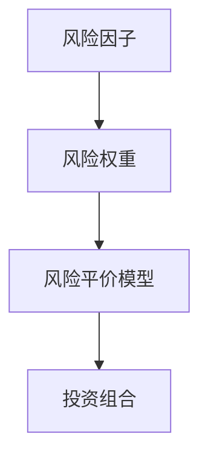
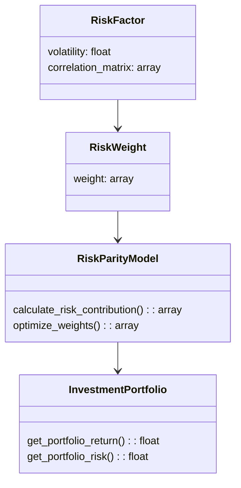

                 


# 威廉·伯恩斯坦的风险平价策略

> 关键词：风险平价策略、威廉·伯恩斯坦、投资组合优化、风险管理、资产配置、现代投资理论

> 摘要：本文深入探讨威廉·伯恩斯坦提出的风险平价策略，分析其在投资组合管理中的应用与优势。通过理论解析、算法实现、系统架构设计和项目实战，全面解析风险平价策略的数学模型、优化算法及其在实际投资中的应用。本文将帮助读者理解如何利用风险平价策略优化投资组合，降低风险，实现长期稳健收益。

---

## 第一部分: 风险平价策略的背景与核心概念

### 第1章: 风险平价策略的起源与定义

#### 1.1 风险平价策略的起源
风险平价策略（Risk Parity Strategy）是一种资产配置方法，旨在通过调整资产权重，使得投资组合中的每个资产对整体风险的贡献相等。这种策略由威廉·伯恩斯坦（William Bernstein）在20世纪90年代提出，是对传统资产配置方法的重要补充。

#### 1.1.1 风险平价策略的提出背景
在传统资产配置方法中，投资者通常根据历史收益率对资产进行权重分配，这种方法忽视了资产之间的风险差异。伯恩斯坦提出风险平价策略的核心思想是：每个资产对投资组合的总体风险贡献应相等，从而实现风险分散。

#### 1.1.2 伯恩斯坦对风险平价策略的贡献
伯恩斯坦通过研究表明，风险平价策略能够有效降低投资组合的尾部风险，特别是在市场波动加剧时，其表现优于传统方法。

#### 1.1.3 风险平价策略在现代投资中的地位
风险平价策略已成为现代投资组合管理的重要工具，尤其是在机构投资者中得到广泛应用。

#### 1.2 风险平价策略的定义与特点
风险平价策略通过优化资产权重，使得每个资产的风险贡献相等，从而分散投资风险。

#### 1.2.1 风险平价的定义
风险平价策略是指在投资组合中，每个资产的风险贡献相等，即每个资产的权重乘以其波动率的平方，再除以总风险。

#### 1.2.2 风险平价与传统投资策略的区别
| 对比维度 | 风险平价策略 | 传统投资策略 |
|----------|---------------|---------------|
| 目标     | 最小化风险贡献 | 最大化预期收益 |
| 权重分配 | 基于风险贡献  | 基于历史收益  |
| 风险控制 | 均衡风险贡献  | 依赖分散化     |

#### 1.2.3 风险平价策略的核心要素
- **风险因子**：波动率、相关性等。
- **风险权重**：每个资产的风险贡献权重。
- **投资组合优化**：调整权重以实现风险平价。

---

### 第2章: 风险平价策略的核心概念与联系

#### 2.1 风险平价的原理
风险平价策略的核心在于通过调整资产权重，使得每个资产的风险贡献相等。

#### 2.1.1 风险因子的分析
- **波动率**：资产价格的波动程度。
- **相关性**：资产价格之间的关联性。

#### 2.1.2 风险权重的分配
通过优化算法，调整每个资产的权重，使得其风险贡献相等。

#### 2.1.3 风险平价模型的构建
构建风险平价模型需要考虑资产的波动率和相关性矩阵。

#### 2.2 核心概念对比与ER图
- **ER实体关系图**：展示风险平价策略中的实体关系。


---

## 第二部分: 风险平价策略的算法原理

### 第3章: 风险平价优化模型

#### 3.1 风险平价算法概述
风险平价算法的目标是最小化风险贡献的不均衡。

#### 3.1.1 风险平价优化的目标
$$ \text{目标函数: } \min_{w} \sum_{i=1}^{n} w_i^2 \cdot \sigma_i^2 $$

#### 3.1.2 风险平价优化的约束条件
$$ \sum_{i=1}^{n} w_i = 1 $$

#### 3.1.3 风险平价优化的数学表达
通过求解上述优化问题，得到每个资产的权重。

#### 3.2 风险平价优化的实现步骤
- **数据准备与预处理**：收集历史数据，计算波动率和相关性矩阵。
- **风险因子的计算**：计算每个资产的波动率。
- **风险权重的优化**：使用优化算法求解权重。
- **投资组合的构建与调整**：根据优化后的权重构建投资组合。

#### 3.3 风险平价优化的数学模型
$$ \text{目标函数: } \min_{w} \sum_{i=1}^{n} w_i^2 \cdot \sigma_i^2 $$
$$ \text{约束条件: } \sum_{i=1}^{n} w_i = 1 $$

#### 3.4 风险平价优化的Python实现
```python
import numpy as np

def risk_parity_optimization(cov_matrix):
    n = cov_matrix.shape[0]
    # 初始化权重向量
    w = np.ones(n) / n
    # 迭代
    for _ in range(100):
        # 计算风险贡献
        risk_contribution = w * np.sqrt(np.dot(w.T, cov_matrix) @ w)
        # 标准化权重
        w = risk_contribution / np.sum(risk_contribution)
    return w
```

---

### 第4章: 风险平价策略的系统架构设计

#### 4.1 系统分析与架构设计方案
- **系统功能设计**：包括数据获取、风险计算、权重优化、投资组合构建等功能。
- **领域模型类图**：展示系统中的核心类及其关系。


- **系统架构图**：展示系统的分层架构。


---

## 第三部分: 风险平价策略的项目实战

### 第5章: 项目实战

#### 5.1 环境安装与数据准备
- **环境安装**：安装Python和必要的库（如NumPy、Pandas）。
- **数据准备**：收集股票价格数据，计算波动率和相关性矩阵。

#### 5.2 系统核心实现源代码
```python
import numpy as np

def calculate_risk_contribution(weights, covariance_matrix):
    return weights * np.sqrt(weights.T @ covariance_matrix @ weights)

def optimize_risk_parity(covariance_matrix):
    n = covariance_matrix.shape[0]
    w = np.ones(n) / n
    for _ in range(100):
        risk_contribution = calculate_risk_contribution(w, covariance_matrix)
        w = risk_contribution / risk_contribution.sum()
    return w

# 示例数据
assets = 4
cov_matrix = np.array([
    [1, 0.5, 0.3, 0.2],
    [0.5, 1, 0.4, 0.3],
    [0.3, 0.4, 1, 0.5],
    [0.2, 0.3, 0.5, 1]
])

weights = optimize_risk_parity(cov_matrix)
print("Optimized Weights:", weights)
```

#### 5.3 代码应用解读与分析
- **数据获取**：从数据源获取历史价格数据。
- **计算波动率和相关性矩阵**：使用Python库计算。
- **优化权重**：通过迭代优化权重，使得风险贡献相等。
- **构建投资组合**：根据优化后的权重进行投资。

#### 5.4 实际案例分析
以4只资产为例，计算优化后的权重，构建投资组合，并分析其风险和收益。

#### 5.5 项目小结
通过实际案例，验证风险平价策略的有效性，并总结优化过程中的关键点。

---

## 第四部分: 风险平价策略的最佳实践

### 第6章: 最佳实践 tips

#### 6.1 小结
风险平价策略是一种有效的资产配置方法，能够优化投资组合的风险收益比。

#### 6.2 注意事项
- **数据质量**：确保数据的准确性和完整性。
- **模型假设**：考虑模型假设的合理性和适用性。
- **市场变化**：定期调整投资组合以应对市场变化。

#### 6.3 拓展阅读
推荐相关书籍和论文，深入理解风险平价策略的应用与优化。

---

## 总结
本文详细解析了威廉·伯恩斯坦的风险平价策略，从理论到实践，全面探讨了其在投资组合管理中的应用。通过数学模型、算法实现和系统架构设计，帮助读者理解并掌握这一策略的核心思想。希望本文能为投资者和研究人员提供有价值的参考。

