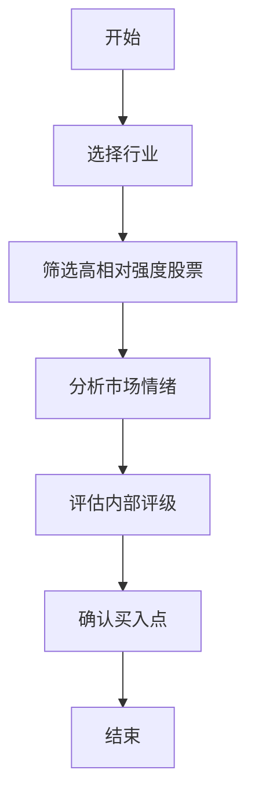

                 


# 《威廉·欧奈尔的CANSLIM投资系统》

## 关键词：威廉·欧奈尔, CANSLIM, 投资系统, 股票选择, 技术分析, 资金管理

## 摘要：威廉·欧奈尔的CANSLIM投资系统是一种基于技术分析和资金管理的股票投资方法，通过分析股票的相对强度、行业地位、市场情绪等多方面因素，帮助投资者做出更明智的投资决策。本文将从系统的核心概念、算法原理、系统架构设计到实际项目实现，全面解析CANSLIM投资系统。

---

## 第1章: CANSLIM投资系统的背景与概述

### 1.1 投资学的基本概念与问题背景
- 1.1.1 投资学的基本概念：资产配置、风险与收益、投资策略
- 1.1.2 传统投资方法的局限性：基本面分析的不足，技术分析的不确定性
- 1.1.3 CANSLIM投资系统的提出与目标：解决传统方法的缺陷，提供科学的投资决策依据

### 1.2 CANSLIM投资系统的定义与核心要素
- 1.2.1 CANSLIM的定义：一种基于技术分析和资金管理的投资系统
- 1.2.2 CANSLIM与传统投资方法的对比：数据驱动 vs 经验驱动，多因素分析 vs 单因素分析
- 1.2.3 CANSLIM投资系统的边界与外延：适用于股票市场，不适用于其他金融市场

---

## 第2章: CANSLIM投资系统的核心概念与联系

### 2.1 CANSLIM系统的核心要素分析
- 2.1.1 C: 资金管理：如何分配资金以最大化收益并最小化风险
- 2.1.2 A: 行业分析：选择具有增长潜力的行业
- 2.1.3 N: 新闻与市场情绪：利用新闻事件和市场情绪影响投资决策
- 2.1.4 S: 相对强度：比较股票与市场指数的表现
- 2.1.5 L: 股价与成交量的关系：分析成交量变化预测股价走势
- 2.1.6 I: 股票内部评级：评估股票的内在价值和成长性
- 2.1.7 M: 市场周期：识别市场的牛市和熊市周期

### 2.2 CANSLIM系统核心要素的对比分析
- 2.2.1 核心要素属性对比表格：列出每个要素的定义、作用和计算方法
- 2.2.2 CANSLIM系统核心要素的ER实体关系图：展示各要素之间的关系

---

## 第3章: CANSLIM投资系统的算法原理

### 3.1 CANSLIM投资系统的筛选标准
- 3.1.1 相对强度指数（RSI）的计算：RSI = (N天上涨天数 / N天总天数) * 100
- 3.1.2 股价与成交量的关系分析：通过成交量确认股价趋势的强度
- 3.1.3 股票内部评级的算法流程：基于财务指标和市场表现进行综合评级

### 3.2 CANSLIM投资系统筛选流程的Mermaid流程图


---

## 第4章: CANSLIM投资系统的系统分析与架构设计

### 4.1 系统功能设计
- 4.1.1 数据采集模块：从数据源获取股票数据
- 4.1.2 筛选模块：基于CANSLIM标准筛选股票
- 4.1.3 分析模块：分析市场情绪和内部评级

### 4.2 系统架构设计
- 4.2.1 系统架构图：展示各模块之间的关系
- 4.2.2 类图：展示领域模型和接口设计
- 4.2.3 接口设计：定义模块之间的接口和交互流程

---

## 第5章: CANSLIM投资系统的项目实战

### 5.1 环境安装
- 安装Python和相关库（如Pandas、Matplotlib、Scrapy）

### 5.2 核心代码实现
```python
def calculate_rsi(data, n=14):
    # 计算相对强度指数(RSI)
    close = data['Close']
    delta = close.diff()
    up = delta.where(delta > 0, 0)
    down = delta.where(delta < 0, 0)
    avg_up = up.rolling(n).mean()
    avg_down = down.rolling(n).mean()
    rsi = 100 - (100 - (avg_up / avg_down))
    return rsi
```

### 5.3 实际案例分析
- 分析某行业股票的相对强度和市场情绪，得出买入点

---

## 第6章: 总结与展望

### 6.1 最佳实践Tips
- 定期调整投资组合
- 结合市场周期进行投资决策

### 6.2 小结
- CANSLIM系统的优缺点
- 未来的研究方向

### 6.3 注意事项
- 风险提示：投资需谨慎，系统仅供参考

### 6.4 拓展阅读
- 推荐相关书籍和资源

---

通过以上目录结构，您可以逐步展开每个章节的内容，深入探讨CANSLIM投资系统的各个方面，帮助读者全面理解和应用这一投资方法。

