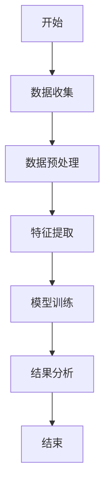
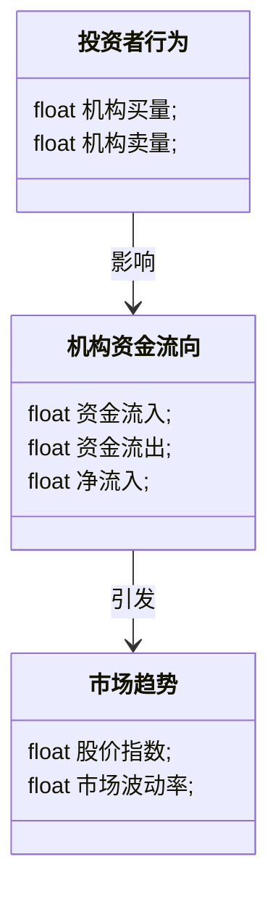

                 


# 威廉·欧奈尔的机构资金流向分析

> 关键词：威廉·欧奈尔, 机构资金流向, 技术分析, 市场情绪, 机构投资者

> 摘要：本文详细探讨了威廉·欧奈尔的机构资金流向分析方法，从理论基础到实际应用，结合技术分析和市场情绪，深入剖析机构资金流向的内在逻辑和数学模型，提供完整的系统架构和实战案例。

---

## 第1章: 机构资金流向分析的定义与重要性

### 1.1 机构资金流向分析的定义

机构资金流向分析是一种通过研究机构投资者的资金流动情况，预测市场趋势和价格波动的技术分析方法。其核心在于识别机构投资者的买卖行为，进而推测市场的未来走势。

#### 1.1.1 机构资金流向的定义

机构资金流向指的是机构投资者在金融市场中的资金流动方向和规模。这些机构包括共同基金、对冲基金、保险公司等大型投资者，他们的资金流动对市场有显著影响。

#### 1.1.2 机构资金流向分析的目的

通过分析机构资金流向，投资者可以预测市场趋势，发现潜在的投资机会，优化投资决策。机构资金流向通常被视为市场的风向标。

#### 1.1.3 机构资金流向分析的市场意义

机构资金流向分析有助于识别市场的强弱趋势，评估市场的整体情绪，为投资者提供决策支持。

---

### 1.2 机构资金流向分析的核心概念

#### 1.2.1 机构投资者的行为特征

机构投资者通常具有较大的资金规模和专业的投资团队，他们的行为往往具有一定的规律性。例如，机构投资者倾向于在市场底部买入，在市场顶部卖出。

#### 1.2.2 机构资金流向与市场情绪的关系

市场情绪是影响机构资金流向的重要因素。当市场情绪乐观时，机构投资者倾向于增加资金投入；当市场情绪悲观时，他们可能会减少投资或撤资。

#### 1.2.3 机构资金流向的边界与外延

机构资金流向分析的边界包括时间范围、资金规模和市场类型。其外延涉及技术分析、市场预测和投资策略。

---

## 第2章: 机构资金流向分析的背景与现状

### 2.1 机构投资者在金融市场中的地位

#### 2.1.1 机构投资者的类型与规模

机构投资者主要包括共同基金、对冲基金、保险公司、养老基金等。他们的资金规模庞大，对市场具有重要影响。

#### 2.1.2 机构投资者对市场的影响

机构投资者的行为直接影响市场的供需关系，进而影响资产价格。他们的资金流向通常被视为市场趋势的晴雨表。

#### 2.1.3 机构资金流向分析的现状

随着金融市场的不断发展，机构资金流向分析逐渐成为投资者的重要工具。技术的进步使得分析更加精准和高效。

---

### 2.2 机构资金流向分析的理论基础

#### 2.2.1 技术分析与资金流向的关系

技术分析通过研究价格和成交量的变化，预测未来的价格走势。机构资金流向分析是技术分析的重要组成部分。

#### 2.2.2 市场情绪与资金流动的相互作用

市场情绪影响机构投资者的决策，进而影响资金流向。机构资金流向反过来又会强化或改变市场情绪。

#### 2.2.3 机构资金流向分析的数学模型

机构资金流向分析可以通过数学模型量化机构投资者的行为。例如，使用移动平均线和相对强度指数等指标。

---

## 第3章: 机构资金流向分析的核心概念与联系

### 3.1 核心概念原理

#### 3.1.1 机构资金流向的核心要素

机构资金流向的核心要素包括资金流入、资金流出、净流入和资金流动速度。这些要素共同构成了机构资金流向的全貌。

#### 3.1.2 机构资金流向的数学模型

机构资金流向的数学模型可以通过时间序列分析构建。例如，使用ARIMA模型预测未来的资金流向。

#### 3.1.3 机构资金流向的实体关系图

机构资金流向涉及多个实体，包括机构投资者、市场、资产等。通过ER图可以清晰地展示这些实体之间的关系。

```mermaid
er
  actor 机构投资者
  actor 市场监管机构
  entity 机构资金流向
  entity 市场情绪
  entity 市场趋势
  entity 市场波动
  relation 机构投资者 -> 机构资金流向: 投资行为
  relation 市场情绪 -> 市场趋势: 影响
  relation 市场趋势 -> 市场波动: 引发
```

---

## 第4章: 机构资金流向分析的算法与数学模型

### 4.1 算法原理概述

机构资金流向分析的算法通常包括数据收集、数据预处理、特征提取、模型训练和结果分析五个步骤。

### 4.2 算法流程图



### 4.3 算法实现代码

以下是一个简单的机构资金流向分析算法的Python实现：

```python
import pandas as pd
import numpy as np

def calculate_institutional_flow(data):
    # 计算机构资金流入
    inflow = data['institutional_buy'] - data['institutional_sell']
    # 计算净流入
    net_flow = inflow.rolling(20).mean()
    return net_flow

# 示例数据
data = pd.DataFrame({
    'institutional_buy': [100, 200, 300, 400],
    'institutional_sell': [50, 100, 150, 200]
})

result = calculate_institutional_flow(data)
print(result)
```

---

## 第5章: 系统分析与架构设计方案

### 5.1 问题场景介绍

本文设计了一个基于威廉·欧奈尔机构资金流向分析的系统，旨在帮助投资者实时监控机构资金流向，预测市场趋势。

### 5.2 系统功能设计

#### 5.2.1 领域模型



#### 5.2.2 系统架构设计


#### 5.2.3 系统接口设计

系统接口包括数据采集接口、分析接口和用户接口。

---

## 第6章: 项目实战

### 6.1 环境安装

需要安装Python、Pandas、NumPy等库。

### 6.2 核心实现代码

```python
import pandas as pd
import numpy as np

def analyze_institutional_flow(data):
    # 计算相对强度
    relative_strength = data['price'].rolling(50).mean()
    # 计算资金流向
    flow = data['volume'] * (data['price'] - relative_strength)
    return flow

# 示例数据
data = pd.DataFrame({
    'price': [100, 105, 110, 115],
    'volume': [1000, 1500, 2000, 2500]
})

result = analyze_institutional_flow(data)
print(result)
```

### 6.3 实际案例分析

以某股票为例，分析其机构资金流向，预测未来走势。

---

## 第7章: 最佳实践与小结

### 7.1 小结

本文详细探讨了威廉·欧奈尔的机构资金流向分析方法，从理论到实践，提供了完整的解决方案。

### 7.2 注意事项

在实际应用中，需要注意数据的准确性和模型的适用性，避免过度依赖单一指标。

### 7.3 拓展阅读

推荐进一步阅读威廉·欧奈尔的相关著作，深入了解其投资理论。

---

通过以上内容，我们全面介绍了威廉·欧奈尔的机构资金流向分析方法，从理论到实践，为投资者提供了有力的工具和方法。希望本文能为读者在金融市场分析中提供新的视角和思路。

