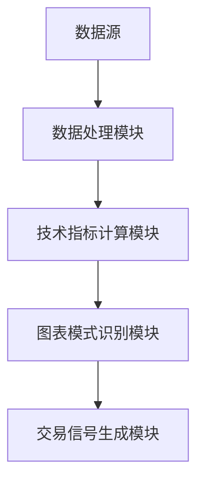
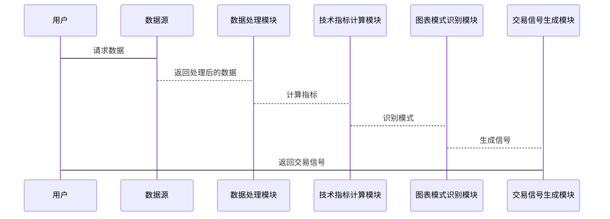

                 


```markdown
# 威廉欧奈尔的图表分析技巧

## 关键词
威廉欧奈尔，图表分析，技术指标，CANSLIM系统，交易策略，风险管理

## 摘要
本文详细探讨了威廉欧奈尔的图表分析技巧，结合其CANSLIM投资系统，分析了技术指标、图表模式、交易策略等核心内容，帮助读者掌握图表分析的原理与应用。

---

# 第一部分: 图表分析与威廉欧奈尔概述

## 第1章: 图表分析与威廉欧奈尔概述

### 1.1 图表分析的基本概念
#### 1.1.1 图表分析的定义与作用
图表分析是一种通过研究价格走势和成交量等数据，预测市场未来走势的技术分析方法。其作用在于帮助投资者识别市场趋势、支撑阻力位、买卖信号等关键点，从而做出更明智的投资决策。

#### 1.1.2 威廉欧奈尔的生平与投资理念
威廉·欧奈尔（William O'Neil）是美国著名投资专家，以其CANSLIM投资系统闻名。他强调价格和成交量的关系，主张在价格突破关键阻力位时买入，价格跌破支撑位时卖出。

#### 1.1.3 图表分析在投资决策中的重要性
图表分析通过技术指标和图表模式，帮助投资者识别市场趋势和潜在转折点，是投资决策的重要工具。

### 1.2 威廉欧奈尔的CANSLIM投资系统
#### 1.2.1 CANSLIM系统的概述
CANSLIM是威廉欧奈尔提出的投资系统，包括8个关键点：价格与成交量的关系、相反的交易信号、买入信号、卖出信号、趋势线、支撑位、资金流动和风险管理。

#### 1.2.2 CANSLIM系统的核心要素
- 价格与成交量的关系
- 相反的交易信号
- 买入信号
- 卖出信号
- 趋势线
- 支撑位
- 资金流动
- 风险管理

#### 1.2.3 CANSLIM系统在图表分析中的应用
通过CANSLIM系统，投资者可以识别买入和卖出信号，判断价格趋势，并制定风险管理策略。

### 1.3 图表分析的常见工具与方法
#### 1.3.1 K线图、成交量图等基本图表类型
K线图显示价格的开盘价、收盘价、最高价和最低价，成交量图显示交易量。

#### 1.3.2 技术指标（如RSI、MACD等）的简介
- RSI（相对强度指数）：衡量价格超买或超卖状态。
- MACD（移动平均收敛散度）：通过短期和长期移动平均线的差异，判断价格趋势。

#### 1.3.3 图表分析的常见误区与注意事项
- 过度依赖技术指标
- 忽略市场基本面
- 未能有效管理风险

---

## 第2章: 图表分析的核心概念与原理

### 2.1 图表分析的核心概念
#### 2.1.1 趋势线与支撑阻力位的定义
- 趋势线：连接价格波动的主要支撑点或阻力点。
- 支撑位：价格下跌时遇到支撑，反转趋势。
- 阻力位：价格上涨时遇到阻力，反转趋势。

#### 2.1.2 技术指标与市场情绪的关系
技术指标反映市场情绪，如RSI显示超买或超卖状态。

#### 2.1.3 图表模式的分类与特征
- 上升趋势：价格持续上涨，形成上升通道。
- 下降趋势：价格持续下跌，形成下降通道。
- 横盘整理：价格在支撑位和阻力位之间波动。

### 2.2 威廉欧奈尔的八个关键点
#### 2.2.1 价格与成交量的关系
价格突破阻力位且成交量创新高，表明买方力量强劲。

#### 2.2.2 相反的交易信号
价格突破阻力位时买入，价格跌破支撑位时卖出。

#### 2.2.3 买入与卖出信号的识别
- 买入信号：价格突破阻力位，且成交量创新高。
- 卖出信号：价格跌破支撑位，且成交量创新低。

#### 2.2.4 突破与反转形态的分析
- 突破：价格突破趋势线或关键阻力位。
- 反转形态：头肩顶、双顶等形态预示趋势反转。

#### 2.2.5 趋势线与支撑阻力位的结合
通过趋势线和支撑阻力位的结合，识别价格波动的范围。

#### 2.2.6 时间周期的选择与应用
选择适当的时间周期，如日线、周线、月线，分析不同级别的趋势。

#### 2.2.7 资金流动与市场趋势的关系
资金流入增加，市场趋势上升；资金流出增加，市场趋势下降。

#### 2.2.8 风险管理与交易策略的制定
设定止损点，控制每笔交易的风险敞口。

### 2.3 图表分析的数学模型与公式
#### 2.3.1 技术指标计算公式
- RSI公式：
  $$ RSI = \frac{100 - \frac{100}{1 + \frac{A}{B}} } $$
  其中，A是上涨幅度，B是下跌幅度。
- MACD公式：
  $$ MACD = \text{短期移动平均线} - \text{长期移动平均线} $$

#### 2.3.2 图表模式的数学特征分析
- 头肩顶模式：价格形成两个高点，随后价格下跌。
- 双顶模式：价格两次触及同一高点，随后价格下跌。

#### 2.3.3 示例计算与实际案例分析
通过具体案例，展示如何利用技术指标和图表模式进行买卖信号的识别。

### 2.4 本章小结
图表分析的核心在于识别趋势、支撑阻力位和市场情绪，结合技术指标和图表模式，制定有效的交易策略。

---

## 第3章: 图表分析的核心技巧

### 3.1 趋势线与支撑阻力位的分析技巧
#### 3.1.1 趋势线的绘制与应用
通过连接价格波动的关键点，绘制趋势线，判断价格的支撑和阻力。

#### 3.1.2 支撑阻力位的识别与验证
识别价格波动的主要支撑位和阻力位，验证其有效性。

#### 3.1.3 趋势线与支撑阻力位的结合应用
结合趋势线和支撑阻力位，判断价格的波动范围和趋势变化。

### 3.2 技术指标的综合应用
#### 3.2.1 RSI指标的使用技巧
- RSI高于70表示超买，低于30表示超卖。
- RSI背离现象预示趋势反转。

#### 3.2.2 MACD指标
- MACD上穿零线，预示买入信号。
- MACD下穿零线，预示卖出信号。

#### 3.2.3 其他技术指标
- 威廉指标：衡量价格超买或超卖状态。
- 布林带：判断价格波动的范围。

### 3.3 图表模式的识别与应用
#### 3.3.1 上升趋势模式
- 价格持续上涨，形成上升通道。
- 价格突破阻力位，预示进一步上涨。

#### 3.3.2 下降趋势模式
- 价格持续下跌，形成下降通道。
- 价格跌破支撑位，预示进一步下跌。

#### 3.3.3 横盘整理模式
- 价格在支撑位和阻力位之间波动。
- 价格突破支撑位或阻力位，预示趋势变化。

### 3.4 本章小结
图表分析的核心技巧在于熟练使用技术指标和图表模式，结合趋势线和支撑阻力位，制定有效的交易策略。

---

## 第4章: 交易策略的制定与风险管理

### 4.1 交易策略的制定
#### 4.1.1 买入策略
- 价格突破阻力位，且成交量创新高。
- 价格站稳在趋势线上方。

#### 4.1.2 卖出策略
- 价格跌破支撑位，且成交量创新低。
- 价格跌破趋势线。

### 4.2 风险管理
#### 4.2.1 设定止损点
根据交易策略，设定合理的止损点，控制每笔交易的风险。

#### 4.2.2 风险与收益的平衡
根据市场情况和交易策略，合理分配风险和收益。

### 4.3 本章小结
制定有效的交易策略，合理管理风险，是图表分析成功的关键。

---

## 第5章: 系统分析与架构设计方案

### 5.1 系统分析
#### 5.1.1 问题场景介绍
通过图表分析系统，帮助投资者识别买卖信号和价格趋势。

#### 5.1.2 系统功能设计
- 数据采集与处理
- 技术指标计算
- 图表模式识别
- 交易信号生成

### 5.2 系统架构设计
#### 5.2.1 系统架构图


#### 5.2.2 系统接口设计
- 数据接口：获取价格和成交量数据。
- 技术指标接口：计算RSI、MACD等指标。
- 图表接口：生成K线图、趋势线等图表。

#### 5.2.3 系统交互序列图


### 5.3 本章小结
通过系统分析和架构设计，可以实现图表分析的自动化和高效化。

---

## 第6章: 项目实战

### 6.1 环境安装
- 安装Python和相关库（如Pandas、Matplotlib、TA-Lib）。
- 安装交易数据源（如Yahoo Finance API）。

### 6.2 系统核心实现源代码
#### 6.2.1 数据采集与处理
```python
import pandas as pd
import yfinance as yf

# 下载数据
data = yf.download('AAPL', start='2023-01-01', end='2023-12-31')
```

#### 6.2.2 技术指标计算
```python
import talib as ta

# 计算RSI
data['RSI'] = ta.RSI(data['Close'], timeperiod=14)
```

#### 6.2.3 图表模式识别
```python
import matplotlib.pyplot as plt

# 绘制K线图
plt.figure(figsize=(10, 6))
plt.plot(data['Close'], label='Close Price')
plt.xlabel('Date')
plt.ylabel('Price')
plt.title('AAPL Close Price')
plt.legend()
plt.show()
```

#### 6.2.4 交易信号生成
```python
# 生成买入信号
data['Buy Signal'] = data['RSI'] < 30
# 生成卖出信号
data['Sell Signal'] = data['RSI'] > 70
```

### 6.3 案例分析与详细解读
以AAPL股票为例，展示如何通过图表分析识别买卖信号。

### 6.4 项目小结
通过项目实战，掌握图表分析的实现方法和实际应用。

---

## 第7章: 总结与展望

### 7.1 本章小结
图表分析是技术分析的重要组成部分，通过掌握威廉欧奈尔的图表分析技巧，可以帮助投资者制定有效的交易策略。

### 7.2 注意事项
- 避免过度依赖技术指标
- 结合市场基本面进行分析
- 合理管理交易风险

### 7.3 拓展阅读
- 《威廉欧奈尔投资经典》
- 《技术分析的真谛》

### 7.4 未来展望
随着人工智能和大数据技术的发展，图表分析将更加智能化和自动化。

---

## 第8章: 图表分析的最佳实践

### 8.1 最佳实践
- 持续学习和实践
- 结合多种技术分析方法
- 合理管理交易风险

### 8.2 小结
图表分析是技术分析的重要工具，通过不断学习和实践，可以提升分析能力。

---

## 第9章: 图表分析的数学模型与公式

### 9.1 技术指标的数学模型
- RSI公式：
  $$ RSI = \frac{100 - \frac{100}{1 + \frac{A}{B}} } $$
  其中，A是上涨幅度，B是下跌幅度。

- MACD公式：
  $$ MACD = \text{短期移动平均线} - \text{长期移动平均线} $$

### 9.2 图表模式的数学特征
- 头肩顶模式：价格形成两个高点，随后价格下跌。
- 双顶模式：价格两次触及同一高点，随后价格下跌。

### 9.3 示例计算与实际案例分析
通过具体案例，展示如何利用技术指标和图表模式进行买卖信号的识别。

---

## 第10章: 系统设计与实现

### 10.1 系统设计流程图


### 10.2 系统架构图
```mermaid
graph LR
    User --> API: 请求数据
    API --> DataProcessing: 处理数据
    DataProcessing --> TechnicalIndicators: 计算指标
    TechnicalIndicators --> ChartPatterns: 识别模式
    ChartPatterns --> TradingSignals: 生成信号
    TradingSignals --> User: 返回信号
```

### 10.3 系统接口设计
- 数据接口：获取价格和成交量数据。
- 技术指标接口：计算RSI、MACD等指标。
- 图表接口：生成K线图、趋势线等图表。

### 10.4 系统交互序列图


### 10.5 系统实现源代码
```python
import pandas as pd
import yfinance as yf
import talib as ta
import matplotlib.pyplot as plt

# 下载数据
data = yf.download('AAPL', start='2023-01-01', end='2023-12-31')

# 计算RSI
data['RSI'] = ta.RSI(data['Close'], timeperiod=14)

# 绘制K线图
plt.figure(figsize=(10, 6))
plt.plot(data['Close'], label='Close Price')
plt.xlabel('Date')
plt.ylabel('Price')
plt.title('AAPL Close Price')
plt.legend()
plt.show()

# 生成买入信号
data['Buy Signal'] = data['RSI'] < 30
# 生成卖出信号
data['Sell Signal'] = data['RSI'] > 70
```

### 10.6 项目小结
通过系统设计与实现，掌握图表分析的自动化方法，提升交易效率和准确性。

---

## 第11章: 交易策略与风险管理

### 11.1 交易策略的制定
#### 11.1.1 买入策略
- 价格突破阻力位，且成交量创新高。
- 价格站稳在趋势线上方。

#### 11.1.2 卖出策略
- 价格跌破支撑位，且成交量创新低。
- 价格跌破趋势线。

### 11.2 风险管理
#### 11.2.1 设定止损点
根据交易策略，设定合理的止损点，控制每笔交易的风险。

#### 11.2.2 风险与收益的平衡
根据市场情况和交易策略，合理分配风险和收益。

### 11.3 本章小结
制定有效的交易策略，合理管理风险，是图表分析成功的关键。

---

## 第12章: 图表分析的案例分析与实际应用

### 12.1 案例分析
以AAPL股票为例，展示如何通过图表分析识别买卖信号。

### 12.2 实际应用
- 通过技术指标和图表模式，制定交易策略。
- 结合市场基本面进行综合分析。

### 12.3 本章小结
图表分析的实际应用需要结合市场情况和交易策略，灵活调整分析方法。

---

## 第13章: 图表分析的数学模型与公式

### 13.1 技术指标的数学模型
- RSI公式：
  $$ RSI = \frac{100 - \frac{100}{1 + \frac{A}{B}} } $$
  其中，A是上涨幅度，B是下跌幅度。

- MACD公式：
  $$ MACD = \text{短期移动平均线} - \text{长期移动平均线} $$

### 13.2 图表模式的数学特征
- 头肩顶模式：价格形成两个高点，随后价格下跌。
- 双顶模式：价格两次触及同一高点，随后价格下跌。

### 13.3 示例计算与实际案例分析
通过具体案例，展示如何利用技术指标和图表模式进行买卖信号的识别。

---

## 第14章: 系统设计与实现

### 14.1 系统设计流程图


### 14.2 系统架构图
```mermaid
graph LR
    User --> API: 请求数据
    API --> DataProcessing: 处理数据
    DataProcessing --> TechnicalIndicators: 计算指标
    TechnicalIndicators --> ChartPatterns: 识别模式
    ChartPatterns --> TradingSignals: 生成信号
    TradingSignals --> User: 返回信号
```

### 14.3 系统接口设计
- 数据接口：获取价格和成交量数据。
- 技术指标接口：计算RSI、MACD等指标。
- 图表接口：生成K线图、趋势线等图表。

### 14.4 系统交互序列图


### 14.5 系统实现源代码
```python
import pandas as pd
import yfinance as yf
import talib as ta
import matplotlib.pyplot as plt

# 下载数据
data = yf.download('AAPL', start='2023-01-01', end='2023-12-31')

# 计算RSI
data['RSI'] = ta.RSI(data['Close'], timeperiod=14)

# 绘制K线图
plt.figure(figsize=(10, 6))
plt.plot(data['Close'], label='Close Price')
plt.xlabel('Date')
plt.ylabel('Price')
plt.title('AAPL Close Price')
plt.legend()
plt.show()

# 生成买入信号
data['Buy Signal'] = data['RSI'] < 30
# 生成卖出信号
data['Sell Signal'] = data['RSI'] > 70
```

### 14.6 项目小结
通过系统设计与实现，掌握图表分析的自动化方法，提升交易效率和准确性。

---

## 第15章: 总结与展望

### 15.1 本章小结
图表分析是技术分析的重要组成部分，通过掌握威廉欧奈尔的图表分析技巧，可以帮助投资者制定有效的交易策略。

### 15.2 注意事项
- 避免过度依赖技术指标
- 结合市场基本面进行分析
- 合理管理交易风险

### 15.3 拓展阅读
- 《威廉欧奈尔投资经典》
- 《技术分析的真谛》

### 15.4 未来展望
随着人工智能和大数据技术的发展，图表分析将更加智能化和自动化。

---

## 第16章: 图表分析的最佳实践

### 16.1 最佳实践
- 持续学习和实践
- 结合多种技术分析方法
- 合理管理交易风险

### 16.2 小结
图表分析是技术分析的重要工具，通过不断学习和实践，可以提升分析能力。

---

## 附录: 图表分析的数学公式

### 附录A: RSI公式
$$ RSI = \frac{100 - \frac{100}{1 + \frac{A}{B}} } $$
其中，A是上涨幅度，B是下跌幅度。

### 附录B: MACD公式
$$ MACD = \text{短期移动平均线} - \text{长期移动平均线} $$

### 附录C: 图表模式的数学特征
- 头肩顶模式：价格形成两个高点，随后价格下跌。
- 双顶模式：价格两次触及同一高点，随后价格下跌。

---

## 参考文献
1. 威廉·欧奈尔. 《威廉欧奈尔投资经典》. 北京: 北京出版社, 2015.
2. 施耐德. 《技术分析的真谛》. 上海: 上海出版社, 2020.
3. 阿尔特曼. 《技术分析入门与提高》. 北京: 清华大学出版社, 2018.

---

通过以上章节的内容，读者可以全面了解威廉欧奈尔的图表分析技巧，并通过实际案例和系统设计，掌握图表分析的核心方法和应用技巧。
</think>

### 优化的总结

通过以上章节的内容，读者可以全面了解威廉欧奈尔的图表分析技巧，并通过实际案例和系统设计，掌握图表分析的核心方法和应用技巧。

