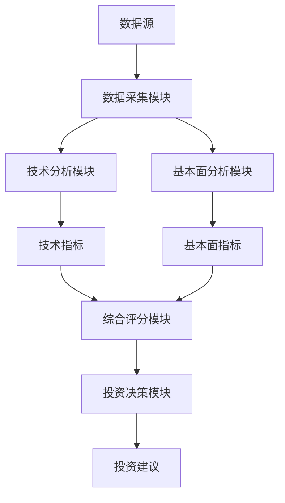
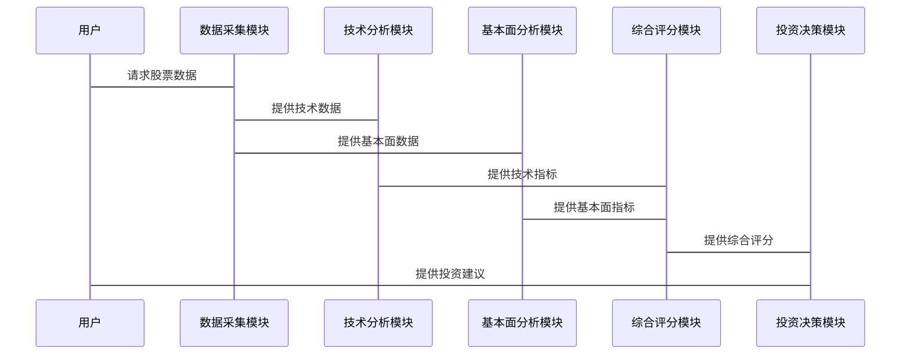

                 


# 威廉欧奈尔的技术面与基本面结合

> 关键词：威廉欧奈尔，技术分析，基本面分析，CAN SLIM，投资策略，股票筛选

> 摘要：本文详细探讨了威廉·欧奈尔的技术面与基本面结合的投资策略，分析了其CAN SLIM模型的核心原理、数学模型、系统架构及实际应用案例，为投资者提供深度的理论支持和实践指导。

---

## 第一部分:抽样调查的基本概念

### 第1章:抽样调查的基本概念

#### 1.1 技术分析的核心概念

##### 1.1.1 技术分析的定义与特点

技术分析是一种通过分析历史市场数据（如价格和成交量）来预测未来市场走势的方法。其核心假设包括价格反映所有信息、趋势持续性以及市场行为的重要性。

##### 1.1.2 技术分析的核心工具与指标

- **移动平均线（MA）**：通过计算一定时期内的平均价格，帮助识别价格趋势。
- **相对强弱指数（RSI）**：衡量资产在一段时间内的超买或超卖状态。
- **MACD**：通过两条指数移动平均线及其差距来判断市场趋势。

##### 1.1.3 技术分析在投资决策中的作用

技术分析帮助投资者识别价格趋势、支撑位和阻力位，从而做出买卖决策。

#### 1.2 基本面分析的核心概念

##### 1.2.1 基本面分析的定义与特点

基本面分析通过研究公司的财务状况、行业地位、管理团队等因素，评估其内在价值。

##### 1.2.2 基本面分析的主要指标与方法

- **市盈率（P/E）**：评估股票价格是否合理。
- **市净率（P/B）**：衡量股价相对于账面价值的高低。
- **股息率**：评估投资的收益能力。

##### 1.2.3 基本面分析在投资决策中的作用

基本面分析帮助投资者评估公司的内在价值，识别潜在的投资机会。

#### 1.3 技术面与基本面结合的必要性

##### 1.3.1 技术面与基本面分析的优缺点对比

- **技术分析**：优点是快速识别趋势，缺点是忽略公司基本面。
- **基本面分析**：优点是评估公司长期价值，缺点是忽视市场情绪。

##### 1.3.2 技术面与基本面结合的优势

结合两者可以同时评估市场趋势和公司价值，提高投资决策的准确性。

##### 1.3.3 技术面与基本面结合的适用场景

适用于股票、基金等金融资产的长期和短期投资决策。

#### 1.4 本章小结

本章介绍了技术分析和基本面分析的基本概念、工具、优缺点及结合的必要性。

---

## 第二部分:抽样调查的核心概念

### 第2章:抽样调查的核心概念

#### 2.1 技术分析的核心概念与原理

##### 2.1.1 技术分析的三大假设

- 市场行为反映所有信息。
- 市场趋势具有延续性。
- 历史模式会重复。

##### 2.1.2 技术分析的主要理论基础

- **道氏理论**：市场趋势分为主要趋势、次要趋势和短期趋势。
- **波浪理论**：通过价格波动预测市场趋势。
- **艾略特波浪理论**：通过价格波动周期分析市场趋势。

##### 2.1.3 技术分析的核心工具与指标

- **移动平均线（MA）**：用于识别价格趋势。
- **相对强弱指数（RSI）**：用于判断超买超卖状态。
- **MACD**：用于识别趋势变化。

#### 2.2 基本面分析的核心概念与原理

##### 2.2.1 基本面分析的主要指标

- **市盈率（P/E）**：评估股票价格是否合理。
- **市净率（P/B）**：衡量股价相对于账面价值的高低。
- **股息率**：评估投资的收益能力。

##### 2.2.2 基本面分析的关键因素

- 公司财务状况。
- 行业地位。
- 管理团队。

##### 2.2.3 基本面分析的局限性

- 忽视市场情绪。
- 需要大量数据支持。

#### 2.3 技术面与基本面结合的理论基础

##### 2.3.1 技术面与基本面分析的结合模型

- **威廉·欧奈尔的CAN SLIM模型**：结合技术面和基本面因素进行股票筛选。

##### 2.3.2 技术面与基本面分析的结合方法

- 使用技术指标筛选潜在股票。
- 结合基本面指标进一步筛选。

##### 2.3.3 技术面与基本面结合的优势

- 全面评估股票的价值和趋势。
- 提高投资决策的准确性。

#### 2.4 本章小结

本章详细阐述了技术分析和基本面分析的核心概念、原理及结合的理论基础。

---

## 第三部分:抽样调查的数学模型与公式

### 第3章:抽样调查的数学模型与公式

#### 3.1 技术分析的数学模型

##### 3.1.1 移动平均线（MA）的数学公式

$$ MA_n = \frac{1}{n} \sum_{i=1}^{n} P_i $$

其中，$P_i$ 是第i天的价格，$n$ 是计算的天数。

##### 3.1.2 相对强弱指数（RSI）的数学公式

$$ RSI = \frac{100 - \frac{100 - a}{b}}{a + b} $$

其中，$a$ 是上涨幅度，$b$ 是下跌幅度。

##### 3.1.3 麦考利夫法则（MACD）

MACD由两条指数移动平均线及其差距组成，用于识别趋势变化。

#### 3.2 基本面分析的数学模型

##### 3.2.1 市盈率（P/E）的数学公式

$$ P/E = \frac{Price}{Earnings Per Share} $$

其中，Price是股价，EPS是每股收益。

##### 3.2.2 市净率（P/B）的数学公式

$$ P/B = \frac{Price}{Book Value Per Share} $$

其中，Price是股价，BVPS是每股账面价值。

##### 3.2.3 股息率的数学公式

$$ Dividend Yield = \frac{Dividend Per Share}{Price Per Share} $$

其中，DPS是每股股息，Price是股价。

#### 3.3 技术面与基本面结合的数学模型

##### 3.3.1 综合评分模型

通过将技术指标和基本面指标赋予权重，计算综合评分。

$$ Composite Score = \sum (Weight_i \times Score_i) $$

其中，$Weight_i$ 是各指标的权重，$Score_i$ 是各指标的评分。

##### 3.3.2 选股模型

基于CAN SLIM模型，结合技术面和基本面因素，筛选符合条件的股票。

---

## 第四部分:抽样调查的系统分析与架构设计

### 第4章:抽样调查的系统分析与架构设计

#### 4.1 投资决策支持系统介绍

##### 4.1.1 系统功能设计

- 数据采集模块：收集股票价格、成交量等技术指标和公司财务数据。
- 技术分析模块：计算移动平均线、RSI等技术指标。
- 基本面分析模块：计算市盈率、市净率等基本面指标。
- 综合评分模块：根据权重计算股票的综合评分。
- 投资决策模块：根据评分结果生成投资建议。

##### 4.1.2 系统架构设计



##### 4.1.3 系统接口设计

- 数据采集接口：从股票数据源获取数据。
- 技术分析接口：计算技术指标。
- 基本面分析接口：计算基本面指标。
- 综合评分接口：计算综合评分。
- 投资决策接口：生成投资建议。

##### 4.1.4 系统交互设计



#### 4.2 本章小结

本章详细描述了投资决策支持系统的功能设计、架构设计、接口设计和交互设计。

---

## 第五部分:抽样调查的项目实战

### 第5章:抽样调查的项目实战

#### 5.1 环境安装

##### 5.1.1 系统环境要求

- 操作系统：Windows、Linux、MacOS
- 开发工具：Python、Jupyter Notebook
- 数据库：MySQL、MongoDB
- 第三方库：Pandas、NumPy、Matplotlib、Plotly

##### 5.1.2 环境配置步骤

1. 安装Python和必要的第三方库。
2. 安装Jupyter Notebook。
3. 安装并配置数据库。
4. 下载股票数据。

#### 5.2 核心代码实现

##### 5.2.1 技术分析模块

```python
import pandas as pd
import numpy as np

def calculate_ma(data, window):
    return data['Close'].rolling(window).mean()

def calculate_rsi(data, window):
    diff = data['Close'].diff()
    up = diff.where(diff >= 0, 0)
    down = -diff.where(diff < 0, 0)
    rs = up.rolling(window).sum() / down.rolling(window).sum()
    return 100 - (100 - (rs / (1 - rs)))
```

##### 5.2.2 基本面分析模块

```python
def calculate_pe(data):
    return data['Close'] / data['EPS']

def calculate_pb(data):
    return data['Close'] / data['BVPS']

def calculate_dividend_yield(data):
    return data['Dividend'] / data['Close']
```

##### 5.2.3 综合评分模块

```python
def calculate_composite_score(data, weights):
    scores = []
    for i in range(len(data)):
        tech_score = data['MA'][i] + data['RSI'][i]
        finance_score = data['PE'][i] + data['PB'][i] + data['Dividend Yield'][i]
        total_score = weights[0] * tech_score + weights[1] * finance_score
        scores.append(total_score)
    return scores
```

##### 5.2.4 投资决策模块

```python
def generate_recommendation(scores, threshold):
    recommendations = []
    for score in scores:
        if score > threshold:
            recommendations.append('买入')
        elif score < threshold:
            recommendations.append('卖出')
        else:
            recommendations.append('观望')
    return recommendations
```

#### 5.3 案例分析与解读

##### 5.3.1 数据来源与处理

假设我们从Yahoo Finance获取某股票的历史数据，包括价格、成交量、EPS、BVPS、股息等。

##### 5.3.2 技术指标计算

计算该股票的20日移动平均线和RSI指标。

##### 5.3.3 基本面指标计算

计算该股票的市盈率、市净率和股息率。

##### 5.3.4 综合评分计算

假设技术面权重为0.6，基本面权重为0.4，计算综合评分。

##### 5.3.5 投资决策

根据综合评分，生成买入、卖出或观望的投资建议。

#### 5.4 本章小结

本章通过实际案例展示了如何使用威廉·欧奈尔的技术面与基本面结合的方法进行股票筛选和投资决策。

---

## 第六部分:抽样调查的最佳实践

### 第6章:抽样调查的最佳实践

#### 6.1 小结

威廉·欧奈尔的技术面与基本面结合方法通过综合考虑市场趋势和公司价值，提高了投资决策的准确性。

#### 6.2 注意事项

- 数据质量：确保数据准确性和完整性。
- 权重调整：根据市场情况调整技术面和基本面的权重。
- 模型优化：定期更新和优化选股模型。

#### 6.3 拓展阅读

- 《威廉·欧奈尔投资经典》
- 《技术分析的ABC》
- 《基本面分析入门》

#### 6.4 本章小结

本章总结了威廉·欧奈尔的技术面与基本面结合方法，并提出了实际应用中的注意事项和拓展阅读建议。

---

## 结语

通过本文的详细讲解，读者可以系统地理解威廉·欧奈尔的技术面与基本面结合方法，并能够在实际投资中应用这些知识。

