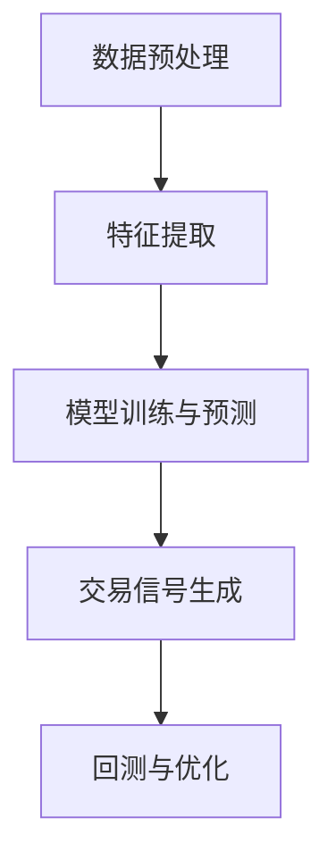

                 


# 威廉欧奈尔的股票买卖时机选择

## 关键词
威廉·欧奈尔, 股票买卖时机, 投资理论, 股票价格形态, 成交量分析, 技术分析

## 摘要
威廉·欧奈尔是全球著名的投资专家，其提出的CAN SLIM系统在股票投资领域具有重要地位。本文详细解析欧奈尔的股票买卖时机选择理论，涵盖其核心概念、数学模型、算法设计及实际应用，为投资者提供科学的决策支持。

---

# 第一部分: 威廉欧奈尔的股票买卖时机选择概述

## 第1章: 威廉欧奈尔及其投资理论背景

### 1.1 威廉欧奈尔的背景与投资理念
#### 1.1.1 威廉欧奈尔的生平简介
威廉·欧奈尔（William O'Neil）是全球知名的股票投资专家，其提出的CAN SLIM系统在全球范围内被广泛应用于股票分析与投资决策。欧奈尔出生于1925年，早年在哥伦比亚大学学习，后进入投资银行领域，逐步发展出一套独特的股票分析方法。

#### 1.1.2 欧奈尔的投资哲学与CAN SLIM系统
欧奈尔的投资哲学以CAN SLIM系统为核心，强调通过分析股票的价格、成交量、相对强度等指标来判断股票的买卖时机。CAN SLIM系统是“Common Attributes of Successful Operators in the Stock Market”的缩写，涵盖以下八大要素：
1. **C** - 大盘状况（Current Market Condition）
2. **A** - 价格走势（Analysis of the Correct Pattern）
3. **N** - 相对强度（Numerical Relationships of Trends）
4. **S** - 供给与需求（Supply and Demand）
5. **L** - 资金流动（Money Flow）
6. **I** - 机构投资者的行为（Institutional Sponsorship）
7. **M** - 市场情绪（Market Sentiment）
8. **心理学因素（Psychological Factors）**

#### 1.1.3 欧奈尔理论的现代应用与局限性
欧奈尔的理论在现代投资中仍然具有重要价值，尤其是在技术分析领域。然而，其方法主要基于历史数据和价格形态分析，可能在市场剧烈波动或新兴市场中表现不佳。

---

## 第2章: 欧奈尔买卖时机选择的核心理论

### 2.1 股票价格与成交量的关系
#### 2.1.1 价格与成交量的相互作用
欧奈尔认为，成交量是判断股票价格趋势的重要指标。成交量是价格变动的“催化剂”，只有在成交量支持下，价格才能持续上涨或下跌。

#### 2.1.2 价格形态分析
欧奈尔提出的价格形态分析是其理论的重要组成部分，主要包括：
1. **支撑位与阻力位**：支撑位是价格下跌时的买点，阻力位是价格上涨时的卖点。
2. **趋势线与通道线**：趋势线是价格波动的主方向，通道线则是趋势线的上下边界。
3. **价格形态的相似性**：通过比较不同股票的价格形态，判断其未来的走势。

#### 2.1.3 成交量在价格波动中的作用
欧奈尔强调，成交量是价格趋势的“风向标”。例如：
- 在价格突破关键阻力位时，成交量必须大幅增加，否则突破无效。
- 在价格回调时，成交量应逐渐减少，否则价格可能继续下跌。

---

## 第3章: 欧奈尔买卖时机选择与其他投资理论的对比

### 3.1 技术分析与基本面分析的结合
#### 3.1.1 技术分析的核心方法
技术分析主要关注价格和成交量的变化，通过图表形态和指标分析来预测价格走势。

#### 3.1.2 基本面分析的核心方法
基本面分析关注公司的财务状况、行业地位、盈利能力等内在因素，通过分析这些因素来判断股票的内在价值。

#### 3.1.3 欧奈尔理论的独特之处
欧奈尔将技术分析与基本面分析有机结合，尤其注重成交量和相对强度分析，提出了独特的买卖时机选择方法。

---

### 3.2 欧奈尔买卖时机选择与现代量化投资的联系
#### 3.2.1 现代量化投资的核心理念
量化投资通过数学模型和算法对市场进行分析，寻找市场中的套利机会和定价偏差。

#### 3.2.2 欧奈尔理论在量化投资中的应用
欧奈尔的买卖时机选择理论可以作为量化投资的辅助工具，尤其是在价格形态识别和成交量分析方面。

#### 3.2.3 量化投资与欧奈尔理论的结合
通过将欧奈尔的买卖时机选择理论与量化投资的算法相结合，可以实现自动化交易和风险管理。

---

## 第4章: 欧奈尔买卖时机选择的数学模型

### 4.1 股票价格波动的数学建模
#### 4.1.1 时间序列分析模型
股票价格可以看作是一种时间序列数据，可以通过ARIMA（自回归积分滑动平均）模型进行建模和预测。

#### 4.1.2 马尔可夫链模型
马尔可夫链模型可以用来分析股票价格的短期趋势，尤其是在价格形态分析中。

#### 4.1.3 布朗运动模型
布朗运动模型可以用来模拟股票价格的随机波动，尤其是在缺乏明显趋势的情况下。

---

### 4.2 欧奈尔价格形态分析的数学公式
#### 4.2.1 支撑位与阻力位的数学表达
支撑位和阻力位可以通过价格数据的极值点来确定。例如，支撑位可以表示为：
$$ S = \min_{i=1}^{n} p_i $$
其中，\( p_i \) 是价格序列中的第 \( i \) 个值。

---

## 第三部分: 基于欧奈尔理论的股票交易算法设计

### 4.3 成交量分析的数学模型
#### 4.3.1 成交量与价格波动的相关性分析
通过统计学方法（如相关系数）分析成交量与价格波动的相关性：
$$ r = \frac{\sum (x_i - \bar{x})(y_i - \bar{y})}{\sqrt{\sum (x_i - \bar{x})^2 \sum (y_i - \bar{y})^2}} $$
其中，\( x_i \) 和 \( y_i \) 分别代表成交量和价格序列。

---

### 4.4 相对强度指数（RSI）的计算
相对强度指数（RSI）用于衡量股票的相对强度，公式为：
$$ RSI = \frac{100}{1 + \frac{d}{u}} $$
其中，\( d \) 是价格下跌幅度，\( u \) 是价格上涨幅度。

---

## 第5章: 基于欧奈尔理论的股票交易算法设计

### 5.1 算法总体流程
1. 数据预处理：获取股票的历史价格和成交量数据。
2. 特征提取：计算相对强度、资金流量指数等指标。
3. 模型训练与预测：基于历史数据训练模型，预测未来的买卖时机。
4. 交易信号生成：根据模型预测结果生成买入或卖出信号。
5. 回测与优化：对交易策略进行回测，优化参数。

---

### 5.2 算法实现代码

#### 5.2.1 数据获取与预处理
```python
import pandas as pd
import numpy as np

# 获取股票数据
def get_stock_data(ticker, start_date, end_date):
    df = pd.DataFrame()
    # 假设 data_api 是数据接口
    df = data_api.get_data(ticker, start_date, end_date)
    return df

# 计算相对强度
def calculate_relative_strength(df):
    df['RS'] = df['Close'] / df['Close'].rolling(window=20).mean()
    return df
```

---

### 5.3 算法流程图


---

### 5.4 算法优化与回测
通过回测可以验证算法的有效性，优化参数（如窗口大小、交易成本等）以提高收益。

---

## 第6章: 项目实战

### 6.1 环境安装
1. 安装Python和相关库（Pandas、NumPy、Matplotlib、Scikit-learn）。
2. 数据接口（如Yahoo Finance API）的安装与配置。

---

### 6.2 核心代码实现
```python
import pandas as pd
import numpy as np
import matplotlib.pyplot as plt

# 示例代码：计算相对强度并生成交易信号
def generate Trading Signals(df, threshold=0.7):
    signals = []
    for i in range(len(df)):
        if df['RSI'][i] > threshold:
            signals.append(1)
        else:
            signals.append(0)
    return signals

# 示例代码：回测策略
def backtestStrategy(signals, prices):
    profits = []
    for i in range(1, len(signals)):
        if signals[i] == 1 and signals[i-1] == 0:
            profits.append((prices[i] - prices[i-1]) * 100)
        else:
            profits.append(0)
    return sum(profits)
```

---

### 6.3 实际案例分析
通过具体案例分析，展示如何在实际市场中应用欧奈尔的买卖时机选择理论，并对策略进行优化。

---

## 第7章: 总结与展望

### 7.1 策略优缺点
- **优点**：欧奈尔的买卖时机选择理论结合了技术分析和基本面分析，具有较强的实战性。
- **缺点**：过于依赖历史数据，可能在市场环境剧烈变化时失效。

### 7.2 最佳实践 tips
- 结合市场环境调整策略。
- 定期回测和优化参数。
- 多关注成交量和相对强度指标。

### 7.3 拓展阅读
- 《击败华尔街》——威廉·欧奈尔
- 《算法交易： hype算法与实战》——马里亚纳·霍尔丹

### 7.4 拓展方向
- 结合机器学习优化交易策略。
- 开发自动化交易系统。
- 研究欧奈尔理论在不同市场中的表现。

---

通过以上步骤，我们可以系统地理解并应用威廉·欧奈尔的股票买卖时机选择理论，结合技术分析和量化投资方法，提升投资决策的科学性和准确性。

