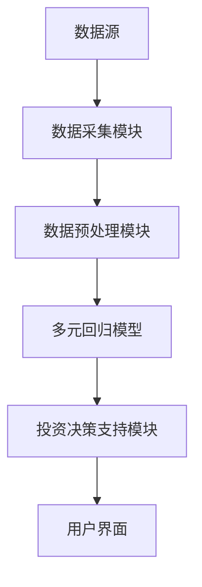

                 


# 宏观经济指标对投资决策的影响

## 关键词：宏观经济指标，投资决策，经济周期，多元回归模型，系统架构设计

## 摘要：本文系统地探讨了宏观经济指标对投资决策的影响，从理论分析到实际应用，结合具体案例和数学模型，深入剖析了如何利用宏观经济指标优化投资策略。

---

### 第一部分：宏观经济指标的背景与定义

#### 1.1 宏观经济指标的核心概念
- **定义**：宏观经济指标是衡量一个国家或地区经济整体运行状况的关键数据，包括GDP、CPI、失业率等。
- **分类**：产出、价格、就业、收入和金融指标五大类。
- **重要性**：反映经济健康状况，影响市场预期和投资决策。

#### 1.2 宏观经济指标与投资决策的关系
- **经济周期**：从衰退到繁荣的不同阶段，投资者需要调整策略。
- **政策影响**：央行货币政策和财政政策对市场的影响机制。
- **市场情绪**：宏观经济数据如何影响投资者信心。

---

### 第二部分：宏观经济指标的核心概念与分类

#### 2.1 主要宏观经济指标解析
- **GDP（国内生产总值）**：衡量经济总产出，影响股市表现。
- **CPI（消费者价格指数）**：反映通货膨胀，影响货币政策。
- **失业率**：反映劳动力市场状况，影响消费能力。
- **利率**：影响企业融资成本和债券收益率。

#### 2.2 宏观经济指标的衡量与计算
- **GDP的计算方法**：生产法、收入法和支出法。
- **CPI的计算方法**：加权平均法，考虑不同商品的权重。
- **失业率的分类**：全面失业率、失业构成等。

---

### 第三部分：宏观经济指标与投资决策的关系模型

#### 3.1 经济周期对投资决策的影响
- **衰退期**：债券和防御性股票较优。
- **复苏期**：周期性股票表现较好。
- **过热期**：科技股和高增长行业表现突出。
- **滞胀期**：现金和黄金较优。

#### 3.2 宏观经济指标对不同类型投资的影响
- **股票投资**：GDP增长率和企业盈利水平直接影响股市表现。
- **债券投资**：利率和通胀水平是主要影响因素。
- **房地产投资**：利率、GDP和就业数据影响房地产市场。

---

### 第四部分：宏观经济指标的量化分析与模型构建

#### 4.1 宏观经济指标的量化方法
- **数据收集**：使用政府发布的统计数据。
- **标准化处理**：对数据进行归一化或差分处理。
- **时间序列分析**：利用ARIMA模型预测未来走势。

#### 4.2 多元回归模型构建
- **模型构建**：将GDP、CPI、失业率等作为自变量，投资回报率作为因变量。
- **公式**：
  $$
  R_i = \beta_0 + \beta_1 GDP + \beta_2 CPI + \beta_3 Unemployment + \epsilon
  $$
- **系数解释**：$\beta$ 表示每个指标对投资回报的影响程度。

---

### 第五部分：系统架构设计与实现

#### 5.1 系统功能模块
- **数据采集模块**：实时获取宏观经济数据。
- **数据分析模块**：构建多元回归模型。
- **投资决策支持模块**：根据模型结果提供投资建议。

#### 5.2 系统架构图


---

### 第六部分：项目实战与结果分析

#### 6.1 代码实现
```python
import pandas as pd
import numpy as np
from sklearn.linear_model import LinearRegression

# 加载数据
data = pd.read_csv('macroeconomic_data.csv')

# 分离自变量和因变量
X = data[['GDP', 'CPI', 'Unemployment']]
y = data['Investment_Return']

# 模型训练
model = LinearRegression()
model.fit(X, y)

# 预测
predicted_returns = model.predict(X)
```

#### 6.2 结果分析
- **系数分析**：GDP对投资回报的正向影响显著，CPI的负面影响较小。
- **模型评估**：R²值为0.75，说明模型解释力较强。

---

### 第七部分：总结与扩展

#### 7.1 总结
- 宏观经济指标是投资决策的重要参考，投资者需要结合多个指标进行综合分析。
- 多元回归模型能够有效量化各指标的影响程度，但需注意数据质量和模型假设。

#### 7.2 扩展阅读
- 《投资学基础》
- 《计量经济学》
- 《系统架构设计》

---

通过系统地分析宏观经济指标对投资决策的影响，结合数学模型和实际案例，投资者可以更好地理解市场动态，优化投资策略，实现长期收益最大化。

