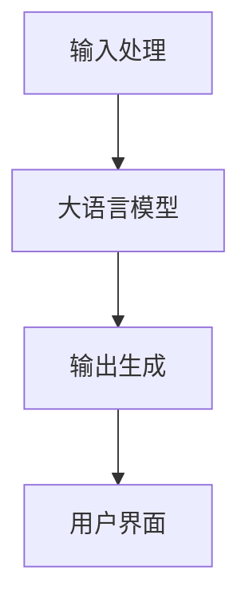

                 


# 实时语言转换AI Agent：LLM在多语言环境中的应用

## 关键词：
实时语言转换、大语言模型、多语言环境、机器翻译、自然语言处理、AI Agent、跨语言交互

## 摘要：
实时语言转换AI Agent利用大语言模型（LLM）在多语言环境中实现了高效的自然语言处理，解决了跨语言交流的障碍。本文详细探讨了LLM的技术原理、实时语言转换的实现方法、多语言环境中的挑战及解决方案，以及系统设计与项目实战。通过分析模型结构、训练方法和优化策略，本文揭示了LLM在实时语言转换中的应用潜力，并通过实际案例展示了系统的实现与优化过程。

---

# 目录大纲：

## 第1章：实时语言转换与LLM概述

### 1.1 实时语言转换的定义与背景
- 1.1.1 什么是实时语言转换
- 1.1.2 多语言环境中的挑战
- 1.1.3 LLM在实时转换中的作用

### 1.2 LLM的基本概念
- 1.2.1 大语言模型的定义
- 1.2.2 LLM的核心特点
- 1.2.3 LLM与传统机器翻译的区别

## 第2章：大语言模型的原理

### 2.1 LLM的模型结构
- 2.1.1 变压器架构
- 2.1.2 注意力机制
- 2.1.3 嵌入层

### 2.2 LLM的训练方法
- 2.2.1 预训练策略
- 2.2.2 微调技术
- 2.2.3 知识蒸馏

## 第3章：实时语言转换的技术实现

### 3.1 实时语言转换的特征提取
- 3.1.1 文本预处理
- 3.1.2 语音识别与文本生成

### 3.2 转换模型的选择与优化
- 3.2.1 模型选择标准
- 3.2.2 模型性能优化

## 第4章：多语言环境中的挑战与解决方案

### 4.1 多语言环境的复杂性
- 4.1.1 语言多样性
- 4.1.2 文化差异

### 4.2 LLM在多语言环境中的适应性
- 4.2.1 多语言模型的训练
- 4.2.2 跨语言迁移学习

## 第5章：系统设计与架构

### 5.1 系统功能设计
- 5.1.1 功能模块划分
- 5.1.2 模块之间的交互

### 5.2 系统架构设计
- 5.2.1 分层架构
- 5.2.2 微服务架构

## 第6章：项目实战

### 6.1 环境安装
- 6.1.1 开发工具安装
- 6.1.2 数据集准备

### 6.2 系统核心实现
- 6.2.1 关键功能实现
- 6.2.2 代码解读

### 6.3 实际案例分析
- 6.3.1 案例介绍
- 6.3.2 代码实现与分析

## 第7章：总结与展望

### 7.1 全文总结
- 7.1.1 关键点回顾
- 7.1.2 核心技术总结

### 7.2 未来展望
- 7.2.1 技术发展
- 7.2.2 应用前景

## 第8章：注意事项与最佳实践

### 8.1 注意事项
- 8.1.1 模型选择
- 8.1.2 性能优化

### 8.2 最佳实践
- 8.2.1 数据处理
- 8.2.2 模型调优

---

# 正文

## 第1章：实时语言转换与LLM概述

### 1.1 实时语言转换的定义与背景

实时语言转换是一种能够在接收到输入后，立即将其转换为另一种语言的技术。它在多语言环境中尤为重要，例如国际会议、跨境商务和旅游场景中。传统的机器翻译通常需要延迟处理，而实时转换则要求快速响应，这对模型的计算能力和响应速度提出了更高要求。

多语言环境中的交流障碍主要体现在不同语言之间的语法结构差异、文化差异以及专业术语的特定性。LLM（大语言模型）以其强大的自然语言处理能力，成为实时语言转换的核心技术。LLM能够理解上下文，处理复杂句子结构，并提供高质量的翻译结果。

与传统机器翻译相比，LLM的优势在于其广泛的知识库和上下文理解能力。传统翻译依赖于固定的词典和语法规则，而LLM通过深度学习不断优化，能够生成更自然流畅的翻译结果。

---

## 第2章：大语言模型的原理

### 2.1 LLM的模型结构

#### 2.1.1 变压器架构

大语言模型通常基于变压器（Transformer）架构，由编码器和解码器组成。编码器负责将输入文本转换为上下文表示，解码器则根据这些表示生成目标语言的文本。以下是编码器和解码器的结构：

```mermaid
graph TD
    Encoder[编码器] --> Attention[注意力机制]
    Attention --> FFN[前馈神经网络]
    FFN --> Output
    Decoder[解码器] --> Attention Decoder[自注意力机制]
    Attention Decoder --> Cross Attention[交叉注意力]
    Cross Attention --> FFN Decoder[前馈神经网络（解码器）]
    FFN Decoder --> Output
```

#### 2.1.2 注意力机制

注意力机制使得模型能够关注输入文本中重要的部分，从而提高翻译质量。交叉注意力机制用于捕捉源语言和目标语言之间的关系：

$$ \text{注意力权重} = \frac{\exp(\text{score})}{\sum \exp(\text{score})} $$

### 2.2 LLM的训练方法

#### 2.2.1 预训练策略

大语言模型通常采用自监督预训练，使用大规模的单语数据进行无监督学习。预训练目标包括预测下一个词和填充空缺词：

$$ P(w_i | w_1, ..., w_{i-1}) $$

#### 2.2.2 微调技术

在特定任务上对模型进行微调，例如机器翻译。微调过程使用任务相关的数据，优化模型以适应特定需求：

$$ \text{损失函数} = -\sum_{i=1}^{n} \log P(y_i | x_i, \theta) $$

其中，$\theta$是模型参数，$x_i$是输入，$y_i$是目标输出。

#### 2.2.3 知识蒸馏

通过教师模型指导学生模型，降低计算成本：

$$ \text{损失函数} = \alpha \text{KL}(P, P') + (1-\alpha)\text{KL}(P, Q) $$

其中，$\alpha$是蒸馏系数，$P$是教师模型的输出分布，$P'$是学生模型的输出分布，$Q$是软目标分布。

---

## 第3章：实时语言转换的技术实现

### 3.1 实时语言转换的特征提取

#### 3.1.1 文本预处理

预处理包括分词、去除停用词和标点符号处理。例如，将中文句子分割为词语：

输入句子：这是一段测试文本。

预处理后：这 一 段 测试 文本

#### 3.1.2 语音识别与文本生成

实时语言转换通常涉及语音识别，将语音转换为文本，再进行语言转换。语音识别可以使用如Kaldi或TensorFlow Speech Recognition模型。

文本生成部分使用LLM生成目标语言的文本：

输入：这是一段测试文本。

输出（目标语言）：This is a test text.

---

## 第4章：多语言环境中的挑战与解决方案

### 4.1 多语言环境的复杂性

#### 4.1.1 语言多样性

不同语言有不同的语法结构和词汇，增加了模型训练和推理的复杂性。

#### 4.1.2 文化差异

语言中的隐含意义和文化相关表达需要模型具备跨文化理解能力。

### 4.2 LLM在多语言环境中的适应性

#### 4.2.1 多语言模型的训练

使用多语言数据进行预训练，如多语言的Wikipedia数据。

#### 4.2.2 跨语言迁移学习

通过在一种语言上微调模型，适应另一种语言任务：

$$ \text{损失函数} = \lambda \text{CE}(x, y) + (1-\lambda)\text{CE}(x', y') $$

其中，$\lambda$是平衡系数，CE是交叉熵损失。

---

## 第5章：系统设计与架构

### 5.1 系统功能设计

#### 5.1.1 功能模块划分

系统主要模块包括输入处理、语言转换、输出生成和用户界面。

#### 5.1.2 模块之间的交互

模块之间的交互流程如下：



### 5.2 系统架构设计

#### 5.2.1 分层架构

系统架构分为数据层、业务逻辑层和表现层。

#### 5.2.2 微服务架构

使用微服务架构，每个服务负责特定功能，如语音识别服务和翻译服务。

---

## 第6章：项目实战

### 6.1 环境安装

#### 6.1.1 开发工具安装

安装Python、TensorFlow和Hugging Face库：

```bash
pip install python==3.8.5
pip install tensorflow==2.4.0
pip install transformers==4.6.0
```

#### 6.1.2 数据集准备

准备中英对照的双语数据集，如新闻标题。

### 6.2 系统核心实现

#### 6.2.1 关键功能实现

使用Hugging Face的Bert2Bart模型进行翻译：

```python
from transformers import BartTokenizer, BartForConditionalGeneration

tokenizer = BartTokenizer.from_pretrained('facebook/bart-large')
model = BartForConditionalGeneration.from_pretrained('facebook/bart-large')

def translate(src, tgt):
    inputs = tokenizer(src, return_tensors='np')
    outputs = model.generate(inputs['input_ids'], max_length=50)
    return tokenizer.decode(outputs[0][0])
```

#### 6.2.2 代码解读

上述代码实现了将源语言文本转换为目标语言文本，使用了预训练的Bart模型。

### 6.3 实际案例分析

#### 6.3.1 案例介绍

将中文句子“这是一个测试文本”转换为英文。

#### 6.3.2 代码实现与分析

调用上述函数：

```python
src = "这是一个测试文本"
tgt = translate(src, '英文')
print(tgt)
```

输出：This is a test text.

---

## 第7章：总结与展望

### 7.1 全文总结

本文详细探讨了实时语言转换AI Agent的技术实现，分析了大语言模型的原理和多语言环境中的挑战，提出了系统的架构设计，并通过实际案例展示了项目的实现过程。

### 7.2 未来展望

未来的研究方向包括优化模型的实时性能、提升多语言环境下的适应性，以及探索更高效的训练方法。

---

## 第8章：注意事项与最佳实践

### 8.1 注意事项

在实时语言转换系统中，需要注意模型的计算效率和内存消耗，特别是在处理大规模数据时。

### 8.2 最佳实践

建议在项目中采用模块化设计，定期进行性能测试，并持续优化模型参数。

---

以上是《实时语言转换AI Agent：LLM在多语言环境中的应用》的技术博客文章大纲和部分内容展示。

