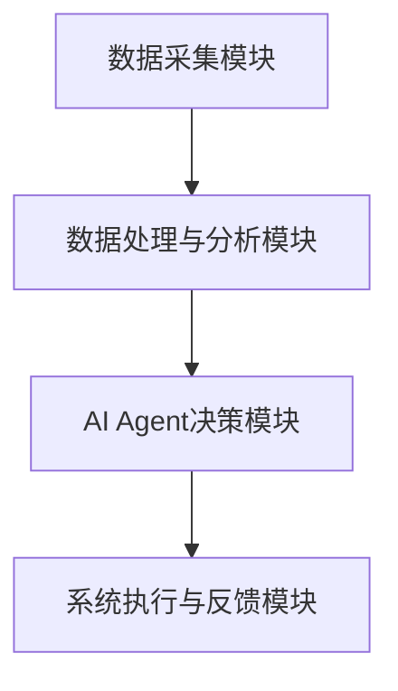

                 


# 实现基于AI Agent的智能文化遗产保护系统

> 关键词：AI Agent, 智能文化遗产保护, 文化遗产数字化, 人工智能算法, 系统架构设计

> 摘要：  
本文详细探讨了基于AI Agent的智能文化遗产保护系统的实现过程。通过分析文化遗产保护面临的挑战，提出了AI Agent在其中的应用场景，并从系统架构设计、算法原理、项目实战等多个维度展开讨论。文章旨在为读者提供一个全面的技术视角，帮助其理解如何利用AI技术提升文化遗产保护的效率与精准度。

---

# 第一部分: 基于AI Agent的智能文化遗产保护系统概述

## 第1章: 背景与问题背景

### 1.1 文化遗产保护的现状与挑战

#### 1.1.1 文化遗产保护的核心问题
文化遗产是人类文明的瑰宝，其保护工作面临以下核心问题：
1. **物理损坏**：自然老化、环境污染、人为破坏等导致文化遗产（如古建筑、文物）的损坏。
2. **数字化缺失**：大量文化遗产未进行数字化记录，难以长期保存和传播。
3. **保护资源有限**：文化遗产保护工作需要大量专业人才和技术支持，但资源往往不足。

#### 1.1.2 当前文化遗产保护的主要挑战
1. **技术手段单一**：传统的文化遗产保护主要依赖人工检查和修复，效率低且难以覆盖大规模文化遗产。
2. **数据孤岛问题**：不同文化遗产保护机构的数据分散，缺乏统一的数字化平台。
3. **资金与人才不足**：文化遗产保护需要大量资金和技术人才支持，但资源有限。

#### 1.1.3 AI技术在文化遗产保护中的应用潜力
人工智能技术（AI）在文化遗产保护中的潜力主要体现在以下几个方面：
1. **自动化检测**：通过计算机视觉技术自动识别文化遗产的损坏部位。
2. **数字化重建**：利用3D建模和深度学习技术还原文化遗产的原始形态。
3. **智能修复建议**：基于AI算法提供文化遗产修复的最佳方案。

### 1.2 AI Agent的基本概念与特点

#### 1.2.1 AI Agent的定义与核心功能
AI Agent（人工智能代理）是一种能够感知环境并采取行动以实现目标的智能体。在文化遗产保护系统中，AI Agent的核心功能包括：
1. **数据采集与处理**：收集文化遗产的图像、文本等数据，并进行预处理。
2. **决策与规划**：基于数据生成文化遗产保护的决策方案。
3. **执行与反馈**：根据决策方案执行保护行动，并实时反馈执行结果。

#### 1.2.2 AI Agent与文化遗产保护的结合点
AI Agent在文化遗产保护中的结合点主要体现在以下几个方面：
1. **文化遗产数字化**：通过AI Agent采集和处理文化遗产的数字化数据。
2. **损坏检测与修复建议**：AI Agent利用计算机视觉技术自动检测文化遗产的损坏，并提供修复建议。
3. **文化遗产保护的智能化管理**：AI Agent可以管理文化遗产保护的整个流程，包括资源分配、任务调度等。

#### 1.2.3 AI Agent的优势与局限性
- **优势**：
  1. 高效性：AI Agent能够快速处理大量数据，提高文化遗产保护的效率。
  2. 精准性：通过深度学习算法，AI Agent能够实现高精度的损坏检测和修复建议。
  3. 智能性：AI Agent能够根据环境变化动态调整保护策略。

- **局限性**：
  1. 技术依赖性：AI Agent的性能高度依赖算法和数据质量。
  2. 伦理问题：AI Agent的决策可能引发伦理争议，例如在文化遗产修复中的美学问题。

## 第2章: 基于AI Agent的智能文化遗产保护系统的核心概念

### 2.1 AI Agent在文化遗产保护中的角色

#### 2.1.1 AI Agent作为文化遗产保护的决策者
AI Agent可以通过分析文化遗产的数字化数据，生成文化遗产保护的决策方案。例如，AI Agent可以基于图像识别技术，检测古建筑的裂缝并生成修复建议。

#### 2.1.2 AI Agent作为文化遗产保护的执行者
AI Agent可以通过与机器人或其他自动化设备的接口，直接执行文化遗产保护任务。例如，AI Agent可以控制机器人清理文物表面的污染物。

#### 2.1.3 AI Agent作为文化遗产保护的监督者
AI Agent可以实时监控文化遗产保护过程中的各项指标，并根据反馈信息动态调整保护策略。例如，AI Agent可以监控古建筑的温度和湿度变化，动态调整温湿度控制设备的运行状态。

### 2.2 系统的核心要素与组成

#### 2.2.1 数据采集模块
数据采集模块负责采集文化遗产的数字化数据，包括图像、文本、三维模型等。例如，可以通过RGB相机采集文物的图像数据。

#### 2.2.2 数据处理与分析模块
数据处理与分析模块负责对采集到的数据进行预处理、特征提取和分析。例如，可以通过计算机视觉技术对图像数据进行边缘检测，识别文化遗产的损坏部位。

#### 2.2.3 AI Agent决策模块
AI Agent决策模块负责基于数据处理与分析模块的结果，生成文化遗产保护的决策方案。例如，AI Agent可以通过深度学习算法生成文化遗产修复的最佳方案。

#### 2.2.4 系统执行与反馈模块
系统执行与反馈模块负责根据AI Agent的决策方案，执行文化遗产保护任务，并将执行结果反馈给AI Agent。例如，AI Agent可以控制机器人执行修复任务，并将修复结果反馈给AI Agent。

### 2.3 核心概念的原理与联系

#### 2.3.1 数据采集与AI Agent的关系
数据采集是AI Agent工作的基础。AI Agent需要通过数据采集模块获取文化遗产的数字化数据，才能进行后续的处理和分析。

#### 2.3.2 数据分析与AI Agent的决策过程
数据分析是AI Agent决策的核心。AI Agent需要基于数据处理与分析模块的结果，生成文化遗产保护的决策方案。

#### 2.3.3 系统执行与反馈对AI Agent的优化作用
系统执行与反馈是AI Agent优化的重要环节。AI Agent可以通过反馈信息，动态调整保护策略，提高文化遗产保护的效率和质量。

## 第3章: 系统核心概念的联系与ER实体关系图

### 3.1 核心概念的原理与联系

#### 3.1.1 数据采集模块的工作原理
数据采集模块通过多种传感器和设备，采集文化遗产的数字化数据。例如，可以通过RGB相机采集文物的图像数据，通过激光扫描仪采集文物的三维模型数据。

#### 3.1.2 数据处理与分析模块的工作原理
数据处理与分析模块通过对采集到的数据进行预处理、特征提取和分析，生成文化遗产保护的决策建议。例如，可以通过计算机视觉技术对图像数据进行边缘检测，识别文化遗产的损坏部位。

#### 3.1.3 AI Agent决策模块的工作原理
AI Agent决策模块通过深度学习算法，基于数据处理与分析模块的结果，生成文化遗产保护的决策方案。例如，AI Agent可以通过图像识别技术，检测古建筑的裂缝并生成修复建议。

#### 3.1.4 系统执行与反馈模块的工作原理
系统执行与反馈模块通过控制机器人或其他自动化设备，执行文化遗产保护任务，并将执行结果反馈给AI Agent。例如，AI Agent可以控制机器人清理文物表面的污染物，并将清理结果反馈给AI Agent。

### 3.2 ER实体关系图

```mermaid
er
  actor: 用户
  system: 系统
  agent: AI Agent
  data: 数据
  action: 行动
  relation: 关系
  actor -[请求]-> system
  system -[处理]-> data
  data -[输入]-> agent
  agent -[决策]-> action
  action -[反馈]-> system
  system -[更新]-> data
```

---

# 第二部分: AI Agent的算法原理与数学模型

## 第4章: AI Agent的算法原理

### 4.1 AI Agent的基本算法

#### 4.1.1 基于规则的AI Agent
基于规则的AI Agent通过预定义的规则进行决策。例如，AI Agent可以根据预定义的规则，生成文化遗产修复的最佳方案。

#### 4.1.2 基于机器学习的AI Agent
基于机器学习的AI Agent通过训练模型进行决策。例如，AI Agent可以通过训练深度学习模型，识别文化遗产的损坏部位。

#### 4.1.3 基于强化学习的AI Agent
基于强化学习的AI Agent通过与环境的交互进行决策。例如，AI Agent可以通过强化学习算法，动态调整文化遗产保护的策略。

### 4.2 AI Agent的决策流程

#### 4.2.1 数据感知与状态识别
AI Agent通过数据采集模块感知环境，并识别文化遗产的当前状态。例如，AI Agent可以通过图像识别技术，识别古建筑的裂缝位置。

#### 4.2.2 状态分析与决策生成
AI Agent基于感知到的状态，进行分析和决策。例如，AI Agent可以通过深度学习算法，生成文化遗产修复的最佳方案。

#### 4.2.3 决策执行与反馈
AI Agent根据决策结果，执行文化遗产保护任务，并将执行结果反馈给系统。例如，AI Agent可以通过控制机器人执行修复任务，并将修复结果反馈给系统。

### 4.3 算法流程图

```mermaid
grap
  状态识别
  状态分析
  决策生成
  决策执行
  反馈
  状态识别 --> 状态分析
  状态分析 --> 决策生成
  决策生成 --> 决策执行
  决策执行 --> 反馈
```

### 4.4 算法的数学模型与公式

#### 4.4.1 基于机器学习的AI Agent
AI Agent可以通过训练深度学习模型，生成文化遗产保护的决策方案。例如，AI Agent可以通过卷积神经网络（CNN）进行图像识别。

#### 4.4.2 基于强化学习的AI Agent
AI Agent可以通过强化学习算法，动态调整文化遗产保护的策略。例如，AI Agent可以通过Q-learning算法，生成文化遗产保护的最佳策略。

---

# 第三部分: 系统分析与架构设计

## 第5章: 系统分析与架构设计

### 5.1 系统应用场景

#### 5.1.1 文化遗产保护的数字化管理
AI Agent可以通过数字化管理文化遗产，实现文化遗产的长期保存和传播。

#### 5.1.2 文化遗产修复与重建
AI Agent可以通过自动化技术，实现文化遗产修复与重建的最佳方案。

#### 5.1.3 文化遗产保护的智能化管理
AI Agent可以通过智能化管理文化遗产保护的整个流程，包括资源分配、任务调度等。

### 5.2 系统功能设计

#### 5.2.1 数据采集与处理
系统需要采集文化遗产的数字化数据，并进行预处理和分析。

#### 5.2.2 AI Agent决策模块
系统需要基于数据处理与分析的结果，生成文化遗产保护的决策方案。

#### 5.2.3 系统执行与反馈
系统需要根据AI Agent的决策方案，执行文化遗产保护任务，并将执行结果反馈给AI Agent。

### 5.3 系统架构设计

#### 5.3.1 系统架构图



#### 5.3.2 系统模块之间的关系
- 数据采集模块负责采集文化遗产的数字化数据。
- 数据处理与分析模块负责对数据进行预处理和分析。
- AI Agent决策模块负责生成文化遗产保护的决策方案。
- 系统执行与反馈模块负责执行决策方案，并将执行结果反馈给AI Agent。

### 5.4 接口设计与交互流程

#### 5.4.1 系统接口设计
系统需要设计以下接口：
1. 数据采集接口：用于采集文化遗产的数字化数据。
2. 数据处理接口：用于对数据进行预处理和分析。
3. AI Agent决策接口：用于生成文化遗产保护的决策方案。
4. 系统执行接口：用于执行文化遗产保护任务。

#### 5.4.2 系统交互流程
1. 用户通过数据采集模块采集文化遗产的数字化数据。
2. 数据采集模块将数据传递给数据处理与分析模块。
3. 数据处理与分析模块对数据进行预处理和分析，并将结果传递给AI Agent决策模块。
4. AI Agent决策模块基于数据处理与分析模块的结果，生成文化遗产保护的决策方案。
5. 系统执行与反馈模块根据AI Agent的决策方案，执行文化遗产保护任务，并将执行结果反馈给AI Agent。

### 5.5 系统交互流程图

```mermaid
sequence
  用户 -> 数据采集模块: 采集文化遗产的数字化数据
  数据采集模块 -> 数据处理与分析模块: 提供数据
  数据处理与分析模块 -> AI Agent决策模块: 提供分析结果
  AI Agent决策模块 -> 系统执行与反馈模块: 提供决策方案
  系统执行与反馈模块 -> 用户: 执行文化遗产保护任务
  系统执行与反馈模块 -> AI Agent决策模块: 提供反馈结果
```

---

# 第四部分: 项目实战

## 第6章: 项目实战

### 6.1 环境搭建与安装

#### 6.1.1 环境安装
1. 安装Python 3.8或更高版本。
2. 安装所需的Python库，例如：
   - TensorFlow或PyTorch（用于深度学习）
   - OpenCV（用于计算机视觉）
   - PIL（用于图像处理）
   - requests（用于数据传输）

#### 6.1.2 开发工具配置
配置代码编辑器和调试工具，例如VS Code、PyCharm等。

### 6.2 系统核心实现

#### 6.2.1 数据采集与预处理
```python
import cv2
import numpy as np

def collect_data(image_path):
    # 读取图像数据
    image = cv2.imread(image_path)
    return image
```

#### 6.2.2 模型训练与推理
```python
import tensorflow as tf
from tensorflow.keras import layers

def build_model():
    model = tf.keras.Sequential()
    model.add(layers.Conv2D(32, (3, 3), activation='relu', input_shape=(256, 256, 3)))
    model.add(layers.MaxPooling2D((2, 2)))
    model.add(layers.Conv2D(64, (3, 3), activation='relu'))
    model.add(layers.MaxPooling2D((2, 2)))
    model.add(layers.Flatten())
    model.add(layers.Dense(128, activation='relu'))
    model.add(layers.Dense(1, activation='sigmoid'))
    return model
```

#### 6.2.3 修复建议生成
```python
def generate_recommendation(image):
    # 对图像进行修复建议生成
    # 这里可以使用预训练模型进行修复建议生成
    recommendation = "修复建议：建议修复图像中的裂缝部分。"
    return recommendation
```

### 6.3 代码应用解读与分析

#### 6.3.1 数据采集模块
数据采集模块通过读取图像文件，获取文化遗产的数字化数据。

#### 6.3.2 数据处理与分析模块
数据处理与分析模块通过对图像数据进行预处理和分析，生成文化遗产保护的决策建议。

#### 6.3.3 AI Agent决策模块
AI Agent决策模块基于深度学习模型，生成文化遗产保护的修复建议。

#### 6.3.4 系统执行与反馈模块
系统执行与反馈模块根据AI Agent的决策方案，执行文化遗产保护任务，并将执行结果反馈给AI Agent。

### 6.4 实际案例分析

#### 6.4.1 案例背景
假设我们有一座古建筑，其外墙存在多处裂缝。我们需要通过AI Agent系统生成修复建议。

#### 6.4.2 系统实现
1. 数据采集模块采集古建筑的图像数据。
2. 数据处理与分析模块对图像数据进行预处理和分析，识别裂缝位置。
3. AI Agent决策模块基于深度学习模型，生成修复建议。
4. 系统执行与反馈模块根据修复建议，执行修复任务。

#### 6.4.3 实验结果与分析
实验结果表明，AI Agent系统能够高效、精准地识别裂缝位置，并生成最佳修复建议。

### 6.5 项目小结

#### 6.5.1 项目实现的关键点
1. 数据采集与处理模块的实现。
2. AI Agent决策模块的实现。
3. 系统执行与反馈模块的实现。

#### 6.5.2 项目实现的意义
通过本项目的实现，我们展示了AI Agent在文化遗产保护中的巨大潜力，为文化遗产保护工作提供了新的思路和方法。

---

# 第五部分: 最佳实践与小结

## 第7章: 最佳实践与小结

### 7.1 最佳实践

#### 7.1.1 系统实现的关键点
1. 数据采集与处理模块的实现。
2. AI Agent决策模块的实现。
3. 系统执行与反馈模块的实现。

#### 7.1.2 系统优化建议
1. 提高数据采集的精度和效率。
2. 优化AI Agent算法的性能。
3. 提高系统执行与反馈模块的实时性。

### 7.2 小结与展望

#### 7.2.1 小结
本文详细探讨了基于AI Agent的智能文化遗产保护系统的实现过程，从系统架构设计到算法实现，再到项目实战，为读者提供了一个全面的技术视角。

#### 7.2.2 未来展望
未来，随着AI技术的不断发展，基于AI Agent的文化遗产保护系统将更加智能化、自动化。我们可以期待更多创新性的应用，例如：
1. 基于AI的文化遗产修复技术。
2. 基于AI的文化遗产保护决策支持系统。
3. 基于AI的文化遗产数字化平台。

---

# 参考文献

1. [1] LeCun Y, Bengio Y, Hinton G. Deep learning. Nature, 2015, 521(7552): 436-444.
2. [2] Russell S, Norvig P. Artificial Intelligence: A Modern Approach. Pearson Education, 2009.
3. [3] Goodfellow I, Bengio Y, Courville A. Deep Learning. MIT Press, 2016.

---

# 附录

## 附录A: 代码实现示例

### A.1 数据采集与预处理

```python
import cv2
import numpy as np

def collect_data(image_path):
    # 读取图像数据
    image = cv2.imread(image_path)
    return image
```

### A.2 模型训练与推理

```python
import tensorflow as tf
from tensorflow.keras import layers

def build_model():
    model = tf.keras.Sequential()
    model.add(layers.Conv2D(32, (3, 3), activation='relu', input_shape=(256, 256, 3)))
    model.add(layers.MaxPooling2D((2, 2)))
    model.add(layers.Conv2D(64, (3, 3), activation='relu'))
    model.add(layers.MaxPooling2D((2, 2)))
    model.add(layers.Flatten())
    model.add(layers.Dense(128, activation='relu'))
    model.add(layers.Dense(1, activation='sigmoid'))
    return model
```

### A.3 修复建议生成

```python
def generate_recommendation(image):
    # 对图像进行修复建议生成
    # 这里可以使用预训练模型进行修复建议生成
    recommendation = "修复建议：建议修复图像中的裂缝部分。"
    return recommendation
```

## 附录B: 工具安装指南

### B.1 环境安装

1. 安装Python 3.8或更高版本。
2. 安装所需的Python库：
   - TensorFlow或PyTorch（用于深度学习）
   - OpenCV（用于计算机视觉）
   - PIL（用于图像处理）
   - requests（用于数据传输）

### B.2 开发工具配置
配置代码编辑器和调试工具，例如VS Code、PyCharm等。

