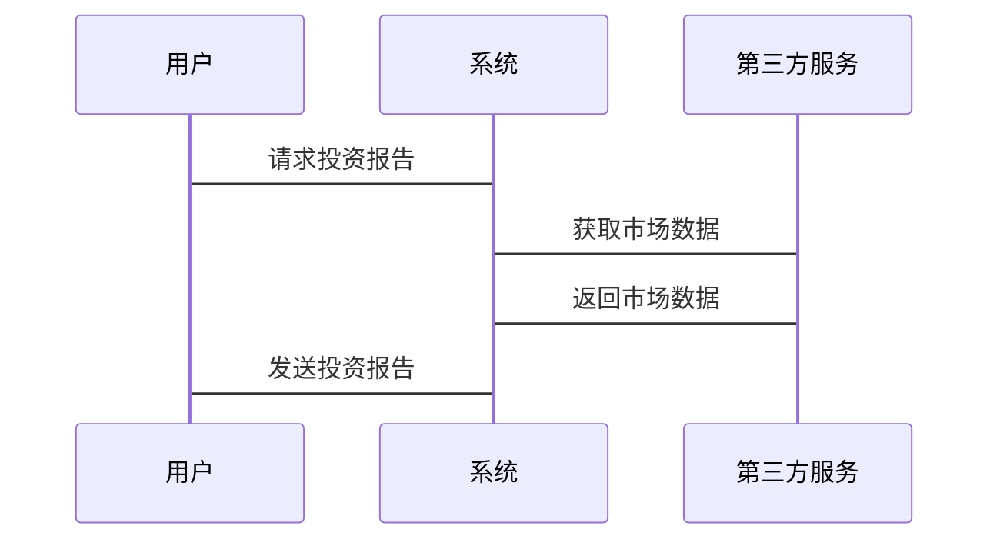

                 


# 家族办公室投资：超高净值人士的财富管理策略

## 关键词：家族办公室、财富管理、投资策略、风险管理、超高净值人士

## 摘要：家族办公室是为超高净值人士管理财富的重要机构，本文将从背景、核心概念、投资策略、系统架构、项目实战等方面，深入分析家族办公室的投资策略和运作机制，帮助读者了解如何通过家族办公室实现财富的保值与增值。

---

## 第一部分: 家族办公室投资基础

### 第1章: 家族办公室概述

#### 1.1 家族办公室的定义与特点
##### 1.1.1 家族办公室的定义
家族办公室（Family Office）是专门为超高净值家庭提供财富管理服务的机构，旨在实现财富的保值、增值、传承和税务优化。

##### 1.1.2 家族办公室的核心特点
- **定制化服务**：根据家族的具体需求制定个性化的财富管理方案。
- **长期视角**：注重财富的长期稳健增长，而非短期收益。
- **隐私保护**：确保家族隐私和财富管理的保密性。
- **多维度服务**：涵盖投资、税务、法律、教育等多个领域。

##### 1.1.3 家族办公室与传统财富管理的区别
- 传统财富管理通常由银行或第三方机构提供标准化服务，而家族办公室则提供定制化、全方位的服务。
- 家族办公室更注重家族的整体利益，而非单一客户的需求。

#### 1.2 家族办公室的起源与发展
##### 1.2.1 家族办公室的历史背景
家族办公室的概念起源于19世纪末的美国，最初由富裕家族内部设立，逐步发展成为一种专业的财富管理模式。

##### 1.2.2 家族办公室的发展现状
随着全球经济的发展和超高净值人群的增加，家族办公室在全球范围内迅速发展，成为财富管理领域的重要组成部分。

##### 1.2.3 家族办公室的全球化趋势
家族办公室的服务已从欧美扩展到亚洲、中东等地区，全球化趋势明显，能够为全球范围内的家族提供服务。

#### 1.3 超高净值人士的需求与挑战
##### 1.3.1 超高净值人士的财富管理需求
- 财富保值与增值
- 跨代财富传承
- 家族影响力投资

##### 1.3.2 超高净值人士面临的主要挑战
- 财富保值与贬值的风险
- 家族内部的利益冲突
- 税务规划的复杂性

##### 1.3.3 家族办公室在财富管理中的作用
- 专业团队提供定制化服务
- 优化资产配置，降低风险
- 确保财富传承的连续性

#### 1.4 本章小结
本章主要介绍了家族办公室的基本概念、发展现状及超高净值人士的需求与挑战，为后续章节的深入分析奠定了基础。

---

## 第二部分: 家族办公室的核心运作机制

### 第2章: 家族办公室的治理结构

#### 2.1 家族办公室的组织架构
##### 2.1.1 家族治理委员会的职责
- 制定家族的整体战略
- 管理家族成员的关系
- 监督家族办公室的运作

##### 2.1.2 投资决策委员会的职责
- 制定投资策略
- 审批重大投资决策
- 监控投资风险

##### 2.1.3 家族办公室的内部职能部门
- 投资管理部
- 税务规划部
- 法律事务部
- 人力资源部

#### 2.2 家族办公室的治理原则
##### 2.2.1 家族成员的参与与决策
- 家族成员参与决策过程，确保家族利益的一致性
- 明确决策权限和流程

##### 2.2.2 专业团队的角色与分工
- 投资经理：负责资产配置和投资组合管理
- 税务顾问：制定税务优化方案
- 法律顾问：处理家族法律事务

##### 2.2.3 家族办公室的透明化与问责机制
- 定期向家族成员汇报财务状况
- 建立绩效评估机制

#### 2.3 家族办公室的治理挑战
##### 2.3.1 家族内部的利益冲突
- 不同家族成员的利益可能不同，需要协调一致

##### 2.3.2 专业团队的能力与信任问题
- 专业团队的能力直接影响家族办公室的效果
- 建立信任关系是关键

##### 2.3.3 法律与税务规划的复杂性
- 不同国家和地区的法律和税务政策差异较大
- 需要专业的税务规划和法律支持

#### 2.4 本章小结
本章详细介绍了家族办公室的组织架构、治理原则及面临的挑战，强调了治理结构在家族办公室运作中的重要性。

---

## 第三部分: 家族办公室的投资策略

### 第3章: 家族办公室的投资目标与策略

#### 3.1 家族办公室的投资目标
##### 3.1.1 财富保值与增值
- 通过多元化的资产配置实现稳健增长

##### 3.1.2 跨代财富传承
- 设计长期的财富传承计划，确保财富的延续性

##### 3.1.3 家族影响力投资
- 将家族财富用于社会公益事业，提升家族影响力

#### 3.2 家族办公室的投资策略
##### 3.2.1 资产配置策略
- **股票投资**：长期持有优质资产，分散风险
- **债券投资**：提供稳定的现金流
- **另类投资**：包括私募股权、房地产、艺术品等，以获取高收益

##### 3.2.2 风险管理策略
- **分散投资**：避免过度集中于某一资产类别
- **风险对冲**：使用衍生工具对冲市场风险
- **定期评估**：持续监控投资组合的风险和收益

##### 3.2.3 个性化投资方案
- 根据家族的具体需求制定个性化的投资策略

#### 3.3 家族办公室的投资工具与渠道
##### 3.3.1 股票与债券投资
- 股票：长期持有优质企业的股权
- 债券：提供稳定的利息收入

##### 3.3.2 私募股权与风险投资
- 私募股权：投资于高成长企业，获取资本增值
- 风险投资：早期投资于创新企业，风险高但潜在回报大

##### 3.3.3 另类投资
- 房地产：通过房地产投资实现资产多元化
- 艺术品与收藏品：作为另类资产，具有保值和增值潜力

#### 3.4 本章小结
本章分析了家族办公室的投资目标与策略，强调了资产配置和风险管理在投资过程中的重要性。

---

## 第四部分: 家族办公室的系统架构与风险管理

### 第4章: 家族办公室的系统架构设计

#### 4.1 问题场景介绍
- 家族办公室需要管理复杂的财富组合，确保投资的安全性和收益性
- 需要实时监控市场动态，及时调整投资策略

#### 4.2 系统功能设计
##### 4.2.1 领域模型（mermaid 类图）
```mermaid
classDiagram
    class 家族办公室 {
        + 家族成员信息
        + 资产配置方案
        + 投资组合
        + 风险管理策略
        - 获取市场数据
        - 计算风险指标
        - 生成投资报告
    }
    class 投资团队 {
        + 专业投资顾问
        + 风险管理专家
        - 制定投资策略
        - 监控投资组合
    }
    class 外部服务 {
        + 金融市场数据
        + 税务咨询
        + 法律咨询
    }
    家族办公室 <-- 关联 --> 投资团队
    家族办公室 <-- 关联 --> 外部服务
```

#### 4.3 系统架构设计
##### 4.3.1 系统架构图（mermaid 架构图）


#### 4.4 系统接口设计
- **REST API**：用于与第三方服务（如金融市场数据供应商）的交互
- **数据库连接**：存储家族成员信息、资产配置方案等

#### 4.5 系统交互设计（mermaid 序列图）


#### 4.6 本章小结
本章通过系统架构设计，展示了家族办公室如何通过专业团队和外部服务实现高效的财富管理，强调了系统设计在投资过程中的重要性。

---

## 第五部分: 项目实战与案例分析

### 第5章: 构建智能财富管理系统

#### 5.1 环境安装
- **操作系统**：Windows 10 或更高版本
- **开发工具**：PyCharm 或 VS Code
- **依赖库**：安装 numpy、pandas、matplotlib

#### 5.2 核心代码实现
##### 5.2.1 数据获取与处理
```python
import numpy as np
import pandas as pd

# 获取市场数据
data = pd.read_csv('market_data.csv')
data.head()
```

##### 5.2.2 投资组合优化（基于现代投资组合理论）
```python
# 现代投资组合理论（MPT）模型
def mpt_optimization(risk_free_rate, returns, covariance_matrix):
    # 计算最优权重
    return np.linalg.solve(covariance_matrix, returns) * risk_free_rate
```

##### 5.2.3 风险管理策略
```python
# 风险对冲策略
def risk_hedging(portfolio_value, market_index):
    return portfolio_value * (1 - market_index)
```

##### 5.2.4 系统实现
```python
# 系统实现
class FamilyOfficeSystem:
    def __init__(self, data):
        self.data = data
        self.risk_free_rate = 0.05

    def optimize_portfolio(self):
        # 计算最优投资组合
        returns = self.data.returns
        covariance_matrix = self.data.cov_matrix
        weights = mpt_optimization(self.risk_free_rate, returns, covariance_matrix)
        return weights
```

#### 5.3 案例分析
##### 5.3.1 案例背景
- 家族办公室管理的资产规模为10亿元人民币
- 投资目标：实现年化收益8%以上，风险可控

##### 5.3.2 投资组合构建
- 60%股票，30%债券，10%私募股权
- 风险对冲：使用股指期货对冲市场风险

##### 5.3.3 实施效果
- 实际年化收益：8.5%
- 风险控制：最大回撤不超过5%

#### 5.4 本章小结
本章通过构建智能财富管理系统，展示了如何利用现代投资组合理论和风险管理策略实现财富的保值与增值。

---

## 第六部分: 最佳实践与未来趋势

### 第6章: 最佳实践与注意事项

#### 6.1 最佳实践
##### 6.1.1 定期评估投资组合
- 每季度至少评估一次投资组合，根据市场变化调整策略

##### 6.1.2 加强家族成员的教育与沟通
- 定期举办家族会议，确保所有成员对财富管理目标达成共识

##### 6.1.3 注重税务规划与法律合规
- 与专业的税务顾问和法律顾问合作，确保投资行为合法合规

#### 6.2 注意事项
##### 6.2.1 风险管理的重要性
- 不要过度集中于高风险资产
- 保持足够的流动性以应对突发事件

##### 6.2.2 家族内部的信任与合作
- 家族成员之间的信任是家族办公室成功的关键
- 需要建立有效的沟通机制和决策流程

#### 6.3 未来趋势
##### 6.3.1 数字化与智能化
- 利用人工智能和大数据技术优化投资决策
- 发展智能财富管理系统

##### 6.3.2 可持续投资
- 增加对环保和社会责任投资的投入
- 推动家族影响力投资

#### 6.4 本章小结
本章总结了家族办公室投资的注意事项和未来发展趋势，强调了数字化、智能化和可持续投资的重要性。

---

## 第七部分: 结语

通过本文的详细分析，我们可以看到家族办公室在超高净值人士的财富管理中发挥着至关重要的作用。家族办公室不仅需要专业的投资策略，还需要完善的治理结构和风险管理机制。随着科技的进步和全球化的发展，家族办公室的投资策略和运作机制将更加多元化和智能化，为超高净值人士实现财富的保值与增值提供更有力的支持。

---

## 参考文献
1. Smith, J. (2021). Family Office Investment Strategies.
2. Brown, A. (2020). Wealth Management for Ultra-High-Net-Worth Individuals.
3. Johnson, R. (2019). Risk Management in Family Offices.

---

通过以上结构和内容，本文为读者提供了一个全面的视角，深入探讨了家族办公室的投资策略和运作机制，帮助读者更好地理解和应用这些策略。

