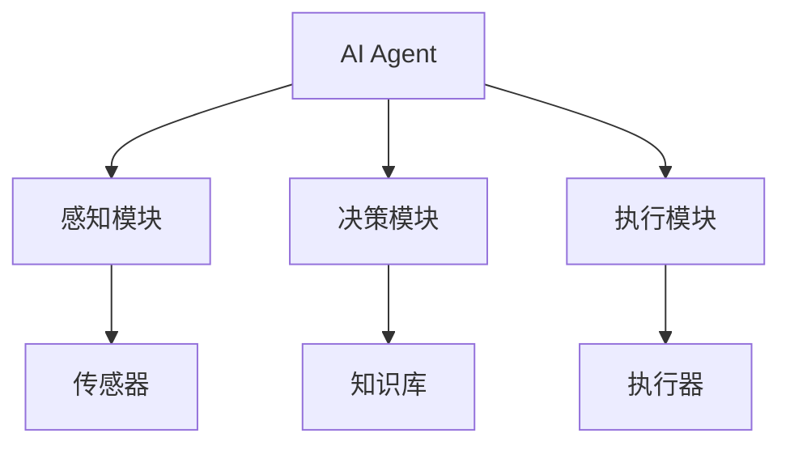
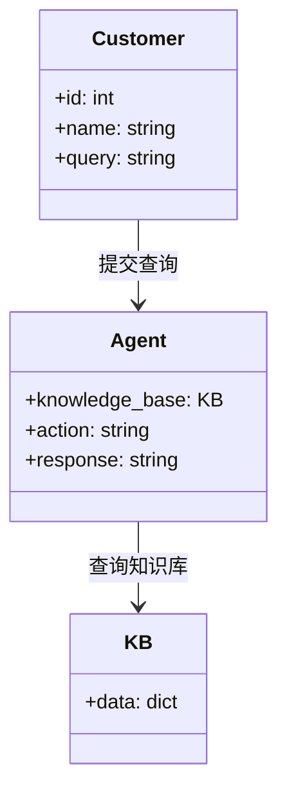
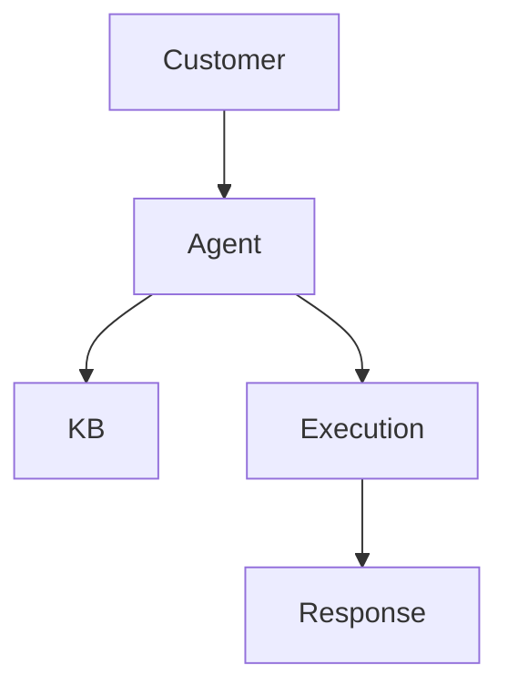
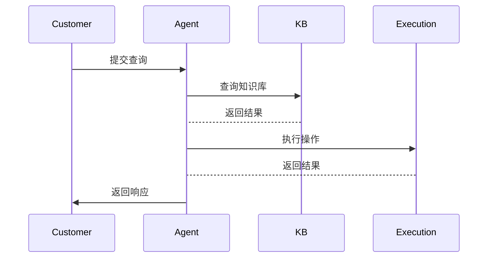

                 


# 展望未来：AI Agent技术发展趋势与机遇

## 关键词：AI Agent, 人工智能, 机器学习, 强化学习, 自然语言处理, 多模态交互

## 摘要：本文系统地探讨了AI Agent技术的发展趋势与机遇，从核心概念到算法原理，再到实际应用，详细分析了AI Agent在感知、决策、执行等环节的关键技术，并展望了其未来发展方向。文章通过案例分析和系统设计，揭示了AI Agent在智能助手、智能客服、自动驾驶等领域的广泛应用潜力。

---

## 第1章: AI Agent概述

### 1.1 AI Agent的基本概念

#### 1.1.1 什么是AI Agent
AI Agent（人工智能代理）是一种能够感知环境、自主决策并执行任务的智能实体。它通过传感器获取信息，利用算法进行分析和决策，并通过执行器与环境交互。

#### 1.1.2 AI Agent的定义与特点
- **定义**：AI Agent是一个能够感知环境、自主决策并执行任务的智能系统。
- **特点**：
  - **自主性**：无需外部干预，自主完成任务。
  - **反应性**：能够实时感知环境变化并做出反应。
  - **目标导向**：基于目标驱动决策和行动。
  - **学习能力**：通过经验改进性能。

#### 1.1.3 AI Agent的核心功能与应用场景
- **核心功能**：
  - 感知：通过传感器或数据源获取环境信息。
  - 决策：基于感知信息进行分析和选择。
  - 执行：通过执行器或接口完成任务。
- **应用场景**：
  - 智能助手（如Siri、Alexa）。
  - 智能客服系统。
  - 自动驾驶技术。
  - 智慧城市管理。

### 1.2 AI Agent的背景与现状

#### 1.2.1 AI Agent的发展历程
- **早期阶段**：20世纪60年代，AI Agent的概念首次提出，主要用于解决简单问题。
- **发展时期**：20世纪90年代，AI Agent技术逐渐成熟，应用于专家系统和机器人控制。
- **当前阶段**：随着深度学习和强化学习的发展，AI Agent在复杂场景中展现出强大的能力。

#### 1.2.2 当前AI Agent技术的应用场景
- **智能助手**：帮助用户完成日常任务，如信息查询、日程管理。
- **智能客服**：提供自动化的客户支持服务。
- **自动驾驶**：实现车辆的自主导航和决策。
- **智慧城市**：优化城市交通、能源管理等系统。

#### 1.2.3 AI Agent技术的挑战与瓶颈
- **技术挑战**：
  - 复杂环境下的决策能力不足。
  - 多模态数据处理能力有限。
  - 跨平台协作的兼容性问题。
- **应用瓶颈**：
  - 数据隐私和安全问题。
  - 算法的可解释性不足。
  - 伦理和法律问题。

### 1.3 AI Agent的技术架构

#### 1.3.1 AI Agent的分层架构
AI Agent通常采用分层架构，包括感知层、决策层和执行层。

- **感知层**：负责环境信息的获取和处理。
- **决策层**：基于感知信息进行分析和决策。
- **执行层**：通过执行器完成任务。

#### 1.3.2 各层的功能与交互关系
- **感知层**：
  - 使用传感器或API获取环境数据。
  - 对数据进行预处理和特征提取。
- **决策层**：
  - 应用算法（如强化学习、DQN）进行决策。
  - 输出决策结果。
- **执行层**：
  - 通过执行器或接口完成任务。
  - 反馈执行结果到感知层。

#### 1.3.3 架构设计的原则与注意事项
- **模块化设计**：各层独立，便于维护和扩展。
- **数据流管理**：确保数据在各层之间高效流动。
- **容错设计**：考虑异常情况的处理机制。

---

## 第2章: AI Agent的核心功能与应用场景

### 2.1 AI Agent的核心功能模块

#### 2.1.1 感知模块
- **功能**：获取环境信息，如视觉、听觉、触觉等。
- **实现**：使用传感器、摄像头、麦克风等设备。
- **案例**：自动驾驶中的环境感知模块。

#### 2.1.2 决策模块
- **功能**：基于感知信息进行分析和决策。
- **实现**：使用强化学习、DQN等算法。
- **案例**：智能助手的对话决策。

#### 2.1.3 执行模块
- **功能**：根据决策结果执行任务。
- **实现**：通过执行器或接口完成动作。
- **案例**：智能客服的自动回复。

### 2.2 AI Agent的主要应用场景

#### 2.2.1 智能助手
- **功能**：提供信息查询、日程管理等服务。
- **案例**：苹果Siri、亚马逊Alexa。

#### 2.2.2 智能客服
- **功能**：提供自动化的客户支持服务。
- **案例**：银行自动问答系统。

#### 2.2.3 自动驾驶
- **功能**：实现车辆的自主导航和决策。
- **案例**：特斯拉FSD系统。

#### 2.2.4 智慧城市
- **功能**：优化城市交通、能源管理等系统。
- **案例**：智能交通管理系统。

### 2.3 AI Agent的未来发展趋势

#### 2.3.1 多模态交互
- **趋势**：结合视觉、听觉等多种交互方式，提升用户体验。
- **案例**：支持语音和手势交互的智能助手。

#### 2.3.2 自适应学习
- **趋势**：通过在线学习和微调，提升模型的适应能力。
- **案例**：动态调整策略的自动驾驶系统。

#### 2.3.3 跨平台协作
- **趋势**：实现不同平台和系统的协同工作。
- **案例**：跨平台的智能安防系统。

---

## 第3章: AI Agent的核心概念与联系

### 3.1 AI Agent的核心概念原理

#### 3.1.1 感知与理解
- **感知**：通过传感器获取环境信息。
- **理解**：对感知信息进行语义分析和特征提取。

#### 3.1.2 决策与规划
- **决策**：基于感知信息做出最优选择。
- **规划**：制定执行任务的详细计划。

#### 3.1.3 执行与反馈
- **执行**：通过执行器完成任务。
- **反馈**：收集执行结果，用于优化决策。

### 3.2 AI Agent的核心概念对比表

| 类别 | 对比内容 | 传统AI | AI Agent |
|------|----------|--------|----------|
| 功能 | 独立性   | 单一功能 | 多功能集成 |
| 决策 | 策略     | 预设规则 | 自主学习 |
| 执行 | 执行方式 | 手动操作 | 自动执行 |

### 3.3 AI Agent的实体关系图



---

## 第4章: AI Agent的算法原理与实现

### 4.1 AI Agent的算法原理

#### 4.1.1 强化学习
- **定义**：通过试错机制，学习最优策略。
- **数学模型**：
  - 状态空间S：$s \in S$。
  - 行动空间A：$a \in A$。
  - 奖励函数R：$r = R(s, a)$。
  - 策略π：$\pi(a|s)$。

#### 4.1.2 DQN算法
- **流程**：
  1. 环境感知，获取状态s。
  2. 根据策略选择动作a。
  3. 执行动作a，获取奖励r和新状态s'。
  4. 更新Q值：$Q(s, a) = Q(s, a) + \alpha (r + \gamma \max Q(s', a') - Q(s, a))$。

### 4.2 AI Agent的实现步骤

#### 4.2.1 环境安装
```bash
pip install gym numpy tensorflow
```

#### 4.2.2 核心代码实现
```python
import gym
import numpy as np
import tensorflow as tf

class AI_Agent:
    def __init__(self, state_space, action_space):
        self.state_space = state_space
        self.action_space = action_space
        self.model = self.build_model()
    
    def build_model(self):
        model = tf.keras.Sequential([
            tf.keras.layers.Dense(64, activation='relu', input_dim=self.state_space),
            tf.keras.layers.Dense(self.action_space, activation='linear')
        ])
        return model

    def act(self, state):
        prediction = self.model.predict(np.array([state]))
        return np.argmax(prediction[0])

# 初始化环境和AI Agent
env = gym.make('CartPole-v0')
agent = AI_Agent(env.observation_space.shape[0], env.action_space.n)

# 训练过程
for episode in range(1000):
    state = env.reset()
    total_reward = 0
    done = False
    while not done:
        action = agent.act(state)
        next_state, reward, done, info = env.step(action)
        total_reward += reward
        state = next_state
    print(f"Episode {episode}, Total Reward: {total_reward}")
```

#### 4.2.3 案例分析
通过训练AI Agent在CartPole环境中的表现，展示强化学习算法的有效性。随着训练的进行，AI Agent能够逐渐掌握平衡杆的任务。

---

## 第5章: AI Agent的系统分析与架构设计

### 5.1 智能客服系统的场景介绍

#### 5.1.1 项目介绍
智能客服系统通过自然语言处理和强化学习，实现自动化的客户支持服务。

#### 5.1.2 领域模型类图


#### 5.1.3 系统架构图


#### 5.1.4 系统交互序列图


---

## 第6章: 项目实战

### 6.1 智能客服系统的实战

#### 6.1.1 环境安装
```bash
pip install transformers gym
```

#### 6.1.2 核心代码实现
```python
from transformers import pipeline
import gym

class Agent:
    def __init__(self):
        self.nlp = pipeline("text-classification")

    def process_query(self, query):
        result = self.nlp(query)
        return result[0]['label']

# 初始化环境和Agent
env = gym.make('CustomerService-v0')
agent = Agent()

# 模拟对话
while True:
    query = input("请输入您的问题：")
    response = agent.process_query(query)
    print(f"系统回复：{response}")
```

#### 6.1.3 案例分析
通过模拟对话展示智能客服系统的实际应用，分析不同输入对系统响应的影响。

---

## 第7章: 最佳实践

### 7.1 小结
AI Agent技术正在快速发展，其应用前景广阔。通过强化学习和多模态交互，AI Agent将更加智能化和人性化。

### 7.2 注意事项
- **数据安全**：确保用户数据的隐私和安全。
- **算法可解释性**：提升决策过程的透明度。
- **跨平台协作**：加强不同系统之间的兼容性。

### 7.3 拓展阅读
- 推荐书籍：《强化学习（深入浅出）》。
- 推荐论文：DeepMind的DQN论文。

---

## 结语

AI Agent技术的发展正推动人工智能迈向新的高度。通过不断的技术创新和应用场景的拓展，AI Agent将在未来发挥更大的作用，为人类社会带来更多的便利和进步。

--- 

（本文完）

