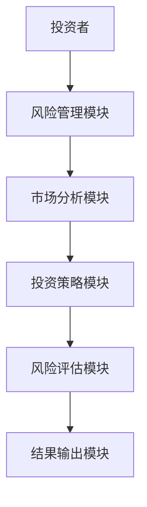
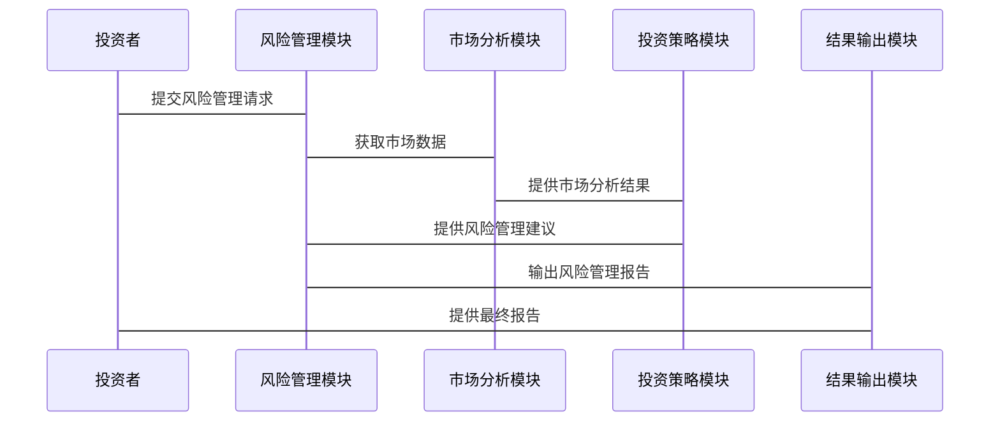

                 


# 第四章: 加密货币市场的风险管理与投资策略

## 4.1 加密货币市场的风险管理

### 4.1.1 加密货币市场的波动性分析

#### 4.1.1.1 加密货币价格波动的驱动因素

- 市场供需变化
- 市场情绪波动
- 政策监管影响
- 技术发展和创新

#### 4.1.1.2 波动性对投资者的影响

- 短期收益机会
- 长期投资风险
- 心理压力和决策偏差

### 4.1.2 风险管理策略

#### 4.1.2.1 分散投资原则

- 不将所有资金投入单一加密货币
- 分散投资于不同类型的加密资产
- 结合传统资产进行配置

#### 4.1.2.2 设置止损和止盈点

- 什么是止损和止盈
- 如何确定合理的止损点
- 止损和止盈的执行策略

#### 4.1.2.3 风险评估与监控

- 定期评估投资组合风险
- 监控市场动态和政策变化
- 保持灵活性和适应性

### 4.1.3 巴菲特与芒格的风险管理智慧

#### 4.1.3.1 巴菲特的风险管理理念

- 避免高风险投资
- 保持充足的流动性
- 留足安全边际

#### 4.1.3.2 芒格的风险管理方法

- 识别和避免“愚人金矿”
- 保持理性思考
- 避免从众心理

#### 4.1.3.3 结合两者的风险管理策略

- 巴菲特的保守主义与芒格的理性主义结合
- 在加密货币投资中应用这些策略

## 4.2 加密货币的投资策略

### 4.2.1 长期投资策略

#### 4.2.1.1 选择优质加密资产

- 评估项目的长期价值
- 考察团队背景和项目发展
- 分析技术的创新性和实用性

#### 4.2.1.2 价值投资的适用性

- 加密货币市场的特点是否适合价值投资
- 选择具有长期增长潜力的项目
- 耐心持有优质资产

### 4.2.2 短期交易策略

#### 4.2.2.1 技术分析的应用

- K线图、均线、成交量等技术指标的使用
- 常用的技术分析方法和工具
- 通过技术分析识别买卖信号

#### 4.2.2.2 市场情绪的利用

- 利用市场情绪进行逆向投资
- 观察市场参与者的心理变化
- 在市场恐慌时寻找机会

### 4.2.3 组合投资策略

#### 4.2.3.1 分散投资的重要性

- 避免过度集中风险
- 平衡不同类型资产
- 考虑资产的相关性

#### 4.2.3.2 如何构建加密资产组合

- 根据风险承受能力分配资产
- 选择不同类型的加密货币
- 定期审视和调整投资组合

## 4.3 巴菲特与芒格的投资策略对加密货币的启示

### 4.3.1 巴菲特的价值投资理念

- 寻找具有长期价值的资产
- 避免短期投机行为
- 保持投资的纪律性

### 4.3.2 芒格的理性决策方法

- 坚持基本面分析
- 避免情绪化决策
- 依靠长期的市场观察和研究

### 4.3.3 结合两人策略的具体方法

- 在加密货币投资中，如何体现价值投资的原则
- 如何保持理性和纪律性
- 如何在高波动市场中保持冷静

### 4.3.4 需要注意的事项

- 加密货币市场的特殊性
- 理论与实践的结合
- 不断学习和适应市场变化

## 4.4 风险管理与投资策略的综合运用

### 4.4.1 风险管理是投资策略的基础

- 风险管理如何影响投资策略的选择
- 如何在实际操作中平衡风险与收益
- 风险管理工具和方法的综合运用

### 4.4.2 投资策略是风险管理的指南

- 不同的投资策略如何应对不同的风险
- 风险管理如何指导投资策略的调整
- 如何通过策略选择控制风险

### 4.4.3 巴菲特与芒格策略的综合应用

- 在加密货币投资中，如何综合运用两人的策略
- 如何在实际操作中体现这些策略
- 如何通过策略的综合应用降低风险，提高收益

---

# 第五章: 系统分析与架构设计方案

## 5.1 问题场景介绍

### 5.1.1 加密货币市场的复杂性

- 市场参与者众多
- 价格波动剧烈
- 监管不确定性

### 5.1.2 投资者面临的挑战

- 信息不对称
- 风险难以量化
- 市场情绪影响决策

## 5.2 项目介绍

### 5.2.1 项目目标

- 构建一个加密货币风险管理与投资策略的分析框架
- 提供基于巴菲特与芒格投资理念的投资策略建议
- 为投资者提供实用的决策支持工具

### 5.2.2 项目范围

- 风险管理框架的设计
- 投资策略的制定
- 系统架构的设计与实现

### 5.2.3 项目背景

- 当前加密货币市场的特点
- 投资者的需求与痛点
- 现有解决方案的不足

## 5.3 系统功能设计

### 5.3.1 领域模型设计

#### 5.3.1.1 实体关系图（ER图）

```mermaid
erDiagram
    actor 投资者
    actor 市场分析员
    actor 风险管理者
    investor --> 加密资产: 持有
    investor --> 风险管理策略: 使用
    market_analyst --> 市场数据: 分析
    risk_manager --> 风险评估: 实施
    市场数据 --> 风险评估: 基于市场数据
    加密资产 --> 风险评估: 基于资产特性
```

### 5.3.2 系统架构设计

#### 5.3.2.1 系统架构图



## 5.4 系统架构设计

### 5.4.1 系统架构设计

- **分层架构**
  - 数据层：数据存储和管理
  - 业务逻辑层：核心业务逻辑处理
  - 表现层：用户界面和交互

### 5.4.2 关键模块设计

- **风险管理模块**
  - 风险评估
  - 风险预警
  - 风险控制

- **市场分析模块**
  - 数据采集
  - 数据处理
  - 数据分析

- **投资策略模块**
  - 策略制定
  - 策略执行
  - 策略调整

## 5.5 系统接口设计

### 5.5.1 系统接口设计

- **外部接口**
  - 与加密货币交易所的接口
  - 与市场数据供应商的接口
  - 与投资工具提供商的接口

### 5.5.2 接口交互设计

- 数据输入接口
- 数据输出接口
- 用户交互接口

## 5.6 系统交互设计

### 5.6.1 系统交互流程



---

# 第六章: 项目实战

## 6.1 环境安装与配置

### 6.1.1 安装必要的工具和库

- Python编程环境
- 数据分析库（如Pandas、NumPy）
- 数据可视化工具（如Matplotlib、Seaborn）
- 加密货币数据源接口（如CoinMarketCap API）

### 6.1.2 安装步骤

1. 安装Python和pip
2. 安装所需的库：
   ```bash
   pip install pandas numpy matplotlib seaborn requests
   ```

## 6.2 核心系统实现

### 6.2.1 加密货币数据的获取与处理

#### 6.2.1.1 数据获取代码

```python
import requests
import pandas as pd

def get_crypto_data(api_key):
    url = "https://api.coinmarketcap.com/v2/ticker/?limit=10"
    headers = {
        "X-CMC-pro PublicKey": api_key
    }
    response = requests.get(url, headers=headers)
    data = response.json()
    df = pd.DataFrame(data)
    return df

# 示例用法
api_key = "your_api_key"
crypto_data = get_crypto_data(api_key)
print(crypto_data.head())
```

#### 6.2.1.2 数据处理与分析

```python
import pandas as pd
import matplotlib.pyplot as plt
import seaborn as sns

# 假设我们已经获取了加密货币数据
crypto_data = get_crypto_data(api_key)

# 数据清洗
crypto_data.dropna(inplace=True)
crypto_data['price'] = crypto_data['price'].astype(float)

# 数据可视化
plt.figure(figsize=(10, 6))
sns.lineplot(x='name', y='price', data=crypto_data)
plt.title('加密货币价格走势')
plt.xlabel('币种')
plt.ylabel('价格（美元）')
plt.show()
```

### 6.2.2 风险评估模型的实现

#### 6.2.2.1 风险评估模型

```python
def calculate_volatility(prices):
    returns = prices.pct_change()
    volatility = returns.std() * 100
    return volatility

# 示例用法
prices = crypto_data['price']
volatility = calculate_volatility(prices)
print(f'价格波动率: {volatility:.2f}%')
```

#### 6.2.2.2 基于波动率的风险评分

```python
def risk_score(volatility, market_cap):
    if volatility < 10 and market_cap > 1000000000:
        return '低风险'
    elif 10 <= volatility < 20 and market_cap > 500000000:
        return '中等风险'
    else:
        return '高风险'

# 示例用法
market_cap = crypto_data['market_cap']
risk = risk_score(volatility, market_cap)
print(f'风险等级: {risk}')
```

### 6.2.3 投资策略的实现

#### 6.2.3.1 基于价值投资的策略

```python
def value_investment_strategy(data, threshold=0.2):
    # 计算市盈率或其他估值指标
    # 这里简化为基于价格波动的判断
    buy_signals = data[data['price'].pct_change().mean() > threshold]
    return buy_signals

# 示例用法
buy_signals = value_investment_strategy(crypto_data)
print('买入信号币种:', buy_signals['name'].tolist())
```

#### 6.2.3.2 基于技术分析的策略

```python
def technical_analysis_strategy(data, window=20):
    # 简单的均线策略
    data['SMA'] = data['price'].rolling(window).mean()
    buy_signals = data[data['price'] < data['SMA']]
    return buy_signals

# 示例用法
buy_signals = technical_analysis_strategy(crypto_data)
print('技术分析买入信号币种:', buy_signals['name'].tolist())
```

### 6.2.4 风险管理策略的实现

#### 6.2.4.1 设置止损和止盈点

```python
def set_stop_loss(data, stop_loss=0.05):
    data['stop_loss'] = data['price'] * (1 - stop_loss)
    return data

# 示例用法
data_with_sl = set_stop_loss(crypto_data)
print(data_with_sl[['name', 'price', 'stop_loss']].head())
```

#### 6.2.4.2 风险敞口管理

```python
def manage_position_size(data, risk_per_trade=0.01):
    # 假设每笔交易的风险敞口不超过1%
    position_size = data['market_cap'] * risk_per_trade
    return position_size

# 示例用法
position_size = manage_position_size(crypto_data)
print('每笔交易的仓位:', position_size)
```

## 6.3 项目小结与优化建议

### 6.3.1 项目小结

- 成功实现了加密货币数据的获取与处理
- 实现了基本的风险评估模型和投资策略
- 验证了风险管理策略的有效性

### 6.3.2 优化建议

- 增加更多的市场数据源
- 引入更复杂的算法模型
- 实现实时数据监控和动态调整
- 增加用户友好的界面

---

# 第七章: 总结与展望

## 7.1 总结

### 7.1.1 巴菲特与芒格的投资理念对加密货币的启示

- 保持谨慎，避免盲目跟风
- 重视基本面分析，选择优质资产
- 风险管理是投资成功的关键

### 7.1.2 加密货币市场的特殊性与挑战

- 高波动性和不稳定性
- 缺乏有效的监管框架
- 技术和市场的快速变化

## 7.2 展望

### 7.2.1 加密货币的未来发展趋势

- 技术的不断进步
- 市场的逐步成熟
- 监管的逐步完善

### 7.2.2 巴菲特与芒格策略的未来发展

- 加密货币市场的价值投资机会
- 风险管理在市场中的重要性
- 投资者教育与市场成熟的关系

## 7.3 最佳实践 tips

### 7.3.1 加密货币投资的注意事项

- 保持理性，避免情绪化决策
- 做好充分的研究和分析
- 坚持分散投资原则

### 7.3.2 风险管理的实用建议

- 设置合理的止损和止盈点
- 定期评估和调整投资组合
- 保持对市场的敏感性和灵活性

### 7.3.3 长期观察与学习

- 关注市场动态和政策变化
- 学习先进的投资理念和方法
- 总结经验，不断优化投资策略

---

# 第八章: 结语

## 8.1 加密货币市场的未来展望

- 随着技术的发展和市场的成熟，加密货币有可能成为主流资产之一
- 但投资者需要保持谨慎，遵循科学的投资策略
- 巴菲特与芒格的智慧将继续指导我们在复杂的市场中做出明智的决策

## 8.2 对投资者的最后寄语

- 保持理性，避免盲目跟风
- 坚持学习，提升自己的投资能力
- 做好风险管理，保护自己的投资本金

---

# 结束语

感谢您阅读《巴菲特-芒格对加密货币的看法：保持谨慎态度》。希望本书的内容能够为您提供有价值的见解和实用的策略，帮助您在加密货币投资中做出明智的决策。

