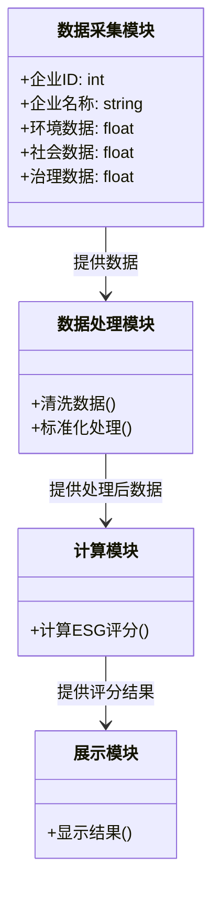

                 


# 巴菲特-芒格的ESG投资观：平衡利润和社会责任

> 关键词：巴菲特,芒格,ESG投资,环境,社会,公司治理,价值投资

> 摘要：本文深入探讨了巴菲特和芒格的投资理念，特别是他们在环境、社会和公司治理（ESG）方面的见解。通过分析他们的投资策略，本文揭示了如何在追求利润的同时，兼顾社会责任和可持续发展。文章从ESG投资的背景、核心概念、巴菲特与芒格的ESG观点、算法原理、系统架构、项目实战以及总结等多个维度展开，为读者提供了全面而深入的分析。

---

## 第1章：ESG投资的起源与发展

### 1.1 ESG投资的起源
#### 1.1.1 ESG概念的提出
ESG（环境、社会、治理）投资是一种关注企业在可持续性方面表现的投资策略。环境（E）关注企业的环保表现，社会（S）关注企业在社会责任方面的表现，治理（G）关注企业内部治理的透明度和道德性。ESG投资起源于20世纪60年代的美国，当时社会运动和环保意识的兴起推动了投资者关注企业对社会和环境的影响。

#### 1.1.2 ESG投资的发展历程
随着全球气候变化、社会不平等等问题的加剧，ESG投资逐渐从边缘走向主流。机构投资者开始意识到，企业的可持续性不仅关系到社会和环境，也直接影响企业的长期价值和风险敞口。

#### 1.1.3 当前ESG投资的现状
目前，ESG投资已成为全球投资领域的重要趋势。越来越多的投资者将ESG因素纳入投资决策，尤其是在气候变化、社会责任和技术伦理等领域。ESG投资的市场规模持续扩大，相关数据和工具也日益完善。

### 1.2 巴菲特与芒格的投资理念
#### 1.2.1 巴菲特的价值投资理念
巴菲特的价值投资理念强调以合理的价格投资于具有持续竞争优势和良好治理的企业。他注重企业的基本面分析，尤其是企业的盈利能力和财务健康状况。

#### 1.2.2 巴菲特对企业的长期价值关注
巴菲特认为，企业的长期价值取决于其核心竞争力、市场地位和管理团队的质量。他倾向于投资那些能够持续创造价值的企业，而不是短期炒作的股票。

#### 1.2.3 巴菲特对社会影响的隐性考量
尽管巴菲特并未公开强调ESG因素，但他投资的公司如比亚迪，体现了他对环保和社会责任的关注。比亚迪在新能源汽车领域的领先地位，符合巴菲特对长期价值和可持续发展的追求。

### 1.3 巴菲特与芒格的ESG观点对比
#### 1.3.1 巴菲特对ESG投资的隐性支持
巴菲特虽然未明确将ESG作为投资标准，但他的投资选择往往体现了对环境和社会责任的关注。例如，他对伯克希尔哈撒韦的投资组合中，包括了多家注重可持续发展的企业。

#### 1.3.2 芒格对ESG投资的系统性分析
芒格的多元思维模型强调企业在社会和环境方面的责任。他倾向于投资那些在公司治理和社会责任方面表现良好的企业。例如，他公开批评亚马逊在劳动条件和社会责任方面的不足。

---

## 第2章：ESG投资的核心概念

### 2.1 ESG的定义与内涵
#### 2.1.1 环境（E）的定义与重要性
环境因素关注企业在资源使用、碳排放、污染控制等方面的表现。良好的环境表现不仅有助于企业的可持续发展，还能降低企业的法律和声誉风险。

#### 2.1.2 社会（S）的定义与重要性
社会因素关注企业在员工权益、社区参与、产品安全等方面的表现。企业通过履行社会责任，可以增强品牌形象，提升顾客忠诚度。

#### 2.1.3 公司治理（G）的定义与重要性
公司治理关注企业的董事会结构、高管薪酬、股东权益等方面。良好的治理结构有助于提高企业的透明度和抗风险能力。

### 2.2 ESG投资的核心要素
#### 2.2.1 ESG核心要素的对比分析
| 要素 | 定义 | 关键指标 |
|------|------|----------|
| E    | 环境 | 碳排放、资源使用效率、环保合规性 |
| S    | 社会 | 员工权益、社区参与、产品安全 |
| G    | 治理 | 董事会结构、高管薪酬、股东权益 |

#### 2.2.2 ESG核心要素的ER图
```mermaid
erDiagram
    actor 投资者 {
        <属性> 企业ID
        <属性> 企业名称
    }
    actor 企业 {
        <属性> 环境表现
        <属性> 社会责任
        <属性> 公司治理
    }
    actor 评级机构 {
        <属性> 评级结果
    }
    投资者 --> 企业 : 评估
    企业 --> 评级机构 : 提交数据
    投资者 --> 评级机构 : 获取评级
```

### 2.3 ESG与企业价值的关系
#### 2.3.1 ESG对投资决策的影响
ESG因素已成为投资者评估企业价值的重要依据。越来越多的投资者将ESG评级作为投资决策的参考。

#### 2.3.2 ESG对企业长期价值的贡献
研究表明，ESG表现良好的企业在长期收益和风险控制方面更具优势。企业通过降低碳排放、优化治理结构和履行社会责任，可以提升品牌价值和客户忠诚度。

#### 2.3.3 ESG与企业风险管理的关系
ESG因素可以帮助企业识别和应对潜在风险，如环境法规变化、社会责任争议等。通过提前识别和管理这些风险，企业可以增强抗风险能力。

---

## 第3章：巴菲特与芒格的ESG投资理念分析

### 3.1 巴菲特的ESG投资理念
#### 3.1.1 巴菲特对ESG投资的隐性支持
巴菲特的投资选择往往体现了对ESG因素的关注。例如，他对比亚迪的投资不仅基于企业的财务表现，还基于其在新能源领域的领先地位和对环境的贡献。

#### 3.1.2 巴菲特对ESG投资的局限性
尽管巴菲特强调长期价值，但他在ESG投资上的隐性支持并未转化为系统的投资策略。这可能与他更关注财务表现和短期投资回报有关。

### 3.2 芒格的ESG投资理念
#### 3.2.1 芒格对ESG投资的系统性分析
芒格的多元思维模型强调企业在社会和环境方面的责任。他倾向于投资那些在公司治理和社会责任方面表现良好的企业。例如，他对亚马逊的批评反映了他对社会责任的高度重视。

#### 3.2.2 芒格对ESG投资的独特见解
芒格认为，企业的社会责任和环境表现是其长期价值的重要组成部分。他主张通过系统性分析这些因素来评估企业的投资价值。

### 3.3 巴菲特与芒格ESG投资理念的联系与区别
#### 3.3.1 联系
巴菲特和芒格都注重企业的长期价值和治理结构。他们的投资理念都强调对企业基本面的深入分析。

#### 3.3.2 区别
巴菲特更关注企业的财务表现和短期投资回报，而芒格则更关注企业的社会责任和环境表现。芒格的多元思维模型使他在ESG投资方面更具系统性和前瞻性。

---

## 第4章：ESG投资的算法原理

### 4.1 ESG评分算法
#### 4.1.1 算法概述
ESG评分算法通过对企业的环境、社会和治理表现进行量化评估，生成一个综合评分。评分通常基于标准化的指标和权重。

#### 4.1.2 算法步骤


#### 4.1.3 算法实现
```python
def calculate_esg_score(environment_score, social_score, governance_score):
    # 环境、社会、治理的权重
    weights = {'E': 0.4, 'S': 0.3, 'G': 0.3}
    # 计算综合评分
    esg_score = (environment_score * weights['E'] + 
                 social_score * weights['S'] + 
                 governance_score * weights['G'])
    return esg_score

# 示例数据
environment_score = 85
social_score = 90
governance_score = 80

# 计算ESG评分
esg_score = calculate_esg_score(environment_score, social_score, governance_score)
print(f"ESG综合评分：{esg_score}")
```

---

## 第5章：ESG投资的系统架构与设计方案

### 5.1 系统功能设计
#### 5.1.1 功能模块
- 数据采集模块：收集企业的环境、社会和治理数据。
- 数据处理模块：对数据进行清洗和标准化处理。
- 计算模块：基于算法计算ESG评分。
- 展示模块：将结果以可视化形式展示。

#### 5.1.2 系统功能模块的类图


### 5.2 系统架构设计
#### 5.2.1 系统架构图


---

## 第6章：ESG投资的项目实战

### 6.1 项目环境搭建
#### 6.1.1 环境要求
- Python 3.8+
- 数据处理工具（如Pandas）
- 数据可视化工具（如Matplotlib）

### 6.2 核心代码实现
#### 6.2.1 数据预处理
```python
import pandas as pd

# 加载数据
data = pd.read_csv('esg_data.csv')

# 数据清洗
data.dropna(inplace=True)
data = data[~data['行业'].isnull()]
```

#### 6.2.2 ESG评分计算
```python
def calculate_esg_score(environment_score, social_score, governance_score):
    weights = {'E': 0.4, 'S': 0.3, 'G': 0.3}
    return (environment_score * weights['E'] + 
            social_score * weights['S'] + 
            governance_score * weights['G'])

# 计算ESG评分
data['ESG评分'] = data.apply(lambda x: calculate_esg_score(x['环境得分'], x['社会得分'], x['治理得分']), axis=1)
```

### 6.3 案例分析
#### 6.3.1 案例选择
以某新能源企业为例，分析其ESG表现。该企业在环境、社会和治理方面的得分分别为85、90和80，综合评分为84.5。

#### 6.3.2 代码实现与分析
```python
# 可视化结果
import matplotlib.pyplot as plt

plt.bar(data['企业名称'], data['ESG评分'])
plt.title('企业ESG评分分布')
plt.xlabel('企业名称')
plt.ylabel('ESG评分')
plt.show()
```

---

## 第7章：总结与展望

### 7.1 总结
本文从ESG投资的背景、核心概念、巴菲特与芒格的ESG观点、算法原理、系统架构、项目实战等多个维度进行了深入分析。通过对比巴菲特和芒格的投资理念，揭示了他们在ESG投资上的异同点。同时，通过算法和系统设计，展示了如何将ESG因素纳入投资决策。

### 7.2 展望
未来，ESG投资将继续在全球范围内发展。随着技术的进步和数据的完善，ESG投资将更加精准和系统化。投资者需要更加关注企业的社会责任和环境表现，以实现长期价值和可持续发展。

### 7.3 最佳实践 Tips
- 数据源的选择：优先选择权威的ESG数据源。
- 模型优化：根据具体行业调整权重和指标。
- 动态调整：定期更新数据和模型，以应对变化的市场环境。

---

通过本文的分析，读者可以更好地理解巴菲特和芒格的ESG投资观，并将其应用于实际投资决策中。

