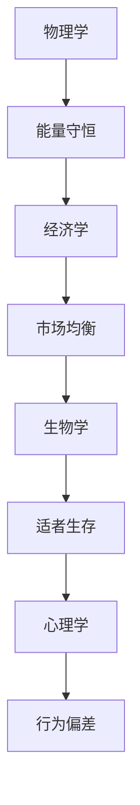

                 

# 巴菲特-芒格的人口老龄化投资：社会变迁中的机遇

## 关键词：巴菲特，芒格，人口老龄化，投资策略，价值投资，长期投资，社会变迁

## 摘要：人口老龄化是一个全球性的社会现象，对经济和投资领域产生了深远的影响。本文探讨了巴菲特和芒格在人口老龄化背景下的投资策略，分析了他们如何利用价值投资和多元思维模型捕捉这一社会变迁中的投资机会。通过数学模型和实际案例，本文详细阐述了如何在人口老龄化趋势中制定长期投资策略，为投资者提供了宝贵的见解和策略建议。

---

## 第一部分: 人口老龄化与投资的背景

### 第1章: 人口老龄化概述

#### 1.1 人口老龄化的基本概念

##### 1.1.1 人口老龄化定义
人口老龄化是指人口中老年人口比例增加，通常以65岁及以上人口占总人口比例来衡量。根据联合国的定义，当一个国家或地区的老年人口比例达到7%以上时，即被视为进入老龄化社会。

##### 1.1.2 人口老龄化的主要特征
- 老年人口比例增加
- 劳动力人口比例下降
- 家庭结构变化（如“421”家庭模式）
- 医疗需求增加

##### 1.1.3 人口老龄化对社会经济的影响
- 经济增长放缓
- 社会保障压力加大
- 医疗支出增加
- 投资需求变化

#### 1.2 巴菲特与芒格的投资哲学

##### 1.2.1 巴菲特的价值投资理念
巴菲特的价值投资理念强调寻找具有持续竞争优势的企业，以合理的价格买入并长期持有。他注重企业的内在价值，而非市场波动。

##### 1.2.2 芒格的多元思维模型
芒格提倡多元思维模型，认为投资者需要跨学科思考，将物理学、心理学、经济学等知识融入投资决策中。

##### 1.2.3 两人投资哲学的核心要素对比
| 投资者 | 投资理念 | 关注点 | 核心要素 |
|--------|----------|--------|----------|
| 巴菲特 | 价值投资 | 内在价值、安全边际 | 股价与价值的偏差 |
| 芒格 | 多元思维 | 跨学科视角、边缘案例 | 思维模型的互补性 |

---

### 第2章: 人口老龄化与投资机遇

#### 2.1 人口老龄化对投资的影响

##### 2.1.1 老龄化对传统行业的影响
- 传统制造业：需求减少
- 房地产行业：老龄化导致购房需求下降
- 汽车行业：老年人对公共交通依赖增加

##### 2.1.2 老龄化催生的新产业机会
- 医疗健康：养老服务、医疗设备
- 金融科技：老年人更倾向于稳健投资
- 教育培训：老年教育市场潜力大

##### 2.1.3 老龄化对金融市场的长期影响
- 股票市场：低增长环境下，优质企业更具吸引力
- 债券市场：老龄化导致债券需求增加
- 资本流动：资金流向防御性资产

#### 2.2 巴菲特与芒格的投资策略

##### 2.2.1 巴菲特的长期价值投资策略
巴菲特在老龄化背景下更倾向于投资具有持续增长能力的公司，尤其是那些能够满足老年人需求的行业。

##### 2.2.2 芒格的跨学科思维与投资决策
芒格通过多元思维模型，能够更全面地评估老龄化对不同行业的影响，从而做出更明智的投资决策。

##### 2.2.3 两人投资策略的异同点
- **相同点**：都注重长期投资，关注企业基本面。
- **不同点**：巴菲特更注重财务指标，芒格更注重跨学科分析。

---

## 第三部分: 巴菲特与芒格的投资策略

### 第4章: 巴菲特的价值投资策略

#### 4.1 巴菲特的价值投资理论

##### 4.1.1 股票的内在价值计算
巴菲特认为股票的内在价值是其未来现金流的现值。内在价值公式为：
$$ V = \sum_{t=1}^{\infty} \frac{CF_t}{(1 + r)^t} $$
其中，\( CF_t \) 是第 \( t \) 年的现金流，\( r \) 是折现率。

##### 4.1.2 安全边际的概念与应用
安全边际是股票市场价格与其内在价值之间的差距。巴菲特建议以低于内在价值的价格买入股票。

##### 4.1.3 长期投资与复利效应
巴菲特强调长期投资，利用复利效应实现财富增长。复利计算公式为：
$$ FV = PV \times (1 + r)^n $$
其中，\( FV \) 是终值，\( PV \) 是现值，\( r \) 是年化收益率，\( n \) 是投资年数。

#### 4.2 巴菲特投资策略的数学模型

##### 4.2.1 内在价值公式
$$ V = \frac{CF}{r - g} $$
其中，\( CF \) 是稳定现金流，\( r \) 是折现率，\( g \) 是现金流增长率。

##### 4.2.2 安全边际计算方法
$$ \text{安全边际} = V_{\text{内在}} - P $$
其中，\( V_{\text{内在}} \) 是内在价值，\( P \) 是市场价格。

---

### 第5章: 芒格的多元思维模型

#### 5.1 芒格的多元思维模型

##### 5.1.1 多元思维模型的定义
多元思维模型是一种通过多个学科的视角分析问题的方法，帮助投资者避免单一思维的局限性。

##### 5.1.2 多元思维模型的核心要素
- **物理学**：能量守恒定律
- **心理学**：行为偏差
- **经济学**：市场均衡
- **生物学**：适者生存

##### 5.1.3 多元思维模型的应用场景
- **风险管理**：识别潜在风险
- **投资决策**：评估企业价值
- **市场预测**：分析行业趋势

#### 5.2 芒格思维模型的数学分析

##### 5.2.1 多元回归模型
$$ y = \beta_0 + \beta_1x_1 + \beta_2x_2 + \dots + \beta_nx_n + \epsilon $$
其中，\( y \) 是因变量，\( x_i \) 是自变量，\( \beta_i \) 是回归系数，\( \epsilon \) 是误差项。

##### 5.2.2 思维模型
使用Mermaid绘制的思维模型图，展示各学科之间的关系。

---

### 第6章: 巴菲特与芒格的投资策略在人口老龄化中的应用

#### 6.1 投资案例分析

##### 6.1.1 老龄化背景下的医疗健康投资
巴菲特投资的医疗设备公司案例，分析其内在价值和竞争优势。

##### 6.1.2 芒格的多元化投资组合
芒格通过多元思维模型分析的金融科技公司案例，展示其投资决策过程。

---

## 结语

人口老龄化是一个不可逆转的社会趋势，投资者需要调整策略以应对这一挑战。巴菲特和芒格的投资哲学为我们提供了宝贵的启示，尤其是在长期投资和价值投资方面。通过深入分析人口老龄化对各行业的影响，投资者可以更好地把握投资机会，实现长期稳健的收益。

---

通过以上分析，我们可以看到，巴菲特和芒格的投资策略在人口老龄化背景下具有显著的优势。他们不仅关注企业的内在价值，还能够通过多元思维模型全面评估投资机会。未来，随着人口老龄化的加剧，投资者需要更加注重长期投资和风险管理，以应对不断变化的市场环境。

