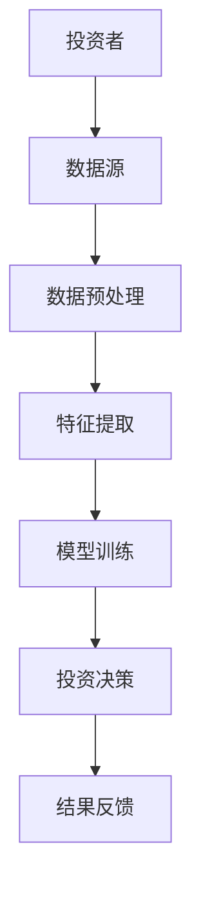

                 

# 巴菲特-芒格的人工智能伦理投资：技术发展与社会影响

## 关键词：
- 人工智能
- 投资伦理
- 巴菲特
- 芒格
- 价值投资
- 风险管理

## 摘要：
本文探讨了人工智能技术在投资领域中的应用及其对投资伦理的影响。结合巴菲特和芒格的投资理念，分析了人工智能如何改变投资方式，并提出了在技术发展与社会影响之间寻求平衡的伦理框架。通过技术分析和案例研究，本文揭示了人工智能在投资中的潜在风险与挑战，并提出了相应的解决方案。

---

## 第一部分：引言

### 1.1 人工智能与投资伦理的背景
- 人工智能技术的快速发展为投资领域带来了革新，但也引发了关于技术与伦理的深刻讨论。
- 本文从技术与伦理的双重角度，探讨人工智能在投资中的应用及其对投资伦理的挑战。

### 1.2 巴菲特与芒格的投资理念
- 巴菲特的价值投资理论强调长期、稳健和人性化的投资策略。
- 芒格的多元思维模型为投资决策提供了哲学和方法论的支持。

### 1.3 人工智能与投资方式的变革
- 人工智能通过数据分析和预测模型，改变了传统投资方式。
- 技术进步与伦理约束之间的平衡是本文的核心问题。

---

## 第二部分：人工智能在投资中的技术分析

### 2.1 人工智能算法的核心原理
- 机器学习算法的数学模型：以线性回归为例，公式为 $$y = \beta_0 + \beta_1x + \epsilon$$，其中 $$\beta_0$$ 和 $$\beta_1$$ 是模型参数，$$x$$ 是输入变量，$$y$$ 是输出变量，$$\epsilon$$ 是误差项。
- 深度学习网络的结构：通过多层神经网络实现复杂模式识别，如使用卷积神经网络（CNN）进行图像识别。

### 2.2 人工智能系统的架构设计

### 2.3 人工智能在投资中的应用场景
- **数据驱动的投资决策**：通过大数据分析优化投资组合。
- **风险管理**：利用AI预测市场波动并制定风险控制策略。

---

## 第三部分：人工智能投资的伦理挑战

### 3.1 人工智能决策的透明度问题
- **算法的可解释性**：黑箱算法的解释性难题。
- **数据偏差与算法偏见**：如何减少数据偏差对投资决策的影响。

### 3.2 人工智能投资的责任归属
- **责任主体的划分**：投资者、开发者与监管机构的责任划分。
- **风险管理的伦理要求**：如何在技术驱动下保持投资决策的稳健性。

---

## 第四部分：技术与伦理的结合

### 4.1 人工智能算法的伦理评估
- **伦理评估指标**：包括公平性、透明性和可解释性。
- **算法优化的伦理约束**：在技术优化中考虑伦理因素。

### 4.2 人工智能系统的伦理设计
- **伦理驱动的系统设计**：将伦理原则嵌入系统架构。
- **系统功能的伦理考量**：确保技术应用符合社会伦理标准。

---

## 第五部分：案例分析与未来展望

### 5.1 案例分析：人工智能在投资中的实际应用
- **案例一**：利用AI进行股票预测的案例分析。
- **案例二**：AI在风险管理中的应用及其伦理挑战。

### 5.2 未来展望
- **技术发展**：人工智能在投资中的进一步应用。
- **伦理框架的完善**：构建技术与伦理平衡的投资模式。

---

## 第六部分：小结与建议

### 6.1 小结
- 人工智能为投资领域带来了巨大变革，但也带来了伦理挑战。
- 巴菲特和芒格的投资理念为技术驱动的投资提供了重要的伦理指导。

### 6.2 建议
- **技术层面**：提升算法的透明度和可解释性。
- **伦理层面**：建立完善的投资伦理框架，确保技术应用的合规性。

---

## 参考文献
- 巴菲特的经典著作《巴菲特写给股东的信》。
- 芒格的《穷查理宝典》。
- 人工智能领域的相关学术论文和研究报告。

---

## 最佳实践 Tips
- 在人工智能投资中，始终关注技术的伦理影响。
- 结合巴菲特的价值投资理念，制定稳健的投资策略。
- 定期评估投资模型的伦理合规性，确保技术应用符合社会价值观。

---

通过以上分析，我们可以看到，人工智能在投资中的应用既带来了技术进步，也提出了伦理挑战。只有在技术与伦理的平衡中，才能实现真正可持续的投资发展。

