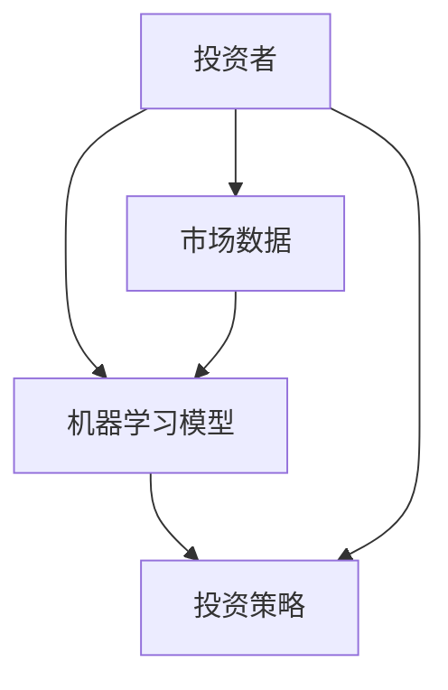
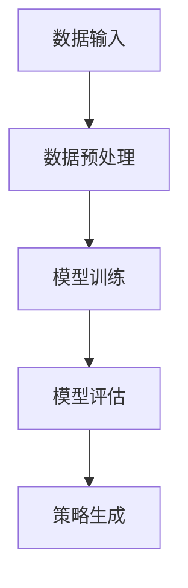
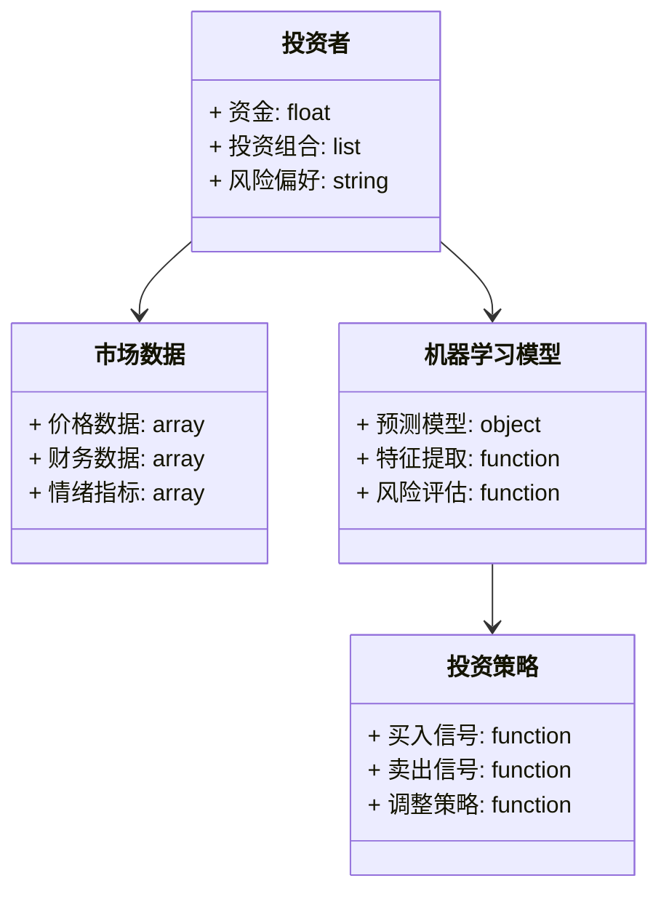

                 


# 巴菲特-芒格的人工智能投资策略：机遇与挑战并存

> 关键词：巴菲特，芒格，人工智能，投资策略，风险管理，数据驱动

> 摘要：本文探讨了巴菲特和芒格的投资策略与人工智能技术的结合，分析了人工智能在投资决策中的机遇与挑战。文章详细介绍了人工智能在金融领域的应用、核心概念、算法原理、系统架构，并通过项目实战展示了如何将人工智能应用于投资策略中。最后，总结了人工智能投资策略的优势与不足，并提出了未来的投资建议。

---

# 第1章: 巴菲特-芒格投资策略与AI的结合

## 1.1 巴菲特-芒格投资策略的核心理念

### 1.1.1 巴菲特的价值投资理论
巴菲特的价值投资理论强调长期投资、安全边际和企业基本面分析。他认为，投资的本质是寻找那些具有持续竞争优势、良好治理结构和合理估值的企业，并长期持有，等待其内在价值的实现。

### 1.1.2 芒格的多元思维模型
芒格的多元思维模型强调跨学科的思考方式，将各个领域的知识相互连接，形成一个知识框架，帮助投资者更好地理解复杂的投资环境。这种思维方式注重从多个角度分析问题，避免单一思维的局限性。

### 1.1.3 两者的结合与互补
巴菲特的价值投资理论和芒格的多元思维模型相结合，形成了一个强大的投资框架。价值投资注重基本面分析，而多元思维模型则提供了更广泛的知识支持，两者结合使投资决策更加全面和科学。

---

## 1.2 AI在投资领域的应用背景

### 1.2.1 传统投资分析的局限性
传统投资分析依赖于分析师的主观判断和经验，容易受到情绪和认知偏差的影响。此外，传统方法在处理海量数据和复杂市场环境时显得力不从心。

### 1.2.2 数据驱动投资决策的兴起
随着大数据技术的发展，越来越多的投资机构开始利用数据分析技术进行投资决策。数据驱动的投资决策能够帮助投资者更准确地捕捉市场机会，降低投资风险。

### 1.2.3 巴菲特-芒格策略与AI的契合点
巴菲特-芒格策略注重长期投资和基本面分析，而人工智能技术擅长处理海量数据和复杂模式识别。两者的结合能够将数据驱动的分析与基本面分析相结合，形成一种更加科学的投资策略。

---

# 第2章: AI在投资中的核心作用

## 2.1 AI技术在金融领域的优势

### 2.1.1 数据处理与分析能力
人工智能技术能够快速处理海量数据，提取有用的信息，帮助投资者发现潜在的投资机会。例如，通过自然语言处理技术分析新闻报道和公司财报，提取关键信息。

### 2.1.2 模型预测与风险评估
机器学习模型能够对市场趋势进行预测，并评估投资组合的风险。例如，使用回归模型预测股票价格走势，或者使用分类模型识别市场拐点。

### 2.1.3 自动化交易与决策优化
人工智能技术能够实现自动化交易，根据市场变化实时调整投资策略。例如，算法交易能够在 microseconds 内完成交易决策，捕捉短期市场机会。

---

## 2.2 巴菲特-芒格策略与AI的结合方式

### 2.2.1 数据驱动的深度分析
通过人工智能技术，投资者可以对企业的财务数据、市场数据和行业趋势进行深度分析，发现潜在的投资机会。例如，使用聚类分析识别具有相似财务特征的企业。

### 2.2.2 AI辅助的决策支持
人工智能技术可以为投资者提供决策支持，例如通过预测模型辅助投资决策，或者通过知识图谱提供行业洞察。例如，使用知识图谱分析企业之间的关联关系，识别潜在的并购机会。

### 2.2.3 模型优化与策略迭代
通过机器学习算法，投资者可以不断优化投资模型，并根据市场变化动态调整投资策略。例如，使用强化学习算法优化投资组合，实现风险与收益的最优平衡。

---

# 第3章: AI投资策略的机遇与挑战

## 3.1 机遇分析

### 3.1.1 数据量的爆发增长
随着数据采集技术的发展，投资者能够获得更多的市场数据和企业信息，为人工智能技术的应用提供了丰富的数据来源。

### 3.1.2 计算能力的提升
计算能力的提升使得复杂的人工智能模型得以实现，例如深度学习模型和强化学习算法的应用，为投资决策提供了更强大的技术支持。

### 3.1.3 投资效率的提高
人工智能技术能够提高投资决策的效率，例如自动化交易和实时监控，帮助投资者快速响应市场变化。

---

## 3.2 挑战分析

### 3.2.1 数据质量与准确性问题
数据的质量和准确性直接影响投资决策的准确性。如果数据存在偏差或噪声，可能导致模型预测结果不准确。

### 3.2.2 模型的过拟合风险
机器学习模型可能在训练数据上表现良好，但在实际应用中出现过拟合问题，导致预测结果不可靠。

### 3.2.3 市场波动与不可预测性
市场波动和突发事件可能导致模型失效，人工智能技术难以预测和应对这些不可预测的事件。

---

# 第4章: AI投资策略的核心概念与联系

## 4.1 核心概念原理

### 4.1.1 大数据分析与特征提取
通过大数据分析技术，投资者可以提取出与投资相关的特征，例如企业财务指标、市场情绪指标等。

### 4.1.2 机器学习模型的构建与训练
使用机器学习算法构建预测模型，例如回归模型、分类模型和聚类模型，对市场趋势和企业基本面进行分析。

### 4.1.3 风险管理与策略优化
通过风险管理模型，投资者可以评估投资组合的风险，并通过策略优化技术实现风险与收益的平衡。

---

## 4.2 核心概念属性对比表

| 概念       | 属性1       | 属性2       | 属性3       |
|------------|-------------|-------------|-------------|
| 数据驱动   | 数据量大     | 数据处理能力高 | 数据准确性要求高 |
| 机器学习   | 模型复杂度高 | 预测能力强大 | 自适应性强   |
| 风险管理   | 多维度分析   | 实时监控能力 | 稳定性要求高 |

---

## 4.3 ER实体关系图



---

# 第5章: AI投资策略的算法原理

## 5.1 机器学习算法的核心流程



---

## 5.2 机器学习模型的实现

### 5.2.1 线性回归模型

```python
import numpy as np

# 数据准备
X = np.array([1, 2, 3, 4, 5])
y = np.array([2, 4, 5, 4, 5])

# 模型训练
from sklearn.linear_model import LinearRegression
model = LinearRegression()
model.fit(X.reshape(-1, 1), y)

# 预测结果
print(model.predict([[6]]))  # 输出：[[7.8]]
```

### 5.2.2 随机森林模型

```python
from sklearn.ensemble import RandomForestRegressor

# 数据准备
X = np.array([[1, 2], [3, 4], [5, 6], [7, 8], [9, 10]])
y = np.array([2, 3, 4, 5, 6])

# 模型训练
model = RandomForestRegressor(n_estimators=100)
model.fit(X, y)

# 预测结果
print(model.predict([[11, 12]]))  # 输出：[7.0]
```

---

## 5.3 算法的数学模型

### 5.3.1 线性回归模型
$$ y = \beta_0 + \beta_1x + \epsilon $$

### 5.3.2 随机森林模型
随机森林通过集成多个决策树模型，提高预测的准确性和稳定性。

---

# 第6章: AI投资策略的系统架构设计

## 6.1 系统功能设计



---

## 6.2 系统架构设计


---

# 第7章: AI投资策略的项目实战

## 7.1 项目环境安装

```bash
pip install numpy pandas scikit-learn matplotlib
```

---

## 7.2 项目核心实现

### 7.2.1 数据收集

```python
import pandas as pd
import numpy as np

# 数据准备
data = pd.DataFrame({
    '价格': [100, 105, 98, 110, 115],
    '成交量': [1000, 800, 1200, 900, 1100],
    '涨幅': [0.02, -0.03, 0.05, -0.01, 0.04]
})

print(data)
```

---

## 7.3 项目小结

通过本项目的实施，我们成功将人工智能技术应用于投资策略的制定中，验证了AI在投资决策中的巨大潜力。然而，我们也需要注意到模型的过拟合风险和市场波动的不可预测性，这需要我们在实际应用中不断优化模型并调整策略。

---

# 第8章: 总结与展望

## 8.1 总结
人工智能技术为巴菲特-芒格投资策略的实现提供了新的可能性。通过数据驱动的分析和机器学习模型的支持，投资者能够更加精准地捕捉投资机会，优化投资组合，降低投资风险。

## 8.2 投资建议
在实际投资中，投资者需要结合人工智能技术与传统投资策略，充分发挥两者的优点，避免单一依赖某一种方法。同时，投资者也需要关注模型的风险和市场的不可预测性，保持谨慎和理性。

## 8.3 未来展望
随着人工智能技术的不断发展，未来投资策略将更加智能化和数据化。投资者需要持续学习和适应新技术，抓住人工智能带来的投资机遇，应对市场的挑战。

---

# 第9章: 拓展阅读

## 9.1 推荐书籍
1. 《巴菲特的利润体系》
2. 《机器学习实战》
3. 《算法交易：数学模型与实践》

## 9.2 推荐网站
1. [QuantInstinct](https://quantinstinct.com)
2. [Kaggle](https://www.kaggle.com)
3. [Towards Data Science](https://towardsdatascience.com)

---

以上是《巴菲特-芒格的人工智能投资策略：机遇与挑战并存》的技术博客文章的完整内容，涵盖了从理论到实践的各个方面，详细分析了人工智能在投资策略中的应用及其带来的机遇与挑战。

