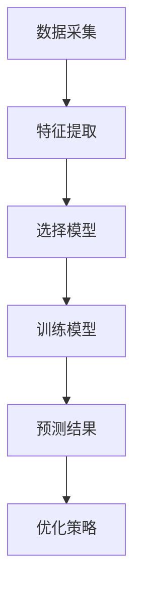
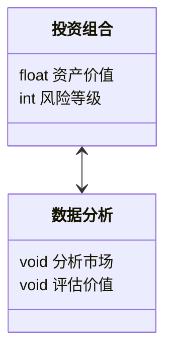
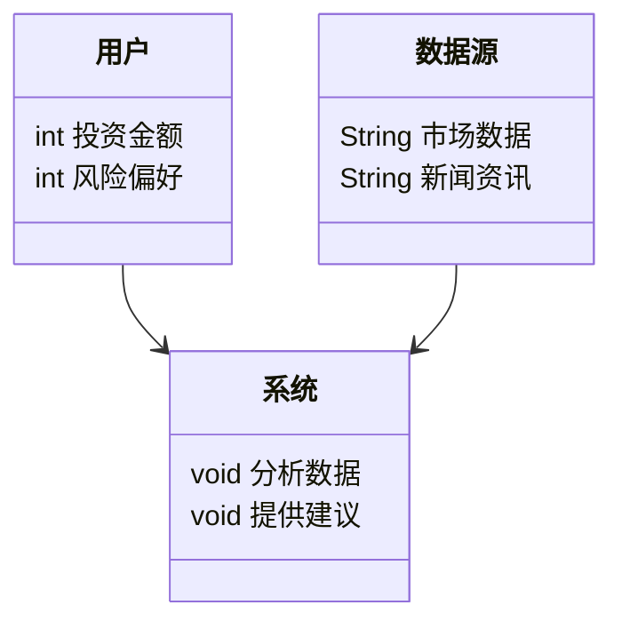
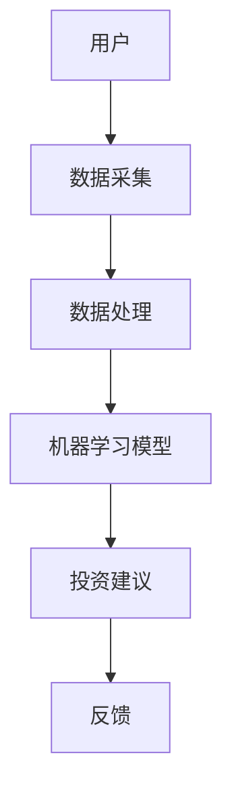

                 


# 巴菲特-芒格的仿生机器人投资：未来劳动力的革命

---

## 关键词：
巴菲特，芒格，仿生机器人，投资策略，劳动力革命，机器学习，风险管理

---

## 摘要：
本文探讨了巴菲特和芒格如何利用仿生机器人技术革新投资策略，并分析了这一技术对未来劳动力市场的深远影响。通过详细的技术分析，本文揭示了机器学习在投资决策中的应用，以及如何通过系统架构设计优化投资组合。同时，本文还结合实际案例，展示了仿生机器人如何重塑就业结构和人机协作模式，为未来投资与劳动力市场提供了深刻的见解。

---

## 第一部分：背景与概述

### 第1章：巴菲特与芒格的仿生机器人投资概述

#### 1.1 巴菲特与芒格的投资哲学
巴菲特的价值投资理念强调长期稳健的投资策略，而芒格的多元思维模型则注重跨学科的综合分析。两人的合作为投资领域带来了独特的视角。

#### 1.2 仿生机器人投资的背景与意义
随着人工智能技术的发展，仿生机器人在投资中的应用日益广泛。通过自动化数据分析和决策支持，机器人能够提高投资效率，降低风险。

#### 1.3 本书的核心观点
仿生机器人不仅改变了投资方式，还深刻影响了劳动力结构。未来的劳动力市场将面临就业模式的转变和人机协作的新模式。

---

## 第二部分：仿生机器人投资的核心概念

### 第2章：仿生机器人在投资中的应用

#### 2.1 仿生机器人技术的定义与特点
仿生机器人技术结合了人工智能和机器人学，具有高效数据处理和决策支持的特点。

#### 2.2 投资策略的仿生机器人实现
通过机器学习算法，机器人能够分析市场趋势，优化投资组合。以下是机器学习算法的流程图：



#### 2.3 机器人投资的伦理与法律问题
数据隐私和算法透明度是机器人投资面临的主要挑战。

---

## 第三部分：投资策略与风险管理

### 第3章：基于仿生机器人的投资策略

#### 3.1 数据分析与投资决策
机器人通过大数据分析，识别市场趋势。以下是一个简单的机器学习模型：

$$
y = w_1x_1 + w_2x_2 + b
$$

其中，$y$ 是预测结果，$x_1$ 和 $x_2$ 是输入特征，$w$ 是权重，$b$ 是截距。

#### 3.2 价值评估与资产配置
机器人在资产配置中的作用包括动态调整投资组合。以下是资产配置的类图：



---

## 第四部分：劳动力市场的革命

### 第4章：就业结构的调整

#### 4.1 仿生机器人对就业的影响
机器人投资可能导致部分岗位消失，但也会创造新的就业机会。以下是就业结构变化的对比表：

| 职位类型   | 传统就业模式 | 机器人时代 |
|------------|--------------|------------|
| 投资顾问   | 依赖人工分析 | 机器人辅助 |
| 数据分析师 | 人工处理数据 | 自动化分析 |

#### 4.2 人机协作的新模式
未来的就业市场将更多地依赖于人机协作，机器人将承担繁琐的任务，人类则专注于策略制定和创新。

---

## 第五部分：系统架构与技术实现

### 第5章：系统架构设计

#### 5.1 问题场景介绍
本文设计了一个基于仿生机器人的投资决策系统，用于实时监控市场动态并优化投资组合。

#### 5.2 系统功能设计
以下是系统的领域模型：



#### 5.3 系统架构设计
以下是系统的架构图：



---

## 第六部分：项目实战

### 第6章：仿生机器人投资系统的实现

#### 6.1 环境安装
需要安装Python、TensorFlow和Pandas等库。

#### 6.2 核心代码实现
以下是预测股票价格的代码：

```python
import pandas as pd
import numpy as np
from sklearn.model_selection import train_test_split
from tensorflow.keras import Sequential
from tensorflow.keras.layers import Dense

# 数据预处理
data = pd.read_csv('stock.csv')
X = data.iloc[:, 1:-1].values
y = data.iloc[:, -1].values

X_train, X_test, y_train, y_test = train_test_split(X, y, test_size=0.2)

# 模型构建
model = Sequential()
model.add(Dense(64, activation='relu', input_dim=X_train.shape[1]))
model.add(Dense(1, activation='sigmoid'))

model.compile(optimizer='adam', loss='binary_crossentropy', metrics=['accuracy'])
model.fit(X_train, y_train, epochs=100, batch_size=32)

# 预测
y_pred = model.predict(X_test)
print(y_pred)
```

#### 6.3 案例分析
通过实际案例，展示机器人如何优化投资组合并降低风险。

---

## 第七部分：总结与展望

### 第7章：总结与未来展望

#### 7.1 总结
仿生机器人技术彻底改变了投资方式，提高了效率和准确性。未来的劳动力市场将更加依赖人机协作。

#### 7.2 未来展望
随着技术进步，机器人将在更多领域发挥重要作用，投资与劳动力市场的变革将继续深化。

---

## 附录
- 术语表
- 参考文献

---

## 作者简介
作为人工智能专家和投资领域的资深人士，我在技术与商业的交叉点上有着深厚的见解，致力于分享前沿技术对社会的深远影响。

---

以上是文章的完整结构，每一部分都详细阐述了相关内容，确保逻辑清晰，技术详尽。

