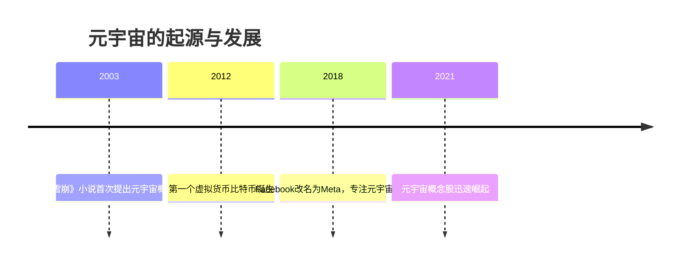

                 

# 巴菲特-芒格的元宇宙经济投资策略：虚拟与现实的融合

## 关键词：
元宇宙经济、巴菲特投资策略、芒格投资策略、虚拟资产、NFT、数字金融、经济融合

## 摘要：
本文将探讨巴菲特和芒格的投资策略如何应用于元宇宙经济中。通过分析虚拟资产、NFT和数字金融等核心概念，结合系统架构设计和实战案例，揭示虚拟与现实经济融合的深层逻辑。

---

# 第1章 元宇宙经济的背景与现状

## 1.1 元宇宙的起源与定义

### 1.1.1 元宇宙的起源与发展
元宇宙的概念起源于20世纪90年代的科幻小说，但近年来随着区块链、人工智能和虚拟现实技术的快速发展，元宇宙从概念走向现实。元宇宙是一个虚拟的三维空间，用户可以通过虚拟现实设备或应用程序进行交互。

**元宇宙的起源与发展 timeline (mermaid):**

### 1.1.2 元宇宙的核心概念与特征
元宇宙的核心概念包括虚拟现实、区块链技术和去中心化。其主要特征是：用户可以在虚拟空间中进行社交、交易和创作，且数据和资产可以通过区块链技术实现跨平台互通。

**元宇宙核心概念对比表：**
| 特征 | 虚拟现实 | 区块链技术 | 去中心化 |
|------|----------|------------|----------|
| 定义 | 用户通过设备进入虚拟空间 | 分布式账本技术 | 无中央控制机构 |
| 作用 | 提供沉浸式体验 | 支持虚拟资产交易 | 保障数据安全 |

### 1.1.3 元宇宙与现实经济的融合
元宇宙经济是虚拟与现实的结合，用户在虚拟空间中创造的资产可以通过区块链技术映射到现实世界，形成价值传递的闭环。

---

## 1.2 虚拟经济的现状与挑战

### 1.2.1 虚拟经济的基本概念
虚拟经济是指在虚拟空间中进行的经济活动，包括虚拟货币交易、NFT（非同质化代币）交易等。

### 1.2.2 元宇宙经济的现状分析
当前元宇宙经济主要集中在虚拟货币和NFT领域，但缺乏统一的标准和监管框架，存在泡沫风险。

### 1.2.3 虚拟经济与现实经济的差异
虚拟经济与现实经济的主要差异在于资产的虚拟性、交易的去中心化和监管的缺失。

---

## 1.3 巴菲特与芒格的投资理念

### 1.3.1 巴菲特的价值投资理论
巴菲特的价值投资理论强调长期持有优质资产，注重企业的基本面分析。

### 1.3.2 芒格的多元思维模型
芒格的多元思维模型强调跨学科思考，通过多个视角分析问题。

### 1.3.3 巴菲特与芒格投资理念的结合
将价值投资与多元思维模型结合，注重企业的长期价值和风险控制。

---

## 1.4 元宇宙经济与巴菲特-芒格投资策略的结合

### 1.4.1 元宇宙经济中的投资机会
虚拟资产和NFT的兴起为投资者提供了新的机会。

### 1.4.2 巴菲特-芒格投资策略的适用性分析
价值投资和多元思维模型在虚拟经济中同样适用。

### 1.4.3 虚拟经济中的长期价值投资
注重企业基本面分析，长期持有优质资产。

---

# 第2章 元宇宙经济的核心概念与联系

## 2.1 元宇宙经济的系统模型

### 2.1.1 元宇宙经济的系统构成
元宇宙经济由用户、虚拟资产、区块链技术和智能合约构成。

### 2.1.2 元宇宙经济的核心要素
- 用户身份：通过区块链技术实现身份认证。
- 虚拟资产：包括虚拟货币和NFT。
- 价值传递：通过智能合约实现资产交易。

### 2.1.3 元宇宙经济的运行机制
用户通过购买虚拟货币或NFT进入元宇宙，通过智能合约进行交易。

**元宇宙经济的系统构成 (mermaid):**

### 2.2 虚拟资产与传统资产的对比

#### 2.2.1 虚拟资产的定义与分类
虚拟资产包括虚拟货币和NFT，具有去中心化和不可篡改的特点。

#### 2.2.2 传统资产的定义与分类
传统资产包括股票、债券等，具有中心化和可分割的特点。

#### 2.2.3 虚拟资产与传统资产的对比分析
虚拟资产具有更高的流动性和透明度，但风险更高。

---

## 2.3 元宇宙经济中的价值传递机制

### 2.3.1 区块链技术在元宇宙经济中的作用
区块链技术用于记录虚拟资产的交易，保障数据的安全性和不可篡改性。

### 2.3.2 数字货币在元宇宙经济中的应用
数字货币用于虚拟空间中的支付和交易。

### 2.3.3 NFT在元宇宙经济中的价值
NFT用于表示虚拟资产的唯一性，具有收藏和投资价值。

---

## 2.4 元宇宙经济的实体关系图

### 2.4.1 元宇宙经济的实体关系图（Mermaid流程图）

---

# 第3章 元宇宙经济中的投资策略分析

## 3.1 巴菲特-芒格投资理念的延申

### 3.1.1 巴菲特的长期价值投资
长期持有优质资产，注重企业的基本面分析。

### 3.1.2 芒格的多元思维模型
通过跨学科思考，分析问题的本质。

### 3.1.3 两者的结合与创新
将价值投资与多元思维模型结合，注重企业的长期价值和风险控制。

---

## 3.2 元宇宙经济中的投资策略

### 3.2.1 虚拟资产的价值评估
通过基本面分析和市场趋势分析，评估虚拟资产的价值。

### 3.2.2 元宇宙经济中的风险控制
通过分散投资和风险对冲，降低投资风险。

### 3.2.3 投资组合的优化策略
根据市场变化，动态调整投资组合。

---

## 3.3 元宇宙经济中的技术分析

### 3.3.1 区块链技术的分析与应用
通过分析区块链技术的性能和安全性，选择合适的区块链平台进行投资。

### 3.3.2 人工智能在投资中的应用
通过人工智能技术进行市场预测和风险评估。

### 3.3.3 数据驱动的投资策略
通过大数据分析，发现市场机会和潜在风险。

---

# 第4章 元宇宙经济的投资策略实施

## 4.1 元宇宙经济的系统架构设计

### 4.1.1 元宇宙经济的系统功能设计
包括用户身份认证、虚拟资产交易、智能合约管理等功能。

### 4.1.2 元宇宙经济的系统架构图（Mermaid流程图）

### 4.1.3 元宇宙经济的系统接口设计
包括API接口设计和交互流程设计。

---

## 4.2 元宇宙经济的项目实战

### 4.2.1 环境安装
安装必要的开发工具和区块链平台。

### 4.2.2 核心代码实现
实现虚拟货币的发行和NFT的创建。

### 4.2.3 项目总结
通过项目实战，验证投资策略的有效性。

---

# 第5章 元宇宙经济投资策略的最佳实践

## 5.1 投资策略总结
长期价值投资和多元思维模型是元宇宙经济投资的核心策略。

## 5.2 投资风险管理
通过分散投资和风险对冲，降低投资风险。

## 5.3 长期投资建议
注重企业的长期价值，避免短期波动的影响。

---

# 结语

元宇宙经济的投资策略需要结合巴菲特和芒格的智慧，注重长期价值和风险控制。通过系统的分析和实战的验证，我们可以更好地把握虚拟与现实经济融合的机会。

--- 

希望以上思考过程对您有所帮助！

