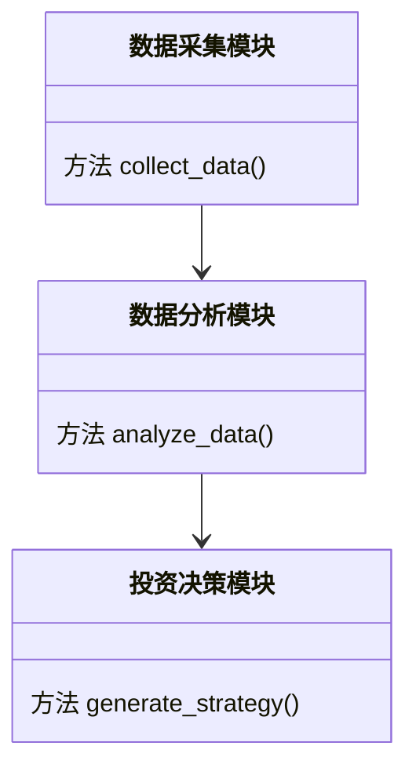
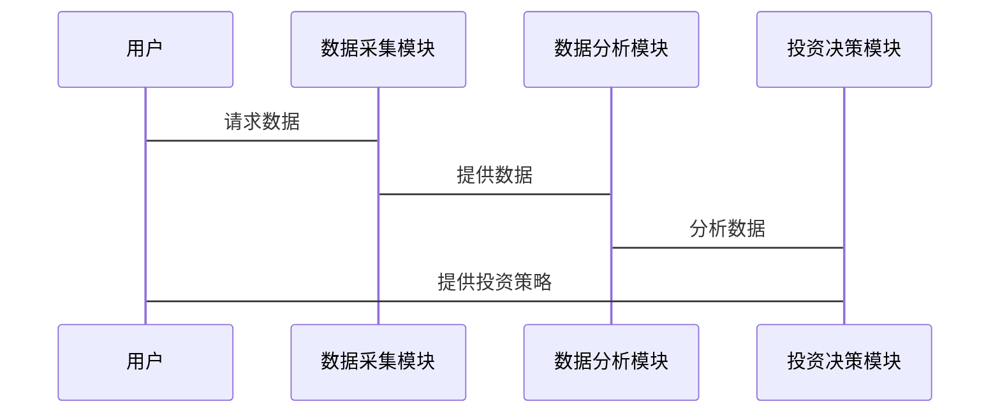

                 


# 巴菲特-芒格的全球化投资视野：跨国界寻找机会

## 关键词：巴菲特，芒格，全球化投资，多元思维模型，价值投资，投资分析系统

## 摘要：  
本文深入探讨巴菲特和芒格的投资哲学，特别是他们如何运用多元思维模型和价值投资原则在全球范围内寻找投资机会。文章结合实际案例，分析了全球化投资的背景、核心概念、系统架构设计以及实战应用，为读者提供了一个全面的投资视野。通过数学模型和算法的详细讲解，本文帮助读者理解如何在全球化市场中做出明智的投资决策。

---

# 第一部分: 巴菲特-芒格投资理念概述

## 第1章: 巴菲特与芒格的投资哲学

### 1.1 巴菲特的价值投资理念

#### 1.1.1 巴菲特的投资理念概述
巴菲特的价值投资理念以“寻找具有持续竞争优势、良好管理和稳定现金流的企业”为核心。他强调长期投资、安全边际和内在价值。  
$$\text{内在价值} = \sum_{t=1}^{n} \frac{\text{现金流}_t}{(1 + r)^t}$$  
其中，\(r\) 是折现率，\(n\) 是企业的剩余寿命。

#### 1.1.2 巴菲特的长期投资策略
巴菲特的长期投资策略强调“买入并持有”，避免频繁交易。他认为市场短期波动是噪音，长期趋势才是关键。  
**对比分析：**  
| 投资策略 | 短期交易 | 长期持有 |  
|----------|----------|----------|  
| 风险     | 高       | 低       |  
| 成本     | 高       | 低       |  

#### 1.1.3 巴菲特的公司治理观
巴菲特重视公司治理，认为管理层的诚信和能力是企业成功的关键。他倾向于投资那些管理层与股东利益一致的企业。

---

### 1.2 芒格的多元思维模型

#### 1.2.1 芒格思维模型的定义
芒格的多元思维模型是一种将多个学科的核心原则整合起来，用于解决复杂问题的方法。它强调跨学科思考，将物理学、心理学、经济学等知识融会贯通。  
**ER实体关系图：**  
```mermaid
er
entity 投资决策 {
  <<属性>> 名称, 理论基础, 应用场景
}
```

#### 1.2.2 芒格思维模型的核心要素
芒格思维模型的核心要素包括：  
1. **物理学定律**：如牛顿定律、热力学第二定律。  
2. **心理学原理**：如行为偏差、认知偏差。  
3. **经济学原理**：如供需关系、边际成本。  
4. **数学模型**：如概率论、统计学。  

#### 1.2.3 芒格思维模型在投资中的应用
芒格通过多元思维模型，分析企业的竞争优势、行业地位和潜在风险。例如，他用“护城河”概念评估企业的长期竞争优势。

---

## 第2章: 全球化投资的背景与趋势

### 2.1 全球化投资的背景与特点

#### 2.1.1 全球化投资的定义
全球化投资是指将资金配置在多个不同国家或地区的资产上，以分散风险、优化收益。

#### 2.1.2 全球化投资的核心特点
1. **分散风险**：跨国投资可以降低单一市场的风险。  
2. **优化收益**：不同地区的经济增长差异提供了投资机会。  
3. **复杂性高**：涉及法律、税务、汇率等多种因素。

#### 2.1.3 全球化投资与本地投资的对比
| 投资类型 | 全球化投资 | 本地投资 |  
|----------|------------|-----------|  
| 风险     | 低         | 高         |  
| 收益     | 多样化     | 单一化     |  

### 2.2 全球经济与投资机会分析

#### 2.2.1 全球经济现状与趋势
当前全球经济面临通胀、地缘政治和科技革命等多重挑战，但也带来了新的投资机会。

#### 2.2.2 不同地区的投资机会分析
1. **新兴市场**：如中国、印度，经济增长快，潜力大。  
2. **发达国家**：如美国、欧洲，市场成熟，风险较低。  

#### 2.2.3 跨国投资的风险与挑战
1. **汇率风险**：货币波动影响投资收益。  
2. **法律风险**：不同国家的法律政策差异。  

---

# 第二部分: 巴菲特-芒格投资框架的核心概念

## 第3章: 芒格的多元思维模型

### 3.1 多元思维模型的数学模型

#### 3.1.1 多元思维模型的数学表达
芒格的多元思维模型可以用以下公式表示：  
$$\text{投资决策} = \sum_{i=1}^{n} \text{学科原则}_i \times \text{权重}_i$$  
其中，\(n\) 是学科数量，权重表示每个学科在决策中的重要性。

#### 3.1.2 多元思维模型的属性对比表格
| 属性       | 物理学      | 心理学      | 经济学      |  
|------------|-------------|-------------|-------------|  
| 核心原则   | 力学定律     | 行为偏差     | 供需关系     |  
| 应用场景   | 工程设计     | 投资决策偏差 | 市场分析     |  

#### 3.1.3 多元思维模型的ER实体关系图
```mermaid
er
entity 多元思维模型 {
  <<属性>> 学科, 原则, 应用场景
}
```

### 3.2 多元思维模型的算法原理

#### 3.2.1 多元思维模型的算法流程图
```mermaid
graph TD
    A[开始] -> B[选择学科]
    B -> C[提取核心原则]
    C -> D[分析应用场景]
    D -> E[得出结论]
    E -> F[结束]
```

#### 3.2.2 多元思维模型的Python实现代码
```python
def multi_discipline_model(subjects):
    principles = {
        'physics': ['牛顿定律', '热力学'],
        'psychology': ['行为偏差', '认知偏差'],
        'economics': ['供需关系', '边际成本']
    }
    analysis = {}
    for subject in subjects:
        for principle in principles[subject]:
            analysis[principle] = '应用于' + subject
    return analysis

subjects = ['physics', 'psychology', 'economics']
print(multi_discipline_model(subjects))
```

#### 3.2.3 多元思维模型的数学公式与举例说明
$$\text{投资决策} = \sum_{i=1}^{3} \text{学科}_i \times \text{权重}_i$$  
例如，分析一家企业的投资价值时，可以结合物理学的热力学原理（企业运行效率）和经济学的供需关系（市场地位）。

---

## 第4章: 巴菲特的价值投资框架

### 4.1 价值投资的核心要素

#### 4.1.1 价值投资的定义
价值投资是寻找市场价格低于内在价值的资产进行投资。

#### 4.1.2 价值投资的核心要素
1. **内在价值**：企业的未来现金流的现值。  
2. **安全边际**：市场价格与内在价值的差距。  
3. **竞争优势**：企业的护城河。  

#### 4.1.3 价值投资与成长投资的对比
| 投资类型 | 价值投资       | 成长投资       |  
|----------|----------------|----------------|  
| 目标     | 买入低于价值的资产 | 投资高增长潜力的企业 |  
| 风险     | 中低            | 高             |  

### 4.2 价值投资框架的数学模型

#### 4.2.1 价值投资的数学表达
$$\text{内在价值} = \sum_{t=1}^{n} \frac{\text{现金流}_t}{(1 + r)^t}$$  
其中，\(r\) 是折现率，\(n\) 是企业的剩余寿命。

#### 4.2.2 价值投资的属性对比表格
| 属性       | 内在价值       | 安全边际       |  
|------------|----------------|----------------|  
| 计算方式   | 现金流折现法    | 市场价格与内在价值的差距 |  
| 应用场景   | 投资决策        | 风险控制       |  

---

# 第三部分: 投资框架的系统分析与架构设计

## 第5章: 投资分析系统的功能设计

### 5.1 投资分析系统的功能模块

#### 5.1.1 数据采集模块
数据采集模块负责收集全球市场的经济数据、企业财务报表等。

#### 5.1.2 数据分析模块
数据分析模块利用多元思维模型和价值投资框架对数据进行分析。

#### 5.1.3 投资决策模块
投资决策模块根据分析结果生成投资策略。

### 5.2 投资分析系统的领域模型

#### 5.2.1 领域模型的定义
领域模型描述了系统的功能模块及其交互关系。

#### 5.2.2 领域模型的Mermaid类图


## 第6章: 投资分析系统的架构设计

### 6.1 系统架构设计

#### 6.1.1 系统架构设计
投资分析系统采用分层架构，包括数据层、业务逻辑层和表现层。

#### 6.1.2 系统架构的Mermaid图


### 6.2 系统接口设计

#### 6.2.1 系统接口设计
系统接口包括数据输入接口和结果输出接口。

### 6.3 系统交互设计

#### 6.3.1 系统交互的Mermaid序列图


---

# 第四部分: 项目实战

## 第7章: 项目实战

### 7.1 项目环境安装

#### 7.1.1 环境配置
需要安装Python、Jupyter Notebook和相关库（如Pandas、Matplotlib）。

### 7.2 系统核心实现

#### 7.2.1 核心代码实现
```python
import pandas as pd
import numpy as np

def calculate_intrinsic_value(cash_flows, discount_rate):
    return np.sum(cash_flows / (1 + discount_rate)**np.arange(len(cash_flows)))

cash_flows = [100, 200, 300]
discount_rate = 0.05
intrinsic_value = calculate_intrinsic_value(cash_flows, discount_rate)
print(f"内在价值: {intrinsic_value}")
```

#### 7.2.2 代码应用解读
上述代码计算了企业的内在价值，帮助投资者判断是否买入。

### 7.3 实际案例分析

#### 7.3.1 案例分析：可口可乐

##### 7.3.1.1 可口可乐的内在价值计算
假设可口可乐的未来现金流为每年100亿美元，折现率为5%，计算其内在价值。

##### 7.3.1.2 分析结论
可口可乐具有稳定的现金流和强大的品牌优势，适合长期投资。

#### 7.3.2 案例分析：苹果

##### 7.3.2.1 苹果的竞争优势
苹果具有强大的研发能力和生态系统。

##### 7.3.2.2 风险分析
苹果面临竞争加剧和技术更新的风险。

### 7.4 项目小结

#### 7.4.1 投资分析系统的总结
通过系统的分析和实战案例，我们验证了巴菲特和芒格投资理念的有效性。

---

# 第五部分: 总结与最佳实践

## 第8章: 总结与最佳实践

### 8.1 小结
本文深入探讨了巴菲特和芒格的投资哲学，分析了全球化投资的背景和趋势，详细讲解了多元思维模型和价值投资框架的数学模型和算法原理。

### 8.2 注意事项
1. 投资需谨慎，避免盲目跟风。  
2. 保持对市场的敏感性和对企业的深入了解。  

### 8.3 拓展阅读
推荐阅读巴菲特和芒格的著作，深入理解他们的投资哲学。

---

通过本文的分析，读者可以更好地理解巴菲特和芒格的投资理念，并在全球化投资中找到更多机会。

