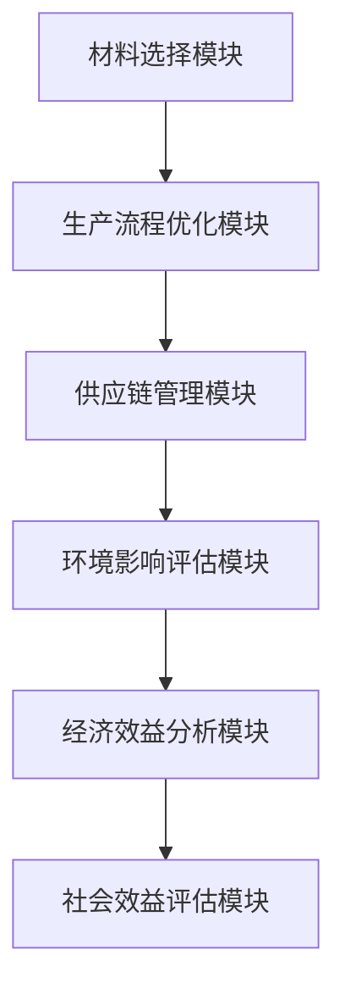

                 


# 巴菲特-芒格的可持续包装投资：环保与便利的平衡

> 关键词：巴菲特，芒格，可持续包装，环保，便利，投资策略，包装设计，价值投资

> 摘要：本文从巴菲特和芒格的投资哲学出发，探讨他们在可持续包装领域的投资策略，分析环保与便利之间的平衡点。通过详细的技术分析和案例研究，揭示可持续包装的设计原则、投资评估方法，以及系统架构设计，为投资者和企业提供实用的指导和启示。

---

# 第一部分：背景介绍

## 第1章：巴菲特与芒格的投资哲学

### 1.1 巴菲特的价值投资理念

- **价值投资的核心原则**  
  巴菲特强调以合理价格买入优秀企业，长期持有的投资策略。他注重企业的基本面分析，尤其是企业的盈利能力和管理层质量。

- **芒格的多元思维模型**  
  芒格提倡通过多学科交叉思考来理解复杂问题，强调在投资中关注企业的长期可持续性。

- **投资哲学对可持续包装的启示**  
  巴菲特和芒格的投资哲学为可持续包装提供了新的视角，即在环保与便利之间找到平衡点，同时关注企业的长期可持续发展。

---

## 第2章：可持续包装的背景与重要性

### 2.1 可持续包装的定义与特点

- **可持续包装的定义**  
  可持续包装是指在全生命周期内对环境影响最小、资源消耗最少的包装形式，强调循环利用和降解性。

- **可持续包装的核心特点**  
  | 特性 | 描述 |
  |------|------|
  | 环保性 | 使用可再生或降解材料，减少环境污染 |
  | 可循环性 | 包装材料可多次回收利用 |
  | 低能耗 | 生产过程能耗低，碳排放少 |

- **与传统包装的对比**  
  传统包装通常使用不可降解材料，生产过程能耗高，对环境造成较大压力。而可持续包装通过技术创新和材料优化，减少了对环境的负担。

---

### 2.2 可持续包装的重要性

- **环境保护的需求**  
  全球范围内对环境保护的关注日益增加，减少包装废弃物对环境的影响已成为企业和消费者的责任。

- **消费者需求的变化**  
  消费者 increasingly demand eco-friendly products, leading to a shift in market preferences toward sustainable packaging.

- **企业的社会责任**  
  企业通过采用可持续包装，不仅能减少环境影响，还能提升品牌形象，增强市场竞争力。

---

# 第二部分：可持续包装的核心概念

## 第3章：可持续包装的设计原则

### 3.1 环保与便利的平衡

- **环保与便利的矛盾**  
  可持续包装在追求环保的同时，需要兼顾消费者的便利性，避免因过度环保设计而影响用户体验。

- **如何在环保与便利之间找到平衡**  
  企业需要在材料选择、生产流程、包装设计等方面进行综合考量，确保包装既环保又实用。

---

## 第4章：可持续包装的材料选择与创新

### 4.1 可持续包装材料的种类

- **可再生材料**  
  如竹纤维、甘蔗渣等，这些材料来源于可再生资源，且易于降解。

- **可降解材料**  
  如聚乳酸（PLA）和聚己内酯（PCL），这些材料在自然环境中可分解为二氧化碳和水。

- **生物基材料**  
  如淀粉基材料，以植物淀粉为原料，减少对石油资源的依赖。

---

### 4.2 包装设计的创新

- **减量设计**  
  通过减少材料用量，降低包装的环境负担。

- **循环设计**  
  设计可重复使用或回收的包装，延长包装的生命周期。

- **智能包装技术**  
  如智能标签和传感器，用于监测包装的状态，提升消费者体验。

---

# 第三部分：巴菲特与芒格的可持续包装投资策略

## 第5章：巴菲特与芒格的投资策略分析

### 5.1 巴菲特与芒格的共同投资原则

- **长期投资视角**  
  巴菲特和芒格注重长期投资，关注企业的可持续发展能力。

- **企业基本面分析**  
  他们重视企业的盈利能力和财务健康状况，确保投资的安全性。

- **管理层质量评估**  
  管理层的能力和道德水平是投资决策的重要考量因素。

---

## 第6章：可持续包装企业的投资评估

### 6.1 可持续包装企业的核心竞争力

- **技术创新能力**  
  企业的研发投入和技术储备是其核心竞争力的重要体现。

- **市场定位与品牌影响力**  
  在环保包装市场中，品牌知名度和市场定位决定了企业的市场份额。

- **可持续发展报告**  
  企业通过发布可持续发展报告，展示其在环保方面的努力和成果，增强投资者信心。

---

### 6.2 投资评估的关键指标

- **环境影响评估**  
  包括材料使用、生产过程中的碳排放、废弃物处理等方面。

- **经济效益分析**  
  包括企业的盈利能力、成长潜力和投资回报率。

- **社会效益评估**  
  包括企业在环保方面的贡献、社会责任履行情况等。

---

# 第四部分：系统分析与架构设计

## 第7章：可持续包装系统的架构设计

### 7.1 可持续包装系统的功能模块

- **材料选择模块**  
  负责选择合适的可持续包装材料，确保环保性和经济性。

- **生产流程优化模块**  
  优化生产流程，降低能耗和废弃物产生。

- **供应链管理模块**  
  管理包装材料的供应链，确保材料的可持续性和可追溯性。

---

### 7.2 系统架构图



---

## 第8章：可持续包装系统的数学模型

### 8.1 环境影响评估模型

- **数学模型**  
  $$ \text{环境影响指数} = \alpha \times \text{材料影响} + \beta \times \text{生产能耗} + \gamma \times \text{废弃物产生} $$  
  其中，$$ \alpha + \beta + \gamma = 1 $$，表示各因素的权重。

---

## 第9章：可持续包装系统的算法实现

### 9.1 算法原理

- **算法名称**：可持续包装优化算法  
- **算法步骤**：
  1. 确定包装材料的候选列表。
  2. 计算每种材料的环境影响指数。
  3. 选择环境影响指数最小的材料作为最优解。

---

### 9.2 算法代码示例

```python
def calculate_environmental_impact(materials):
    impacts = []
    for material in materials:
        impact = material['material_impact'] + material['production_energy'] + material['waste_generated']
        impacts.append(impact)
    return impacts

def optimal_material_selection(materials):
    impacts = calculate_environmental_impact(materials)
    min_impact = min(impacts)
    optimal_material = materials[impacts.index(min_impact)]
    return optimal_material

# 示例数据
materials = [
    {'name': 'PLA', 'material_impact': 0.2, 'production_energy': 0.3, 'waste_generated': 0.1},
    {'name': 'PET', 'material_impact': 0.4, 'production_energy': 0.2, 'waste_generated': 0.1},
    {'name': '竹纤维', 'material_impact': 0.1, 'production_energy': 0.4, 'waste_generated': 0.2}
]

result = optimal_material_selection(materials)
print(f"最优材料为：{result['name']}")
```

---

# 第五部分：项目实战

## 第10章：可持续包装项目的实施

### 10.1 项目背景

- **项目目标**：设计一种可降解的包装解决方案，满足环保和便利性需求。

---

### 10.2 项目实施步骤

1. **需求分析**：明确包装的使用场景和用户需求。
2. **材料选择**：根据环境影响评估模型选择最优材料。
3. **设计与优化**：进行包装设计和生产工艺优化。
4. **测试与验证**：进行样品生产和市场测试，收集反馈意见。
5. **量产与推广**：实现量产并推广至市场。

---

## 第11章：项目总结与扩展

### 11.1 项目总结

- **项目成果**：成功设计并推广了一种可降解包装解决方案，降低了环境影响，提升了用户体验。

---

### 11.2 项目扩展

- **技术创新**：探索更多新型可持续包装材料和技术。
- **市场推广**：进一步扩大市场覆盖，提升品牌影响力。

---

# 第六部分：结论与展望

## 第12章：结论

### 12.1 核心结论

- 巴菲特和芒格的投资哲学为可持续包装投资提供了重要的指导思想。
- 可持续包装的设计和生产需要在环保与便利之间找到平衡点。
- 通过技术创新和系统优化，可持续包装的市场潜力巨大。

---

## 第13章：未来展望

### 13.1 可持续包装的未来趋势

- **材料创新**：新型可降解材料的研发将继续推动可持续包装的发展。
- **智能包装技术**：智能包装将更加普及，提升用户体验和环保效果。
- **政策支持**：政府和社会组织将提供更多政策支持和资金投入，推动可持续包装的广泛应用。

---

# 参考文献

1. 巴菲特股东大会演讲集
2. 芒格的《Poor Charlie's Almanack》
3. 可持续包装相关学术论文
4. 相关行业报告与市场分析

---

通过以上结构，我们可以全面、系统地探讨巴菲特和芒格的可持续包装投资策略，从理论到实践，从概念到技术，为投资者和企业提供深刻的洞察和实用的指导。

