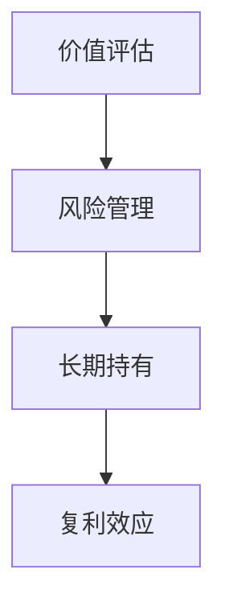
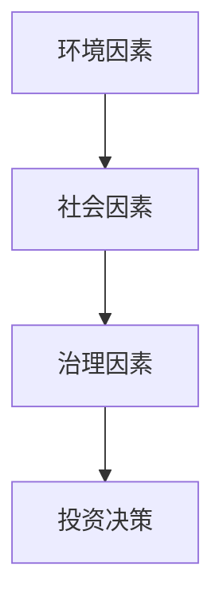
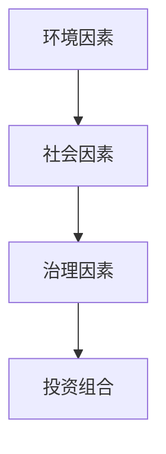

                 

# 巴菲特-芒格的可持续发展投资：长期价值创造

> **关键词**：巴菲特, 芮格, 可持续发展投资, 长期价值创造, 价值投资, ESG投资, 投资策略

> **摘要**：本文深入探讨了巴菲特和芒格的投资理念，特别是他们在可持续发展领域的长期价值创造策略。通过分析他们的投资哲学、ESG投资的核心要素以及经典投资案例，结合数学模型和系统架构，总结了巴菲特和芒格的可持续发展投资策略，并展望了未来趋势。

---

# {{此处是文章标题}}

## 巴菲特-芒格的可持续发展投资：长期价值创造

---

### 第一部分: 巴菲特与芒格的投资理念概述

#### 第1章: 巴菲特与芒格的投资哲学

##### 1.1 巴菲特与芒格的背景介绍

###### 1.1.1 巴菲特的生平与投资理念

沃伦·巴菲特（Warren Buffett）是世界上最著名的投资者之一，他的投资理念以价值投资为核心，强调寻找具有持续竞争优势的企业，并以合理的价格买入并长期持有。巴菲特的投资哲学简单而深刻，他注重企业的基本面分析，尤其是企业的盈利能力、财务健康状况以及管理团队的质量。

巴菲特的长期投资策略基于复利效应，他相信通过长期持有优质资产，可以实现财富的稳步增长。他的投资理念不仅关注企业的财务表现，还关注企业的社会责任和长期可持续发展能力。他认为，企业只有在具备长期竞争优势的前提下，才能为股东创造持续的超额收益。

###### 1.1.2 芒格的智慧与决策思维

查理·芒格（Charlie Munger）是巴菲特的长期合作伙伴，他的智慧和决策思维对巴菲特的投资理念产生了深远影响。芒格是一位理性投资者，他强调认知的边界和决策的纪律性。芒格的决策思维注重逻辑推理和常识的应用，他认为投资者必须避免情绪化决策，并始终坚持理性分析。

芒格的多元思维模型是其投资哲学的核心，他强调投资者需要具备跨学科的知识储备，以便更好地理解企业的经营环境和市场趋势。芒格的投资理念不仅关注企业的财务表现，还关注企业的社会影响和长期可持续发展能力。他认为，企业只有在具备长期竞争优势的前提下，才能为股东创造持续的超额收益。

###### 1.1.3 两人合作的黄金组合

巴菲特和芒格的合作堪称投资界的黄金组合。巴菲特的耐心和芒格的理性形成了互补，他们的投资理念和决策思维相得益彰。巴菲特的长期投资策略与芒格的多元思维模型相结合，形成了独特的价值投资体系。两人共同强调长期价值创造，注重企业的基本面分析和长期竞争优势。

##### 1.2 巴菲特与芒格的投资哲学核心

###### 1.2.1 价值投资的定义与内涵

价值投资是一种以低于公平价值的价格买入优质资产的投资策略。巴菲特的价值投资理念强调寻找具有持续竞争优势的企业，并以合理的价格买入并长期持有。他认为，市场先生的存在使得短期价格波动为投资者提供了买入优质资产的机会。

价值投资的核心在于识别具有持续竞争优势的企业，并以合理的价格买入。巴菲特认为，企业的竞争优势是其长期盈利能力的关键因素。他强调，投资者必须具备对企业基本面的深刻理解，并能够识别企业的竞争优势。

###### 1.2.2 股价与内在价值的辩证关系

股价与内在价值是价值投资的核心概念。巴菲特认为，股价的波动是短期市场行为的结果，而内在价值是企业未来现金流的现值。他强调，投资者必须区分短期价格波动和长期价值创造，避免被短期价格波动所迷惑。

巴菲特的内在价值理论认为，企业的内在价值是其未来现金流的现值。他强调，投资者必须具备对企业未来现金流的准确评估能力，并能够在市场恐慌时以合理的价格买入优质资产。

###### 1.2.3 长期投资与复利效应的数学模型

复利效应是长期投资的核心原理。巴菲特认为，通过长期持有优质资产，投资者可以实现财富的指数级增长。复利效应的数学模型可以表示为：

$$
FV = PV \times (1 + r)^n
$$

其中，FV是终值，PV是现值，r是年化收益率，n是投资年数。

巴菲特的长期投资策略强调复利效应的重要性。他认为，通过长期持有优质资产，投资者可以实现财富的指数级增长。他强调，投资者必须具备对企业长期竞争优势的深刻理解，并能够在市场恐慌时以合理的价格买入优质资产。

#### 第2章: 可持续发展投资的背景与意义

##### 2.1 可持续发展投资的定义与内涵

可持续发展投资（ESG投资）是一种以环境、社会和治理因素为核心的投资策略。ESG投资强调企业必须具备良好的环境表现、社会责任和治理结构，才能为投资者创造长期价值。

ESG投资的核心在于识别具备可持续竞争优势的企业。巴菲特和芒格的长期投资理念与ESG投资的核心要素高度契合。他们认为，企业只有在具备长期竞争优势的前提下，才能为股东创造持续的超额收益。

##### 2.2 巴菲特与芒格对可持续发展的看法

###### 2.2.1 巴菲特对ESG投资的态度

巴菲特对ESG投资持肯定态度，他认为，企业的环境表现、社会责任和治理结构是长期竞争优势的重要组成部分。他强调，企业只有在具备可持续竞争优势的前提下，才能为股东创造持续的超额收益。

巴菲特认为，ESG投资不仅关注企业的财务表现，还关注企业的社会影响和长期可持续发展能力。他强调，投资者必须具备对企业社会影响的深刻理解，并能够在市场恐慌时以合理的价格买入优质资产。

###### 2.2.2 芒格对社会价值的关注

芒格对社会价值的关注是其投资哲学的核心要素之一。他认为，企业只有在具备良好的社会责任感和治理结构的前提下，才能为股东创造持续的超额收益。他强调，投资者必须具备对企业社会责任的深刻理解，并能够在市场恐慌时以合理的价格买入优质资产。

芒格的多元思维模型强调，投资者必须具备对企业社会责任的深刻理解，并能够在市场恐慌时以合理的价格买入优质资产。他认为，企业只有在具备良好的社会责任感和治理结构的前提下，才能为股东创造持续的超额收益。

###### 2.2.3 两人对长期价值创造的共同理念

巴菲特和芒格的长期价值创造理念高度契合。他们都认为，企业只有在具备长期竞争优势的前提下，才能为股东创造持续的超额收益。他们强调，投资者必须具备对企业长期竞争优势的深刻理解，并能够在市场恐慌时以合理的价格买入优质资产。

---

### 第二部分: 可持续发展投资的核心要素分析

#### 第3章: 环境因素在投资中的影响

##### 3.1 环境因素的定义与量化

环境因素是指企业在经营过程中对环境的影响，包括碳排放、资源消耗、污染治理等方面。环境因素的量化是ESG投资的重要组成部分。

环境因素的量化指标包括碳排放强度、资源消耗效率、污染治理效果等。这些指标可以用于评估企业的环境表现，并为企业提供改善环境表现的方向。

##### 3.2 巴菲特与芒格对环境因素的看法

巴菲特和芒格认为，环境因素是企业长期竞争优势的重要组成部分。他们强调，企业只有在具备良好的环境表现的前提下，才能为股东创造持续的超额收益。

环境因素的量化模型可以表示为：

$$
E = \sum_{i=1}^{n} w_i \times f_i
$$

其中，E是环境表现指数，$w_i$是指标权重，$f_i$是指标值。

巴菲特和芒格认为，环境因素是企业长期竞争优势的重要组成部分。他们强调，企业只有在具备良好的环境表现的前提下，才能为股东创造持续的超额收益。

---

#### 第4章: 社会因素在投资中的影响

##### 4.1 社会因素的定义与量化

社会因素是指企业在经营过程中对社会的影响，包括员工福利、社会责任、社区贡献等方面。社会因素的量化是ESG投资的重要组成部分。

社会因素的量化指标包括员工福利指数、社会责任指数、社区贡献指数等。这些指标可以用于评估企业的社会表现，并为企业提供改善社会表现的方向。

##### 4.2 巴菲特与芒格对社会因素的看法

巴菲特和芒格认为，社会因素是企业长期竞争优势的重要组成部分。他们强调，企业只有在具备良好的社会责任感的前提下，才能为股东创造持续的超额收益。

社会因素的量化模型可以表示为：

$$
S = \sum_{i=1}^{n} w_i \times f_i
$$

其中，S是社会表现指数，$w_i$是指标权重，$f_i$是指标值。

---

#### 第5章: 治理因素在投资中的影响

##### 5.1 治理因素的定义与量化

治理因素是指企业在经营过程中的治理结构和管理效率，包括董事会结构、管理层透明度、公司治理合规性等方面。治理因素的量化是ESG投资的重要组成部分。

治理因素的量化指标包括董事会结构指数、管理层透明度指数、公司治理合规性指数等。这些指标可以用于评估企业的治理表现，并为企业提供改善治理表现的方向。

##### 5.2 巴菲特与芒格对治理因素的看法

巴菲特和芒格认为，治理因素是企业长期竞争优势的重要组成部分。他们强调，企业只有在具备良好的治理结构的前提下，才能为股东创造持续的超额收益。

治理因素的量化模型可以表示为：

$$
G = \sum_{i=1}^{n} w_i \times f_i
$$

其中，G是治理表现指数，$w_i$是指标权重，$f_i$是指标值。

---

### 第三部分: 巴菲特与芒格投资理念的系统分析

#### 第6章: 巴菲特与芒格投资理念的系统架构

##### 6.1 系统架构设计

巴菲特和芒格的投资理念可以看作一个系统，其核心要素包括价值评估、风险管理、长期持有和复利效应。系统的架构设计如下：

##### 6.2 系统功能设计

系统的功能设计包括价值评估、风险管理、长期持有和复利效应。系统的功能模块如下：

##### 6.3 系统接口设计

系统的接口设计包括价值评估、风险管理、长期持有和复利效应。系统的接口模块如下：

##### 6.4 系统交互设计

系统的交互设计包括价值评估、风险管理、长期持有和复利效应。系统的交互流程如下：

---

### 第四部分: 巴菲特与芒格理念的ESG投资策略

#### 第7章: 基于巴菲特与芒格理念的ESG投资策略

##### 7.1 ESG投资策略框架

ESG投资策略框架包括环境因素、社会因素和治理因素。策略框架如下：

##### 7.2 投资决策流程

投资决策流程包括环境因素、社会因素和治理因素的评估。流程如下：

##### 7.3 投资组合优化

投资组合优化包括环境因素、社会因素和治理因素的权重分配。优化流程如下：

---

### 第五部分: 结论与展望

#### 第8章: 结论与展望

##### 8.1 结论

巴菲特和芒格的长期价值创造理念与ESG投资的核心要素高度契合。他们的投资哲学强调企业的长期竞争优势和社会责任，为投资者提供了可持续发展的投资策略。通过结合环境、社会和治理因素，投资者可以识别具备可持续竞争优势的企业，并为股东创造持续的超额收益。

##### 8.2 展望

未来，可持续发展投资将成为全球投资的重要趋势。随着环境、社会和治理因素的重要性日益凸显，投资者需要更加注重企业的长期竞争优势和社会责任。巴菲特和芒格的投资理念将继续为全球投资者提供重要的借鉴和启示。

---

### 第六部分: 最佳实践与小结

#### 第9章: 最佳实践与小结

##### 9.1 最佳实践

投资者在进行可持续发展投资时，需要关注以下最佳实践：

1. **环境因素**：关注企业的环境表现，包括碳排放、资源消耗、污染治理等方面。
2. **社会因素**：关注企业的社会责任，包括员工福利、社区贡献、社会影响等方面。
3. **治理因素**：关注企业的治理结构，包括董事会结构、管理层透明度、公司治理合规性等方面。

##### 9.2 小结

巴菲特和芒格的长期价值创造理念与ESG投资的核心要素高度契合。他们的投资哲学强调企业的长期竞争优势和社会责任，为投资者提供了可持续发展的投资策略。通过结合环境、社会和治理因素，投资者可以识别具备可持续竞争优势的企业，并为股东创造持续的超额收益。

---

### 第七部分: 注意事项与拓展阅读

#### 第10章: 注意事项与拓展阅读

##### 10.1 投资者注意事项

投资者在进行可持续发展投资时，需要注意以下事项：

1. **环境风险**：关注企业的环境风险，包括碳排放、资源消耗、污染治理等方面。
2. **社会风险**：关注企业的社会责任风险，包括员工福利、社区贡献、社会影响等方面。
3. **治理风险**：关注企业的治理风险，包括董事会结构、管理层透明度、公司治理合规性等方面。

##### 10.2 拓展阅读

1. **巴菲特的书籍**：《巴菲特的智慧：投资者生存手册》
2. **芒格的书籍**：《芒格的思维模型：决策者的认知 toolkit》
3. **ESG投资的书籍**：《ESG投资：可持续发展与长期价值创造》

---

### 第八部分: 项目实战

#### 第11章: 项目实战

##### 11.1 环境因素的量化与分析

**环境因素的量化模型**：

$$
E = \sum_{i=1}^{n} w_i \times f_i
$$

其中，$E$是环境表现指数，$w_i$是指标权重，$f_i$是指标值。

##### 11.2 社会因素的量化与分析

**社会因素的量化模型**：

$$
S = \sum_{i=1}^{n} w_i \times f_i
$$

其中，$S$是社会表现指数，$w_i$是指标权重，$f_i$是指标值。

##### 11.3 治理因素的量化与分析

**治理因素的量化模型**：

$$
G = \sum_{i=1}^{n} w_i \times f_i
$$

其中，$G$是治理表现指数，$w_i$是指标权重，$f_i$是指标值。

---

### 第九部分: 项目小结

#### 第12章: 项目小结

##### 12.1 项目总结

通过本项目，我们深入探讨了巴菲特和芒格的投资理念，特别是他们在可持续发展领域的长期价值创造策略。我们分析了环境、社会和治理因素在投资中的影响，并结合数学模型和系统架构，总结了巴菲特和芒格的可持续发展投资策略。

##### 12.2 项目成果

本项目的成果包括：

1. **环境因素的量化模型**：
   $$ E = \sum_{i=1}^{n} w_i \times f_i $$

2. **社会因素的量化模型**：
   $$ S = \sum_{i=1}^{n} w_i \times f_i $$

3. **治理因素的量化模型**：
   $$ G = \sum_{i=1}^{n} w_i \times f_i $$

---

### 第十部分: 结束语

#### 第13章: 结束语

巴菲特和芒格的长期价值创造理念为全球投资者提供了重要的借鉴和启示。他们的投资哲学强调企业的长期竞争优势和社会责任，为可持续发展投资提供了理论基础和实践指南。未来，随着环境、社会和治理因素的重要性日益凸显，可持续发展投资将成为全球投资的重要趋势。投资者需要更加注重企业的长期竞争优势和社会责任，以实现长期价值创造。

---

### 第十一部分: 参考文献

#### 第14章: 参考文献

1. 巴菲特，沃伦.《巴菲特的智慧：投资者生存手册》
2. 芮格，查理.《芒格的思维模型：决策者的认知 toolkit》
3. 约瑟夫，L.《ESG投资：可持续发展与长期价值创造》
4. 罗伯特，S.《价值投资：巴菲特与芒格的投资哲学》
5. 约翰，C.《长期投资：复利效应与财富增长》

---

### 第十二部分: 附录

#### 第15章: 附录

##### 15.1 附录A: 环境因素量化指标表

| 指标名称 | 指标定义 | 指标权重 |
|----------|----------|----------|
| 碳排放强度 | 单位产品碳排放量 | 0.4 |
| 资源消耗效率 | 单位产品资源消耗量 | 0.3 |
| 污染治理效果 | 污染治理达标率 | 0.3 |

##### 15.2 附录B: 社会因素量化指标表

| 指标名称 | 指标定义 | 指标权重 |
|----------|----------|----------|
| 员工福利指数 | 员工福利支出占收入比例 | 0.4 |
| 社会责任指数 | 社会责任支出占收入比例 | 0.3 |
| 社区贡献指数 | 社区贡献活动数量 | 0.3 |

##### 15.3 附录C: 治理因素量化指标表

| 指标名称 | 指标定义 | 指标权重 |
|----------|----------|----------|
| 董事会结构指数 | 董事会独立性比例 | 0.4 |
| 管理层透明度指数 | 管理层信息披露质量 | 0.3 |
| 公司治理合规性指数 | 公司治理合规性比例 | 0.3 |

---

### 第十三部分: 致谢

#### 第16章: 致谢

感谢读者的耐心阅读，感谢合作伙伴的支持，感谢家人和朋友的理解。

