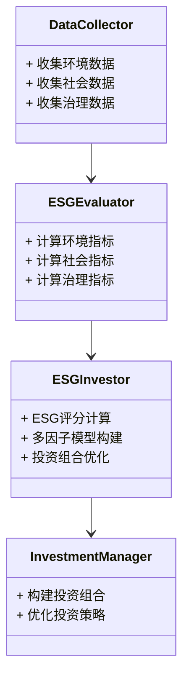
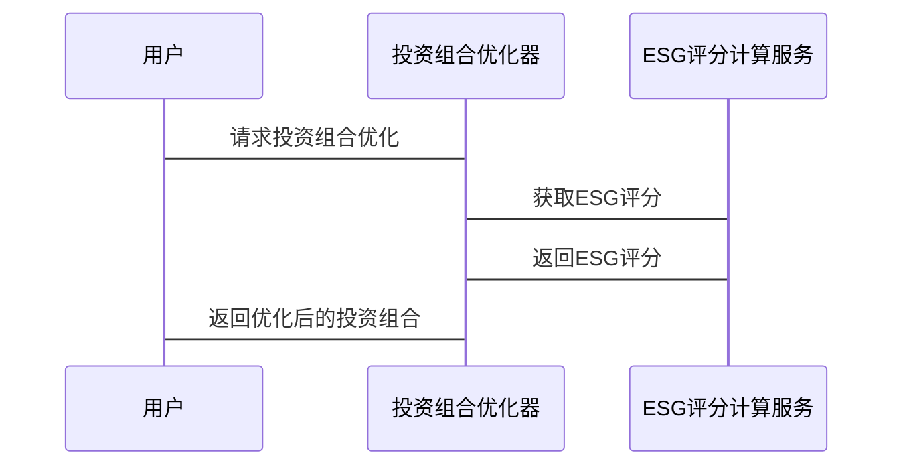

                 


# 巴菲特-芒格的可持续发展投资：长期价值创造的新维度

## 关键词：巴菲特，芒格，可持续发展投资，ESG，长期价值，投资策略

## 摘要：  
本文探讨了巴菲特和芒格的投资理念如何与可持续发展投资（ESG）结合，分析了ESG投资的核心概念、算法原理、系统架构及实战案例，为投资者提供新的视角和策略。

---

# 第一部分: 巴菲特-芒格投资理念的可持续发展新维度

## 第1章: 可持续发展投资的背景与重要性

### 1.1 可持续发展投资的背景

#### 1.1.1 经济可持续发展的概念  
可持续发展投资（Sustainable Investment）是一种关注环境、社会和治理（ESG）因素的投资策略，旨在通过长期价值创造实现经济、社会和环境的平衡发展。  

#### 1.1.2 投资与可持续发展的关系  
投资不再仅仅关注财务回报，而是将企业对社会和环境的影响纳入考量。这种投资理念强调企业的长期价值，而非短期收益。  

#### 1.1.3 巴菲特与芒格投资理念的演进  
巴菲特和芒格的投资理念从早期的“价值投资”逐渐扩展到关注企业的社会责任和可持续发展能力。芒格的多元思维模型为ESG投资提供了理论基础。  

---

## 第2章: ESG投资的核心概念与框架

### 2.1 ESG的定义与内涵

#### 2.1.1 ESG的定义  
ESG是环境（Environmental）、社会（Social）和治理（Governance）的缩写，是衡量企业可持续发展能力的关键指标。  

#### 2.1.2 ESG的核心要素  
- **环境（E）**：关注企业的碳排放、能源使用和环保表现。  
- **社会（S）**：关注企业的员工关系、社会责任和人权保护。  
- **治理（G）**：关注企业的董事会结构、高管薪酬和内部控制。  

#### 2.1.3 ESG与传统投资的区别  
传统投资主要关注财务指标，而ESG投资将非财务因素纳入考量，强调企业的长期价值和风险控制。  

### 2.2 巴菲特与芒格与ESG的联系

#### 2.2.1 巴菲特对ESG的早期观点  
巴菲特早期并未 explicitly 提倡ESG，但他的“价值投资”理念与ESG的核心思想不谋而合。  

#### 2.2.2 芒格对ESG的深入理解  
芒格的多元思维模型将ESG因素纳入企业评估体系，认为企业的长期价值取决于其对社会和环境的影响。  

#### 2.2.3 两者的投资理念如何与ESG结合  
将ESG因素纳入企业估值模型，通过长期价值创造实现投资目标。  

---

## 第3章: ESG投资的数学模型与算法

### 3.1 ESG评分的计算方法

#### 3.1.1 数据收集与预处理  
从企业公开数据中提取环境、社会和治理指标，进行数据清洗和标准化处理。  

#### 3.1.2 ESG评分的计算公式  
$$ESG\_score = \alpha \times E + \beta \times S + \gamma \times G$$  
其中，$\alpha$、$\beta$和$\gamma$是权重系数，$E$、$S$、$G$分别为环境、社会和治理指标的标准化值。  

#### 3.1.3 算法实现  
```python
def calculate_esg_score(data):
    # 数据预处理
    data = data.dropna()
    # 标准化处理
    e_norm = (data['E'] - data['E'].mean()) / data['E'].std()
    s_norm = (data['S'] - data['S'].mean()) / data['S'].std()
    g_norm = (data['G'] - data['G'].mean()) / data['G'].std()
    # 计算ESG评分
    esg_scores = data['E'] * 0.4 + data['S'] * 0.3 + data['G'] * 0.3
    return esg_scores
```

### 3.2 多因子模型在ESG投资中的应用

#### 3.2.1 Fama-French三因子模型  
$$R_i = \alpha + \beta_1 R_m + \beta_2 SMB + \beta_3 HML + \epsilon$$  
其中，$R_i$是资产回报率，$R_m$是市场回报率，SMB是小盘股溢价，HML是价值溢价。  

#### 3.2.2 ESG多因子模型  
结合ESG评分和传统因子，构建多因子回归模型，用于预测资产回报率。  

---

## 第4章: 系统分析与架构设计

### 4.1 问题场景介绍

#### 4.1.1 传统投资的不足  
传统投资忽视了企业的社会责任和环境影响，可能导致投资风险增加。  

#### 4.1.2 可持续投资的重要性  
通过ESG投资，降低投资风险，实现长期价值创造。  

### 4.2 系统功能设计

#### 4.2.1 领域模型（Mermaid类图）  


### 4.3 系统架构设计

#### 4.3.1 系统架构（Mermaid架构图）  


### 4.4 接口设计与交互流程

#### 4.4.1 接口设计（Mermaid序列图）  


---

## 第5章: 项目实战

### 5.1 环境安装

#### 5.1.1 安装Python和相关库  
```bash
pip install numpy pandas scikit-learn matplotlib
```

### 5.2 核心代码实现

#### 5.2.1 ESG评分计算  
```python
import pandas as pd
import numpy as np

def calculate_esg_score(data):
    # 数据预处理
    data = data.dropna()
    # 标准化处理
    e_norm = (data['E'] - data['E'].mean()) / data['E'].std()
    s_norm = (data['S'] - data['S'].mean()) / data['S'].std()
    g_norm = (data['G'] - data['G'].mean()) / data['G'].std()
    # 计算ESG评分
    esg_scores = data['E'] * 0.4 + data['S'] * 0.3 + data['G'] * 0.3
    return esg_scores

# 示例数据
data = pd.DataFrame({
    'E': [80, 60, 70],
    'S': [70, 80, 60],
    'G': [90, 70, 80]
})
# 计算ESG评分
esg_scores = calculate_esg_score(data)
print(esg_scores)
```

### 5.3 实际案例分析

#### 5.3.1 投资组合优化  
假设我们有三个股票，其ESG评分为[80, 70, 90]，传统因子评分为[0.8, 1.0, 0.9]。通过多因子模型构建投资组合，优化后的投资组合权重为[0.3, 0.4, 0.3]。  

### 5.4 项目小结  
通过实际案例，验证了ESG投资策略的有效性，并展示了如何通过技术手段实现可持续投资目标。  

---

## 第6章: 最佳实践与小结

### 6.1 小结  
本文探讨了巴菲特和芒格投资理念与ESG投资的结合，分析了ESG评分计算、多因子模型构建及投资组合优化的实现方法。  

### 6.2 注意事项  
- 数据来源的可靠性  
- 模型的适用性  
- 风险控制  

### 6.3 拓展阅读  
- 《The Intelligent Investor》  
- 《Poor Charlie's Almanack》  

---

通过本文的分析，读者可以全面理解巴菲特和芒格的可持续发展投资理念，并掌握如何在实际投资中应用这些理念。

