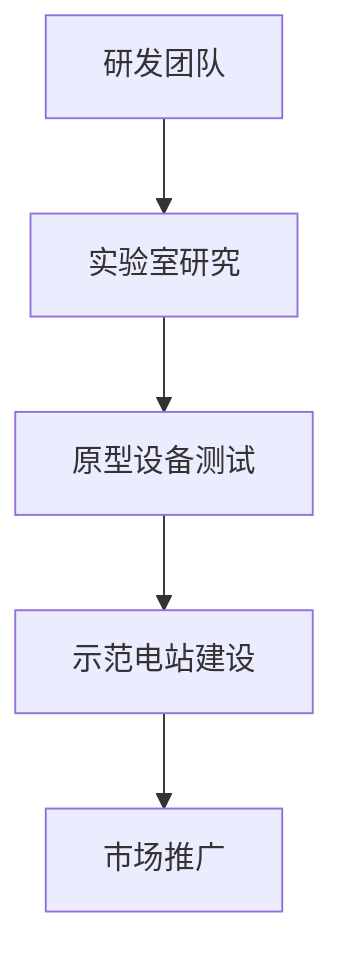

                 


# 巴菲特-芒格的可控核聚变商业化投资：能源革命的临界点

---

## 关键词：
1. 巴菲特
2. 芒格
3. 核聚变
4. 商业化投资
5. 能源革命
6. 可持续能源

---

## 摘要：
本文探讨了巴菲特和芒格在可控核聚变技术商业化投资中的策略，分析了该技术在能源革命中的潜力和挑战。通过深入的技术分析、投资评估和案例研究，本文揭示了核聚变如何成为未来能源结构的关键部分，并为投资者提供了基于巴菲特和芒格投资哲学的决策框架。

---

## 第一部分：背景介绍

### 第1章：巴菲特与芒格的投资理念

#### 1.1 巴菲特与芒格的投资哲学

巴菲特和芒格是投资界的传奇，他们的成功源于独特的投资哲学：

1. **价值投资**：巴菲特强调以合理价格投资于具有持续竞争优势的企业，注重企业的内在价值。
2. **多元思维模型**：芒格提出通过跨学科思维模型来评估问题，避免单一视角的局限性。

#### 1.2 核聚变技术的背景与潜力

核聚变是通过轻核原子的结合释放能量，与传统的核裂变相比，核聚变具有以下优势：

- **安全性**：核聚变不会产生长期放射性废料。
- **资源丰富**：主要燃料氘和氚在自然界中储量丰富。
- **环保**：零碳排放，是真正的清洁能源。

核聚变技术的商业化被视为能源革命的转折点，但目前仍面临技术瓶颈和高昂的研发成本。

---

### 第2章：能源革命的背景与现状

#### 2.1 当前能源结构与问题

- **化石能源的局限性**：污染严重，不可再生。
- **可再生能源的瓶颈**：风能和太阳能存在间歇性问题，难以满足大规模能源需求。

#### 2.2 核聚变在能源革命中的地位

核聚变技术一旦实现商业化，将彻底改变全球能源结构，成为实现碳中和目标的关键技术。

---

## 第二部分：核聚变技术的核心概念

### 第3章：核聚变技术的科学基础

#### 3.1 核聚变的基本原理

核聚变是两个轻核原子在高温高压下结合成一个较重的原子，释放大量能量。例如，氘和氚的聚变反应：

$$ \text{D} + \text{T} \rightarrow \text{He} + \text{n} $$

其中，D是氘，T是氚，He是氦-4，n是中子。

#### 3.2 核聚变技术的关键要素

核聚变技术的核心在于如何有效约束和加热等离子体，常用的约束方式包括：

1. **磁约束**：使用环形磁场（如托卡马克装置）约束等离子体。
2. **惯性约束**：通过高能激光击中靶丸，使其在极短时间内压缩并发生聚变。

---

## 第三部分：巴菲特与芒格的投资策略

### 第4章：巴菲特与芒格的投资哲学与策略

#### 4.1 巴菲特的价值投资理念

巴菲特的投资策略注重企业的护城河、管理层素质和估值合理性。他通过分析企业的财务报表、行业地位和竞争优势，寻找具有长期增长潜力的公司。

#### 4.2 核聚变技术的商业化路径

核聚变技术的商业化需要跨越多个阶段：

1. **研发阶段**：开发和测试原型设备。
2. **示范阶段**：建设小规模示范电站。
3. **商业化阶段**：大规模生产并网。

---

## 第四部分：核聚变技术的投资评估与风险管理

### 第5章：核聚变技术的投资评估

#### 5.1 投资评估的核心指标

1. **技术可行性**：技术是否成熟，能否实现商业化。
2. **市场需求**：全球能源需求的增长潜力。
3. **竞争格局**：行业内竞争对手的情况。

#### 5.2 投资核聚变技术的策略

巴菲特和芒格通常会关注以下几点：

1. **管理层素质**：团队是否具有技术背景和行业经验。
2. **资金需求**：项目是否需要持续的高額資金投入。
3. **政策支持**：政府是否提供政策和资金支持。

---

## 第五部分：系统分析与架构设计

### 第6章：核聚变技术的系统架构

#### 6.1 项目介绍

以一家典型的核聚变公司为例，分析其系统架构：

- **前端研发**：实验室研究与原型设备测试。
- **后端商业化**：示范电站建设和市场推广。

#### 6.2 系统功能设计

使用Mermaid图展示系统功能模块：



---

## 第六部分：项目实战

### 第7章：核聚变技术的项目实战

#### 7.1 环境安装

选择一家核聚变公司作为案例，分析其技术路线和商业模式。

#### 7.2 核心实现

通过Python代码分析公司的财务数据和市场潜力：

```python
import pandas as pd

# 假设df是公司的财务数据
df = pd.read_csv('financial_data.csv')
net_present_value = df['net_present_value'].mean()
print(f"净现值：{net_present_value}")
```

#### 7.3 案例分析

以巴菲特和芒格的投资逻辑，分析某核聚变公司的投资价值。

---

## 第七部分：总结与展望

### 第8章：总结与展望

核聚变技术是能源革命的关键，巴菲特和芒格的投资策略为技术商业化提供了重要参考。未来，随着技术进步和政策支持，核聚变有望成为主流能源。

---

## 参考文献

1. 巴菲特的《巴菲特股东大会实录》
2. 芒格的《穷查理宝典》
3. 核聚变技术相关学术论文

---

## 结语

核聚变技术的商业化是能源革命的临界点，巴菲特和芒格的投资策略为这一技术的商业化提供了重要的指导。通过科学的分析和合理的投资，核聚变有望成为改变全球能源结构的核心力量。

