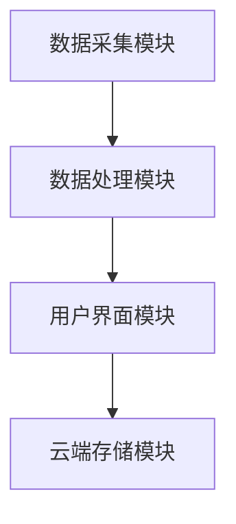

                 


# 巴菲特-芒格的可穿戴设备投资：健康监测的未来

## 关键词
- 巴菲特投资策略
- 芒格多元思维模型
- 可穿戴设备
- 健康监测技术
- 机器学习算法
- 系统架构设计

## 摘要
本文探讨了巴菲特和芒格在可穿戴设备领域的投资策略，分析了健康监测技术的现状与未来发展方向。通过详细的技术分析，包括传感器技术、数据处理算法、系统架构设计等，本文揭示了可穿戴设备如何在健康监测领域发挥重要作用，并结合实际案例展示了如何将这些技术应用于投资决策中。文章旨在为投资者和技术开发者提供深刻的见解，帮助他们在健康监测领域做出明智决策。

---

# 第1章：巴菲特与芒格的投资理念

## 1.1 投资策略概述

### 1.1.1 巴菲特的价值投资理论
巴菲特的价值投资理论强调长期投资、注重企业的内在价值和竞争优势。他主张投资那些具有强大护城河、良好管理和财务状况的企业。芒格则提出多元思维模型，认为投资者需要从多个学科的角度分析问题，以做出更全面的决策。

### 1.1.2 芒格的多元思维模型
芒格的多元思维模型强调将不同学科的知识结合起来，以形成一个完整的认知框架。这种思维方式帮助投资者避免单一视角的局限性，能够在复杂的投资环境中做出更明智的决策。

### 1.1.3 投资决策的核心要素
巴菲特和芒格的投资决策基于以下几个核心要素：
1. 企业的财务状况
2. 管理层的素质
3. 行业的竞争结构
4. 技术的创新潜力

---

# 第2章：可穿戴设备的市场分析

## 2.1 可穿戴设备的定义与分类

### 2.1.1 可穿戴设备的定义
可穿戴设备是指能够佩戴在身体部位或嵌入服装中的智能设备，用于采集、处理和传输数据。这些设备通常集成了传感器、数据处理芯片和无线通信模块。

### 2.1.2 主流可穿戴设备的分类
可穿戴设备主要分为以下几类：
1. **智能手表**：如Apple Watch、Fitbit
2. **运动手环**：如Garmin、小米手环
3. **智能眼镜**：如Google Glass
4. **医疗设备**：如智能血压计、心率监测器

### 2.1.3 市场规模与发展现状
根据市场研究，全球可穿戴设备市场规模在持续增长，预计到2025年将达到数千亿美元。健康监测类设备占据了主要市场份额，特别是在疫情后，人们对健康监测的需求大幅增加。

---

# 第3章：健康监测技术的现状与未来

## 3.1 健康监测的核心技术

### 3.1.1 传感器技术
健康监测设备依赖于多种传感器，包括：
1. **心率传感器**：用于监测心率和心率变异性
2. **加速度传感器**：用于监测运动和步频
3. **体温传感器**：用于测量体温
4. **血氧传感器**：用于测量血氧饱和度

### 3.1.2 数据采集与传输
可穿戴设备通过传感器采集数据后，通常通过蓝牙或Wi-Fi将数据传输到手机或云端。数据传输的实时性和可靠性是设备性能的重要指标。

### 3.1.3 数据分析与处理
健康监测数据需要经过预处理、特征提取和模式识别等步骤。通过机器学习算法，设备可以分析用户的健康状况并提供个性化的建议。

---

# 第4章：巴菲特与芒格的可穿戴设备投资逻辑

## 4.1 投资逻辑分析

### 4.1.1 技术创新的重要性
巴菲特和芒格认识到，可穿戴设备的健康监测功能依赖于技术创新。他们倾向于投资那些在传感器技术、数据处理算法和系统架构方面具有领先地位的企业。

### 4.1.2 市场需求的评估
健康监测设备的市场需求主要来自于人们对健康的关注。随着人口老龄化和慢性病的增加，市场对健康监测设备的需求将持续增长。

### 4.1.3 企业竞争优势的判断
巴菲特和芒格注重企业的竞争优势，包括技术壁垒、成本优势和品牌影响力。他们倾向于投资那些能够在市场竞争中占据领先地位的企业。

---

# 第5章：健康监测的核心算法

## 5.1 数据采集与预处理

### 5.1.1 传感器数据的采集流程
传感器数据的采集流程包括：
1. 数据采集
2. 数据滤波
3. 数据校准
4. 数据存储

### 5.1.2 数据预处理方法
常用的数据预处理方法包括：
1. 噪声消除
2. 数据归一化
3. 异常值处理

### 5.1.3 噪声消除技术
噪声消除技术可以通过傅里叶变换、小波变换等方法实现。以下是一个简单的傅里叶变换示例：

$$
\hat{f}(k) = \sum_{n=0}^{N-1} x_n e^{-j2\pi kn/N}
$$

---

# 第6章：健康监测的数学模型与算法

## 6.1 基于机器学习的健康监测

### 6.1.1 机器学习算法在健康监测中的应用
机器学习算法在健康监测中的应用包括：
1. 疾病预测
2. 健康状态分类
3. 数据特征提取

### 6.1.2 健康监测的数学模型
健康监测的数学模型可以基于回归分析或分类算法。以下是一个简单的线性回归模型：

$$
y = \beta_0 + \beta_1x + \epsilon
$$

### 6.1.3 实例分析与算法实现
以下是一个使用Python实现的健康监测算法示例：

```python
import numpy as np
from sklearn.linear_model import LinearRegression

# 示例数据
X = np.array([[1], [2], [3], [4], [5]])
y = np.array([2, 4, 5, 4, 6])

# 训练模型
model = LinearRegression()
model.fit(X, y)

# 预测
print(model.predict([[6]]))
```

---

# 第7章：系统架构与设计

## 7.1 系统架构设计

### 7.1.1 系统模块划分
健康监测系统的模块划分包括：
1. 数据采集模块
2. 数据处理模块
3. 用户界面模块
4. 云端存储模块

### 7.1.2 系统架构图
以下是系统架构的Mermaid图：



### 7.1.3 系统接口设计
系统接口设计需要考虑数据格式、通信协议和API设计。常用的数据格式包括JSON和XML，通信协议包括HTTP和WebSocket。

---

# 第8章：项目实战与案例分析

## 8.1 环境搭建与数据采集

### 8.1.1 开发环境的安装与配置
开发环境通常包括Python、Jupyter Notebook和相关库（如NumPy、Matplotlib）。

### 8.1.2 数据采集工具的使用
数据采集工具包括传感器模块和数据采集卡。以下是使用Python采集数据的示例：

```python
import serial

# 连接串口
ser = serial.Serial('COM3', 9600)

while True:
    data = ser.readline()
    print(data)
```

### 8.1.3 数据预处理与分析
数据预处理包括去除噪声和数据归一化。以下是使用Python进行数据预处理的示例：

```python
import numpy as np

data = np.array([1, 2, 3, 4, 5])
normalized_data = (data - np.mean(data)) / np.std(data)
print(normalized_data)
```

---

# 第9章：最佳实践与总结

## 9.1 投资与技术的结合

### 9.1.1 巴菲特与芒格的成功经验
巴菲特和芒格的成功投资经验表明，技术与投资的结合能够创造更大的价值。

### 9.1.2 可穿戴设备投资的未来趋势
未来，可穿戴设备的投资将更加依赖于技术创新和市场的需求。健康监测技术的进一步发展将推动可穿戴设备市场的增长。

### 9.1.3 投资中的风险与机遇
投资者需要关注技术风险、市场需求变化和竞争格局。同时，技术开发者需要注重用户体验和数据隐私保护。

---

通过本文的分析，我们可以看到，巴菲特和芒格的投资策略与健康监测技术的结合，为可穿戴设备的未来发展提供了重要启示。技术开发者和投资者需要紧密合作，共同推动这一领域的创新与进步。

