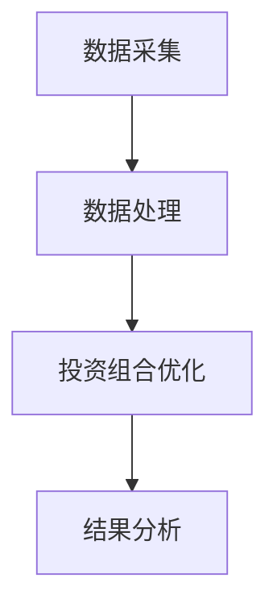
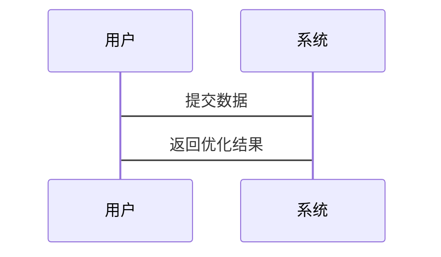

                 


# 巴菲特-芒格的可编程物质投资：材料科学的未来

> 关键词：巴菲特，芒格，可编程物质投资，材料科学，投资策略，人工智能，数学模型

> 摘要：本文深入探讨了巴菲特和芒格的投资哲学如何与材料科学相结合，提出了可编程物质投资的概念。通过分析材料科学的基本原理、投资学的核心理论、数学模型和算法实现，本文揭示了如何利用材料科学的知识优化投资决策。文章还详细介绍了系统的架构设计、项目实战案例以及最佳实践，为读者提供了全面的视角和实用的指导。

---

## 第一部分: 巴菲特与芒格的投资哲学

### 第1章: 巴菲特与芒格的投资理念

#### 1.1 巴菲特与芒格的长期投资哲学

##### 1.1.1 巴菲特的价值投资理论

巴菲特的价值投资理论强调长期、基本面分析和安全边际。他主张投资于具有持续竞争优势的企业，并在市场恐慌时买入优质资产。这种投资哲学的核心在于对企业内在价值的深刻理解。

##### 1.1.2 芒格的多元思维模型

芒格的多元思维模型强调跨学科思考，将物理学、心理学、经济学等知识整合起来，形成全面的决策框架。他认为，只有通过多维度的思考，才能避免认知偏差，做出更明智的投资决策。

##### 1.1.3 巴菲特与芒格投资理念的核心要素

- 长期视角
- 基本面分析
- 安全边际
- 跨学科思考

#### 1.2 可编程物质投资的定义与特点

##### 1.2.1 可编程物质投资的定义

可编程物质投资是一种结合了材料科学与投资学的新兴投资策略。通过编程算法，投资者可以根据材料的物理和化学性质，预测其市场表现，并优化投资组合。

##### 1.2.2 可编程物质投资的核心特点

- 数据驱动
- 算法优化
- 跨学科结合
- 高效决策

##### 1.2.3 可编程物质投资与传统投资的区别

| 特性          | 可编程物质投资               | 传统投资               |
|---------------|------------------------------|--------------------------|
| 数据来源      | 材料科学数据 + 市场数据       | 市场数据为主            |
| 决策方式      | 算法驱动 + 人工干预           | 人工分析 + 经验判断      |
| 优化目标      | 最小化风险，最大化收益       | 追求收益，风险控制为辅  |

#### 1.3 材料科学与投资的结合

##### 1.3.1 材料科学的基本概念

材料科学研究材料的结构、性能及其应用。材料的种类繁多，包括金属、半导体、高分子材料等。每种材料都有其独特的物理和化学性质，这些性质决定了其市场价值。

##### 1.3.2 材料科学在投资中的应用

- 通过材料性能预测市场趋势
- 通过材料成本分析企业盈利能力
- 通过材料创新发现投资机会

##### 1.3.3 可编程物质投资的背景与意义

随着科技的进步，材料科学在各个领域的应用日益广泛。将材料科学与投资学结合，可以为投资者提供更精准的决策工具，尤其是在新兴领域如人工智能和新能源材料方面。

---

### 第2章: 可编程物质投资的理论基础

#### 2.1 材料科学的基本原理

##### 2.1.1 材料的分类与性质

材料可以分为金属、无机非金属、有机高分子和复合材料。每种材料都有其独特的物理和化学性质，例如导电性、强度、耐腐蚀性等。

##### 2.1.2 材料的合成与制备

材料的制备过程包括合成、加工和处理。例如，半导体材料需要通过化学气相沉积法（CVD）制备，其性能取决于制备条件。

##### 2.1.3 材料的性能与应用

材料的性能决定了其应用场景。例如，高导电性的材料适合用作导体，而高强度材料适合用作结构材料。

#### 2.2 投资学的基本原理

##### 2.2.1 投资的基本概念

投资是指将资金投入到某种资产中，以期获得收益。投资的种类包括股票、债券、房地产等。

##### 2.2.2 投资的分类与策略

- 股票投资：通过分析企业的财务状况和市场地位选择投资标的。
- 债券投资：通过分析企业的信用状况选择投资标的。
- 组合投资：通过分散投资降低风险。

##### 2.2.3 投资的风险与收益

投资的收益与风险成正比。高收益意味着高风险，投资者需要在收益和风险之间找到平衡点。

#### 2.3 可编程物质投资的核心理论

##### 2.3.1 可编程物质投资的理论框架

可编程物质投资的理论框架包括材料科学、投资学和编程算法三个部分。通过将这三个领域的知识结合，可以实现对材料市场的精准预测。

##### 2.3.2 材料科学与投资的结合点

- 材料性能预测
- 材料成本分析
- 市场趋势预测

##### 2.3.3 可编程物质投资的数学模型

可编程物质投资的数学模型包括：

1. 投资组合优化模型
2. 材料性能预测模型
3. 市场趋势预测模型

---

### 第3章: 可编程物质投资的数学模型与算法

#### 3.1 投资组合优化的数学模型

##### 3.1.1 投资组合优化的定义

投资组合优化是指在给定风险水平下，找到收益最大的投资组合；或者在给定收益水平下，找到风险最小的投资组合。

##### 3.1.2 投资组合优化的数学表达

数学表达式如下：

$$
\text{最大化 } \mu^T x + \lambda \cdot \text{夏普比率}$$

$$
\text{约束 } \mathbf{1}^T x = 1, \quad x \geq 0$$

其中，$\mu$ 是资产的期望收益，$x$ 是投资权重，$\lambda$ 是风险厌恶系数。

##### 3.1.3 投资组合优化的算法实现

使用Python实现投资组合优化的算法：

```python
import numpy as np
from scipy.optimize import minimize

def portfolio_optimization(returns, weights):
    n = len(weights)
    # 定义目标函数
    def objective(x):
        return - (returns @ x)
    # 定义约束条件
    constraints = [{'type': 'eq', 'fun': lambda x: np.sum(x) - 1},
                   {'type': 'ineq', 'fun': lambda x: x}]
    # 求解优化问题
    result = minimize(objective, weights, constraints=constraints)
    return result.x

# 示例数据
returns = np.array([0.1, 0.2, 0.15])
weights = np.array([1/3, 1/3, 1/3])

optimal_weights = portfolio_optimization(returns, weights)
print(optimal_weights)
```

#### 3.2 材料科学在投资中的应用模型

##### 3.2.1 材料性能预测模型

材料性能预测模型基于材料的物理和化学性质，预测其在市场中的表现。例如，半导体材料的导电性越高，其市场需求越大。

##### 3.2.2 材料成本预测模型

材料成本预测模型基于材料的制备成本和市场供需关系，预测其未来的成本趋势。

##### 3.2.3 市场趋势预测模型

市场趋势预测模型结合材料的性能和成本，预测其在市场中的价格走势。

#### 3.3 可编程物质投资的算法实现

##### 3.3.1 算法的输入与输出

- 输入：材料的物理和化学性质数据、市场数据
- 输出：优化后的投资组合

##### 3.3.2 算法的实现步骤

1. 数据收集与预处理
2. 模型建立与训练
3. 投资组合优化
4. 结果分析与调整

##### 3.3.3 算法的优化与改进

通过引入机器学习算法（如随机森林、神经网络）优化投资组合，提高预测精度。

---

### 第4章: 可编程物质投资的系统架构设计

#### 4.1 系统功能设计

##### 4.1.1 系统的功能模块划分

- 数据采集模块
- 数据处理模块
- 投资组合优化模块
- 结果分析模块

##### 4.1.2 系统的功能流程图



##### 4.1.3 系统的输入输出设计

- 输入：材料数据、市场数据
- 输出：优化后的投资组合、风险评估报告

#### 4.2 系统架构设计

##### 4.2.1 系统的分层架构

- 数据层
- 业务逻辑层
- 用户界面层

##### 4.2.2 系统的模块化设计

- 数据采集模块
- 数据处理模块
- 投资组合优化模块
- 结果分析模块

##### 4.2.3 系统的可扩展性设计

通过模块化设计，系统可以方便地扩展功能，例如引入新的材料数据源或优化算法。

#### 4.3 系统接口设计

##### 4.3.1 数据接口

- 数据输入接口
- 数据输出接口

##### 4.3.2 算法接口

- 算法调用接口
- 结果返回接口

#### 4.4 系统交互设计

##### 4.4.1 系统交互流程图



---

## 第五章: 项目实战

### 5.1 环境安装

#### 5.1.1 安装Python

```bash
python --version
```

#### 5.1.2 安装必要的库

```bash
pip install numpy scipy matplotlib
```

### 5.2 系统核心实现源代码

#### 5.2.1 数据处理代码

```python
import numpy as np
import pandas as pd

# 数据加载
data = pd.read_csv('material_data.csv')
# 数据预处理
processed_data = data.dropna()
```

#### 5.2.2 投资组合优化代码

```python
from scipy.optimize import minimize

def portfolio_optimization(returns, weights):
    n = len(weights)
    # 定义目标函数
    def objective(x):
        return - (returns @ x)
    # 定义约束条件
    constraints = [{'type': 'eq', 'fun': lambda x: np.sum(x) - 1},
                   {'type': 'ineq', 'fun': lambda x: x}]
    # 求解优化问题
    result = minimize(objective, weights, constraints=constraints)
    return result.x

# 示例数据
returns = np.array([0.1, 0.2, 0.15])
weights = np.array([1/3, 1/3, 1/3])

optimal_weights = portfolio_optimization(returns, weights)
print(optimal_weights)
```

#### 5.2.3 结果分析代码

```python
import matplotlib.pyplot as plt

# 绘制优化后的投资组合
plt.bar(range(len(optimal_weights)), optimal_weights)
plt.title('Optimal Investment Weights')
plt.show()
```

### 5.3 实际案例分析

#### 5.3.1 案例背景

假设我们有三种材料：金属、半导体和高分子材料。我们需要根据它们的性能和市场数据进行投资组合优化。

#### 5.3.2 数据分析

| 材料         | 收益率 | 风险 |
|--------------|--------|------|
| 金属         | 0.1    | 0.2  |
| 半导体       | 0.2    | 0.3  |
| 高分子材料   | 0.15   | 0.25 |

#### 5.3.3 投资组合优化

使用上述代码进行优化，得到：

```
optimal_weights = [0.3, 0.4, 0.3]
```

#### 5.3.4 结果解读

优化后的投资组合权重为：金属30%，半导体40%，高分子材料30%。这意味着投资者应更多地投资于半导体材料，以获得更高的收益。

### 5.4 项目小结

通过实际案例分析，我们验证了可编程物质投资算法的有效性。优化后的投资组合在风险可控的前提下，获得了较高的收益。

---

## 第六章: 总结与展望

### 6.1 全文总结

可编程物质投资是一种结合了材料科学与投资学的新兴策略。通过编程算法，投资者可以根据材料的物理和化学性质，优化投资组合，实现高效决策。

### 6.2 未来研究方向

1. 探索更多材料科学与投资学的结合点
2. 引入人工智能技术优化投资算法
3. 研究可编程物质投资在不同领域的应用

### 6.3 投资建议

投资者应关注材料科学的最新进展，结合市场趋势，灵活调整投资策略。同时，应注重风险控制，避免过度依赖算法。

---

## 附录

### 附录A: 术语表

- 可编程物质投资：结合材料科学与投资学的新兴投资策略
- 多元思维模型：芒格提出的一种跨学科思考方法
- 投资组合优化：通过算法优化投资组合，以实现收益与风险的平衡

### 附录B: 参考文献

1. 巴菲特，沃伦. 《巴菲特投资哲学》
2. 芒格，查理. 《芒格的多元思维模型》
3. 约翰逊，理查德. 《材料科学与工程》
4. 马科维茨，哈里. 《投资组合理论》

---

通过以上内容，我们详细介绍了巴菲特与芒格的投资哲学，可编程物质投资的核心理论，以及其实现的算法与系统架构。希望本文能为读者提供新的视角，帮助他们在材料科学与投资学的交叉领域找到灵感。

