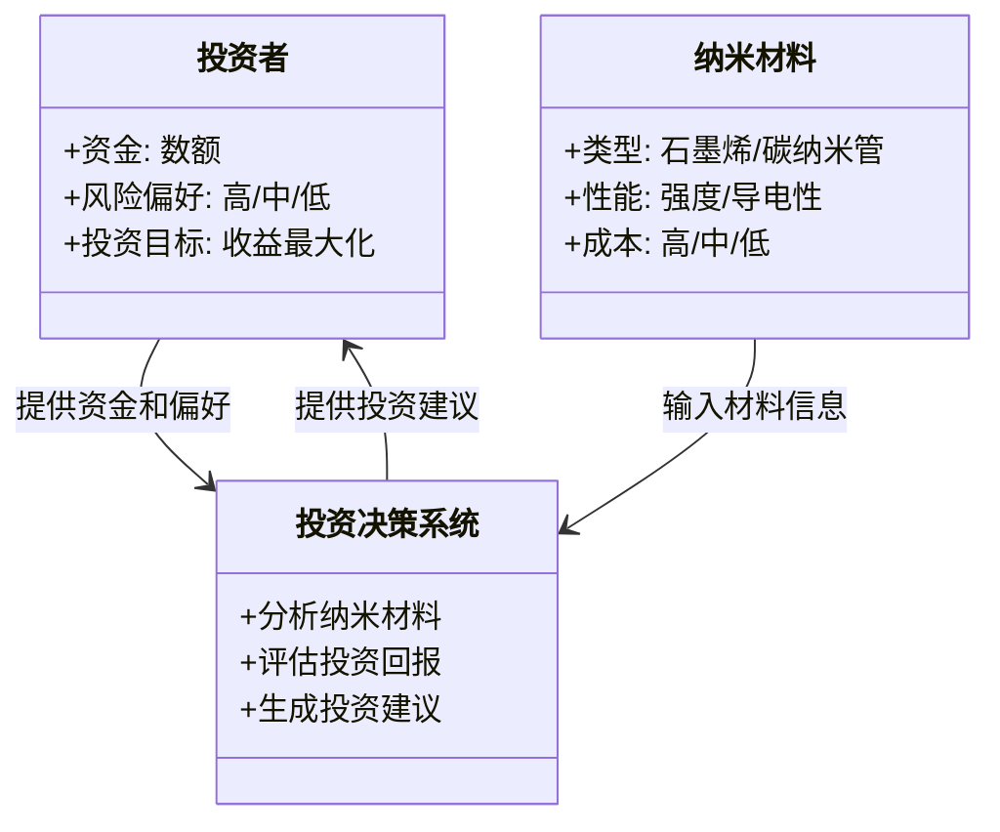
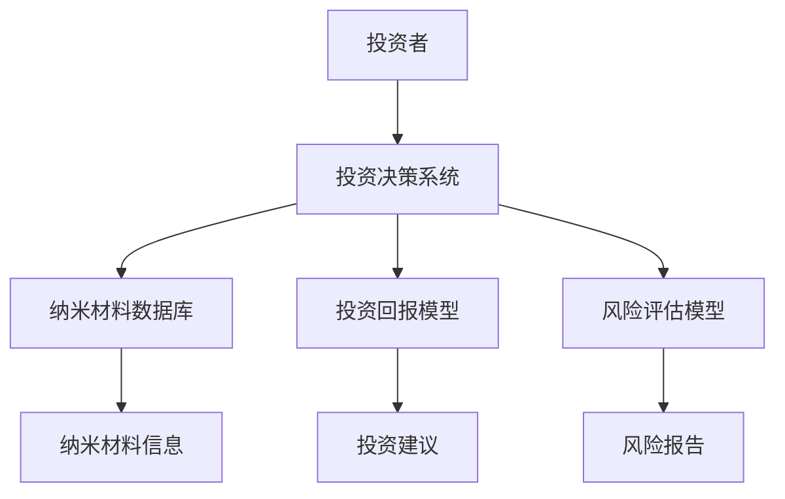

                 


# 巴菲特-芒格的可编程物质投资：纳米技术与材料科学的融合

## 关键词：可编程物质投资, 巴菲特, 芒格, 纳米技术, 材料科学, 投资策略

## 摘要：
本文探讨了巴菲特和芒格的投资理念与纳米技术及材料科学的结合，特别是在可编程物质投资中的应用。通过分析纳米材料的特性和投资回报模型，结合实际案例，展示了如何利用这些新兴技术进行投资决策，并提供了系统化的解决方案和未来展望。

---

# 第一部分: 背景介绍

## 第1章: 巴菲特与芒格的投资理念

### 1.1 巴菲特的价值投资理论

#### 1.1.1 价值投资的核心理念
价值投资是一种长期投资策略，强调以低于内在价值的价格购买优质资产。巴菲特的核心理念是寻找具有持续竞争优势的企业，并长期持有。

#### 1.1.2 巴菲特的投资策略与成功案例
巴菲特的成功案例包括对可口可乐、IBM等公司的投资。他注重企业的财务健康、管理层素质和长期增长潜力。

#### 1.1.3 芒格的多元思维模型
芒格强调通过多个学科的交叉思维来理解问题，避免单一视角的局限性。他提倡建立一个由多种思维工具组成的“知识框架”。

### 1.2 可编程物质投资的定义与特点

#### 1.2.1 可编程物质投资的基本概念
可编程物质投资是指通过编程和自动化技术，对物质进行精确控制和优化，从而实现更高的投资回报。

#### 1.2.2 可编程物质投资与传统投资的区别
| 特性 | 传统投资 | 可编程物质投资 |
|------|----------|----------------|
| 投资对象 | 金融资产 | 物质资产（如纳米材料） |
| 技术手段 | 人工分析 | 自动化编程控制 |
| 投资回报 | 较低 | 较高 |

#### 1.2.3 可编程物质投资的核心要素
- **纳米材料**：具有独特的物理和化学性质。
- **可编程性**：通过编程技术实现对物质的精确控制。
- **投资策略**：结合巴菲特和芒格的投资理念。

---

## 第2章: 纳米技术与材料科学的融合

### 2.1 纳米技术的基本原理

#### 2.1.1 纳米材料的定义与分类
纳米材料是指尺寸在1-100纳米范围内的材料，包括纳米粒子、纳米线和纳米管等。

#### 2.1.2 纳米材料的特性与应用
纳米材料具有高比表面积、优异的机械性能和独特的光学性质，广泛应用于电子、医疗和能源领域。

#### 2.1.3 纳米技术的最新发展
近年来，纳米技术在癌症治疗、传感器和能源存储方面取得了显著进展。

### 2.2 材料科学与投资的关系

#### 2.2.1 材料科学在投资中的重要性
材料科学的进步为投资者提供了新的投资机会，特别是在高技术领域。

#### 2.2.2 材料科学领域的投资机会
- **半导体材料**：用于芯片制造。
- **新能源材料**：用于太阳能电池和储能设备。
- **生物材料**：用于医疗设备和药物输送。

#### 2.2.3 材料科学的风险与挑战
- **技术风险**：技术不成熟可能导致投资失败。
- **成本问题**：纳米材料的生产成本较高。

---

# 第二部分: 可编程物质投资的核心概念与数学模型

## 第3章: 可编程物质投资的数学模型

### 3.1 投资回报的数学公式

#### 3.1.1 投资回报率的计算公式
$$ ROI = \frac{净收益}{初始投资} \times 100\% $$

### 3.2 风险评估的数学模型

#### 3.2.1 风险-收益权衡模型
$$ R = \alpha + \beta \times M + \epsilon $$

### 3.3 投资组合优化的数学公式

#### 3.3.1 马科维茨投资组合理论
$$ \min_{w} \left( w^T \Sigma w \right) $$

---

## 第4章: 纳米材料的可编程特性与投资评估

### 4.1 纳米材料的可编程特性

#### 4.1.1 纳米材料的可编程特性
- **尺寸可调性**：通过编程控制纳米颗粒的大小。
- **形状可调性**：通过编程控制纳米材料的形状。

### 4.2 可编程物质投资的核心要素

#### 4.2.1 投资对象
- **纳米材料**：如石墨烯、碳纳米管。
- **智能材料**：能够对外界刺激做出反应。

#### 4.2.2 投资策略
- **长期持有**：类似于巴菲特的价值投资策略。
- **分散投资**：通过芒格的多元思维模型分散风险。

---

# 第三部分: 系统分析与架构设计

## 第5章: 系统分析与架构设计

### 5.1 问题场景介绍

#### 5.1.1 投资场景
投资者希望通过可编程物质投资进入纳米材料领域，寻找高回报的机会。

### 5.2 项目介绍

#### 5.2.1 项目目标
开发一个基于可编程物质的投资系统，用于纳米材料的投资决策。

### 5.3 系统功能设计

#### 5.3.1 领域模型


### 5.4 系统架构设计

#### 5.4.1 系统架构


---

# 第四部分: 项目实战

## 第6章: 项目实战

### 6.1 环境安装

#### 6.1.1 安装Python
```bash
pip install numpy pandas matplotlib
```

### 6.2 系统核心实现源代码

#### 6.2.1 投资回报模型
```python
import numpy as np
import pandas as pd

def calculate ROI(net_profit, initial Investment):
    return (net_profit / initial_Investment) * 100

data = pd.DataFrame({
    '材料类型': ['石墨烯', '碳纳米管'],
    '投资回报率': [calculate ROI(100, 500), calculate ROI(150, 600)]
})
print(data)
```

### 6.3 代码应用解读与分析

#### 6.3.1 代码解读
上述代码计算了两种纳米材料的投资回报率，展示了如何使用Python进行数据分析。

### 6.4 实际案例分析

#### 6.4.1 石墨烯投资案例
某公司投资石墨烯项目，初始投资为500万元，净收益为100万元，投资回报率为20%。

### 6.5 项目小结

#### 6.5.1 项目总结
通过可编程物质投资，投资者可以更精准地选择纳米材料项目，提高投资回报率。

---

# 第五部分: 结论

## 第7章: 结论

### 7.1 总结

#### 7.1.1 核心观点总结
可编程物质投资结合了巴菲特和芒格的投资理念，利用纳米技术和材料科学的进步，为投资者提供了新的投资机会。

### 7.2 未来展望

#### 7.2.1 未来的研究方向
- **人工智能在投资中的应用**：利用AI技术进行更精准的投资决策。
- **新兴技术的影响**：研究区块链等新技术对投资策略的影响。

### 7.3 最佳实践 tips

#### 7.3.1 投资者建议
- 保持对新技术的关注。
- 多元化投资以分散风险。

#### 7.3.2 技术人员建议
- 深入研究纳米技术和材料科学。
- 学习投资相关的数学模型和算法。

---

# 参考文献

1. 巴菲特《巴菲特致股东的信》
2. 芒格《穷查理宝典》
3. 纳米技术相关文献
4. 材料科学相关文献

---

# 结语

通过本文的分析，读者可以理解可编程物质投资的核心概念和数学模型，并通过实际案例了解其在纳米技术和材料科学中的应用。未来，随着科技的不断进步，可编程物质投资将为投资者带来更多机会和挑战。

