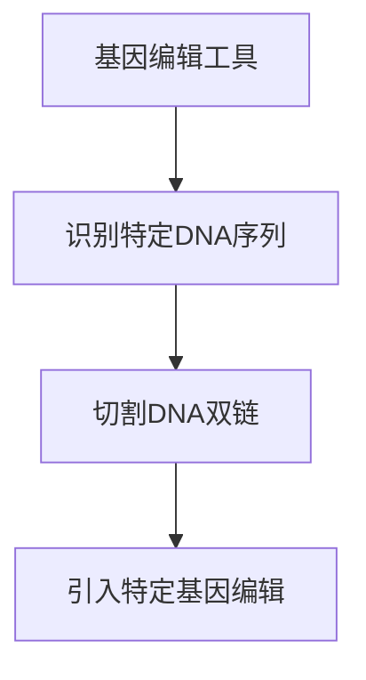
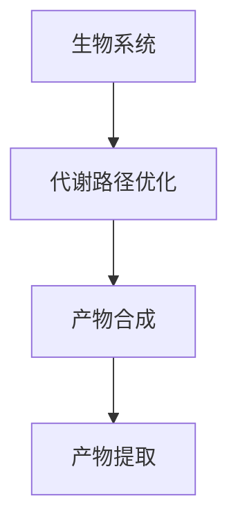

                 

# 巴菲特-芒格的合成生物学投资：创造生命的科技革命

> 关键词：巴菲特，芒格，合成生物学，投资，科技革命

> 摘要：本文深入探讨了巴菲特和芒格在合成生物学领域的投资策略，分析了合成生物学的核心概念、技术原理及其在投资中的应用。通过案例分析、技术解读和投资逻辑的结合，本文揭示了合成生物学作为一项创造生命的科技革命的投资潜力与挑战。

---

## 第一部分：合成生物学与投资的背景与基础

### 第1章：合成生物学的基本概念

#### 1.1 合成生物学的定义与特点
合成生物学（Synthetic Biology）是通过工程学的方法设计和构建新的生物系统，或对现有生物系统进行重新设计，以实现特定功能的学科。其核心特点包括：
- **模块化设计**：将生物系统分解为可模块化设计的组件。
- **工程化思维**：以工程学的方法对生物系统进行设计和优化。
- **跨学科融合**：结合了生物学、化学、计算机科学和工程学等多学科知识。

#### 1.2 合成生物学的起源与发展
合成生物学起源于21世纪初，随着基因编辑技术（如CRISPR-Cas9）的突破而迅速发展。其主要发展阶段包括：
1. **早期探索阶段**：2000年代初，科学家开始尝试在实验室中合成简单生物系统。
2. **技术突破阶段**：2010年代，CRISPR技术的应用使得基因编辑更加高效和精准。
3. **商业化阶段**：近年来，合成生物学技术开始应用于医疗、农业和能源等领域。

#### 1.3 合成生物学的投资价值
合成生物学被认为是继信息技术革命之后的下一个科技革命，其市场潜力巨大。根据市场研究机构的预测，到2030年，合成生物学市场规模将超过1000亿美元。投资合成生物学的核心逻辑在于其技术的颠覆性和应用的广泛性。

---

### 第2章：巴菲特与芒格的投资哲学

#### 2.1 巴菲特的价值投资理念
巴菲特的价值投资理念强调：
- **长期价值**：关注企业的长期盈利能力。
- **安全边际**：寻找市场价格低于内在价值的投资标的。
- **竞争优势**：投资具有护城河的企业。

#### 2.2 芒格的多元思维模型
芒格的多元思维模型强调：
- **跨学科思考**：将不同领域的知识整合起来分析问题。
- **逆向思维**：从反方向思考问题的本质。
- **决策框架**：通过建立决策框架来简化复杂问题。

#### 2.3 巴菲特与芒格投资理念的结合
巴菲特和芒格的投资理念在合成生物学投资中表现出协同效应：
- 巴菲特的“长期价值”理念与合成生物学的技术周期相契合。
- 芒格的“多元思维模型”帮助投资者从多个角度分析合成生物学企业的价值。

---

### 第3章：合成生物学与投资的结合

#### 3.1 合成生物学的投资机会
合成生物学在以下领域展现出巨大的投资机会：
- **医疗健康**：开发新药和个性化医疗方案。
- **农业**：提高作物产量和抗病能力。
- **能源**：生产可持续生物燃料。

#### 3.2 合成生物学投资的风险与挑战
投资合成生物学面临以下风险：
- **技术不确定性**：合成生物学技术尚未完全成熟。
- **商业化难度**：从实验室到商业化的过程复杂且耗时。
- **政策与伦理风险**：涉及基因编辑的政策监管和伦理争议。

#### 3.3 巴菲特与芒格投资合成生物学的逻辑
巴菲特和芒格投资合成生物学的核心逻辑在于：
- **长期价值**：合成生物学技术的颠覆性可能带来巨大的长期收益。
- **竞争优势**：选择具有技术壁垒和市场优势的企业。

---

## 第二部分：合成生物学的核心概念与投资逻辑

### 第4章：合成生物学的核心技术

#### 4.1 基因编辑技术
基因编辑技术是合成生物学的核心工具之一。CRISPR-Cas9技术的原理如下：

CRISPR-Cas9技术的数学模型可以表示为：
$$ \text{基因编辑} = \text{识别} \times \text{切割} \times \text{修复} $$

#### 4.2 生物制造技术
生物制造技术是通过生物系统生产化学物质的技术。其流程如下：

生物制造技术的效率可以用以下公式衡量：
$$ \text{效率} = \frac{\text{产物产量}}{\text{输入资源}} $$

#### 4.3 合成基因组学
合成基因组学是通过人工合成基因组来研究生物系统。其核心步骤包括：
1. **基因设计**：设计目标基因组。
2. **基因合成**：通过化学合成方法合成基因组。
3. **基因组装**：将合成的基因组导入宿主细胞。

---

### 第5章：合成生物学企业的商业模式

#### 5.1 合成生物学企业的主要业务模式
合成生物学企业的主要业务模式包括：
- **产品销售**：销售合成生物学产品（如生物燃料）。
- **技术服务**：提供基因编辑和生物制造的技术服务。
- **许可证模式**：通过授权使用技术获得收入。

#### 5.2 合成生物学企业的竞争优势
合成生物学企业的竞争优势体现在：
- **技术优势**：掌握核心基因编辑技术。
- **成本优势**：通过规模化生产降低成本。
- **市场优势**：占据新兴市场的先发优势。

---

### 第6章：合成生物学的投资策略与案例分析

#### 6.1 投资策略
巴菲特和芒格在合成生物学投资中的策略包括：
- **长期视角**：关注企业的长期价值。
- **技术评估**：评估企业的技术壁垒。
- **风险管理**：识别和规避投资风险。

#### 6.2 投资案例分析
以某合成生物学企业为例，其投资价值体现在：
- **技术优势**：拥有领先的基因编辑技术。
- **市场潜力**：在医疗和农业领域具有广泛应用前景。

---

## 第三部分：合成生物学的未来展望与投资建议

### 第7章：合成生物学的未来发展趋势

#### 7.1 技术创新
合成生物学技术的创新将继续推动行业的发展，包括：
- **人工智能在合成生物学中的应用**。
- **新型基因编辑工具的开发**。

#### 7.2 市场应用
合成生物学将在更多领域得到应用，包括：
- **可持续材料生产**。
- **环境修复技术**。

---

### 第8章：投资建议与风险提示

#### 8.1 投资建议
- **长期投资**：关注具有长期价值的企业。
- **技术驱动**：选择具有技术壁垒的企业。
- **分散投资**：分散投资以降低风险。

#### 8.2 风险提示
- **技术风险**：技术不确定性可能导致投资失败。
- **政策风险**：政策监管可能影响企业的发展。
- **市场风险**：市场需求可能不及预期。

---

## 结语

合成生物学作为一项创造生命的科技革命，正在改变我们对生命科学的认知和应用。巴菲特和芒格的投资理念为合成生物学的投资提供了重要的指导。未来，随着技术的进一步发展，合成生物学的投资潜力将更加显著。投资者需要结合技术、市场和政策等多方面因素，做出明智的投资决策。

--- 

# 附录

## 附录A：合成生物学相关术语表

1. **合成生物学（Synthetic Biology）**：通过工程学方法设计和构建新的生物系统。
2. **基因编辑（Gene Editing）**：对生物基因组进行精确修改的技术。
3. **生物制造（Biomanufacturing）**：利用生物系统生产化学物质的技术。

## 附录B：数据与图表

1. 合成生物学市场规模预测图（2020-2030）。
2. CRISPR-Cas9技术流程图。

## 附录C：参考文献

1. 合成生物学相关学术论文。
2. 巴菲特和芒格投资理念的经典著作。

